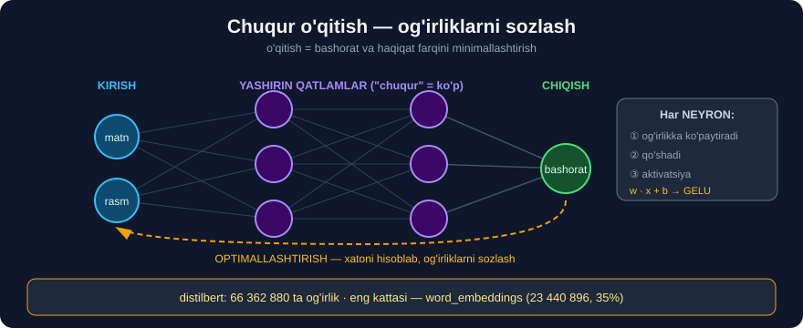

# 1-dars. Chuqur o'qitishni takrorlash

## 🎬 Boshlashdan oldin

> **"Kodlashning dastlabki kunlarida biz bir sinfni boshqasidan ajratadigan qoidalarni QO'LDA YOZISHIMIZ kerak edi."**

---

## 1. 🌸 Qoidalardan modellarga

> **"Masalan, agar siz mashinali o'qitishda ancha vaqt bo'lgan bo'lsangiz, turli gul turlari haqidagi ma'lumotni o'z ichiga olgan mashhur Iris ma'lumotlar to'plamini bilasiz."**
>
> **"Eski kunlarda biz gulning turini aniqlash uchun qoidalarni shunchaki QO'LDA yozardik. Aytaylik, agar gulbarg o'lchami 1 sm dan kichik va kosachabarg uzunligi 5 sm dan kam bo'lsa, buni Iris setosa deb tasniflash uchun qoida yaratamiz."**

```python
# ❌ ESKI USUL — qo'lda yozilgan qoidalar
def gul_turi(gulbarg, kosachabarg):
    if gulbarg < 1.0 and kosachabarg < 5.0:
        return "Iris setosa"
    elif gulbarg < 4.8:
        return "Iris versicolor"
    return "Iris virginica"
```

> ## ⚠️ **Muammo: har bir yangi holat uchun YANGI QOIDA yozish kerak.** Va tilda qoidalar **cheksiz** ko'p.

> **"Lekin biz bundan ANCHA UZOQLASHDIK. Endi bizda shunday mashinalar borki, ularga gulning rasmini ko'rsatib, 'bu qanday gul?' deb so'rashimiz mumkin."**
>
> ## **"Tabiiy tilni qayta ishlashda esa biz gullar haqida SUHBATLASHA OLADIGAN generativ modellar qura olamiz."**

---

## 2. 🔁 Siz buni allaqachon boshdan kechirgansiz

Bu — **21–26-modullarning** aynan hikoyasi:

```
21-MODUL    qo'lda regex yozdingiz         →  qoidalar
            re.sub(r"[^a-zA-Z ]", "", t)

23-MODUL    VADER lug'ati                  →  qoidalar
            "good" = +1.9, "bad" = -2.5
                    ↑
              ODAM yozgan lug'at

26-MODUL    model O'ZI o'rgandi            →  ma'lumotdan
            love (+2.1), waste (-1.8)
                    ↑
              HECH KIM aytmadi
```

> ## 🔑 **Mana taraqqiyot yo'nalishi:** qoidalarni **odam yozadi** → model ularni **o'zi topadi**.

---

## 3. Transformer qayerdan kelib chiqdi?

> ## **"Katta til modellari TRANSFORMER arxitekturasiga asoslangan — bu 2017-yilda Google Brain tadqiqotchilari tomonidan ishlab chiqilgan neyron tarmoq turi."**
>
> **"Transformerlar — chuqur o'qitishning bir qismi."**

```
Sun'iy intellekt (AI)
  └── Mashinali o'qitish (ML)          ← 26-modul
        └── Chuqur o'qitish             ← 28-modul
              └── TRANSFORMER (2017)     ← BU MODUL
                    └── LLM              ← 29-modul
```

---

## 4. Chuqur o'qitish — qisqacha takror

> ## **"Chuqur o'qitish — o'zining TARMOQ TUZILISHI tufayli MURAKKAB MA'LUMOTDA NAQSHLARNI topishda ustunlik qiladigan model arxitekturasi turi."**

### Qadamma-qadam

> **"U matn yoki rasm kabi KIRISH MA'LUMOTIDAN boshlanadi, keyin bu kirish o'zaro bog'langan NEYRONLAR QATLAMLARIDAN o'tadi va neyron tarmoqni hosil qiladi."**
>
> **"Har bir neyron matematik amalni qo'llaydi — jumladan, neyronlar orasidagi bog'lanishlar kuchini yoki OG'IRLIKLARNI sozlashni."**



```
KIRISH  →  [qatlam 1]  →  [qatlam 2]  →  ...  →  CHIQISH
 matn         ↓              ↓                     bashorat
            har bir neyron:
            ① kirishlarni OG'IRLIKKA ko'paytiradi
            ② qo'shadi
            ③ aktivatsiya funksiyasidan o'tkazadi
```

### O'qitish — og'irliklarni sozlash

> ## **"Bu og'irliklar o'qitish bosqichida BASHORAT QILINGAN va HAQIQIY natija o'rtasidagi FARQNI MINIMALLASHTIRISH uchun doimiy YANGILANADI — bu jarayon OPTIMALLASHTIRISH deb ataladi."**
>
> **"Takroriy sozlashlar va ulkan hajmdagi ma'lumotdan o'rganish orqali neyron tarmoq o'z og'irliklarini asta-sekin sozlab, tobora aniqroq bashoratlar qiladi."**

```
① Model bashorat qiladi        →  "ijobiy" (ehtimol 0.6)
② Haqiqiy javob bilan solishtiradi →  aslida "salbiy"
③ XATO hisoblanadi              →  0.6 farq
④ Og'irliklar SOZLANADI         →  keyingi safar yaxshiroq
⑤ MILLIONLAB marta takrorlanadi
```

> ## 💡 **`SGDClassifier` dagi `SGD` — bu aynan shu:** *Stochastic **Gradient Descent*** — og'irliklarni bosqichma-bosqich sozlash. Siz **26-modulda** buni ishlatgansiz.

---

## 5. 💻 Amaliyot — og'irliklarni KO'RAMIZ

Nazariya yetarli. **Haqiqiy modelning og'irliklariga qaraymiz.**

```python
import warnings; warnings.filterwarnings("ignore")
from transformers import AutoModel

mod = AutoModel.from_pretrained(
    "distilbert-base-uncased-finetuned-sst-2-english")

jami = 0
for nom, p in list(mod.named_parameters())[:8]:
    print(f"{str(tuple(p.shape)):>16s}  {p.numel():>10,}  {nom}")
for _, p in mod.named_parameters():
    jami += p.numel()
print(f"{'':>16s}  {jami:>10,}  JAMI")
```

```
    (30522, 768)   23,440,896  embeddings.word_embeddings.weight
      (512, 768)      393,216  embeddings.position_embeddings.weight
          (768,)          768  embeddings.LayerNorm.weight
          (768,)          768  embeddings.LayerNorm.bias
      (768, 768)      589,824  transformer.layer.0.attention.q_lin.weight
          (768,)          768  transformer.layer.0.attention.q_lin.bias
      (768, 768)      589,824  transformer.layer.0.attention.k_lin.weight
          (768,)          768  transformer.layer.0.attention.k_lin.bias
                    66,362,880  JAMI
```

> ## 🎯 **MANA O'SHA "OG'IRLIKLAR".** 66 million ta son — har biri o'qitish davomida **sozlangan**.
>
> Diqqat qiling: eng katta blok — **`word_embeddings`** *(23.4 million, jamining 35%)*. Ya'ni modelning **uchdan biri** — shunchaki **so'zlar lug'ati**.

> 💡 **`q_lin` va `k_lin` nomlariga e'tibor bering** — bu **Query** va **Key**. Ular **6-darsda** asosiy mavzumiz bo'ladi.

---

## 6. ⚡ Mashqlar

### 🟢 Oson

**M1.** Transformer qachon va kim tomonidan ishlab chiqilgan?

**M2.** Chuqur o'qitishda "og'irlik" nima?

**M3.** Optimallashtirish nima?

<details>
<summary>✅ Javoblar</summary>

**M1.** ## **2017-yil**, **Google Brain** tadqiqotchilari.

**M2.** Neyronlar orasidagi **bog'lanish kuchi** — o'qitish davomida **sozlanadigan son**.

**M3.** **Bashorat** va **haqiqiy** natija o'rtasidagi **farqni minimallashtirish** jarayoni.

</details>

### 🟡 O'rta

**M4.** ⭐ Modelning og'irliklarini ko'ring va eng katta blokni toping.

**M5.** Iris misolidagi "qoidalar" yondashuvi sizning qaysi modulingizga o'xshaydi?

<details>
<summary>✅ Javoblar</summary>

**M4.**
```python
import pandas as pd
df = pd.DataFrame([{"nom": n, "shakl": tuple(p.shape), "soni": p.numel()}
                   for n, p in mod.named_parameters()])
print(df.nlargest(5, "soni").to_string(index=False))
print(f"\njami: {df.soni.sum():,}")
print(f"embeddinglar ulushi: {100*df[df.nom.str.contains('embeddings')].soni.sum()/df.soni.sum():.1f}%")
```
> 🔑 Eng katta blok — **`word_embeddings` (23,440,896)**, jamining **~36%** *(pozitsion embedding bilan birga)*.

**M5.** ## **21-modul** *(regex tozalash)* va **23-modul** *(VADER lug'ati)* — ikkalasida ham qoidalarni **odam** yozgan. **26-modulda** esa model o'zi o'rgangan.

</details>

### 🔴 Qiyin

**M6.** ⭐⭐ Model og'irliklarining **taqsimotini** tekshiring — ular qanday sonlar?

<details>
<summary>✅ Yechim</summary>

```python
import torch
W = mod.transformer.layer[0].attention.q_lin.weight.detach()
print(f"shakl    : {tuple(W.shape)}")
print(f"o'rtacha : {W.mean():.5f}")
print(f"std      : {W.std():.5f}")
print(f"min / max: {W.min():.4f} / {W.max():.4f}")
print(f"|w|<0.1  : {(W.abs() < 0.1).float().mean():.1%}")
```

> ## 🔑 **Kutilgan naqsh: og'irliklar 0 ATROFIDA, kichik qiymatlar.**
>
> ```
> o'rtacha ≈ 0        →  musbat va manfiy muvozanatda
> std      ≈ 0.03-0.05→  aksariyati juda kichik
> ```
>
> ## 💡 **Nima uchun kichik?** Agar og'irliklar katta bo'lsa, 6 qatlamdan o'tgach qiymatlar **portlab ketardi** *(exploding gradients)*. Shuning uchun `LayerNorm` qatlamlari ham bor — ular har qatlamdan keyin qiymatlarni **normallashtiradi**.
>
> ⚠️ Bu — **28-moduldagi "quantization"** g'oyasining asosi: agar hamma son `−0.5 … +0.5` oralig'ida bo'lsa, ularni **32-bit** o'rniga **8-bit** bilan saqlash mumkin.

</details>

---

## 🧠 O'zini tekshirish savollari

1. Qoidalar yondashuvining kamchiligi nimada?
2. Transformer qaysi kattaroq sohaning qismi?
3. Neyron nima qiladi?
4. Og'irliklar qanday yangilanadi?
5. Modelning eng katta qismi nima?

<details>
<summary>✅ Javoblar</summary>

1. Har bir yangi holat uchun **yangi qoida** kerak — tilda esa qoidalar **cheksiz**.
2. ## **Chuqur o'qitish** *(deep learning)*.
3. Kirishlarni **og'irlikka ko'paytiradi**, **qo'shadi**, **aktivatsiya funksiyasidan** o'tkazadi.
4. **Bashorat** va **haqiqat** farqini kamaytirish yo'nalishida — **optimallashtirish**.
5. ## **`word_embeddings`** — 23.4 million *(jamining ~35%)*.

</details>

---

## 📌 Xulosa

```
TARAQQIYOT YO'LI

  QO'LDA QOIDALAR      →   MODEL O'ZI O'RGANADI
  if gulbarg < 1.0         66 000 000 ta og'irlik


IERARXIYA
  AI → ML → CHUQUR O'QITISH → TRANSFORMER (2017, Google Brain) → LLM


CHUQUR O'QITISH
  kirish → [qatlam] → [qatlam] → ... → chiqish

  Har neyron:  og'irlikka ko'paytiradi · qo'shadi · aktivatsiya

  O'QITISH = OPTIMALLASHTIRISH
    ① bashorat  ② xatoni hisobla
    ③ og'irliklarni sozla  ④ MILLIONLAB marta takrorla


💻 HAQIQIY MODEL (distilbert, 66,362,880 parametr)

  word_embeddings   23,440,896   ← ENG KATTA (35%)
  position_embed       393,216
  q_lin, k_lin         589,824   ← Query va Key (6-dars!)


🔑 SGDClassifier dagi "SGD" — aynan shu optimallashtirish
```

---

## 🔖 Atamalar

| Atama | Inglizcha | Izoh |
|---|---|---|
| Og'irlik | *weight* | Bog'lanish kuchi, o'qitiladigan son |
| Optimallashtirish | *optimization* | Xatoni minimallashtirish |
| Neyron tarmoq | *neural network* | O'zaro bog'langan qatlamlar |
| Aktivatsiya funksiyasi | *activation function* | Chiziqsizlik kirituvchi funksiya |
| LayerNorm | *layer normalization* | Qiymatlarni normallashtirish |

---

🏠 [Modul boshiga](README.md) · ➡️ [Keyingi: RNN muammosi](02-The-Problem-with-RNNs.md)
