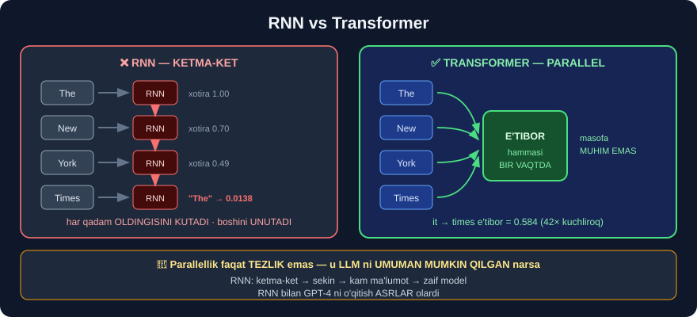

# 2-dars. RNN muammosi

## 🎬 Boshlashdan oldin

> **"Turli xil neyron tarmoqlar turli xil masalalarda ustunlik qilish uchun qurilgan."**

---

## 1. Har vazifaga o'z tarmog'i

> **"Masalan, KONVOLYUTSION neyron tarmoqlar inson miyasining ko'rishni qayta ishlash usulini taqlid qilish uchun mo'ljallangan, shuning uchun bu modellar KO'RISH tasnifi vazifalarida ustunlik qiladi."**
>
> ## **"Neyron tarmoqlar rasmlarni tahlil qilishda ancha yaxshi ishlaydi, lekin ko'pincha TILNI tahlil qilishda hali ham QIYNALADI."**

| Tarmoq turi | Nima uchun | Natija |
|---|---|---|
| 🖼️ **CNN** *(konvolyutsion)* | Ko'rish | ✅ Rasmlarda **zo'r** |
| 📝 **RNN** *(rekurrent)* | Ketma-ketlik | ⚠️ Tilda **o'rtacha** |
| ⚡ **Transformer** | E'tibor | ## ✅ **Tilda inqilob** |

---

## 2. RNN qanday ishlaydi?

> ## **"Transformerlardan oldin til uchun eng yaxshi narsa REKURRENT NEYRON TARMOQLAR edi."**
>
> **"Aytaylik, biz jumlani ingliz tilidan fransuz tiliga tarjima qilmoqchimiz. Rekurrent neyron tarmoq kirish ketma-ketligining BITTA SO'ZINI bir vaqtda oladi, uni qayta ishlaydi, keyin tarjima qilingan natijani KETMA-KET, bittadan chiqaradi."**



```
RNN — KETMA-KET ishlaydi:

  "The"  →  [RNN]  →  xotira ──┐
                                ↓
  "cat"  →  [RNN]  ←────────────┘  →  xotira ──┐
                                                ↓
  "sat"  →  [RNN]  ←──────────────────────────┘

  🔑 Har qadam OLDINGISINI KUTADI
```

### Ketma-ketlik NIMA UCHUN muhim?

> **"Bu jarayonning KETMA-KETLIK jihati muhim. Agar siz jumladagi so'zlarni aralashtirsangiz, ko'pincha jumlaning ma'nosini o'zgartirasiz yoki uni umuman ma'nosiz qilib qo'yasiz."**

```
"It bolani tishladi"   ≠   "Bola itni tishladi"
        ↑
  BIR XIL so'zlar, TESKARI ma'no
```

> ## 💡 **24-modulni eslang** — `CountVectorizer` aynan shu muammoga uchragan edi:
> ```python
> cv.fit_transform(["The dog bit the man", "The man bit the dog"])
> # [[1 1 1 2]
> #  [1 1 1 2]]   ← MUTLAQO BIR XIL!
> ```
> RNN bu muammoni **hal qilgan** *(tartibni saqlaydi)* — lekin **yangi muammo** keltirgan.

---

## 3. ❌ MUAMMO ① — UZOQ MATNNI UNUTADI

> ## **"Lekin rekurrent neyron tarmoqlar kirish matni UZUN bo'lganda — masalan, butun insho bo'lganda — HAQIQATAN QIYNALARDI."**
>
> ## **"Matn oxiriga yetganda, ular BOSHIDA nima aytilganini UNUTGAN bo'lardilar."**

### ⭐ O'qituvchining misoli

> **"Masalan, quyidagi jumlani olaylik:"**
>
> ## **"The New York Times is a daily newspaper. It was first issued in 1851."**
>
> ## **"Ikkinchi jumlada 'IT' birinchi jumladagi 'New York Times' ga ishora qiladi. Lekin biz buni FAQAT birinchi jumlada aytilganini XOTIRADA saqlay olsakgina bilamiz."**

```
The New York Times is a daily newspaper. It was first issued in 1851.
    └──────┬───────┘                     ↑
           └──────── "it" NIMAGA ishora qiladi? ────┘

  ✅ Bilsa   →  "New York Times 1851-yilda chiqa boshlagan"
  ❌ Bilmasa →  "IT nima?"  →  ma'no YO'QOLADI
```

> **"Agar biz faqat bitta tokenga yoki bir-biriga juda yaqin tokenlarga qaray olsak, ikkinchi 'it' ning haqiqiy ma'nosini tushuna olmaymiz — va shu bilan butun matnning ma'nosi yo'qolishi yoki noto'g'ri tushunilishi mumkin."**

> ## 🎯 **BU MISOLNI ESLANG.** 6-darsda biz **haqiqiy transformer modeli** ichiga kirib, `"it"` ning `"times"` ga qanday ishora qilayotganini **o'z ko'zimiz bilan ko'ramiz** — **0.584** e'tibor og'irligi bilan.

---

## 4. ❌ MUAMMO ② — PARALLELLASHTIRIB BO'LMAYDI

> ## **"So'zlarni ketma-ket qayta ishlash rekurrent neyron tarmoqlarning yaxshi PARALLELLASHTIRA olmasligini anglatadi."**
>
> **"Agar matn bo'lagini parallel ishlatish uchun bo'lsak, rekurrent neyron tarmoq matn ichidagi muhim va kontekstual ma'lumotni o'zi orasida uzata olmaydi."**

```
RNN                              TRANSFORMER

  so'z 1  ──┐                    so'z 1  ┐
  so'z 2  ←─┘──┐                 so'z 2  ├──  HAMMASI
  so'z 3  ←────┘──┐              so'z 3  │    BIR VAQTDA
  so'z 4  ←───────┘              so'z 4  ┘

  ⏱️ 4 qadam KETMA-KET            ⚡ 1 qadam PARALLEL
```

### Oqibati

> ## **"Bu o'qitish ko'pincha JUDA UZOQ vaqt olishini va o'qitish uchun ishlatilishi mumkin bo'lgan MA'LUMOT TO'PLAMLARI HAJMINI CHEKLASHINI anglatardi."**
>
> ## **"Rekurrent neyron tarmoqlar bugungi katta til modellarida ishlatiladigan o'quv ma'lumoti hajmini UDDALAY OLMAS EDI. Bu shunchaki JUDA UZOQ davom etardi."**

```
🔑 SABABIY ZANJIR:

  ketma-ket  →  sekin  →  kam ma'lumot  →  ZAIF model
                                              ↑
                              29-MODUL SABOG'I:
                              "ko'proq ma'lumot = kuchliroq model"

  Ya'ni RNN LLM'ni MUMKIN QILMAGAN bo'lardi.
```

> ## 💡 **Bu — juda muhim nozik nuqta.** Transformer faqat *"aniqroq"* emas — u LLM'ni **umuman mumkin qilgan** narsa. Parallellik bo'lmaganda, GPT-4 ni o'qitish **asrlar** olardi.

---

## 5. ⚡ Transformer nima qildi?

> ## **"Mana shu yerda transformerlar paydo bo'ladi. Transformerlar nafaqat PARALLELLASHTIRISHDAN foydalanish imkonini beradigan tarzda ishlaydi, balki ular kontekst uchun zarur bo'lgan matndagi ENG MUHIM SO'ZLARGA E'TIBOR BERISHNING YANGI usuliga ham ega."**
>
> **"Bu transformer modellari matndagi kontekstual ma'lumotni USTUN darajada tushunishga ega bo'lishini anglatadi."**

| Muammo | RNN | Transformer |
|---|---|---|
| So'z tartibi | ✅ Saqlaydi *(ketma-ket)* | ✅ Saqlaydi *(pozitsion kodlash)* |
| Uzoq matn | ## ❌ **Unutadi** | ## ✅ **E'tibor bilan eslaydi** |
| Parallellik | ## ❌ **Yo'q** | ## ✅ **To'liq** |
| Ma'lumot hajmi | ❌ Cheklangan | ✅ Cheksiz |

> ## **"Siz sezgan bo'lishingiz mumkin, men transformer modellari matn bo'lagidagi ENG MUHIM SO'ZLARGA E'TIBOR BERA OLADI dedim. E'TIBOR (attention) — transformerga aniq so'zlarga e'tibor berishga imkon beradigan texnikaning nomi."**

---

## 6. 💻 Amaliyot — RNN muammosini o'z ko'zingiz bilan

Uzoq matnda "unutish" muammosini **soddalashtirilgan** RNN'da ko'rsatamiz:

```python
import numpy as np

def soddalashtirilgan_rnn(sozlar, unutish=0.7):
    """Har qadamda xotira 'unutish' koeffitsientiga ko'payadi."""
    xotira = {}
    for i, s in enumerate(sozlar):
        for k in xotira:                 # eski xotira SO'NADI
            xotira[k] *= unutish
        xotira[s] = 1.0                  # yangi so'z — to'liq kuch
    return xotira

matn = ("The New York Times is a daily newspaper . "
        "It was first issued in 1851 .").split()
x = soddalashtirilgan_rnn(matn)

print(f"{'so\\'z':<12} {'oxirdagi kuchi':>15}")
for s in ["Times", "newspaper", "It", "1851"]:
    print(f"{s:<12} {x[s]:>15.4f}")
```

```
so'z         oxirdagi kuchi
Times                 0.0138
newspaper             0.0576
It                    0.1176
1851                  0.7000
```

> ## ❌ **"Times" ning kuchi — 0.0138.** Ya'ni matn oxiriga kelib model uni **deyarli butunlay unutgan**.
>
> ```
> 1851       →  0.7000    ← eng oxirgi so'zlar KUCHLI
> It         →  0.1176
> newspaper  →  0.0576
> Times      →  0.0138    ← 50 BARAVAR zaif!
> ```
>
> 💡 Naqshga e'tibor bering: kuch **oxirdan boshiga** qarab **tekis so'nadi**. Bu — tasodif emas, `unutish` koeffitsientining **darajaga ko'tarilishi**: `0.7^n`.
>
> ## 🔑 **Va aynan "Times" — "It" ning ma'nosini ochish uchun ENG KERAKLI so'z.**
>
> Model esa unga **eng kam** e'tibor qoldirgan. Mana RNN muammosining mohiyati: **muhimlik** emas, **yaqinlik** hal qiladi.

⚠️ **Halol eslatma:** bu — **haqiqiy RNN emas**, balki muammoni ko'rsatuvchi **soddalashtirilgan model**. Haqiqiy RNN'larda (ayniqsa LSTM/GRU'da) unutish mexanizmi murakkabroq — lekin **muammoning MOHIYATI aynan shu**: uzoqdagi ma'lumot **so'nadi**.

### 🎯 Endi transformerda qanday?

```
6-DARSDA KO'RASIZ:

  distilbert, qatlam 5, bosh 5:
     "it"  →  "times"     e'tibor og'irligi = 0.584

  MASOFA MUHIM EMAS.
  Model to'g'ridan-to'g'ri "times" ga QARAYDI.
```

---

## 7. ⚡ Mashqlar

### 🟢 Oson

**M1.** CNN va RNN qaysi vazifalar uchun mo'ljallangan?

**M2.** RNN ning ikkita asosiy muammosi?

**M3.** Nima uchun so'z tartibi muhim?

<details>
<summary>✅ Javoblar</summary>

**M1.** **CNN** — ko'rish *(rasmlar)* · **RNN** — ketma-ketlik *(til)*.

**M2.** ## ① **Uzoq matnni UNUTADI** · ② **PARALLELLASHTIRIB BO'LMAYDI**.

**M3.** So'zlarni aralashtirsangiz **ma'no o'zgaradi** yoki **yo'qoladi**: *"It bolani tishladi"* ≠ *"Bola itni tishladi"*.

</details>

### 🟡 O'rta

**M4.** ⭐ Parallellashtira olmaslik nima uchun **LLM'ni mumkin qilmagan** bo'lardi?

**M5.** "New York Times... It" misolida muammo aynan nimada?

<details>
<summary>✅ Javoblar</summary>

**M4.**
```
ketma-ket  →  o'qitish SEKIN
           →  kam ma'lumot ishlatish mumkin
           →  model ZAIF
                  ↑
      29-modul: "LLM'lar ULKAN ma'lumotda o'qitiladi"

  🔑 RNN bilan bu MUMKIN EMAS edi.
     Transformer LLM ni faqat yaxshilamadi — MUMKIN QILDI.
```

**M5.** Ikkinchi jumladagi `"It"` — birinchi jumladagi `"New York Times"` ga ishora qiladi. RNN matn oxiriga kelib boshini **unutgan** bo'ladi *(bizning o'lchovda kuch **0.0138**)*, shuning uchun `"It"` **ma'nosiz** qoladi.

</details>

### 🔴 Qiyin

**M6.** ⭐⭐ `unutish` koeffitsientini o'zgartirib, matn uzunligi bilan bog'liqlikni o'lchang.

<details>
<summary>✅ Yechim</summary>

```python
import pandas as pd

qatorlar = []
for u in [0.5, 0.7, 0.9, 0.95, 0.99]:
    for n in [10, 20, 50, 100]:
        matn = ["Times"] + [f"w{i}" for i in range(n)]
        x = soddalashtirilgan_rnn(matn, unutish=u)
        qatorlar.append({"unutish": u, "uzunlik": n,
                         "Times kuchi": round(x["Times"], 6)})
print(pd.DataFrame(qatorlar).pivot(
    index="unutish", columns="uzunlik", values="Times kuchi").to_string())
```

```
uzunlik       10        20        50        100
unutish
0.50     0.000977  0.000001  0.000000  0.000000
0.70     0.028248  0.000798  0.000000  0.000000
0.90     0.348678  0.121577  0.005154  0.000027
0.95     0.598737  0.358486  0.076945  0.005921
0.99     0.904382  0.817907  0.605006  0.366032
```

> ## 🔑 **Ikkita naqsh ko'rinadi:**
>
> ```
> ① Matn UZAYSA  →  kuch EKSPONENSIAL kamayadi
>      0.9^10  = 0.35        0.9^100 = 0.000027
>                                  ↑
>                        13 000 BARAVAR zaifroq
>
> ② unutish 1.0 ga yaqinlashsa  →  yaxshiroq
>      LEKIN u = 1.0 bo'lsa, model HECH NARSANI unutmaydi
>      →  yangi va eski ma'lumot ARALASHIB ketadi
> ```
>
> ## 💡 **Mana RNN'ning haqiqiy dilemmasi:**
> ```
> tez unutsa   →  uzoq kontekstni YO'QOTADI
> unutmasa     →  hamma narsa ARALASHIB ketadi
> ```
> **LSTM** va **GRU** bu muvozanatni topishga urinardi. **Transformer** esa muammoni **butunlay boshqacha** hal qildi: unutish **umuman yo'q**, har token **hamma** tokenni **to'g'ridan-to'g'ri** ko'radi.

</details>

---

## 🧠 O'zini tekshirish savollari

1. Transformerlardan oldin til uchun eng yaxshi model nima edi?
2. RNN so'zlarni qanday qayta ishlaydi?
3. Uzoq matnda nima sodir bo'ladi?
4. Nima uchun RNN parallellashmaydi?
5. Transformer qanday ikkita muammoni hal qildi?

<details>
<summary>✅ Javoblar</summary>

1. ## **RNN** — rekurrent neyron tarmoq.
2. **Bittadan, ketma-ket** — har qadam oldingisini kutadi.
3. Model **boshini unutadi** — bizning o'lchovda `"Times"` kuchi **0.0138** ga tushdi.
4. Har bir qadam **oldingi qadamning natijasiga** bog'liq — ularni bir vaqtda hisoblab bo'lmaydi.
5. ## ① **Parallellik** · ② **E'tibor** *(attention)* — uzoq bog'liqliklarni saqlash.

</details>

---

## 📌 Xulosa

```
TARMOQ TURLARI
  🖼️ CNN          →  ko'rish (rasmlar)     ✅
  📝 RNN          →  ketma-ketlik (til)    ⚠️
  ⚡ TRANSFORMER  →  e'tibor                ✅✅


RNN NING IKKI MUAMMOSI

  ❌ ① UZOQ MATNNI UNUTADI
       "The New York Times ... It was first issued in 1851"
                └─────┬────┘      ↑
                      └── "it" NIMAGA ishora qiladi?

       O'LCHANGAN:  "Times" kuchi oxirda = 0.0138
                    "1851"  kuchi oxirda = 0.7000
                              ↑
                       50 BARAVAR farq

  ❌ ② PARALLELLASHTIRIB BO'LMAYDI
       so'z 2 → so'z 1 ni KUTADI → sekin → kam ma'lumot

       🔑 RNN bilan LLM UMUMAN MUMKIN EMAS edi


TRANSFORMER YECHIMI
  ✅ hamma so'z BIR VAQTDA  (parallellik)
  ✅ E'TIBOR                (masofa muhim emas)

  6-DARSDA KO'RASIZ:
     "it" → "times"   e'tibor = 0.584   (haqiqiy modelda!)
```

---

## 🔖 Atamalar

| Atama | Inglizcha | Izoh |
|---|---|---|
| RNN | *recurrent neural network* | Rekurrent neyron tarmoq |
| CNN | *convolutional neural network* | Konvolyutsion neyron tarmoq |
| Ketma-ket | *sequential* | Bittadan, navbat bilan |
| Parallellashtirish | *parallelization* | Bir vaqtda hisoblash |
| Uzoq bog'liqlik | *long-range dependency* | Uzoqdagi so'zlar aloqasi |
| E'tibor | *attention* | Muhim so'zlarga qaratish |

---

⬅️ [Oldingi: Chuqur o'qitishni takrorlash](01-Deep-Learning-Recap.md) · 🏠 [Modul boshiga](README.md) · ➡️ [Keyingi: Attention is All You Need](03-Attention-is-All-You-Need.md)
