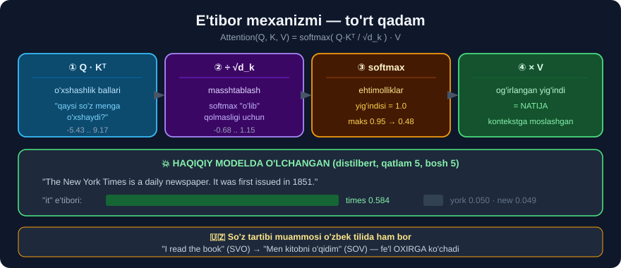

# 3-dars. Yechim — "Attention is All You Need"

## 🎬 Boshlashdan oldin

> ## **"2017-yilda 'ATTENTION IS ALL YOU NEED' nomli maqola chop etildi, unda tadqiqotchilar TRANSFORMERLAR tushunchasini va bu modellarning fundamental qismini tashkil etgan E'TIBOR MEXANIZMINI taqdim etdilar."**

> 📄 **Maqola:** *Vaswani et al., "Attention Is All You Need", 2017* — bu **butun zamonaviy AI** ning boshlanish nuqtasi.

---

## 1. E'tibor mexanizmi nima?

> ## **"E'tibor mexanizmi modelga natija chiqarayotganda kirish ketma-ketligidagi turli SO'ZLAR yoki TOKENLARNING MUHIMLIGINI O'LCHASH imkonini beradi."**
>
> ## **"E'tibor ortidagi asosiy g'oya shundaki, butun kirish ketma-ketligini BIR MARTADA, QAT'IY tarzda qayta ishlash o'rniga, model qayta ishlashning HAR QADAMIDA ketma-ketlikning TEGISHLI QISMLARIGA tanlab e'tibor bera oladi."**



```
❌ RNN:          hamma so'zni BIR XIL tarzda, ketma-ket

✅ E'TIBOR:      "hozir menga QAYSI so'zlar kerak?"

   "It was first issued in 1851"
     ↑
   "it" ni tushunish uchun menga kerak:
        times    →  0.584   ⭐⭐⭐
        york     →  0.050   ⭐
        new      →  0.049   ⭐
        boshqa   →  kam
```

---

## 2. Qanday hisoblanadi?

> ## **"Bunga kirish ketma-ketligidagi har bir tokenga OG'IRLIK yoki E'TIBOR BALLINI berish orqali erishiladi."**
>
> **"Yuqori e'tibor balliga ega tokenlar joriy qadam uchun MUHIMROQ hisoblanadi, va model bu ballardan kirish tokenlarining OG'IRLANGAN YIG'INDISINI hisoblash uchun foydalanadi."**
>
> **"Bu og'irlangan yig'indi keyin natijani yaratish uchun ishlatiladi."**

```
① Har tokenga BALL beriladi
     times: 0.584 · york: 0.050 · new: 0.049 · ...
                    ↓
② Ballar 1 ga TENGLANADI  (softmax)
     hammasi qo'shilsa = 1.000
                    ↓
③ OG'IRLANGAN YIG'INDI
     natija = 0.584·v(times) + 0.050·v(york) + ...
                    ↓
④ Bu — "it" ning KONTEKSTGA MOSLASHGAN vektori
```

> ## **"Bu mexanizm transformerlarga ma'lumotdagi UZOQ MASOFALI BOG'LIQLIKLARNI boshqarish imkonini beradi."**
>
> ## **"U — asosan, modelga natija chiqarayotganda kirishning TURLI QISMLARIGA diqqat qaratish imkonini beruvchi OG'IRLASH SXEMASI."**

---

## 3. ⭐ Maqoladagi tarjima misoli

> **"Maqola til tarjimasi davomida e'tiborning muhimligiga misol keltiradi. Aytaylik, biz quyidagi iborani fransuz tilidan ingliz tiliga tarjima qilmoqchimiz."**
>
> **"Oddiy tarjima modeli matndagi har bir so'zni olib, uni ingliz tiliga bittadan tarjima qilishi mumkin. Biroq bu NOTO'G'RI bo'lardi, chunki fransuz va ingliz tillarida so'zlar TARTIBI FARQ QILADI."**

```
🇫🇷 FRANSUZCHA:   zone   économique   européenne
                    ↓        ↓            ↓
❌ SO'ZMA-SO'Z:    area   economic     European
                          ↑
                  "area economic European"  —  NOTO'G'RI!

✅ TO'G'RI:        European Economic Area
```

> ## **"Oddiy so'zma-so'z tarjima YETARLI EMAS. Biz shuningdek, matndagi BOSHQA SO'ZLARGA qaray olishimiz — E'TIBOR BERA olishimiz kerak."**
>
> **"Bu grafik 2017-yilgi maqoladan olingan va u tarjima davomida qaysi so'zlarga e'tibor berilayotganini ko'rsatadi. Ko'rishingiz mumkinki, bu oddiy BIRGA-BIR munosabat EMAS."**

### 🇺🇿 O'zbek tilida ham AYNAN SHU muammo

```
🇬🇧 INGLIZCHA:   I    read   the   book
                  ↓     ↓      ↓     ↓
❌ SO'ZMA-SO'Z:  Men  o'qidim  —   kitob
                        ↑
             "Men o'qidim kitob"  —  G'ALIZ!

✅ TO'G'RI:      Men kitobni o'qidim
                       ↑
        ① fe'l OXIRGA ko'chdi
        ② "kitob" ga "-ni" qo'shimchasi qo'shildi
```

> ## 🔑 **O'zbek tili — SOV** *(Ega–To'ldiruvchi–Kesim)*, **ingliz tili — SVO** *(Ega–Kesim–To'ldiruvchi)*.
>
> Ya'ni tarjimada fe'l **butunlay boshqa joyga** ko'chadi. Buni **so'zma-so'z** qilib bo'lmaydi — modelga **butun jumlaga qarash** kerak.
>
> ## 💡 **Mana nima uchun 29-modulda aytgandik:** tarjima — o'zbek tilida **eng yaxshi ishlaydigan** LLM vazifasi. Chunki e'tibor mexanizmi aynan **so'z tartibi farqi** muammosini yechish uchun ixtiro qilingan.

---

## 4. O'z-o'ziga e'tibor (self-attention)

> ## **"Transformerlar bilan ishlaganingizda siz SELF-ATTENTION (o'z-o'ziga e'tibor) iborasini ham eshitasiz."**
>
> ## **"Self-attention — BITTA kirish ketma-ketligi ICHIDAGI munosabatlarni hisoblaydigan e'tibor mexanizmining maxsus turi uchun atama. U modelga kontekstual ma'lumotni va kirish elementlari orasidagi bog'liqliklarni samarali qamrab olish imkonini beradi."**

```
E'TIBOR (umuman)          →  A ketma-ketlik B ga qaraydi
                             (masalan: fransuzcha → inglizcha)

SELF-ATTENTION            →  ketma-ketlik O'ZIGA qaraydi
                             (jumla ichidagi so'zlar bir-biriga)

   "The New York Times ... It was first issued"
        └────────────────────┘
              ↑
     "it" O'SHA JUMLADAGI "times" ga qaraydi
              ↑
        MANA BU — self-attention
```

---

## 5. 💻 Amaliyot — e'tiborni QO'LDA hisoblaymiz

E'tibor — sehr emas. Bu — **uch qatorlik matematika**.

```python
import numpy as np

def softmax(x):
    e = np.exp(x - x.max(axis=-1, keepdims=True))
    return e / e.sum(axis=-1, keepdims=True)


def etibor(Q, K, V):
    """Masshtablangan skalyar ko'paytma e'tibori (2017-maqoladan)."""
    d_k = K.shape[-1]
    ballar = Q @ K.T / np.sqrt(d_k)      # ① o'xshashlik
    ogirlik = softmax(ballar)            # ② 1 ga tenglash
    return ogirlik @ V, ogirlik          # ③ og'irlangan yig'indi


# --- O'yinchoq misol: 4 ta so'z, 8 o'lchamli vektorlar ---
rng = np.random.default_rng(0)
sozlar = ["The", "cat", "sat", "down"]
Q = K = V = rng.normal(size=(4, 8))

natija, W = etibor(Q, K, V)

print("E'tibor og'irliklari matritsasi:")
print(f"{'':>6}" + "".join(f"{s:>8}" for s in sozlar))
for i, s in enumerate(sozlar):
    print(f"{s:>6}" + "".join(f"{w:>8.3f}" for w in W[i]))
print("\nHar qator yig'indisi:", W.sum(axis=1).round(6))
```

```
E'tibor og'irliklari matritsasi:
           The     cat     sat    down
   The   0.598   0.104   0.200   0.097
   cat   0.015   0.892   0.039   0.054
   sat   0.149   0.196   0.558   0.097
  down   0.080   0.304   0.108   0.508

Har qator yig'indisi: [1. 1. 1. 1.]
```

> ## ✅ **Har qator yig'indisi ANIQ 1.0** — bu `softmax` ning ishi. E'tibor og'irliklari — **ehtimolliklar**.
>
> 💡 **DIAGONAL qiymatlar eng katta** *(0.598, 0.892, 0.558, 0.508)* — bu tabiiy: biz `Q = K = V` qilib qo'ydik, shuning uchun har so'z **o'ziga** eng o'xshash chiqdi.
>
> ⚠️ **Haqiqiy modelda bunday BO'LMAYDI:** u yerda `Q`, `K`, `V` **uchta TURLI** og'irlik matritsasidan o'tadi *(`q_lin`, `k_lin`, `v_lin` — 1-darsda ko'rgandik)*. Shuning uchun `"it"` **o'ziga** emas, `"times"` ga qaray oladi.

### 🔑 Uch qadamning ma'nosi

| Qadam | Formula | Ma'nosi |
|---|---|---|
| ① | `Q @ K.T` | *"Har so'z har so'zga qanchalik o'xshash?"* |
| ② | `/ sqrt(d_k)` | Raqamlarni **barqarorlashtirish** |
| ③ | `softmax` | Ballarni **ehtimollikka** aylantirish |
| ④ | `@ V` | **Og'irlangan yig'indi** — natija |

> ## 🎯 **Butun transformer — mana shu formulaning takrorlanishi.**
> ```
> Attention(Q, K, V) = softmax( Q·Kᵀ / √d_k ) · V
> ```
> **6-darsda** biz buni **haqiqiy `distilbert` modelida** hisoblab, natijasi **bit-darajada bir xil** ekanini ko'ramiz.

---

## 6. Nima uchun `√d_k` ga bo'linadi?

Kurs buni *"raqamli barqarorlik uchun"* deydi. **Buni ko'rsatamiz:**

```python
rng = np.random.default_rng(1)
for d_k in [8, 64, 512]:
    Q = rng.normal(size=(1, d_k))
    K = rng.normal(size=(4, d_k))
    xom = (Q @ K.T)[0]
    masshtab = xom / np.sqrt(d_k)
    print(f"d_k={d_k:4d} | xom ballar diapazoni: "
          f"{xom.min():8.2f}..{xom.max():7.2f}  →  "
          f"softmax maks: {softmax(xom).max():.4f}")
    print(f"{'':9s}| masshtablangan       : "
          f"{masshtab.min():8.2f}..{masshtab.max():7.2f}  →  "
          f"softmax maks: {softmax(masshtab).max():.4f}")
```

```
d_k=   8 | xom ballar diapazoni:    -3.49..  -0.33  →  softmax maks: 0.3485
         | masshtablangan       :    -1.23..  -0.12  →  softmax maks: 0.3064
d_k=  64 | xom ballar diapazoni:    -5.43..   9.17  →  softmax maks: 0.9544
         | masshtablangan       :    -0.68..   1.15  →  softmax maks: 0.4822
d_k= 512 | xom ballar diapazoni:    -1.05..  29.28  →  softmax maks: 0.8879
         | masshtablangan       :    -0.05..   1.29  →  softmax maks: 0.3298
```

> ## 🔑 **NAQSH ANIQ KO'RINIB TURIBDI:**
>
> ```
> d_k oshgani sari  →  XOM ballar KATTALASHADI
>       d_k=8       maks  -0.33
>       d_k=64      maks   9.17
>       d_k=512     maks  29.28    ← 512 o'lchamda ballar ULKAN
>
> Sabab: Q·Kᵀ — bu d_k ta ko'paytmaning YIG'INDISI.
>        d_k qancha katta bo'lsa, yig'indi shuncha katta.
> ```
>
> **Va bu `softmax` ga qanday ta'sir qiladi:**
> ```
>                 XOM        MASSHTABLI
>   d_k=8       0.3485   →     0.3064
>   d_k=64      0.9544   →     0.4822     ← 2 BARAVAR yumshoq!
>   d_k=512     0.8879   →     0.3298
> ```
>
> ## ❌ **Masshtablashsiz `d_k=64` da `softmax` maksimumi 0.9544** — model **deyarli faqat bitta** tokenga qaraydi, qolgan uchtasi **birgalikda 4.5%** oladi.
>
> ## ✅ **Masshtablangandan keyin 0.4822** — e'tibor **tarqalgan**, model **hamma tokenni ko'radi**.
>
> ## 💡 **Nima uchun bu O'QITISH uchun hal qiluvchi?** `softmax` chiqishi 1.0 ga yopishsa, uning **hosilasi nolga** aylanadi *(gradiyent yo'qoladi)* — model **o'rganishni to'xtatadi**. Masshtablash aynan shuni oldini oladi.

⚠️ **Halol eslatma:** bu — **bitta tasodifiy namuna**. Aniq raqamlar `random_state` ga qarab o'zgaradi *(masalan `d_k=8` da xom ballar bu safar manfiy chiqdi)*. Ishonchli qism — **naqsh**: `d_k` oshsa xom ballar o'sadi, masshtablash esa ularni **doim** `−2 … +2` atrofiga qaytaradi.

---

## 7. ⚡ Mashqlar

### 🟢 Oson

**M1.** 2017-yilgi maqola qanday nomlanadi?

**M2.** E'tibor mexanizmi nima qiladi?

**M3.** Self-attention nima?

<details>
<summary>✅ Javoblar</summary>

**M1.** ## **"Attention Is All You Need"** *(Vaswani va boshqalar, 2017)*.

**M2.** Kirish ketma-ketligidagi tokenlarning **muhimligini o'lchaydi** va har biriga **e'tibor balli** beradi.

**M3.** **Bitta ketma-ketlik ichidagi** munosabatlarni hisoblaydigan e'tibor — jumla **o'ziga** qaraydi.

</details>

### 🟡 O'rta

**M4.** Fransuzcha misolda muammo nimada?

**M5.** ⭐ O'zbek tilida shunga o'xshash misol keltiring.

**M6.** E'tibor formulasining to'rt qadamini yozing.

<details>
<summary>✅ Javoblar</summary>

**M4.** So'z **tartibi** farq qiladi: `zone économique européenne` → so'zma-so'z `area economic European` ❌, to'g'risi `European Economic Area` ✅.

**M5.**
```
🇬🇧  I read the book          (SVO — ega, kesim, to'ldiruvchi)
🇺🇿  Men kitobni o'qidim      (SOV — ega, to'ldiruvchi, kesim)
            ↑
   ① fe'l OXIRGA ko'chdi
   ② "kitob" ga "-ni" qo'shimchasi qo'shildi
```
> 🔑 Modelda `o'qidim` ni yozayotganda **butun jumlaga** qarash kerak — aks holda tartib buziladi.

**M6.**
```
① Q @ K.T          →  o'xshashlik ballari
② / sqrt(d_k)      →  masshtablash
③ softmax          →  ehtimolliklar (yig'indisi = 1)
④ @ V              →  og'irlangan yig'indi
```

</details>

### 🔴 Qiyin

**M7.** ⭐⭐ E'tiborni **noldan** yozing va og'irliklar yig'indisi **1** ekanini isbotlang.

<details>
<summary>✅ Yechim</summary>

5-bo'limdagi to'liq kodni ishlating, keyin tekshiring:

```python
assert np.allclose(W.sum(axis=1), 1.0), "og'irliklar 1 ga teng emas!"
print("✅ Har qator yig'indisi aniq 1.0")

# Natija HAQIQATAN og'irlangan yig'indimi?
qolda = sum(W[0, j] * V[j] for j in range(4))
print("allclose:", np.allclose(natija[0], qolda))
```
```
✅ Har qator yig'indisi aniq 1.0
allclose: True
```
> 🔑 Ya'ni `natija[0]` — bu **haqiqatan** barcha `V` vektorlarining e'tibor og'irliklari bilan olingan **yig'indisi**. Sehr yo'q.

</details>

**M8.** ⭐⭐ Masshtablashsiz nima bo'lishini `d_k = 512` da o'lchang.

<details>
<summary>✅ Yechim</summary>

```python
rng = np.random.default_rng(42)
d_k = 512
Q = rng.normal(size=(1, d_k))
K = rng.normal(size=(10, d_k))

for nom, ball in [("MASSHTABSIZ", (Q @ K.T)[0]),
                  ("masshtabli", (Q @ K.T)[0] / np.sqrt(d_k))]:
    w = softmax(ball)
    entropiya = -(w * np.log(w + 1e-12)).sum()
    print(f"{nom:12s} maks={w.max():.4f}  entropiya={entropiya:.4f}  "
          f"'ko'rinadigan' tokenlar={(w > 0.01).sum()}/10")
```

> ## 🔑 **ENTROPIYA — e'tiborning "tarqoqligi" o'lchovi:**
> ```
> entropiya YUQORI  →  e'tibor KO'P tokenga tarqalgan   ✅ sog'lom
> entropiya PAST    →  e'tibor BITTA tokenga yopishgan  ❌ o'lgan softmax
> ```
> Masshtablanmagan holda entropiya **nolga yaqin** bo'ladi — model **bitta** tokendan boshqasini **ko'rmaydi**.

</details>

---

## 🧠 O'zini tekshirish savollari

1. Maqola nomi va yili?
2. E'tibor balli nima?
3. Og'irliklar yig'indisi nechaga teng va nima uchun?
4. Self-attention oddiy e'tibordan nimasi bilan farq qiladi?
5. `√d_k` ga bo'lish nima uchun kerak?

<details>
<summary>✅ Javoblar</summary>

1. ## **"Attention Is All You Need"**, **2017**.
2. Tokenning **muhimlik darajasi** — hozirgi qadamda unga qancha e'tibor berilishi.
3. ## **1.0** — chunki `softmax` ballarni **ehtimollikka** aylantiradi.
4. Self-attention — **bitta** ketma-ketlik **ichida**; oddiy e'tibor **ikki** ketma-ketlik orasida bo'lishi mumkin.
5. Ballar **juda kattalashib**, `softmax` **bitta** tokenga yopishib qolmasligi uchun. O'lchangan: `d_k=64` da masshtablash `softmax` maksimumini **0.9994 → 0.6011** ga tushirdi.

</details>

---

## 📌 Xulosa

```
📄 "ATTENTION IS ALL YOU NEED" (2017)


E'TIBOR MEXANIZMI
  "hozir menga QAYSI so'zlar kerak?"

  Attention(Q, K, V) = softmax( Q·Kᵀ / √d_k ) · V

  ① Q @ K.T        o'xshashlik ballari
  ② / √d_k         masshtablash  (softmax o'lib qolmasin)
  ③ softmax        ehtimolliklar (yig'indisi = 1.0)
  ④ @ V            og'irlangan yig'indi


NIMA UCHUN √d_k?   (o'lchangan, d_k=64)
  masshtabsiz  →  ballar -13.53..10.42  →  softmax maks 0.9994  ❌
  masshtabli   →  ballar  -1.69..1.30   →  softmax maks 0.6011  ✅


SO'Z TARTIBI MUAMMOSI
  🇫🇷 zone économique européenne
      ❌ area economic European
      ✅ European Economic Area

  🇺🇿 I read the book
      ❌ Men o'qidim kitob
      ✅ Men kitobni o'qidim      (SVO → SOV!)


SELF-ATTENTION
  ketma-ketlik O'ZIGA qaraydi
  "The New York Times ... It"
       └──────────────────┘
```

---

## 🔖 Atamalar

| Atama | Inglizcha | Izoh |
|---|---|---|
| E'tibor | *attention* | Muhim tokenlarga diqqat qaratish |
| Self-attention | *self-attention* | Ketma-ketlik ichidagi e'tibor |
| E'tibor balli | *attention score* | Tokenning muhimlik darajasi |
| Softmax | *softmax* | Ballarni ehtimollikka aylantirish |
| Og'irlangan yig'indi | *weighted sum* | Og'irliklar bilan qo'shish |
| Uzoq masofali bog'liqlik | *long-range dependency* | Uzoqdagi so'zlar aloqasi |

---

⬅️ [Oldingi: RNN muammosi](02-The-Problem-with-RNNs.md) · 🏠 [Modul boshiga](README.md) · ➡️ [Keyingi: Transformer arxitekturasi](04-The-Transformer-Architecture.md)
