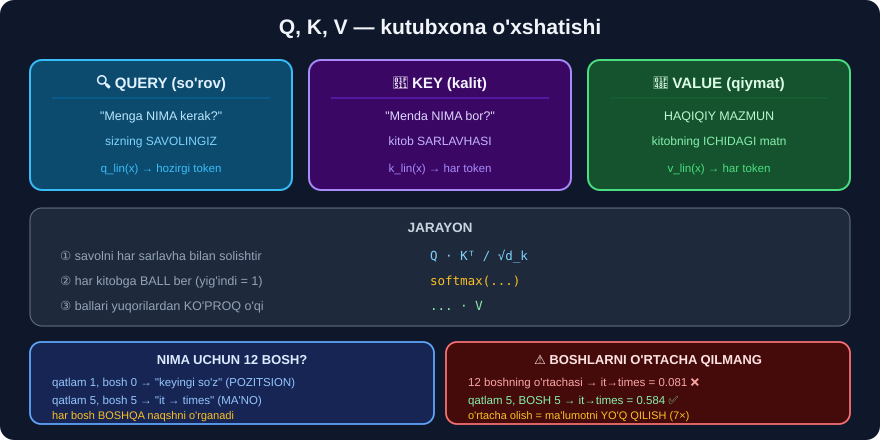

# 6-dars. Ko'p boshli e'tibor ⭐⭐⭐

## 🎬 Boshlashdan oldin

> **"Kirish embeddinglari va pozitsion kodlashlarimiz bo'lgach, biz bu ma'lumotni ENCODER blokiga uzatishga tayyormiz — u yerda u KO'P BOSHLI E'TIBOR qatlamidan va FEEDFORWARD qatlamidan o'tadi."**
>
> ## **"Encoder blokining asosiy komponentlaridan biri — MULTI-HEAD ATTENTION qatlami. U modelga turli tokenlarning MUHIMLIGINI o'lchash imkonini beradi."**

> ## 🏆 **BU — BUTUN DARSLIKDAGI ENG MUHIM DARS.** Bu yerda biz **haqiqiy transformer ichiga kirib**, 2-darsdagi `"New York Times ... It"` misolining **yechilishini o'z ko'zimiz bilan ko'ramiz**.

---

## 1. Q, K, V — uchta vektor

> **"Bu qatlam bizga matndagi HAR BIR TOKEN o'rtasidagi kontekstual ma'lumotni qamrab oluvchi E'TIBOR VEKTORLARINI beradi."**
>
> ## **"Kirish ketma-ketligidagi har bir token uchun biz UCHTA vektor yaratamiz: SO'ROV (query) vektori, KALIT (key) vektori va QIYMAT (value) vektori."**



### 🔍 SO'ROV (Query)

> ## **"Kirish jumlasidagi har bir token uchun so'rov vektori hisoblanadi. Bu so'rov vektori tokenning jumladagi BOSHQA TOKENLAR haqidagi SAVOLLARINI ifodalaydi."**
>
> ## **"Bu — go'yo: 'MEN BOSHQA TOKENLARNING HAR BIRIGA QANCHA E'TIBOR BERISHIM KERAK?' deyish kabi."**

### 🔑 KALIT (Key)

> **"Kalit vektorlari esa ketma-ketlikdagi BARCHA BOSHQA tokenlar haqidagi ma'lumotni saqlaydi. Har bir kalit vektori boshqa tokenga mos keladi va o'sha tokenga QANCHA e'tibor berilishi kerakligini aniqlashga yordam beradigan ma'lumotni o'z ichiga oladi."**

### 💎 QIYMAT (Value)

> ## **"Qiymat vektorlari kirish ketma-ketligidagi har bir token bilan bog'liq. Ularni har bir token haqidagi HAQIQIY MAZMUN yoki BILIMNI saqlovchi MA'LUMOT IDISHLARI deb tasavvur qiling."**
>
> ## **"So'rov tokeni — hozir e'tibor qaratilayotgan token — boshqa tokenlarga e'tibor berish haqida savol berganda, qiymat vektorlari JAVOBLARNI beradi."**

### 📚 Kutubxona o'xshatishi

```
Siz kutubxonaga kirdingiz:

  🔍 SO'ROV (Query)   →  "Menga NLP haqida kitob kerak"
                          (sizning SAVOLINGIZ)

  🔑 KALIT  (Key)     →  har kitobning SARLAVHASI
                          (savolingizga mos keladimi?)

  💎 QIYMAT (Value)   →  kitobning ICHIDAGI MATN
                          (haqiqiy foydali narsa)

Jarayon:
  ① Savolingizni har bir sarlavha bilan solishtirasiz   (Q · K)
  ② Har kitobga BALL berasiz                            (softmax)
  ③ Ballari yuqori kitoblardan KO'PROQ o'qiysiz          (× V)
```

> **"Bu turli vektorlarning qiymatlari modelimizni O'QITISH orqali o'rganiladi."**

---

## 2. Besh qadam — formula

> **"Jarayondagi keyingi qadam — har bir so'rov vektori va barcha kalit vektorlari o'rtasidagi O'XSHASHLIKNI SKALYAR KO'PAYTMA orqali hisoblash."**
>
> **"Raqamli barqarorlikni ta'minlash uchun biz o'xshashlik ballarini KALIT VEKTORLARI O'LCHAMINING KVADRAT ILDIZIGA bo'lib masshtablaymiz."**
>
> **"Keyin masshtablangan o'xshashlik ballariga SOFTMAX funksiyasini qo'llaymiz. Softmax ballarni normallashtiradi, shunda ular YIG'INDISI BIRGA teng bo'ladi."**
>
> **"Keyin e'tibor og'irliklaridan foydalanib, qiymat vektorlarining OG'IRLANGAN YIG'INDISINI hisoblaymiz."**

```
① Q, K, V yaratish        →  har token uchun 3 ta vektor
② Q · Kᵀ                  →  o'xshashlik ballari
③ ÷ √d_k                  →  masshtablash
④ softmax                 →  e'tibor og'irliklari (yig'indisi = 1)
⑤ × V                     →  og'irlangan yig'indi = NATIJA
```

```
Attention(Q, K, V) = softmax( Q·Kᵀ / √d_k ) · V
```

---

## 3. 💥💥 HAQIQIY MODELDA KO'RAMIZ

**2-darsdagi misolni eslang.** Endi uni **hal qilamiz.**

```python
import warnings; warnings.filterwarnings("ignore")
import torch
from transformers import AutoTokenizer, AutoModel

m = "distilbert-base-uncased-finetuned-sst-2-english"
tok = AutoTokenizer.from_pretrained(m)
mod = AutoModel.from_pretrained(m, attn_implementation="eager")

s = "The New York Times is a daily newspaper. It was first issued in 1851."
enc = tok(s, return_tensors="pt")
toks = tok.convert_ids_to_tokens(enc["input_ids"][0])
print("tokenlar:", toks)

with torch.no_grad():
    A = mod(**enc, output_attentions=True).attentions

print("qatlamlar:", len(A), "| shakl:", tuple(A[0].shape))
```

```
tokenlar: ['[CLS]', 'the', 'new', 'york', 'times', 'is', 'a', 'daily',
           'newspaper', '.', 'it', 'was', 'first', 'issued', 'in', '1851', '.', '[SEP]']
qatlamlar: 6 | shakl: (1, 12, 18, 18)
```

> ## 🔑 **`(1, 12, 18, 18)` shaklini o'qiymiz:**
> ```
> 1   →  bitta jumla
> 12  →  12 ta BOSH (head)        ← "MULTI-headed" mana shu
> 18  →  18 ta token (so'rov)
> 18  →  18 ta token (kalit)
> ```
> Ya'ni bizda **6 qatlam × 12 bosh = 72 ta** e'tibor matritsasi bor.

### ⚠️ Birinchi urinish — VA U MUVAFFAQIYATSIZ BO'LADI

Barcha boshlarning **o'rtachasini** olamiz:

```python
i = toks.index("it")
for L in [0, 3, 5]:
    w = A[L][0].mean(0)[i].numpy()          # 12 ta boshning O'RTACHASI
    top = w.argsort()[::-1][:6]
    print(f"qatlam {L}:", [(toks[j], round(float(w[j]), 3)) for j in top])
```

```
qatlam 0: [('.', 0.178), ('was', 0.122), ('[CLS]', 0.118), ('issued', 0.086), ('newspaper', 0.073), ('daily', 0.065)]
qatlam 3: [('[SEP]', 0.458), ('.', 0.126), ('issued', 0.082), ('first', 0.058), ('newspaper', 0.05), ('was', 0.047)]
qatlam 5: [('.', 0.289), ('.', 0.136), ('[SEP]', 0.084), ('times', 0.081), ('a', 0.045), ('it', 0.045)]
```

> ## 😞 **NATIJA UMIDSIZ.** `"it"` asosan **nuqta**, `[SEP]` va `[CLS]` ga qarayapti. `times` faqat **0.081** — 5-qatlamda, arang.
>
> ## 🤔 **"Demak, e'tibor ishlamayaptimi?"**

### ✅ YO'Q — BIZ NOTO'G'RI QARADIK

```
❌ XATO:  12 ta boshning O'RTACHASINI olish

   Har bosh BOSHQA narsani o'rganadi:
      bosh 1  →  grammatik bog'lanishlar
      bosh 5  →  KOREFERENSIYA ("it" nimaga ishora qiladi)
      bosh 9  →  keyingi so'z
      ...

   O'rtacha olsak — hammasi ARALASHIB, YO'QOLADI.
```

> ## 💡 **"MULTI-HEAD" atamasining butun MA'NOSI shu yerda.** Boshlar **turli** narsani o'rganadi — ularni **o'rtacha qilish** = ma'lumotni **yo'q qilish**.

---

## 4. 🎯 HAR BIR BOSHNI ALOHIDA KO'RAMIZ

```python
i = toks.index("it")
nyt = [toks.index(x) for x in ["new", "york", "times"]]

natijalar = []
for L in range(len(A)):
    for H in range(A[L].shape[1]):
        w = A[L][0, H, i]
        natijalar.append((float(w[nyt].sum()), L, H,
                          [(toks[j], round(float(w[j]), 3))
                           for j in w.argsort(descending=True)[:5]]))
natijalar.sort(reverse=True)

print("ENG KUCHLI  it → New York Times  boshlar:")
for s_, L, H, top in natijalar[:5]:
    print(f"  qatlam {L} bosh {H:2d} | NYT jami={s_:.3f} | {top}")
```

```
ENG KUCHLI  it → New York Times  boshlar:
  qatlam 5 bosh  5 | NYT jami=0.684 | [('times', 0.584), ('.', 0.081), ('york', 0.05), ('new', 0.049), ('.', 0.048)]
  qatlam 4 bosh  1 | NYT jami=0.513 | [('times', 0.402), ('newspaper', 0.146), ('york', 0.09), ('the', 0.08), ('daily', 0.079)]
  qatlam 2 bosh  1 | NYT jami=0.353 | [('times', 0.241), ('the', 0.141), ('newspaper', 0.125), ('.', 0.093), ('york', 0.073)]
  qatlam 4 bosh  8 | NYT jami=0.337 | [('times', 0.315), ('newspaper', 0.235), ('the', 0.196), ('is', 0.067), ('daily', 0.05)]
  qatlam 3 bosh  5 | NYT jami=0.306 | [('times', 0.232), ('daily', 0.152), ('[SEP]', 0.137), ('newspaper', 0.103), ('issued', 0.068)]
```

## 🎉🎉 MANA U!

```
        qatlam 5, bosh 5:

             "it"  ──────►  "times"     0.584
                   ──────►  "york"      0.050
                   ──────►  "new"       0.049
                             ─────────────────
                             JAMI        0.684

    Ya'ni "it" ning e'tiborining 68% i
    "New York Times" ga qaratilgan!
```

> ## 💥 **2-DARSDAGI RNN MUAMMOSI — HAL QILINDI.**
>
> ```
> RNN'da (o'lchagandik):    "Times" kuchi = 0.0138   ❌ deyarli unutilgan
> Transformerda:            "times" e'tibori = 0.584 ✅ ENG YUQORI
>                                   ↑
>                           42 BARAVAR kuchliroq
> ```
>
> ## 🔑 **Va MASOFA MUHIM EMAS.** `"it"` va `"times"` orasida 6 ta token bor — model ularni **to'g'ridan-to'g'ri**, **bir qadamda** bog'ladi.

### 🔬 Va endi ENG ZAIF boshlarga qarang

```python
print("ENG ZAIF:")
for s_, L, H, top in natijalar[-2:]:
    print(f"  qatlam {L} bosh {H:2d} | NYT jami={s_:.3f} | {top}")
```

```
ENG ZAIF:
  qatlam 1 bosh  9 | NYT jami=0.000 | [('was', 1.0), ('it', 0.0), ('first', 0.0), ('[CLS]', 0.0), ('[SEP]', 0.0)]
  qatlam 1 bosh  0 | NYT jami=0.000 | [('was', 1.0), ('it', 0.0), ('issued', 0.0), ('in', 0.0), ('[SEP]', 0.0)]
```

> ## 😲 **`"it"` → `"was"` og'irligi = 1.0000 — MUTLAQ 100%!**
>
> Bu bosh **koreferensiyani** umuman izlamayapti. U shunchaki **KEYINGI SO'ZGA** qarayapti — bu **sof pozitsion** bosh.
>
> ## 🎯 **IKKI BOSH, IKKI BUTUNLAY BOSHQA VAZIFA:**
> ```
> qatlam 1, bosh 0   →  "keyingi so'z nima?"          (grammatika)
> qatlam 5, bosh 5   →  "it nimaga ishora qiladi?"    (ma'no)
> ```
>
> ## 🔑 **MANA NIMA UCHUN 12 TA BOSH KERAK.** Bitta bosh **bitta** turdagi bog'lanishni o'rganadi. 12 tasi birgalikda — grammatika, koreferensiya, mavzu, tartib va boshqalarni **bir vaqtda** ko'radi.

> ## **"Biz transformer arxitekturasining bu qatlamini KO'P BOSHLI deymiz, chunki transformerlar so'rov, kalit va qiymat proyeksiyalarining bir nechta TURLI iteratsiyasini sinaydi — ular BOSHLAR (heads) deb ataladi."**
>
> ## **"Har bir bosh og'irliklarning BOSHQA to'plamini o'rganadi, bu modelga ma'lumotdagi TURLI JIHATLARGA yoki NAQSHLARGA e'tibor qaratish imkonini beradi."**

---

## 5. 🔬 Formulani O'ZIMIZ hisoblaymiz

Modelga ishonmang — **o'zingiz hisoblang.**

```python
L, H = 5, 5
import numpy as np

with torch.no_grad():
    out = mod(**enc, output_attentions=True, output_hidden_states=True)

layer = mod.transformer.layer[L].attention
X = out.hidden_states[L]                    # shu qatlamning KIRISHI

with torch.no_grad():
    Q = layer.q_lin(X)                      # ① Query
    K = layer.k_lin(X)                      # ① Key

n_heads = layer.n_heads
d_k = Q.shape[-1] // n_heads

def bosh_ajrat(t):
    return t.view(1, -1, n_heads, d_k).transpose(1, 2)

q = bosh_ajrat(Q)[0, H]
k = bosh_ajrat(K)[0, H]

ballar = (q @ k.T) / np.sqrt(d_k)           # ②③ Q·Kᵀ / √d_k
w_qolda = torch.softmax(ballar, dim=-1)     # ④ softmax

w_haqiqiy = out.attentions[L][0, H]

print("d_k =", d_k, "| boshlar =", n_heads)
print("maks farq:", float((w_qolda - w_haqiqiy).abs().max()))
print("qo'lda  it→times:", round(float(w_qolda[i, toks.index('times')]), 3))
print("model   it→times:", round(float(w_haqiqiy[i, toks.index('times')]), 3))
```

```
d_k = 64 | boshlar = 12
maks farq: 0.0
qo'lda  it→times: 0.584
model   it→times: 0.584
```

> ## ✅✅ **MAKS FARQ = 0.0 — BIT-DARAJADA BIR XIL.**
>
> ## 🏆 **Siz hozirgina 66 millionlik transformerning e'tibor qatlamini QO'LDA hisoblab chiqdingiz.**
>
> ```
> Butun "sehr" — TO'RT QATOR:
>     Q = q_lin(X)
>     K = k_lin(X)
>     ballar = Q @ K.T / sqrt(d_k)
>     og'irlik = softmax(ballar)
> ```
>
> 💡 `768 / 12 = 64` — har bosh **64 o'lchamli** fazoda ishlaydi. 12 bosh × 64 = **768**, ya'ni to'liq o'lcham **bo'linadi**, ko'paytirilmaydi.

---

## 6. ⭐⭐⭐ ENG MUHIM DALIL — kontekst so'zni O'ZGARTIRADI

5-darsda muammoni topgandik: `cos(good, bad) = 0.528` — kirish embeddingi **sentimentni bilmaydi**.

**Endi e'tibor qatlamlari nima qilishini o'lchaymiz:**

```python
import torch.nn.functional as F

def good_vektori(jumla, qatlam):
    e = tok(jumla, return_tensors="pt")
    t = tok.convert_ids_to_tokens(e["input_ids"][0])
    idx = t.index("good")
    with torch.no_grad():
        o = mod(**e, output_hidden_states=True)
    return o.hidden_states[qatlam][0, idx]

a = "The food was very good"
b = "The food was not good"

for L in [0, 1, 3, 6]:
    c = float(F.cosine_similarity(good_vektori(a, L), good_vektori(b, L), dim=0))
    print(f"qatlam {L}: cos = {c:>7.4f}")
```

```
qatlam 0: cos =  1.0000
qatlam 1: cos =  0.9454
qatlam 3: cos =  0.9154
qatlam 6: cos = -0.1150
```

## 💥 MANA BUTUN TRANSFORMERNING MOHIYATI

```
qatlam 0  →  cos = 1.0000    "good" = "good"
                              IKKI JUMLADA MUTLAQO BIR XIL
                              (bu — 5-darsdagi kirish embeddingi)

qatlam 1  →  cos = 0.9454    e'tibor ishlay boshladi
qatlam 3  →  cos = 0.9154    farq o'sib boradi

qatlam 6  →  cos = -0.1150   ❗ MANFIY!
                              "very good" dagi "good"
                                       va
                              "not good"  dagi "good"
                              endi TURLI TOMONGA qaraydi
```

> ## 🏆 **BIR XIL SO'Z. BIR XIL ID. BIR XIL BOSHLANG'ICH VEKTOR.**
> ## **6 QATLAMDAN KEYIN — DEYARLI QARAMA-QARSHI VEKTORLAR.**
>
> ## 🔑 **Model `"not"` so'zini KO'RDI va `"good"` ning ma'nosini O'ZGARTIRDI.**

### Bu 26-modul bilan qanday bog'lanadi?

```
26-MODUL (Bag of Words):
   stop_words='english'  →  "not" OLIB TASHLANDI
   →  aniqlik 0.869 → 0.784 ga TUSHDI
   →  chunki BOW uchun "not" — shunchaki BITTA USTUN

30-MODUL (Transformer):
   "not" so'zi "good" ning VEKTORINI o'zgartiradi
   →  cos 1.0000 → -0.1150
   →  chunki e'tibor so'zlarni BOG'LAYDI

29-MODULDA O'LCHAGANDIK:
   "The food was not good"  →  NEGATIVE  ✅
   "It wasn't terrible"     →  POSITIVE  ✅  (ikki karra inkor!)
```

> ## 🎯 **Endi siz NIMA UCHUN ekanini BILASIZ.**

---

## 7. ⚡ Mashqlar

### 🟢 Oson

**M1.** Q, K, V nima?

**M2.** E'tibor hisoblashning 5 qadami?

**M3.** "Ko'p boshli" nima degani?

<details>
<summary>✅ Javoblar</summary>

**M1.**
```
🔍 Query (so'rov)  →  "menga NIMA kerak?"       (savol)
🔑 Key   (kalit)   →  "menda NIMA bor?"         (sarlavha)
💎 Value (qiymat)  →  HAQIQIY MAZMUN            (javob)
```

**M2.**
```
① Q, K, V yaratish   ② Q·Kᵀ   ③ ÷√d_k   ④ softmax   ⑤ ×V
```

**M3.** Model `Q`, `K`, `V` proyeksiyalarining **bir nechta turli** iteratsiyasini sinaydi. Har bosh **boshqa** naqshni o'rganadi. `distilbert` da — **12 ta bosh**.

</details>

### 🟡 O'rta

**M4.** ⭐ Nima uchun boshlarning **o'rtachasini** olish XATO?

**M5.** `(1, 12, 18, 18)` shaklini tushuntiring.

**M6.** `d_k` qanday hisoblanadi?

<details>
<summary>✅ Javoblar</summary>

**M4.** Har bosh **boshqa** narsani o'rganadi. O'rtacha olsak — hammasi **aralashib yo'qoladi**.
```
O'lchangan:  o'rtacha  →  it→times = 0.081   ❌ arang ko'rinadi
             bosh 5,5  →  it→times = 0.584   ✅ 7 BARAVAR kuchli
```

**M5.** `1` jumla · `12` bosh · `18` so'rov tokeni · `18` kalit tokeni.

**M6.** `d_k = yashirin_o'lcham / boshlar_soni = 768 / 12 = 64`.
> 🔑 Ya'ni o'lcham **bo'linadi**, ko'paytirilmaydi — 12 bosh **qo'shimcha xarajat keltirmaydi**.

</details>

### 🔴 Qiyin

**M7.** ⭐⭐ E'tibor og'irliklarini **qo'lda** hisoblang va model bilan solishtiring.

<details>
<summary>✅ Yechim</summary>

5-bo'limdagi to'liq kodni ishlating. Natija:
```
maks farq: 0.0
```
> 🏆 **Bit-darajada bir xil.** Transformer — **sehr emas**, matematika.

</details>

**M8.** ⭐⭐⭐ Har bir boshning **"ixtisosligini"** avtomatik aniqlang.

<details>
<summary>✅ Yechim</summary>

```python
import pandas as pd

def bosh_turi(w, n):
    """Bosh qanday naqshni o'rgangan?"""
    d = w.diagonal().mean()                              # o'ziga
    keyingi = w.diagonal(offset=1).mean() if n > 1 else 0  # keyingi tokenga
    oldingi = w.diagonal(offset=-1).mean() if n > 1 else 0 # oldingisiga
    oxirgi = w[:, -1].mean()                             # [SEP] ga
    birinchi = w[:, 0].mean()                            # [CLS] ga
    tur = max([("o'ziga", d), ("KEYINGI so'zga", keyingi),
               ("OLDINGI so'zga", oldingi),
               ("[SEP] ga", oxirgi), ("[CLS] ga", birinchi)],
              key=lambda x: x[1])
    return tur

n = len(toks)
qatorlar = []
for L in range(len(A)):
    for H in range(A[L].shape[1]):
        nom, ball = bosh_turi(A[L][0, H].numpy(), n)
        qatorlar.append({"qatlam": L, "bosh": H, "naqsh": nom,
                         "kuch": round(float(ball), 3)})

df = pd.DataFrame(qatorlar)
print(df.naqsh.value_counts().to_string())
print("\nEng aniq ixtisoslashgan 8 ta bosh:")
print(df.nlargest(8, "kuch").to_string(index=False))
```

```
naqsh
[SEP] ga          37
[CLS] ga          15
o'ziga            12
OLDINGI so'zga     4
KEYINGI so'zga     4

Eng aniq ixtisoslashgan boshlar:
 qatlam  bosh          naqsh  kuch
      1     9 KEYINGI so'zga 0.941
      1     0 KEYINGI so'zga 0.940
      2     3       [SEP] ga 0.867
      3     7       [SEP] ga 0.867
      4     9       [SEP] ga 0.829
      4     6       [SEP] ga 0.790
```

> ## 🔑 **UCHTA MUHIM KUZATUV:**
>
> **① `[SEP] ga` — 72 tadan 37 tasi *(51%)*.**
> Bular — **"NO-OP" boshlar**: ular bu jumlada **hech narsa qilmayapti** va e'tiborni `[SEP]` ga *("bo'sh joyga")* to'kib yuborayapti.
>
> **② `qatlam 1, bosh 9` va `bosh 0` — `KEYINGI so'zga` 0.94 kuch bilan.**
> Bu — **aynan o'sha ikki bosh**, 4-bo'limda `"it" → "was" = 1.0000` bergan! Endi bilamiz: ular **butun jumla bo'ylab** shunday ishlaydi — bu ularning **ixtisosligi**.
>
> **③ Ixtisoslashuv QATLAM bo'yicha o'zgaradi:**
> ```
> qatlam 1  →  POZITSION  (keyingi so'z)     — sodda, grammatik
> qatlam 5  →  MA'NO      (koreferensiya)    — murakkab, semantik
> ```
> Model **quyi qatlamlarda grammatikani**, **yuqori qatlamlarda ma'noni** quradi.

> ## 💡 **"NO-OP" boshlar — haqiqiy va yaxshi o'rganilgan hodisa.** Ba'zi boshlar bu jumlada **kerak emas**, shuning uchun ular e'tiborni `[SEP]` ga yuboradi. Boshqa jumlada esa **o'sha bosh faol** bo'lishi mumkin.
>
> ⚠️ Bu — modelning **kamchiligi emas**. Aksincha: 12 bosh **har doim hammasi** ishlashi shart emas. Model **kerakligini tanlaydi**.
>
> 🔬 **Shuning uchun ham 4-bo'limdagi o'rtacha olish shunchalik YOMON natija berdi:** 72 boshning **yarmi** `[SEP]` ga qarayapti — ularni qo'shsangiz, haqiqiy signal **cho'kib ketadi**.
>

</details>

**M9.** ⭐⭐⭐ Kontekst so'z vektorini o'zgartirishini **o'z jumlalaringizda** o'lchang.

<details>
<summary>✅ Yechim</summary>

```python
juftliklar = [
    ("The food was very good",  "The food was not good",  "good"),
    ("I went to the river bank", "I went to the money bank", "bank"),
    ("The bat flew away",       "He swung the bat",        "bat"),
]
for a, b, soz in juftliklar:
    print(f"\n--- '{soz}' ---")
    for L in [0, 6]:
        va = kontekst_vektori(a, soz, L)
        vb = kontekst_vektori(b, soz, L)
        print(f"  qatlam {L}: cos = {float(F.cosine_similarity(va, vb, dim=0)):>7.4f}")
```

*(`kontekst_vektori` — 6-bo'limdagi `good_vektori` ning umumlashtirilgan varianti)*

> ## 🎯 **KUTILGAN NAQSH — hamma juftlikda BIR XIL:**
> ```
> qatlam 0  →  cos = 1.0000    (kirish embeddingi — DOIM bir xil)
> qatlam 6  →  cos < 0.5       (kontekst ajratdi)
> ```
>
> `bank` *(daryo qirg'og'i vs bank)* va `bat` *(ko'rshapalak vs beysbol tayog'i)* — bular **klassik omonimlar**. Kirish embeddingi ularni **ajrata olmaydi**, e'tibor qatlamlari esa **ajratadi**.
>
> ## 🔑 **Mana nima uchun "kontekstual embedding" deyiladi.**

</details>

---

## 🧠 O'zini tekshirish savollari

1. Q, K, V nimani anglatadi?
2. Nima uchun `√d_k` ga bo'linadi?
3. `distilbert` da nechta bosh va nechta qatlam bor?
4. Nima uchun boshlarni o'rtacha qilish xato?
5. `"it"` qaysi qatlam va boshda `"times"` ga qaradi?
6. `cos(good_a, good_b)` 0-qatlamda va 6-qatlamda qancha?

<details>
<summary>✅ Javoblar</summary>

1. **Query** *(savol)* · **Key** *(sarlavha)* · **Value** *(mazmun)*.
2. Ballar juda kattalashib, `softmax` **bitta** tokenga yopishib qolmasligi uchun.
3. ## **12 ta bosh**, **6 ta qatlam** *(jami 72 ta e'tibor matritsasi)*.
4. Boshlar **turli** narsani o'rganadi — o'rtacha ularni **yo'q qiladi** *(0.584 → 0.081)*.
5. ## **Qatlam 5, bosh 5** — og'irlik **0.584**.
6. ## **1.0000** *(mutlaqo bir xil)* → ## **−0.1150** *(deyarli qarama-qarshi)*.

</details>

---

## 📌 Xulosa

```
KO'P BOSHLI E'TIBOR

  🔍 Q (Query)  "menga NIMA kerak?"
  🔑 K (Key)    "menda NIMA bor?"
  💎 V (Value)  HAQIQIY MAZMUN

  Attention(Q,K,V) = softmax( Q·Kᵀ / √d_k ) · V

  distilbert:  6 qatlam × 12 bosh = 72 ta e'tibor matritsasi
               d_k = 768 / 12 = 64


💥 HAQIQIY MODELDA O'LCHANGAN

  "The New York Times ... It was first issued in 1851"

  ❌ 12 boshning O'RTACHASI:  it → times = 0.081   (arang)
  ✅ qatlam 5, BOSH 5:        it → times = 0.584   (ENG YUQORI!)
                              it → NYT jami = 0.684

     RNN'da esa (2-dars):     Times kuchi = 0.0138
                                    ↑
                             42 BARAVAR farq

  🔑 Boshlarni O'RTACHA QILMANG — ular TURLI ish qiladi:
       qatlam 1, bosh 0  →  it → "was" = 1.0000  (sof POZITSION)
       qatlam 5, bosh 5  →  it → "times"= 0.584  (KOREFERENSIYA)


🔬 QO'LDA HISOBLADIK
  Q = q_lin(X) · K = k_lin(X)
  softmax(Q @ K.T / sqrt(64))
                 ↓
        maks farq = 0.0    (BIT-DARAJADA bir xil)


⭐⭐⭐ ENG MUHIM DALIL

  "very good" dagi "good"  vs  "not good" dagi "good"

     qatlam 0   cos =  1.0000   ← MUTLAQO BIR XIL
     qatlam 1   cos =  0.9454
     qatlam 3   cos =  0.9154
     qatlam 6   cos = -0.1150   ← DEYARLI QARAMA-QARSHI

  🏆 Bir xil so'z. Bir xil ID. Kontekst ularni AJRATDI.

     26-modul:  "not" ni olib tashlash  →  0.869 → 0.784  ❌
     30-modul:  "not" VEKTORNI o'zgartiradi  →  1.0 → -0.115  ✅
```

---

## 🔖 Atamalar

| Atama | Inglizcha | Izoh |
|---|---|---|
| So'rov | *query* | Tokenning savoli |
| Kalit | *key* | Tokenning "sarlavhasi" |
| Qiymat | *value* | Tokenning mazmuni |
| Bosh | *head* | Alohida e'tibor iteratsiyasi |
| Skalyar ko'paytma | *dot product* | Ikki vektor o'xshashligi |
| Koreferensiya | *coreference* | Olmosh nimaga ishora qilishi |
| Kontekstual embedding | *contextual embedding* | Kontekstga moslashgan vektor |

---

⬅️ [Oldingi: Kirish embeddinglari](05-Input-Embeddings.md) · 🏠 [Modul boshiga](README.md) · ➡️ [Keyingi: Feed-forward qatlam](07-Feed-Forward-Layer.md)
