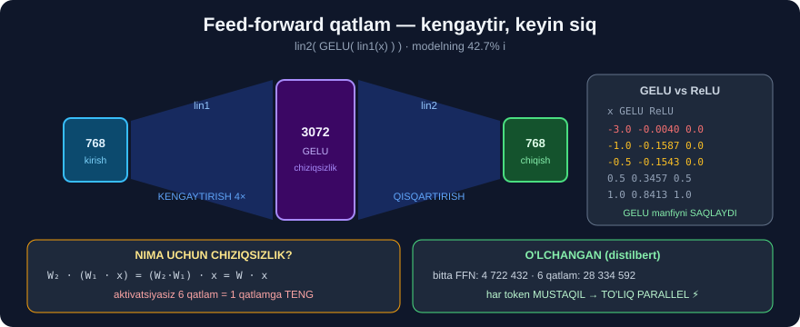

# 7-dars. Feed-forward qatlam

## 🎬 Boshlashdan oldin

> **"Ko'p boshli e'tibor mexanizmidan so'ng natija FEEDFORWARD neyron tarmog'idan o'tkaziladi."**
>
> ## **"Feedforward tarmoq kirish ketma-ketligi ichidagi MURAKKAB CHIZIQSIZ MUNOSABATLARNI qamrab olish va modellashtirishni o'rganadi."**

---

## 1. Nima uchun kerak?

> **"Transformer encoder blokidagi feedforward qatlami — self-attention mexanizmi davomida qamrab olingan ma'lumotni QAYTA ISHLASH va O'ZGARTIRISH uchun mas'ul asosiy komponent."**
>
> **"U modelning kirish ketma-ketligi ichidagi murakkab naqsh va munosabatlarni qamrab olish qobiliyatini KUCHAYTIRISH uchun mo'ljallangan."**

```
6-DARS (e'tibor)     →  "QAYSI so'zlar bir-biriga bog'liq?"
                         so'zlarni BOG'LAYDI

7-DARS (feed-forward)→  "Bu bog'lanishdan NIMA XULOSA chiqadi?"
                         har tokenni ALOHIDA qayta ishlaydi
```

---

## 2. Uch qadam

> **"Bu feedforward qatlamiga kirish — self-attention mexanizmining natijasi. Self-attention'dan so'ng sizda kirish ketma-ketligidagi har bir token uchun KONTEKSTGA XABARDOR ko'rinishlar to'plami bo'ladi."**

### ① Birinchi chiziqli o'zgartirish — KENGAYTIRISH

> ## **"Feedforward qatlamidagi birinchi qadam har bir token ko'rinishi uchun CHIZIQLI O'ZGARTIRISHNI o'z ichiga oladi. Ya'ni har bir ko'rinishga o'rganilgan OG'IRLIK MATRITSASI qo'llaniladi — bu uni qayta shakllantiradi va POTENSIAL YUQORIROQ O'LCHAMLI yangi fazoga proyeksiya qiladi."**

### ② Aktivatsiya funksiyasi — CHIZIQSIZLIK

> ## **"Bu o'zgartirish odatda modelga CHIZIQSIZLIKNI kirituvchi AKTIVATSIYA FUNKSIYASI bilan davom etadi."**

### ③ Ikkinchi chiziqli o'zgartirish — QISQARTIRISH

> **"Keyin yana bir chiziqli o'zgartirish qo'llaniladi. Bu o'zgartirish ma'lumotni yanada qayta shakllantiradi va proyeksiya qiladi, ko'pincha O'LCHAMLILIKNI KAMAYTIRADI. Bu qadamni ma'lumotni SIQISH yoki SODDALASHTIRISH deb ko'rish mumkin."**



---

## 3. 💻 Haqiqiy modelda o'lchaymiz

```python
import warnings; warnings.filterwarnings("ignore")
from transformers import AutoModel

mod = AutoModel.from_pretrained(
    "distilbert-base-uncased-finetuned-sst-2-english")
ffn = mod.transformer.layer[0].ffn

print("lin1:", tuple(ffn.lin1.weight.shape))
print("lin2:", tuple(ffn.lin2.weight.shape))
print("kengayish:", ffn.lin1.out_features / ffn.lin1.in_features, "baravar")

p1 = ffn.lin1.weight.numel() + ffn.lin1.bias.numel()
p2 = ffn.lin2.weight.numel() + ffn.lin2.bias.numel()
print(f"bitta FFN : {p1 + p2:,}")
print(f"6 qatlam  : {6 * (p1 + p2):,}")
```

```
lin1: (3072, 768)
lin2: (768, 3072)
kengayish: 4.0 baravar
bitta FFN : 4,722,432
6 qatlam  : 28,334,592
```

> ## 🎯 **AYNAN 4 BARAVAR KENGAYISH — bu transformerlarda STANDART.**
>
> ```
> 768   →   3072   →   768
>   ↑        ↑          ↑
> kirish  KENGAYTIR  QISQARTIR
>         (4× keng)   (asliga)
> ```
>
> ## 💡 **4-darsni eslang:** feed-forward — modelning **eng katta** qismi *(42.7%, 28 334 592 parametr)*. Mana **aynan o'sha raqam**.

### 🤔 Nima uchun kengaytirib, keyin qisqartirish?

```
Tasavvur qiling: siz murakkab masalani yechyapsiz.

  ① Avval hamma variantni QOG'OZGA YOZASIZ   (kengaytirish)
       →  ko'proq joy, ko'proq imkoniyat

  ② Keyin eng muhimini TANLAB OLASIZ          (qisqartirish)
       →  siqilgan, tozalangan xulosa

Model ham shunday qiladi.
```

---

## 4. ⭐ Aktivatsiya funksiyasi — GELU

Kurs *"aktivatsiya funksiyasi"* deydi, lekin **qaysi biri**? Tekshiramiz:

```python
print(ffn.activation)
```

```
GELUActivation()
```

**GELU va ReLU ni solishtiramiz:**

```python
import torch
import torch.nn.functional as F

x = torch.tensor([-3., -1., -0.5, 0., 0.5, 1., 3.])
print("x   :", x.tolist())
print("GELU:", [round(float(v), 4) for v in F.gelu(x)])
print("ReLU:", [round(float(v), 4) for v in F.relu(x)])
```

```
x   : [-3.0, -1.0, -0.5, 0.0, 0.5, 1.0, 3.0]
GELU: [-0.004, -0.1587, -0.1543, 0.0, 0.3457, 0.8413, 2.996]
ReLU: [0.0, 0.0, 0.0, 0.0, 0.5, 1.0, 3.0]
```

> ## 🔑 **ASOSIY FARQ — MANFIY QIYMATLARDA:**
>
> ```
> ReLU:  manfiy → 0        ← ma'lumot BUTUNLAY yo'qoladi
> GELU:  manfiy → kichik manfiy
>          -1.0  →  -0.1587
>          -0.5  →  -0.1543
>          -3.0  →  -0.0040   ← juda manfiy bo'lsa, deyarli 0
> ```
>
> ## 💡 **GELU "yumshoq" o'chirish qiladi.** Kichik manfiy signal **butunlay yo'qolmaydi** — u **zaiflashadi**, lekin **qoladi**. Bu o'qitishda **gradiyentning yo'qolmasligiga** yordam beradi.

### 😲 Va bitta g'alati narsaga e'tibor bering

```
x = -1.0   →  GELU = -0.1587
x = -0.5   →  GELU = -0.1543
                     ↑
        -1.0 dagi qiymat -0.5 dagidan KICHIKROQ (manfiyroq)
        LEKIN -3.0 da yana 0 ga QAYTGAN (-0.004)
```

> ## 🔑 **GELU MONOTON EMAS** — u `-0.75` atrofida **minimumga** tushadi, keyin yana **nolga** ko'tariladi.
>
> Bu — **ataylab**: *"biroz manfiy"* signal **saqlanadi**, *"juda manfiy"* signal esa **o'chiriladi**. `ReLU` ikkalasini ham **bir xil** *(0 ga)* aylantiradi.

### ⚠️ Nima uchun CHIZIQSIZLIK umuman kerak?

```
Agar aktivatsiya BO'LMASA:

   lin2(lin1(x))  =  W₂ · (W₁ · x)  =  (W₂ · W₁) · x  =  W · x
                                              ↑
              IKKI qatlam = BITTA qatlamga TENG!

   🔑 Chiziqsizliksiz 6 qatlam ham 1 qatlamga teng bo'lardi.
      Model "chuqur" bo'lmasdi.
```

---

## 5. Har token MUSTAQIL — va bu MUHIM

> ## **"Xulosa qilib aytganda, feedforward qatlami har bir token ko'rinishiga MUSTAQIL RAVISHDA qo'llaniladigan neyron tarmoq amallari to'plami sifatida ishlaydi."**
>
> ## **"Va bu amallar har bir tokenga mustaqil qo'llanilgani uchun, biz ularni PARALLEL ishga tushirishimiz mumkin — bu jarayonni haqiqatan TEZLASHTIRADI."**

```
E'TIBOR qatlami:       tokenlar BIR-BIRIGA qaraydi
                       → mustaqil EMAS

FEED-FORWARD qatlami:  har token ALOHIDA qayta ishlanadi
                       → TO'LIQ PARALLEL  ⚡
```

> ## 💡 **Mana nima uchun transformer tez.** Parametrlarning **42.7%** i *(feed-forward)* **butunlay parallel** ishlaydi.

---

## 6. ⚡ Mashqlar

### 🟢 Oson

**M1.** Feed-forward qatlamning uch qadami?

**M2.** `distilbert` da qanday aktivatsiya ishlatiladi?

**M3.** O'lcham qanday o'zgaradi?

<details>
<summary>✅ Javoblar</summary>

**M1.** ① **Chiziqli kengaytirish** → ② **aktivatsiya** *(chiziqsizlik)* → ③ **chiziqli qisqartirish**.

**M2.** ## **GELU** *(`GELUActivation()`)*.

**M3.** ## **768 → 3072 → 768** *(4 baravar kengayadi, keyin asliga qaytadi)*.

</details>

### 🟡 O'rta

**M4.** ⭐ Chiziqsizlik bo'lmasa nima bo'lardi?

**M5.** GELU va ReLU farqi?

**M6.** Nima uchun feed-forward parallel ishlay oladi?

<details>
<summary>✅ Javoblar</summary>

**M4.**
```
W₂ · (W₁ · x) = (W₂ · W₁) · x = W · x
                       ↑
        Ikki qatlam BITTA qatlamga teng bo'lardi
```
> ## 🔑 **6 qatlam ham 1 qatlamga teng bo'lardi** — model "chuqur" bo'lmasdi.

**M5.**
```
ReLU:  manfiy → 0             (ma'lumot BUTUNLAY yo'qoladi)
GELU:  manfiy → kichik manfiy (ma'lumot ZAIFLASHADI, lekin QOLADI)
```
> O'lchangan: `-1.0` → ReLU `0.0`, GELU `-0.1587`.

**M6.** Har token **mustaqil** qayta ishlanadi — biri boshqasini **kutmaydi**.

</details>

### 🔴 Qiyin

**M7.** ⭐⭐ FFN ni **qo'lda** hisoblang va model bilan solishtiring.

<details>
<summary>✅ Yechim</summary>

```python
import torch
import torch.nn.functional as F

x = torch.randn(1, 5, 768)

with torch.no_grad():
    model_natija = ffn(x)                       # modelning o'zi
    qolda = ffn.lin2(F.gelu(ffn.lin1(x)))       # QO'LDA: lin1 → GELU → lin2

print("shakl     :", tuple(model_natija.shape))
print("maks farq :", float((model_natija - qolda).abs().max()))
```

> ## 🔑 **Kutilgan natija: maks farq ≈ 0.**
>
> ⚠️ `ffn` da `dropout` ham bor, lekin `model.eval()` rejimida *(`from_pretrained` shunday yuklaydi)* u **o'chirilgan** bo'ladi. Shuning uchun natija **bir xil** chiqadi.
>
> 🏆 **Butun feed-forward qatlami — bitta qatorlik ifoda:** `lin2(gelu(lin1(x)))`.

</details>

**M8.** ⭐⭐ Kengaytirish koeffitsienti *(4×)* turli modellarda bir xilmi?

<details>
<summary>✅ Yechim</summary>

```python
from transformers import AutoConfig

for m in ["distilbert-base-uncased-finetuned-sst-2-english",
          "cardiffnlp/twitter-roberta-base-sentiment-latest",
          "nlptown/bert-base-multilingual-uncased-sentiment"]:
    c = AutoConfig.from_pretrained(m)
    yashirin = getattr(c, "hidden_size", getattr(c, "dim", None))
    ffn_dim = getattr(c, "intermediate_size", getattr(c, "hidden_dim", None))
    print(f"{m.split('/')[-1][:34]:36s} {yashirin} → {ffn_dim} "
          f"({ffn_dim / yashirin:.1f}×)")
```

> ## 🔑 **Kutilgan natija: uchalasida ham 4.0×.**
>
> Bu — 2017-yilgi maqoladan kelgan **konventsiya**: `d_ff = 4 · d_model`. U hech qanday matematik qonundan kelib chiqmagan — shunchaki **amalda yaxshi ishlagan** va standart bo'lib qolgan.
>
> 💡 Yangi modellarda *(LLaMA, Mistral)* bu nisbat **o'zgargan** — ular `SwiGLU` aktivatsiyasi bilan `~2.7×` ishlatadi.

</details>

---

## 🧠 O'zini tekshirish savollari

1. Feed-forward qatlamning kirishi nima?
2. Uch qadam qaysilar?
3. Nima uchun kengaytirib keyin qisqartiriladi?
4. Chiziqsizlik nima uchun kerak?
5. Bu qatlam parametrlarning necha foizini oladi?

<details>
<summary>✅ Javoblar</summary>

1. ## **Self-attention qatlamining natijasi** — kontekstga xabardor ko'rinishlar.
2. **Chiziqli** *(768→3072)* → **GELU** → **chiziqli** *(3072→768)*.
3. Avval **ko'proq joy** *(murakkab naqshlarni topish uchun)*, keyin **siqish** *(muhimini saqlash)*.
4. Aks holda ikki qatlam **bitta** qatlamga teng bo'lardi — model chuqur bo'lmasdi.
5. ## **42.7%** — **28 334 592** parametr *(eng katta qism!)*.

</details>

---

## 📌 Xulosa

```
FEED-FORWARD QATLAM

  Kirish: self-attention natijasi (kontekstga xabardor vektorlar)

  ① lin1   768 → 3072      KENGAYTIRISH (4×)
  ② GELU                   CHIZIQSIZLIK
  ③ lin2   3072 → 768      QISQARTIRISH

  Butun qatlam:  lin2(gelu(lin1(x)))


O'LCHANGAN (distilbert)
  lin1: (3072, 768)   lin2: (768, 3072)
  bitta FFN : 4,722,432
  6 qatlam  : 28,334,592   ← modelning 42.7% i!


GELU vs ReLU
       x      GELU      ReLU
    -3.0   -0.0040     0.0     ← juda manfiy: ikkalasi ham ~0
    -1.0   -0.1587     0.0     ← GELU SAQLAYDI, ReLU O'CHIRADI
     0.5    0.3457     0.5
     1.0    0.8413     1.0

  🔑 GELU "yumshoq" o'chiradi va MONOTON EMAS


NIMA UCHUN CHIZIQSIZLIK?
  W₂ · (W₁ · x) = W · x
        ↑
  Aktivatsiyasiz 6 qatlam = 1 qatlam


HAR TOKEN MUSTAQIL  →  TO'LIQ PARALLEL  ⚡
```

---

## 🔖 Atamalar

| Atama | Inglizcha | Izoh |
|---|---|---|
| Feed-forward | *feed-forward* | Oldinga uzatuvchi tarmoq |
| Chiziqli o'zgartirish | *linear transformation* | Matritsaga ko'paytirish |
| Aktivatsiya | *activation* | Chiziqsizlik kirituvchi funksiya |
| GELU | *Gaussian Error Linear Unit* | Yumshoq aktivatsiya |
| ReLU | *Rectified Linear Unit* | Manfiyni nolga aylantiruvchi |
| O'lchamlilik | *dimensionality* | Vektordagi sonlar soni |

---

⬅️ [Oldingi: Ko'p boshli e'tibor](06-Multi-Headed-Attention.md) · 🏠 [Modul boshiga](README.md) · ➡️ [Keyingi: Niqoblangan e'tibor](08-Masked-Multihead-Attention.md)
