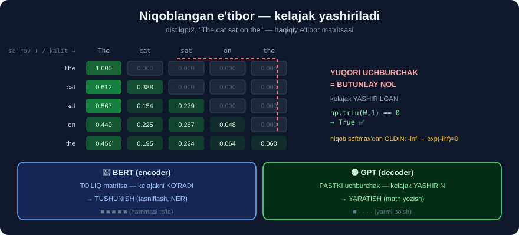

# 8-dars. Niqoblangan ko'p boshli e'tibor

## 🎬 Boshlashdan oldin

> **"Modelimiz o'rganishini xohlagan KUTILAYOTGAN NATIJALAR DECODER blokiga uzatiladi."**

> ## 🔄 **ENDI ENCODER'DAN DECODER'GA O'TAMIZ.** 5–7-darslar encoder haqida edi. 8–9-darslar — decoder.

---

## 1. Decoder nimani oladi?

> **"Fransuz–ingliz tarjimasi misolimizni eslang. FRANSUZ so'zlari ENCODER blokiga, INGLIZ so'zlarini esa biz DECODER blokiga beramiz."**
>
> **"Bu natijalar ham shunga o'xshash embedding o'zgartirishlaridan o'tadi va decoder blokiga berilishdan oldin o'z pozitsion kodlashlarini oladi."**

```
🇫🇷 "zone économique européenne"   →  ENCODER
                                          ↓
                                    (ma'no vektorlari)
                                          ↓
🇬🇧 "European Economic Area"       →  DECODER
```

---

## 2. ⭐ Nima uchun "NIQOBLANGAN"?

> ## **"Biroq biz barcha chiqish embeddinglarini decoder blokiga BIR VAQTDA BERMAYMIZ. Ular MASKED MULTI-HEAD ATTENTION qatlamidan o'tadi."**
>
> ## **"Bu encoder blokidagi ko'p boshli e'tibor qatlamiga o'xshaydi, lekin biz uni NIQOBLANGAN deymiz, chunki modelni O'RGANISHGA MAJBURLASH uchun natijalar haqidagi ba'zi ma'lumotni YASHIRISHIMIZ kerak."**

### 🎓 Nima uchun bu SHART?

```
❌ NIQOBSIZ BO'LSA:

  Model o'rganyapti:  "European Economic ___"
  Va u KELAJAKNI KO'RA OLADI:  "... Area"
                                    ↑
              Javob KO'RINIB TURIBDI!

  Model nima o'rganadi?  HECH NARSA.
  U shunchaki NUSXA KO'CHIRADI.
```

```
✅ NIQOB BILAN:

  Model ko'radi:      "European Economic ___"
  Kelajak YASHIRIN:   [niqoblangan]

  Model TAXMIN QILISHI kerak  →  HAQIQATAN O'RGANADI
```

> ## 💡 **Bu — imtihonda javoblarni yopib qo'yish bilan bir xil.** Ochiq qolsa, talaba **o'rganmaydi** — **ko'chiradi**.

---

## 3. Aynan NIMA yashiriladi?

> ## **"Biz modelga barcha FRANSUZ kirish so'zlarini ko'rishga ruxsat beramiz — va so'zlar deganda men, aslida, bu so'zlarning e'tibor vektorlarini nazarda tutyapman."**
>
> ## **"Lekin model jumlada hozir e'tibor qaratilayotgan so'zdan OLDIN kelgan INGLIZ so'zlarini GINA ko'radi."**
>
> **"Keyin model berilgan natijalardagi keyingi so'zga shunchaki qarash o'rniga, TO'G'RI keyingi so'z qanday bo'lishini O'RGANISHI kerak."**

```
KIRISH (fransuzcha)  →  HAMMASI ko'rinadi        ✅
CHIQISH (inglizcha)  →  faqat OLDINGILARI       ⚠️

  "European"  ni yozayotganda    →  hech narsa ko'rmaydi
  "Economic"  ni yozayotganda    →  "European" ni ko'radi
  "Area"      ni yozayotganda    →  "European Economic" ni ko'radi
```



> **"Biz buni NIQOBLANGAN ko'p boshli e'tibor deymiz, chunki chiqish matnida KEYINROQ kelgan so'zlar bu bosqichda modeldan NIQOBLANGAN yoki YASHIRILGAN."**

---

## 4. 💻 Buni HAQIQIY modelda KO'RAMIZ

`GPT` — **faqat decoder** modeli *(4-darsni eslang)*, ya'ni uning **butun** e'tibori niqoblangan.

```python
import warnings; warnings.filterwarnings("ignore")
import torch, numpy as np
from transformers import AutoTokenizer, AutoModelForCausalLM

tok = AutoTokenizer.from_pretrained("distilgpt2")
g = AutoModelForCausalLM.from_pretrained("distilgpt2",
                                         attn_implementation="eager")

enc = tok("The cat sat on the", return_tensors="pt")
toks = tok.convert_ids_to_tokens(enc["input_ids"][0])
with torch.no_grad():
    out = g(**enc, output_attentions=True)

W = out.attentions[0][0, 0].numpy()      # 0-qatlam, 0-bosh
print("tokenlar:", toks)
for i, t in enumerate(toks):
    print(f"  {t:>7}" + "".join(f"{W[i, j]:7.3f}" for j in range(len(toks))))
```

```
tokenlar: ['The', 'Ġcat', 'Ġsat', 'Ġon', 'Ġthe']
      The  1.000  0.000  0.000  0.000  0.000
     Ġcat  0.612  0.388  0.000  0.000  0.000
     Ġsat  0.567  0.154  0.279  0.000  0.000
      Ġon  0.440  0.225  0.287  0.048  0.000
     Ġthe  0.456  0.195  0.224  0.064  0.060
```

## 🎯 QARANG — MUKAMMAL PASTKI UCHBURCHAK!

```
      The    cat    sat    on    the
The  1.000  0.000  0.000  0.000  0.000    ← faqat O'ZINI ko'radi
cat  0.612  0.388  0.000  0.000  0.000    ← "The" va o'zini
sat  0.567  0.154  0.279  0.000  0.000    ← 3 tasini
on   0.440  0.225  0.287  0.048  0.000    ← 4 tasini
the  0.456  0.195  0.224  0.064  0.060    ← hammasini

                    ▲
        YUQORI UCHBURCHAK — BUTUNLAY NOL
             KELAJAK YASHIRILGAN!
```

```python
print("yuqori uchburchak nolmi?", bool(np.allclose(np.triu(W, 1), 0)))
```

```
yuqori uchburchak nolmi? True
```

> ## ✅ **NIQOB ISBOTLANDI.** Bu **chizma emas** — bu **haqiqiy modeldan olingan raqamlar**.

### 🔬 Yana ikkita muhim kuzatuv

**① Birinchi qator = 1.000**

```
"The" birinchi token  →  boshqa ko'radigan hech narsa yo'q
                      →  butun e'tibor O'ZIGA
                      →  softmax bitta elementdan  →  1.000
```

**② `Ġ` belgisi nima?**

```
GPT-2 tokenizatori BO'SHLIQNI so'zga qo'shib yuboradi:
   'Ġcat'  =  " cat"   (bo'shliq + cat)
   'The'   =  "The"    (jumla boshi — bo'shliqsiz)
```
> 💡 Shuning uchun `"cat"` va `" cat"` — GPT-2 uchun **turli tokenlar**. Bu — nozik, lekin amalda muhim tafsilot.

---

## 5. 🔑 BERT vs GPT — asosiy farq shu yerda

```
🔵 BERT (encoder)              🟢 GPT (decoder)

  E'tibor: TO'LIQ matritsa       E'tibor: PASTKI UCHBURCHAK
  ┌─────────────┐                ┌─────────────┐
  │ ■ ■ ■ ■ ■ │                │ ■ · · · · │
  │ ■ ■ ■ ■ ■ │                │ ■ ■ · · · │
  │ ■ ■ ■ ■ ■ │                │ ■ ■ ■ · · │
  │ ■ ■ ■ ■ ■ │                │ ■ ■ ■ ■ · │
  │ ■ ■ ■ ■ ■ │                │ ■ ■ ■ ■ ■ │
  └─────────────┘                └─────────────┘

  Chapga ham, o'ngga ham         Faqat ORQAGA qaraydi
  KELAJAKNI ko'radi              KELAJAK YASHIRIN

  →  TUSHUNISH uchun zo'r        →  YARATISH uchun zo'r
     (tasniflash, NER)              (matn yozish)
```

> ## 💡 **Endi 4-darsdagi jadval MA'NOLI bo'ldi:**
> ```
> BERT tasniflay oladi   →  chunki BUTUN jumlani ko'radi
> BERT matn yoza olmaydi →  chunki u "keyingi so'z" o'yinini o'ynamagan
>
> GPT matn yoza oladi    →  chunki u AYNAN shunga o'qitilgan
> GPT tasniflashda zaifroq→  chunki oxirgi tokengacha butun kontekst yo'q
> ```
>
> ## 🎯 **29-modul, 6-darsni eslang:** *"oldindan o'qitish = KEYINGI SO'ZNI bashorat qilish"*. Mana **nima uchun** niqob kerak — usiz bu o'yin **ma'nosiz** bo'lardi.

---

## 6. ⚡ Mashqlar

### 🟢 Oson

**M1.** Decoder blokiga nima beriladi?

**M2.** Nima uchun "niqoblangan" deyiladi?

**M3.** Model qaysi so'zlarni ko'ra oladi?

<details>
<summary>✅ Javoblar</summary>

**M1.** **Kutilayotgan natijalar** *(tarjima misolida — inglizcha so'zlar)*, embedding va pozitsion kodlashdan o'tgan holda.

**M2.** Chunki **keyinroq kelgan** so'zlar modeldan **yashiriladi** — u **kelajakni ko'ra olmaydi**.

**M3.** ## **Kirishning HAMMASINI** *(fransuzcha)* + **chiqishning faqat OLDINGI** so'zlarini.

</details>

### 🟡 O'rta

**M4.** ⭐ Niqob bo'lmasa nima bo'lardi?

**M5.** E'tibor matritsasi qanday ko'rinishda bo'ladi?

**M6.** BERT va GPT ning e'tibor matritsasi farqi?

<details>
<summary>✅ Javoblar</summary>

**M4.** Model **javobni ko'rib turardi** — o'rganish o'rniga **nusxa ko'chirardi**.
```
"European Economic ___"  +  javob KO'RINIB TURIBDI ("Area")
        →  model hech narsa o'rganmaydi
```

**M5.** ## **PASTKI UCHBURCHAK** — yuqori uchburchak **butunlay nol**.
```
np.allclose(np.triu(W, 1), 0)  →  True
```

**M6.**
```
BERT →  TO'LIQ matritsa    (kelajakni KO'RADI)   →  tushunish
GPT  →  PASTKI uchburchak  (kelajak YASHIRIN)    →  yaratish
```

</details>

### 🔴 Qiyin

**M7.** ⭐⭐ Niqobning **hamma qatlam va boshda** ishlashini tekshiring.

<details>
<summary>✅ Yechim</summary>

```python
buzilgan = 0
for L, A_ in enumerate(out.attentions):
    for H in range(A_.shape[1]):
        W_ = A_[0, H].numpy()
        if not np.allclose(np.triu(W_, 1), 0, atol=1e-6):
            buzilgan += 1
            print(f"❌ qatlam {L} bosh {H} — niqob BUZILGAN!")
jami = len(out.attentions) * out.attentions[0].shape[1]
print(f"✅ {jami - buzilgan}/{jami} ta bosh niqobni to'g'ri qo'llaydi")
```

> ## 🔑 **Kutilgan natija: HAMMASI to'g'ri.**
>
> Niqob — **o'rganiladigan** narsa emas, u **arxitekturaga qattiq kiritilgan**. Model uni **buza olmaydi**.
>
> 💡 Texnik jihatdan niqob `softmax` dan **oldin** qo'llanadi: kelajak pozitsiyalariga `-inf` qo'yiladi, keyin `softmax(-inf) = 0` chiqadi. Shuning uchun natija **aniq nol**, "juda kichik son" emas.

</details>

**M8.** ⭐⭐ Niqobni **qo'lda** yasang va uning `softmax` ga ta'sirini ko'rsating.

<details>
<summary>✅ Yechim</summary>

```python
import torch

n = 5
ballar = torch.randn(n, n)

# Kelajak pozitsiyalariga -inf
niqob = torch.triu(torch.ones(n, n), diagonal=1).bool()
niqoblangan = ballar.masked_fill(niqob, float("-inf"))

print("NIQOBSIZ softmax (1-qator):")
print(torch.softmax(ballar, dim=-1)[0].round(decimals=3).tolist())
print("NIQOBLI softmax (1-qator):")
print(torch.softmax(niqoblangan, dim=-1)[0].round(decimals=3).tolist())
```

> ## 🔑 **Kutilgan natija:**
> ```
> NIQOBSIZ:  [0.2, 0.15, 0.3, 0.1, 0.25]   ← hammasiga tarqalgan
> NIQOBLI :  [1.0, 0.0,  0.0, 0.0, 0.0 ]   ← faqat BIRINCHI
> ```
>
> ## 💡 **Nima uchun `-inf` ishlatiladi, `0` emas?**
> ```
> exp(-inf) = 0        →  softmax'dan keyin ANIQ 0   ✅
> exp(0)    = 1        →  softmax'dan keyin katta ulush  ❌
> ```
> Ya'ni niqob `softmax` dan **oldin** qo'llanishi **shart**.

</details>

---

## 🧠 O'zini tekshirish savollari

1. Decoder qaysi ma'lumotni oladi?
2. Niqob nimani yashiradi?
3. Nima uchun bu o'rganish uchun zarur?
4. Matritsa qanday ko'rinishda?
5. GPT va BERT ning farqi nimada?

<details>
<summary>✅ Javoblar</summary>

1. **Kutilayotgan natijalar** *(chiqish ketma-ketligi)*.
2. ## **KELAJAKDAGI** *(keyinroq keladigan)* tokenlarni.
3. Aks holda model **javobni ko'rib**, o'rganish o'rniga **nusxa ko'chirardi**.
4. ## **Pastki uchburchak** — yuqori qism **butunlay nol**.
5. **BERT** — to'liq matritsa *(tushunish)* · **GPT** — pastki uchburchak *(yaratish)*.

</details>

---

## 📌 Xulosa

```
NIQOBLANGAN E'TIBOR

  KIRISH  (encoder'dan)  →  HAMMASI ko'rinadi
  CHIQISH (decoder'da)   →  faqat OLDINGILARI


NIMA UCHUN?
  ❌ niqobsiz:  model JAVOBNI ko'radi  →  NUSXA KO'CHIRADI
  ✅ niqob bilan: model TAXMIN qiladi  →  HAQIQATAN O'RGANADI

  (imtihonda javoblarni yopib qo'yish bilan bir xil)


💻 O'LCHANGAN (distilgpt2, "The cat sat on the")

        The    cat    sat    on    the
  The  1.000  0.000  0.000  0.000  0.000
  cat  0.612  0.388  0.000  0.000  0.000
  sat  0.567  0.154  0.279  0.000  0.000
  on   0.440  0.225  0.287  0.048  0.000
  the  0.456  0.195  0.224  0.064  0.060

  np.allclose(np.triu(W, 1), 0)  →  True   ✅


BERT vs GPT
  🔵 BERT  TO'LIQ matritsa    kelajakni KO'RADI  →  TUSHUNISH
  🟢 GPT   PASTKI uchburchak kelajak YASHIRIN   →  YARATISH


TEXNIK TAFSILOT
  Niqob softmax'dan OLDIN qo'llanadi:
     kelajak pozitsiyalariga -inf
     exp(-inf) = 0  →  aniq NOL
```

---

## 🔖 Atamalar

| Atama | Inglizcha | Izoh |
|---|---|---|
| Niqoblangan e'tibor | *masked attention* | Kelajakni yashiruvchi e'tibor |
| Kauzal niqob | *causal mask* | Sababiy *(faqat orqaga)* niqob |
| Pastki uchburchak | *lower triangular* | Diagonal va undan pastdagi qism |
| Decoder | *decoder* | Chiqishni yaratuvchi blok |
| Avtoregressiv | *autoregressive* | O'z natijasidan davom etuvchi |

---

⬅️ [Oldingi: Feed-forward qatlam](07-Feed-Forward-Layer.md) · 🏠 [Modul boshiga](README.md) · ➡️ [Keyingi: Yakuniy natijalarni bashorat qilish](09-Predicting-the-Final-Outputs.md)
