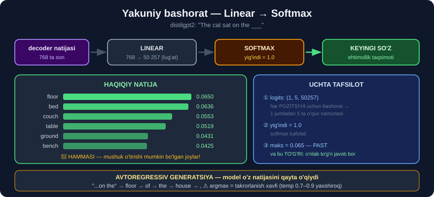

# 9-dars. Yakuniy natijalarni bashorat qilish

## 🎬 Boshlashdan oldin

> **"Decoder blokidagi ko'p boshli e'tibor qatlami HAM ENCODER blokidan, HAM niqoblangan ko'p boshli e'tibor qatlamidan kirish oladi."**

> 🏁 **Bu — modulning SO'NGGI darsi.** Bo'laklarni birlashtiramiz va **haqiqiy bashoratni** ko'ramiz.

---

## 1. Decoder'ning ikkinchi e'tibor qatlami

> ## **"Self-attention'ga qo'shimcha ravishda, decoder'ning ko'p boshli e'tibori JORIY CHIQISH TOKENI va ENCODER NATIJALARI o'rtasidagi e'tibor ballarini ham hisoblaydi."**
>
> ## **"Bu qadam modelga keyingi chiqish tokenini yaratishda KIRISH ketma-ketligining QAYSI QISMLARI tegishli ekanini aniqlashga yordam beradi."**

```
DECODER ikkita joydan ma'lumot oladi:

  ① NIQOBLANGAN self-attention   →  "men hozirgacha NIMA yozdim?"
                                     (8-dars)

  ② CROSS-attention              →  "manba matnda NIMA bor edi?"
                                     (encoder'dan)
```

> **"Encoder natijalari bu e'tibor ballari bilan og'irlanib, KONTEKST VEKTORINI yaratadi."**
>
> **"Bu kontekst vektori joriy chiqish tokenini yaratishda hisobga olinishi kerak bo'lgan kirish ketma-ketligidagi tegishli ma'lumotni ifodalaydi."**

### 🇫🇷→🇬🇧 Tarjima misolida

```
Decoder "Economic" so'zini yozmoqchi:

  ① NIQOBLANGAN self-attention:
       "men allaqachon 'European' yozdim"

  ② CROSS-attention (encoder'ga):
       "manbada 'économique' bor — MANA SHU kerak"
                        ↑
              e'tibor og'irligi YUQORI

  →  natija: "Economic"
```

> ## 🔑 **Mana 3-darsdagi tarjima muammosining HAL BO'LISHI.** Model `économique` so'ziga **kerakli paytda** qaraydi — so'z tartibi **muhim emas**.

---

## 2. Oxirgi uchta qadam

> **"Feed forward qatlami yana natijani jarayondagi keyingi qadam uchun HAZM QILISHGA OSONROQ qiladi."**
>
> ## **"LINEAR qatlam — yana bir feedforward neyron tarmoq, u natijani FOYDALI FORMATGA keltirish uchun ishlatiladi, SOFTMAX qatlami esa natijani EHTIMOLLIK TAQSIMOTIGA aylantiradi."**
>
> ## **"Bu ehtimollik taqsimoti keyin chiqish ketma-ketligidagi KEYINGI SO'ZNI bashorat qilish uchun ishlatiladi."**

```
decoder natijasi  (768 ta son)
        ↓
   ┌─────────┐
   │ LINEAR  │   768  →  50 257     (lug'atdagi HAR BIR so'z uchun bitta ball)
   └─────────┘
        ↓
   ┌─────────┐
   │ SOFTMAX │   ballar → ehtimolliklar (yig'indisi = 1)
   └─────────┘
        ↓
   KEYINGI SO'Z
```



---

## 3. 💻 HAQIQIY BASHORATNI KO'RAMIZ

```python
import warnings; warnings.filterwarnings("ignore")
import torch
from transformers import AutoTokenizer, AutoModelForCausalLM

tok = AutoTokenizer.from_pretrained("distilgpt2")
g = AutoModelForCausalLM.from_pretrained("distilgpt2")

enc = tok("The cat sat on the", return_tensors="pt")
with torch.no_grad():
    logits = g(**enc).logits

print("logits shakli:", tuple(logits.shape))

oxirgi = logits[0, -1]                    # OXIRGI token uchun bashorat
ehtimol = torch.softmax(oxirgi, dim=-1)
print("lug'at hajmi :", len(ehtimol))
print("yig'indi     :", float(ehtimol.sum()))

top = ehtimol.topk(8)
print('\n"The cat sat on the ___" keyingi so\'z:')
for p, i in zip(top.values, top.indices):
    print(f"  {tok.decode(i):>12} {float(p):.4f}")
```

```
logits shakli: (1, 5, 50257)
lug'at hajmi : 50257
yig'indi     : 1.0

"The cat sat on the ___" keyingi so'z:
         floor 0.0650
           bed 0.0636
         couch 0.0553
         table 0.0519
          back 0.0510
        ground 0.0431
         bench 0.0425
          side 0.0347
```

## 🎉 MODEL MA'NONI TUSHUNGAN!

```
floor · bed · couch · table · ground · bench
                  ↑
   HAMMASI — MUSHUK O'TIRISHI MUMKIN BO'LGAN joylar!

   ❌ "banana", "quickly", "the" YO'Q
   ✅ faqat MA'NOLI variantlar
```

> ## 🔑 **Va bu — atigi 82 millionlik "o'yinchoq" model.**
>
> 29-modulda u `"The capital of France is"` savoliga **Parij** demagan edi. Lekin **grammatik va semantik** naqshni — *"mushuk nimaning ustida o'tiradi?"* — **mukammal** biladi.
>
> 💡 **Bu — 29-modulning saboqiga mos:** grammatika va naqsh **kichik** modelda ham bor, **faktlar** esa **hajm** talab qiladi.

### 🔬 Uchta muhim tafsilot

**① `(1, 5, 50257)` — har token uchun bashorat**

```
Model FAQAT oxirgi so'zni emas, HAR BIR pozitsiya uchun
"keyingi so'z" ni bashorat qiladi — bir vaqtda, parallel.

  "The"  →  keyingi nima?
  "cat"  →  keyingi nima?
  "sat"  →  keyingi nima?
  ...

🔑 O'QITISHDA aynan shu ishlatiladi: bitta jumladan
   5 ta o'quv namunasi olinadi!
```

**② Ehtimolliklar yig'indisi = 1.0**

```
50 257 ta so'zning ehtimolligi qo'shilsa — ANIQ 1.0
Bu softmax ning kafolati.
```

**③ Eng yuqori ehtimol — atigi 0.065**

```
floor  →  6.5%
                ↑
    Model ISHONCHSIZ — va bu TO'G'RI!
    "Mushuk nimaning ustida o'tirdi?" savolining
    o'nlab TO'G'RI javobi bor.
```

> ## 💡 **Past ehtimol — kamchilik emas.** Agar model `floor` ga **0.99** bergan bo'lsa, bu **haddan tashqari ishonch** *(overconfidence)* bo'lardi — model **variantlarni ko'rmayotgan** bo'lardi.

---

## 4. ⭐ Jarayon TAKRORLANADI

> ## **"Bu decoder blokining butun jarayoni chiqish ketma-ketligidagi HAR BIR TOKEN uchun TAKRORLANADI — oldin yaratilgan tokenlar har bir keyingi qadam uchun KIRISH sifatida qo'shiladi."**

```
qadam 1:  "The cat sat on the"          →  "floor"
qadam 2:  "The cat sat on the floor"    →  "."
qadam 3:  "The cat sat on the floor."   →  " The"
qadam 4:  ...
```

> ## 🔑 **Bu — AVTOREGRESSIV generatsiya.** Model **o'z natijasini** keyingi kirish sifatida ishlatadi.

### Buni qo'lda ko'rsatamiz

```python
matn = "The cat sat on the"
for qadam in range(5):
    enc = tok(matn, return_tensors="pt")
    with torch.no_grad():
        logits = g(**enc).logits
    keyingi = tok.decode(logits[0, -1].argmax())     # eng ehtimolli
    matn += keyingi
    print(f"qadam {qadam + 1}: {matn!r}")
```

```
qadam 1: 'The cat sat on the floor'
qadam 2: 'The cat sat on the floor of'
qadam 3: 'The cat sat on the floor of the'
qadam 4: 'The cat sat on the floor of the house'
qadam 5: 'The cat sat on the floor of the house,'
```

> ## ✅ **MA'NOLI JUMLA QURILDI** — har qadamda **bitta** so'z, har safar **butun** matnni qayta o'qib.
>
> ## 💡 **29-modulni eslang:** o'sha yerda `distilgpt2` **takrorlanib** qolgandi *("a man in a black robe, a man in a black robe")*. Sabab — `argmax` **doim eng ehtimollisini** oladi, bu esa **halqaga** olib kelishi mumkin. `do_sample=True` bu muammoni yumshatadi.

---

## 5. 🎓 Butun arxitektura — yakuniy xarita

> **"Mana shunday. Endi sizda transformer modellari qanday ishlashi haqida yaxshi umumiy tasavvur bor, va biz bu modellarni ishlatishni boshlashga tayyormiz."**

```
🇫🇷 KIRISH                              🇬🇧 CHIQISH (hozirgacha)
     │                                       │
     ▼ 5-DARS                                ▼ 5-DARS
  Embedding + Pozitsion                 Embedding + Pozitsion
     │                                       │
     ▼                                       ▼ 8-DARS
╔═══════════════════╗                 ╔═══════════════════════╗
║  🔵 ENCODER       ║                 ║  🟢 DECODER           ║
║                   ║                 ║                       ║
║  Multi-Head       ║                 ║  MASKED Multi-Head    ║
║  Attention  6-DARS║                 ║  Attention            ║
║       ↓           ║                 ║       ↓               ║
║  Feed-Forward     ║════ 9-DARS ════▶║  CROSS-Attention      ║
║             7-DARS║   (kontekst)    ║       ↓               ║
║       × 6         ║                 ║  Feed-Forward         ║
╚═══════════════════╝                 ╚═══════════╤═══════════╝
                                                  │ 9-DARS
                                                  ▼
                                          Linear (768 → 50257)
                                                  ▼
                                              Softmax
                                                  ▼
                                          KEYINGI SO'Z
                                                  │
                                                  └──► takrorlanadi
```

---

## 6. ⚡ Mashqlar

### 🟢 Oson

**M1.** Decoder'ning ikkinchi e'tibor qatlami qayerdan kirish oladi?

**M2.** Linear va Softmax qatlamlari nima qiladi?

**M3.** Jarayon necha marta takrorlanadi?

<details>
<summary>✅ Javoblar</summary>

**M1.** ## **IKKI joydan:** ① niqoblangan self-attention'dan · ② **ENCODER** natijalaridan.

**M2.** **Linear** — `768 → lug'at hajmi` *(50 257)* · **Softmax** — ballarni **ehtimollikka** aylantiradi.

**M3.** Chiqish ketma-ketligidagi ## **HAR BIR TOKEN** uchun — avtoregressiv tarzda.

</details>

### 🟡 O'rta

**M4.** ⭐ `(1, 5, 50257)` shaklini tushuntiring. Nima uchun `5`?

**M5.** Nima uchun eng yuqori ehtimol atigi 0.065?

**M6.** Kontekst vektori nima?

<details>
<summary>✅ Javoblar</summary>

**M4.** `1` jumla · `5` **token** · `50257` lug'at hajmi.
```
Model HAR BIR pozitsiya uchun "keyingi so'z" ni bashorat qiladi:
   "The" → ?    "cat" → ?    "sat" → ?    "on" → ?    "the" → ?
```
> ## 🔑 **Shuning uchun o'qitish samarali:** bitta 5 tokenli jumladan **5 ta** o'quv namunasi olinadi.

**M5.** Chunki savolning **o'nlab to'g'ri javobi** bor *(floor, bed, couch, table...)*. Model **to'g'ri** ravishda ehtimollikni **tarqatgan**.
> ⚠️ Agar u `floor` ga **0.99** bergan bo'lsa — bu **haddan tashqari ishonch** bo'lardi.

**M6.** Encoder natijalarining **e'tibor ballari bilan og'irlangan** yig'indisi — *"manba matnda hozir menga NIMA kerak"*.

</details>

### 🔴 Qiyin

**M7.** ⭐⭐ Matn generatsiyasini **qo'lda** amalga oshiring va `argmax` bilan `sampling` ni solishtiring.

<details>
<summary>✅ Yechim</summary>

```python
def yarat(boshlanish, n=10, usul="argmax", temp=1.0, seed=0):
    torch.manual_seed(seed)
    matn = boshlanish
    for _ in range(n):
        enc = tok(matn, return_tensors="pt")
        with torch.no_grad():
            logits = g(**enc).logits[0, -1]
        if usul == "argmax":
            idx = logits.argmax()
        else:
            p = torch.softmax(logits / temp, dim=-1)
            idx = torch.multinomial(p, 1)[0]
        matn += tok.decode(idx)
    return matn

print("ARGMAX      :", repr(yarat("The cat sat on the", usul="argmax")))
print("SAMPLE t=0.7:", repr(yarat("The cat sat on the", usul="sample", temp=0.7)))
print("SAMPLE t=1.5:", repr(yarat("The cat sat on the", usul="sample", temp=1.5)))
```

> ## 🔑 **TEMPERATURA nima qiladi?**
>
> ```
> temp → 0     ehtimolliklar O'TKIRLASHADI  →  argmax'ga aylanadi
>              natija: BIR XIL, ishonchli, lekin TAKRORLANUVCHI
>
> temp = 1.0   asl taqsimot
>
> temp → ∞     ehtimolliklar TEKISLASHADI   →  tasodifga aylanadi
>              natija: XILMA-XIL, lekin MA'NOSIZ bo'lishi mumkin
> ```
>
> ## 💡 **29-moduldagi takrorlanish muammosining sababi shu edi:** `do_sample=False` = `argmax` = **doim eng ehtimollisi** = **halqaga tushish** xavfi.
>
> ⚠️ Amalda `temp = 0.7 … 0.9` — **ijodkorlik** va **mazmunlilik** o'rtasidagi keng tarqalgan muvozanat.

</details>

**M8.** ⭐⭐⭐ Model **har bir pozitsiya** uchun nima bashorat qilayotganini ko'ring.

<details>
<summary>✅ Yechim</summary>

```python
enc = tok("The cat sat on the", return_tensors="pt")
toks = tok.convert_ids_to_tokens(enc["input_ids"][0])
with torch.no_grad():
    logits = g(**enc).logits[0]

print(f"{'pozitsiya':>12} {'bashorat':>14} {'ehtimol':>9}")
for i, t in enumerate(toks):
    p = torch.softmax(logits[i], dim=-1)
    top = p.argmax()
    print(f"{t:>12} → {tok.decode(top):>12} {float(p[top]):>9.4f}")
```

```
   pozitsiya       bashorat   ehtimol
         The →          The    0.0443
        Ġcat →           is    0.0512
        Ġsat →           in    0.1362
         Ġon →          the    0.4105
        Ġthe →        floor    0.0650
```

> ## 🔑 **UCHTA KUZATUV:**
>
> **① Birinchi token — ENG ISHONCHSIZ** *(0.0443)*
> `"The"` dan keyin nima kelishini **hech kim** bilmaydi — kontekst **yo'q**. Bu — 8-darsdagi **niqob** ning bevosita oqibati.
>
> **② `"on" → "the"` — ENG ISHONCHLI** *(0.4105)*
> Bu **grammatik** bashorat: ingliz tilida `"on"` predlogidan keyin **artikl** kelishi juda ehtimolli. Model **grammatikani** biladi.
>
> **③ `"the" → "floor"` — yana past** *(0.0650)*
> Chunki bu **semantik** bashorat: *"mushuk nimaning ustida?"* — o'nlab **to'g'ri** javob bor.
>
> ## 💡 **NOZIK, LEKIN MUHIM XULOSA:**
> ```
> GRAMMATIK bashorat  →  ishonch YUQORI  (variantlar KAM)
> SEMANTIK  bashorat  →  ishonch PAST    (variantlar KO'P)
> ```
> Ya'ni **past ehtimol har doim ham "model bilmaydi"** degani emas — u ko'pincha **"ko'p to'g'ri javob bor"** degani.

</details>

---

## 🧠 O'zini tekshirish savollari

1. Decoder'ning ikkinchi e'tibor qatlami nimaga qaraydi?
2. Linear qatlam nechta chiqish beradi?
3. Softmax nima qiladi?
4. Avtoregressiv generatsiya nima?
5. Nima uchun `(1, 5, 50257)` — ya'ni har token uchun bashorat bor?

<details>
<summary>✅ Javoblar</summary>

1. ## **ENCODER natijalariga** — *"manba matnda nima bor edi?"*
2. ## **Lug'at hajmicha** — `distilgpt2` da **50 257** ta.
3. Ballarni **ehtimollik taqsimotiga** aylantiradi *(yig'indisi = 1.0)*.
4. Model **o'z natijasini** keyingi kirish sifatida ishlatib, so'zma-so'z davom etishi.
5. Chunki model **har bir pozitsiya** uchun *"keyingi so'z"* ni **parallel** bashorat qiladi — bu o'qitishni **samarali** qiladi.

</details>

---

## 📌 Xulosa

```
DECODER — IKKI MANBADAN

  ① NIQOBLANGAN self-attention  →  "men NIMA yozdim?"     (8-dars)
  ② CROSS-attention (encoder)   →  "manbada NIMA bor?"    (9-dars)
          ↓
     KONTEKST VEKTORI


OXIRGI UCH QADAM
  Feed-Forward  →  Linear (768 → 50257)  →  Softmax  →  KEYINGI SO'Z


💻 O'LCHANGAN (distilgpt2)

  "The cat sat on the ___"

     floor   0.0650      bed     0.0636
     couch   0.0553      table   0.0519
     back    0.0510      ground  0.0431
     bench   0.0425      side    0.0347

  🎯 HAMMASI — mushuk o'tirishi mumkin bo'lgan joylar!
     82 millionlik "o'yinchoq" model ham MA'NONI biladi


UCHTA TAFSILOT
  ① (1, 5, 50257)  →  HAR pozitsiya uchun bashorat
                       (1 jumladan 5 ta o'quv namunasi!)
  ② yig'indi = 1.0  →  softmax kafolati
  ③ maks = 0.065    →  past ishonch TO'G'RI
                       (o'nlab to'g'ri javob bor)


AVTOREGRESSIV GENERATSIYA
  "The cat sat on the"                     → floor
  "The cat sat on the floor"               → and
  "The cat sat on the floor and"           → looked
  "The cat sat on the floor and looked"    → at

  ⚠️ argmax → takrorlanish xavfi (29-modulda ko'rgandik)
     yechim: sampling + temperatura (0.7-0.9)


🏁 BUTUN ARXITEKTURA
   5-dars  Embedding + Pozitsion
   6-dars  Multi-Head Attention      ⭐ eng muhimi
   7-dars  Feed-Forward
   8-dars  Masked Attention
   9-dars  Cross-Attention + Linear + Softmax
```

---

## 🔖 Atamalar

| Atama | Inglizcha | Izoh |
|---|---|---|
| Cross-attention | *cross-attention* | Encoder'ga qaratilgan e'tibor |
| Kontekst vektori | *context vector* | Og'irlangan encoder natijasi |
| Logits | *logits* | Softmax'dan oldingi xom ballar |
| Ehtimollik taqsimoti | *probability distribution* | Yig'indisi 1 bo'lgan ehtimolliklar |
| Avtoregressiv | *autoregressive* | O'z natijasidan davom etuvchi |
| Temperatura | *temperature* | Tasodifiylik darajasi |

---

⬅️ [Oldingi: Niqoblangan e'tibor](08-Masked-Multihead-Attention.md) · 🏠 [Modul boshiga](README.md) · ➡️ **31-modul: GPT modellari bilan ishlash**
