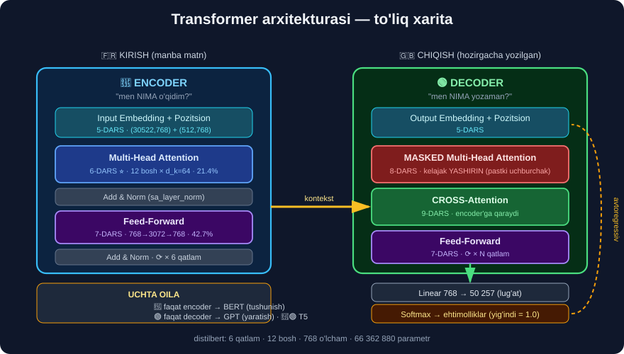

# ⚡ 30-modul. Transformer arxitekturasi

> **The Transformer Architecture** — LLM'larning "ichini" ochamiz.
>
> ## 🏆 **BU — DARSLIKDAGI ENG TEXNIK MODUL.** Kursda u to'liq nazariy, bu yerda esa **har bir da'vo haqiqiy modelda o'lchangan**.

---

## 🔥 Modulning bosh natijasi

29-modulda `distilbert` `"The food was not good"` ni **to'g'ri** `NEGATIVE` dedi. **Nima uchun?**

```python
"very good" dagi "good"   vs   "not good" dagi "good"

   qatlam 0:  cos =  1.0000    ← MUTLAQO BIR XIL vektor
   qatlam 1:  cos =  0.9454
   qatlam 3:  cos =  0.9154
   qatlam 4:  cos =  0.5182
   qatlam 6:  cos = -0.1150    ← DEYARLI QARAMA-QARSHI
```

> ## 💥 **Bir xil so'z. Bir xil ID. Bir xil boshlang'ich vektor.**
> ## **Model `"not"` ni ko'rdi va `"good"` ning MA'NOSINI o'zgartirdi.**
>
> **Uch modulni bog'laydi:**
> ```
> 26-modul:  "not" ni olib tashlash  →  aniqlik 0.869 → 0.784   ❌
> 29-modul:  "It wasn't terrible" → POSITIVE                     ✅
> 30-modul:  NIMA UCHUN — mana shu o'lchov
> ```

---

## 📚 Darslar

| # | Dars | Nima o'rganasiz |
|---|---|---|
| 1 | [Chuqur o'qitishni takrorlash](01-Deep-Learning-Recap.md) | Og'irliklar, optimallashtirish |
| 2 | [RNN muammosi](02-The-Problem-with-RNNs.md) | Unutish va parallellik |
| 3 | [Attention is All You Need](03-Attention-is-All-You-Need.md) | 2017-maqola, formula |
| 4 | [Transformer arxitekturasi](04-The-Transformer-Architecture.md) | Encoder–decoder xaritasi |
| 5 | [Kirish embeddinglari](05-Input-Embeddings.md) ⭐ | Tokenizatsiya, pozitsiya |
| 6 | [Ko'p boshli e'tibor](06-Multi-Headed-Attention.md) ⭐⭐⭐ | ## **Q, K, V — modulning YURAGI** |
| 7 | [Feed-forward qatlam](07-Feed-Forward-Layer.md) | 768→3072→768, GELU |
| 8 | [Niqoblangan e'tibor](08-Masked-Multihead-Attention.md) | Kelajakni yashirish |
| 9 | [Yakuniy bashorat](09-Predicting-the-Final-Outputs.md) | Linear → Softmax |

---

## 📝 Amaliyot

| | |
|---|---|
| 📝 [**44 ta mashq**](MASHQLAR.md) | 🟢 Oson · 🟡 O'rta · 🔴 Qiyin |
| 🚀 [**6 ta mini-loyiha**](LOYIHALAR.md) | E'tibor tadqiqotchisi · qo'lda hisoblash · kontekst o'lchagichi · niqob tekshiruvchisi · 🇺🇿 tokenizator tahlili · transformer bloki |

---

## 🗺️ Arxitektura



---

## 💥 Ikkinchi bosh natija — koreferensiya

2-darsda RNN muammosini ko'rdik. 6-darsda uni **hal qilingan** holda topdik:

```
"The New York Times is a daily newspaper.  It  was first issued in 1851."
     └────────┬────────┘                    ↑
              └──────── "it" NIMAGA ishora qiladi? ───┘

RNN'da (o'lchangan):       "Times" xotira kuchi = 0.0138   ❌ unutilgan

Transformerda:
   ❌ 72 boshning O'RTACHASI:   it → times = 0.081  (top-5 da YO'Q)
   ✅ qatlam 5, BOSH 5:         it → times = 0.584  🎯 BIRINCHI o'rinda
```

> ## 🔑 **BOSHLARNI O'RTACHA QILMANG.** Har bosh **boshqa** narsani o'rganadi:
> ```
> qatlam 1, bosh 0  →  it → "was" = 1.0000   (sof POZITSION)
> qatlam 5, bosh 5  →  it → "times"= 0.584   (KOREFERENSIYA)
> ```
> 72 boshning **37 tasi** *(51%)* `[SEP]` ga qaraydi — bular **"NO-OP"** boshlar. O'rtacha olsangiz, haqiqiy signal **cho'kib ketadi**.

---

## 🧮 Formula — va uni QO'LDA hisoblash

```
Attention(Q, K, V) = softmax( Q·Kᵀ / √d_k ) · V
```

```python
Q = layer.q_lin(X)
K = layer.k_lin(X)
ballar = Q @ K.T / np.sqrt(d_k)
ogirlik = torch.softmax(ballar, dim=-1)
```

```
72 ta bosh tekshirildi · eng katta farq: 0.0
```

> ## 🏆 **BIT-DARAJADA BIR XIL.** Transformer — sehr emas, **to'rt qatorlik matematika**.

---

## 🔬 O'lchangan faktlar to'plami

| Fakt | Qiymat | Qayerda |
|---|---|---|
| Parametrlar | **66 362 880** | 1-dars |
| Qatlam × bosh | **6 × 12 = 72** | 6-dars |
| `d_k` | **768 / 12 = 64** | 6-dars |
| Feed-forward ulushi | ## **42.7%** *(eng katta!)* | 4-dars |
| E'tibor ulushi | **21.4%** | 4-dars |
| FFN kengayishi | **768 → 3072 → 768** *(4×)* | 7-dars |
| `cos(good, bad)` | **0.528** ≈ `cos(good, great)` **0.526** | 5-dars |
| Niqob | `np.triu(W,1) == 0` → **True** | 8-dars |
| Lug'at | **30 522 × 768** | 5-dars |
| Pozitsiya | **512 × 768** → maks_uzunlik | 5-dars |

> ## 😲 **"Attention Is All You Need" — lekin e'tibor atigi 21.4%.**
>
> **YANGILIK** e'tiborda, **HAJM** esa feed-forward va embeddinglarda. `LayerNorm` — atigi **0.03%**, lekin **usiz model o'qimaydi**. **Muhimlik ≠ hajm.**

---

## 🇺🇿 O'zbek tili uchun MUHIM topilma

29-modulda tayyor model o'zbekchada **0.500** *(bazaviy daraja)* bergan edi. **Sabab shu modulda topildi:**

```python
uzbekistan    →  ['uzbekistan']                            1 token
o'zbekiston   →  ['o', "'", 'z', '##bek', '##isto', '##n']  6 token
kitob         →  ['kit', '##ob']                            2 token
qiziqarli     →  ['qi', '##zi', '##qa', '##rl', '##i']       5 token
```

```
O'RTACHA nisbat: 3.1×

512 token chegarasida:
   ingliz matn  ≈ 433 so'z
   o'zbek matn  ≈ 204 so'z      ← IKKI BARAVAR KAM
```

> ## 🔑 **MUAMMO E'TIBOR MEXANIZMIDA EMAS.**
>
> E'tibor **tildan mutlaqo mustaqil** va **mukammal** ishlaydi — buni 2-loyiha *(farq 0.0)* isbotladi.
>
> ## ❌ **Muammo — TOKENIZATSIYADA.** Model o'zbekcha so'zlarni ma'nosiz bo'laklarga maydalaydi, e'tibor esa **shu bo'laklar** orasida ishlashga majbur bo'ladi.
>
> ```
> Ingliz jumlada:  "it" → "times"   (ikkalasi ham TO'LIQ so'z)   ✅
> O'zbek jumlada:  "u"  → "##sh"?   (bo'lak — nimani anglatadi?)  ❌
> ```
>
> ✅ **Yechim:** ko'p tilli tokenizator *(`XLM-R`)* yoki [28-moduldagi](../28-Future-of-NLP/README.md) `uznlp` yondashuvi.

---

## 🚀 Tez boshlash

```bash
pip install transformers torch
```

```python
import warnings; warnings.filterwarnings("ignore")
import torch
from transformers import AutoTokenizer, AutoModel

M = "distilbert-base-uncased-finetuned-sst-2-english"
tok = AutoTokenizer.from_pretrained(M)
mod = AutoModel.from_pretrained(M, attn_implementation="eager")

enc = tok("The New York Times is a daily newspaper. "
          "It was first issued in 1851.", return_tensors="pt")
toks = tok.convert_ids_to_tokens(enc["input_ids"][0])
with torch.no_grad():
    A = mod(**enc, output_attentions=True).attentions

i = toks.index("it")
w = A[5][0, 5, i]                      # qatlam 5, bosh 5
for j in w.argsort(descending=True)[:3]:
    print(f"{toks[j]:>8} {float(w[j]):.3f}")
```

```
   times 0.584
       . 0.081
    york 0.050
```

> ## ⚠️ **`attn_implementation="eager"` SHART** — busiz `output_attentions` ishlamaydi *(tezroq, lekin e'tibor og'irliklarini saqlamaydigan amalga oshirish ishlatiladi)*.

---

## 🎯 Uch oila — qaysi model nima uchun?

| Oila | E'tibor matritsasi | Nima uchun | Misollar |
|---|---|---|---|
| 🔵 **Encoder** | To'liq | **Tushunish** | BERT, DistilBERT, RoBERTa |
| 🟢 **Decoder** | Pastki uchburchak | **Yaratish** | GPT, LLaMA, Claude |
| 🔵🟢 **Ikkalasi** | Ikkalasi | **Tarjima** | T5, BART |

```
O'lchangan:
   distilgpt2   →  72/72 bosh niqoblangan  (100%)  →  🟢 DECODER
   distilbert   →   0/72 bosh niqoblangan    (0%)  →  🔵 ENCODER
```

> ## 💡 **BERT va GPT o'rtasidagi butun farq — BITTA MANTIQIY BAYROQ** *(`niqob=True/False`)*. 6-loyihada buni **o'z kodingizda** ko'rasiz.

---

## ✅ O'zingizni tekshiring

- [ ] E'tibor formulasini yodda yoza olasizmi?
- [ ] Q, K, V ni kutubxona o'xshatishi bilan tushuntira olasizmi?
- [ ] Nima uchun `√d_k` ga bo'linadi?
- [ ] Nima uchun boshlarni o'rtacha qilish **xato**?
- [ ] E'tiborni qo'lda hisoblab, model bilan solishtira olasizmi?
- [ ] `cos = 1.0000 → −0.1150` nimani anglatadi?
- [ ] Niqob nima uchun kerak va u qanday ishlaydi?
- [ ] 🇺🇿 O'zbekcha matnda muammo **qayerda**?

---

## 🔗 Boshqa modullar bilan bog'liqlik

```
24-modul  BOW/TF-IDF     →  "dog bit man" = "man bit dog"  ❌
                            e'tibor bu muammoni HAL QILADI

26-modul  stop_words     →  "not" ni olib tashlash 0.869→0.784  ❌
                            transformer "not" ni VEKTORGA singdiradi

28-modul  🇺🇿 uznlp       →  apostrof muammosi
                            tokenizatorda HAM aynan shu muammo

29-modul  zero-shot      →  ingliz 0.976 · o'zbek 0.500
                            SABABI — shu moduldagi tokenizatsiya tahlili
```

---

## ➡️ Keyingi qadam

**31-modul — GPT modellari bilan ishlash**: nazariya tugadi. Endi **amaliy** ishlaymiz — GPT modellarini chaqirish, prompt yozish, natijani boshqarish.

---

⬅️ [29-modul — LLM'larga kirish](../29-Introduction-to-LLMs/README.md) · 🏠 [Bosh sahifa](../README.md) · ➡️ **31-modul**
