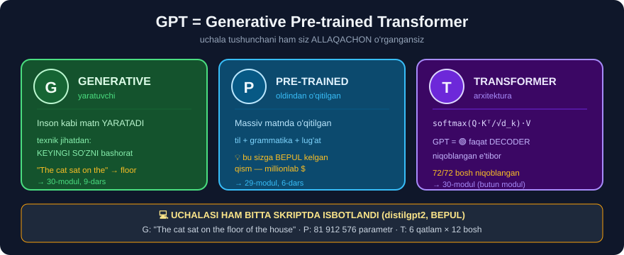

# 1-dars. GPT nima degani?

## 🎬 Boshlashdan oldin

> **"ChatGPT o'zining kontent yaratish, kod yozish, qiziqarli suhbatlar qurish va yana ko'p narsa qila olish qobiliyati bilan NLP sohasini bo'ronday egalladi."**
>
> **"Bu — OpenAI tomonidan ishlab chiqilgan ILG'OR katta til modeli."**

---

## 1. ⭐ Uchta harf — uchta tushuncha

> ## **"ChatGPT dagi GPT — GENERATIVE PRE-TRAINED TRANSFORMER degani. Keling, buni bo'laklarga ajratamiz."**



```
G  =  GENERATIVE      →  YARATADI
P  =  PRE-TRAINED     →  OLDINDAN O'QITILGAN
T  =  TRANSFORMER     →  30-MODULDAGI ARXITEKTURA
```

> ## 🎯 **DIQQAT: uchala tushunchani ham SIZ ALLAQACHON O'RGANGANSIZ.**
> ```
> G  →  29-modul, 30-modul (9-dars: keyingi so'zni bashorat qilish)
> P  →  29-modul (6-dars: oldindan o'qitish va sozlash)
> T  →  30-modul (BUTUN MODUL)
> ```

---

## 2. G — Generative *(yaratuvchi)*

> ## **"Biz modelni GENERATIV deymiz, chunki u PROMPT yoki KONTEKST berilganda inson kabi matn YARATA oladi."**
>
> **"ChatGPT matnni IZCHIL va KONTEKSTGA MOS tarzda davom ettira oladi."**
>
> **"Bu uni MATNNI TUGALLASH, MULOQOT YARATISH va KONTENT YARATISH kabi vazifalar uchun juda foydali qiladi."**

### 🔁 Siz buni 30-modulda ko'rgansiz

```python
# 30-modul, 9-dars
"The cat sat on the"  →  floor (0.065) · bed (0.064) · couch (0.055)
                             ↑
                    MANA "G" — generatsiya
```

```
qadam 1:  "The cat sat on the"                    → floor
qadam 2:  "The cat sat on the floor"              → of
qadam 3:  "The cat sat on the floor of"           → the
qadam 4:  "The cat sat on the floor of the"       → house
```

> ## 🔑 **"Generativ" — bu SEHR EMAS.** Bu — **keyingi so'zni bashorat qilish**, millionlab marta takrorlangan.

---

## 3. P — Pre-trained *(oldindan o'qitilgan)*

> ## **"GPT ning OLDINDAN O'QITILGAN jihati — aniq vazifalarga sozlashdan OLDIN hal qiluvchi ahamiyatga ega."**
>
> ## **"GPT oldindan o'qitish bosqichidan o'tadi — u yerda MASSIV hajmdagi matn ma'lumotidan o'rganadi."**
>
> **"Bu jarayon modelni TIL, GRAMMATIKA va KENG LUG'ATNI chuqur tushunish bilan qurollantiradi."**

### 🔁 29-modul, 6-darsni eslang

```
① OLDINDAN O'QITISH        ② SOZLASH
   butun internet              kichik to'plam
   ❌ yorliq KERAK EMAS         ✅ yorliq kerak
   millionlab dollar           o'nlab dollar
   kompaniyalar qiladi         SIZ qilasiz
```

> ## 💡 **"Pre-trained" — bu sizga BEPUL kelgan qism.** OpenAI millionlab dollar sarflab modelni o'qitdi. Siz esa uni **bir qator kodda** ishlatasiz.

---

## 4. T — Transformer

> ## **"Va, albatta, nomdagi TRANSFORMER — bu kursning oxirgi bo'limida muhokama qilgan transformer arxitekturasiga ISHORA."**

### 🔁 30-modulning butun mazmuni

```
Attention(Q, K, V) = softmax( Q·Kᵀ / √d_k ) · V

  🔍 Q  "menga NIMA kerak?"
  🔑 K  "menda NIMA bor?"
  💎 V  HAQIQIY MAZMUN
```

> ## 🎯 **Siz buni QO'LDA hisoblab, model bilan BIT-DARAJADA bir xil natija olgansiz** *(30-modul, 2-loyiha: `72 ta bosh · eng katta farq: 0.0`)*.

### GPT — qaysi turdagi transformer?

```
🟢 FAQAT DECODER  (30-modul, 4-dars)

   E'tibor matritsasi:  PASTKI UCHBURCHAK
   Kelajak:             YASHIRIN (niqoblangan)
   Maqsad:              YARATISH
```

**Buni o'lchagandik:**

```python
# 30-modul, 4-loyiha
distilgpt2   →  72/72 bosh niqoblangan  (100%)  →  🟢 DECODER
distilbert   →   0/72 bosh niqoblangan    (0%)  →  🔵 ENCODER
```

> ## 🔑 **GPT — bu "faqat decoder" transformer.** Shuning uchun u **matn yozadi**, BERT esa **matnni tushunadi**.

---

## 5. 🗺️ Uch modul — bitta rasm

```
29-MODUL                30-MODUL                31-MODUL
  LLM nima?               Ichida NIMA bor?        Uni QANDAY ishlatish?
      │                        │                        │
      ▼                        ▼                        ▼
  ┌────────┐            ┌────────────┐          ┌─────────────┐
  │ 3 ta   │            │  Q, K, V   │          │  API        │
  │ xususi-│            │  softmax   │          │  prompt     │
  │ yat    │            │  6 qatlam  │          │  temperature│
  └────────┘            └────────────┘          └─────────────┘
      │                        │                        │
      └────────────────────────┴────────────────────────┘
                               ▼
                    G P T  =  Generative
                              Pre-trained
                              Transformer
```

---

## 6. ⚡ Mashqlar

### 🟢 Oson

**M1.** GPT nimaning qisqartmasi?

**M2.** "Generativ" nima degani?

**M3.** "Oldindan o'qitilgan" nima degani?

<details>
<summary>✅ Javoblar</summary>

**M1.** ## **Generative Pre-trained Transformer**.

**M2.** Model **prompt** yoki **kontekst** berilganda **inson kabi matn yarata oladi** — izchil va kontekstga mos.

**M3.** Model aniq vazifaga sozlashdan **oldin** massiv matn ma'lumotidan **o'rgangan** — til, grammatika va keng lug'atni.

</details>

### 🟡 O'rta

**M4.** ⭐ GPT qaysi turdagi transformer? Buni **kodda** isbotlang.

**M5.** "Generativ" texnik jihatdan aynan nima qiladi?

<details>
<summary>✅ Javoblar</summary>

**M4.** ## 🟢 **FAQAT DECODER.**

```python
import warnings; warnings.filterwarnings("ignore")
import torch, numpy as np
from transformers import AutoTokenizer, AutoModelForCausalLM

tok = AutoTokenizer.from_pretrained("distilgpt2")
g = AutoModelForCausalLM.from_pretrained("distilgpt2",
                                         attn_implementation="eager")
enc = tok("The cat sat on the", return_tensors="pt")
with torch.no_grad():
    A = g(**enc, output_attentions=True).attentions

W = A[0][0, 0].numpy()
print(W.round(3))
print("pastki uchburchakmi?", bool(np.allclose(np.triu(W, 1), 0)))
```
```
[[1.    0.    0.    0.    0.   ]
 [0.612 0.388 0.    0.    0.   ]
 [0.567 0.154 0.279 0.    0.   ]
 [0.44  0.225 0.287 0.048 0.   ]
 [0.456 0.195 0.224 0.064 0.06 ]]
pastki uchburchakmi? True
```
> 🔑 **Kelajak yashirin** → model faqat **orqaga** qaraydi → u **yozish** uchun mo'ljallangan.

**M5.** ## **Keyingi so'zni bashorat qiladi** — va buni **takroran** qiladi *(avtoregressiv)*.
```
"The cat sat on the" → floor → of → the → house
```

</details>

### 🔴 Qiyin

**M6.** ⭐⭐ GPT ning uchala harfini **o'z kodingiz bilan** namoyish qiling.

<details>
<summary>✅ Yechim</summary>

```python
import warnings; warnings.filterwarnings("ignore")
import torch, numpy as np
from transformers import AutoTokenizer, AutoModelForCausalLM

tok = AutoTokenizer.from_pretrained("distilgpt2")
g = AutoModelForCausalLM.from_pretrained("distilgpt2",
                                         attn_implementation="eager")

# ── G: GENERATIVE ──────────────────────────────
matn = "The cat sat on the"
for _ in range(4):
    e = tok(matn, return_tensors="pt")
    with torch.no_grad():
        matn += tok.decode(g(**e).logits[0, -1].argmax())
print("G (generative):", repr(matn))

# ── P: PRE-TRAINED ─────────────────────────────
n = sum(p.numel() for p in g.parameters())
print(f"P (pre-trained): {n:,} parametr — SIZ o'qitmadingiz")

# ── T: TRANSFORMER ─────────────────────────────
e = tok("The cat sat on the", return_tensors="pt")
with torch.no_grad():
    A = g(**e, output_attentions=True).attentions
print(f"T (transformer): {len(A)} qatlam × {A[0].shape[1]} bosh "
      f"= {len(A) * A[0].shape[1]} e'tibor matritsasi")
print("   niqoblangan?", bool(np.allclose(np.triu(A[0][0,0].numpy(), 1), 0)))
```

```
G (generative): 'The cat sat on the floor of the house'
P (pre-trained): 81,912,576 parametr — SIZ o'qitmadingiz
T (transformer): 6 qatlam × 12 bosh = 72 e'tibor matritsasi
   niqoblangan? True
```

> ## 🏆 **Uchala harf ham — bitta skriptda isbotlandi.**
>
> ## 💡 **Va e'tibor bering: bu HECH QANDAY API KALITI talab qilmadi.** `distilgpt2` — **bepul** va **sizning kompyuteringizda** ishlaydi. Bu — butun modul davomida qaytadigan mavzu.

</details>

---

## 🧠 O'zini tekshirish savollari

1. GPT nimaning qisqartmasi?
2. Uchala harf qaysi modulda o'rganilgan?
3. GPT qaysi turdagi transformer?
4. "Generativ" texnik jihatdan nima qiladi?
5. `distilgpt2` nechta parametrga ega?

<details>
<summary>✅ Javoblar</summary>

1. ## **Generative Pre-trained Transformer**.
2. **G** → 30-modul *(9-dars)* · **P** → 29-modul *(6-dars)* · **T** → 30-modul *(butun modul)*.
3. ## 🟢 **Faqat decoder** — niqoblangan e'tibor, kelajak yashirin.
4. **Keyingi so'zni bashorat qiladi**, keyin buni **takroran** qiladi *(avtoregressiv)*.
5. ## **81 912 576** *(~82 million)*.

</details>

---

## 📌 Xulosa

```
GPT  =  Generative Pre-trained Transformer


G — GENERATIVE (yaratuvchi)
    prompt berilsa, inson kabi matn yaratadi
    texnik jihatdan: KEYINGI SO'ZNI bashorat qiladi
    → 30-modul, 9-dars

P — PRE-TRAINED (oldindan o'qitilgan)
    massiv ma'lumotda o'qitilgan
    til + grammatika + keng lug'at
    💡 bu sizga BEPUL kelgan qism
    → 29-modul, 6-dars

T — TRANSFORMER
    Attention(Q,K,V) = softmax(Q·Kᵀ/√d_k)·V
    GPT = 🟢 FAQAT DECODER (niqoblangan)
    → 30-modul, butun modul


O'LCHANGAN (distilgpt2)
   G  →  "The cat sat on the floor of the house"
   P  →  81,912,576 parametr
   T  →  6 qatlam × 12 bosh, niqoblangan = True
```

---

## 🔖 Atamalar

| Atama | Inglizcha | Izoh |
|---|---|---|
| GPT | *Generative Pre-trained Transformer* | Yaratuvchi, oldindan o'qitilgan transformer |
| Generativ | *generative* | Matn yaratuvchi |
| Prompt | *prompt* | Modelga beriladigan matn |
| Matnni tugallash | *text completion* | Boshlangan matnni davom ettirish |
| Izchil | *coherent* | Mantiqan bog'langan |

---

🏠 [Modul boshiga](README.md) · ➡️ [Keyingi: ChatGPT rivojlanishi](02-The-Development-of-ChatGPT.md)
