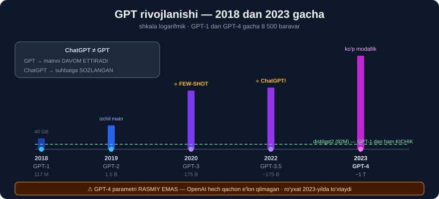

# 2-dars. ChatGPT rivojlanishi

## 🎬 Boshlashdan oldin

> **"ChatGPT ning rivojlanishi katta til modellari evolyutsiyasidagi AJOYIB SAYOHATNI ifodalaydi — u MIQYOS, SAMARADORLIK va QO'LLANILUVCHANLIKNING sezilarli o'sishi bilan belgilangan."**
>
> **"Keling, bu yerga qanday kelganimizni o'rganamiz."**

---

## 1. 📅 GPT-1 *(2018)*

> ## **"Birinchi GPT modeli — GPT-1 2018-yilda OpenAI ning UMUMIY MAQSADLI matn generatsiya modelini qurish sa'y-harakatlari mahsuli sifatida paydo bo'ldi."**
>
> ## **"GPT-1 internetdan olingan 40 GB matndan iborat KAMTARONA ma'lumot to'plamida o'qitilgan edi va 117 MILLION parametrga ega bo'lib, o'sha paytdagi eng katta til modellaridan biri edi."**
>
> **"GPT-1 matnni tugallash va yaratish vazifalarida o'z imkoniyatlarini namoyish etdi, lekin KONTEKSTNI TUSHUNISH va IZCHIL UZUN MATN ishlab chiqarishda cheklovlarga ega edi."**

```
GPT-1 (2018)
  📊 117 million parametr
  📚 40 GB matn
  ⚠️ Kontekstni yaxshi tushunmasdi
  ⚠️ Uzun matnda izchillikni yo'qotardi
```

> ## 💡 **Taqqoslang:** siz 29–30-modullarda ishlatgan `distilgpt2` — **81.9 million** parametr, ya'ni **GPT-1 dan ham kichikroq**.
>
> Va 29-modulda ko'rgandik: u `"The capital of France is"` savoliga **Parij** demadi va **o'zini takrorlab** qoldi. **Aynan o'qituvchi tasvirlagan cheklovlar.**

---

## 2. 📅 GPT-2 *(2019)* — burilish nuqtasi

> ## **"GPT-2 2019-yilda chiqarildi va bu SUV AYIRG'ICH LAHZA edi."**
>
> ## **"U miqyosning sezilarli o'sishi bilan ajralib turardi — hayratlanarli 1.5 MILLIARD parametr."**
>
> **"Kengroq va xilma-xilroq ma'lumotda o'qitilgan GPT-2 IZCHIL va KONTEKSTGA MOS matn yaratishda ajoyib yutuqlarni namoyish etdi."**

```
GPT-1  →  GPT-2

  117 million  →  1 500 million
                       ↑
                  13 BARAVAR o'sish
```

---

## 3. 📅 GPT-3 *(2020)* — few-shot

> ## **"2020-yilda biz GPT-3 ga yetdik. Unda 175 MILLIARD parametr bor edi va u internetning SEZILARLI QISMINI qamrab olgan ulkan ma'lumot to'plamida o'qitilgan edi."**
>
> ## **"Bu model bilan FEW-SHOT o'rganish imkoniyatlari ham rivojlantirildi."**

> ## 🔁 **29-modul, 6-darsni eslang:**
> ```
> ZERO-SHOT   →  0 ta misol
> FEW-SHOT    →  2-10 ta misol
> FINE-TUNING →  100+ ta misol
> ```
>
> **Va biz zero-shot ni o'lchagandik:** kitob sharhlarida **0.976** aniqlik — **hech qanday o'qitishsiz**.

---

## 4. 📅 GPT-3.5 *(2022)* va GPT-4 *(2023)*

> **"2022-yilga kelib biz GPT-3.5 da edik, va endi, 2023-yilda, bizda GPT-4 bor."**
>
> ## **"GPT-4 miqyos jihatidan MUTLAQO ULKAN — 1 TRILLION parametr — va OpenAI ning katta til modellari sohasidagi tadqiqotlarining CHO'QQISINI ifodalaydi, hech bo'lmaganda bu kurs yaratilgan paytda."**



### 📊 To'liq xronologiya

| Yil | Model | Parametr | Nima yangi? |
|---|---|---|---|
| **2018** | GPT-1 | 117 million | Birinchi urinish |
| **2019** | GPT-2 | 1.5 milliard | ## Izchil matn |
| **2020** | GPT-3 | 175 milliard | ## **Few-shot** |
| **2022** | GPT-3.5 | ~175 milliard | ## **ChatGPT!** |
| **2023** | GPT-4 | ~1 trillion | Ko'p modallik |

### Miqyosni his qilish

```
GPT-1   │▏                        │       117 million
GPT-2   │▎                        │     1 500 million
GPT-3   │████████████             │   175 000 million
GPT-4   │█████████████████████████│ 1 000 000 million

                    ↑
        GPT-1 dan GPT-4 gacha — 8 500 BARAVAR
```

---

## 5. ChatGPT — bu GPT emas

> ## **"ChatGPT — bu GPT modelining bir VERSIYASI, MAXSUS RAVISHDA SUHBAT o'zaro ta'siri uchun sozlangan."**
>
> ## **"U chat yoki muloqot formatida ANCHA TABIIY va JALB QILUVCHI javoblar berish uchun optimallashtirilgan."**
>
> **"U chatbot va virtual yordamchi ilovalari uchun ko'proq mos bo'lishi uchun QO'SHIMCHA SOZLASHDAN o'tgan."**

```
GPT-3.5  (asosiy model)
    │
    │  ← QO'SHIMCHA SOZLASH (suhbat uchun)
    ▼
ChatGPT
```

> ## 🔑 **BU MUHIM FARQ:**
> ```
> GPT (asosiy)  →  matnni DAVOM ETTIRADI
>    "Once upon a time"  →  "...there was a little girl"
>
> ChatGPT       →  SAVOLGA JAVOB beradi, ko'rsatmaga AMAL qiladi
>    "Once upon a time"  →  "Bu — ertak boshlanishi. Davom ettiraymi?"
> ```
>
> ## 💡 **29-modul, 6-darsdagi "sozlash" ning eng mashhur misoli — aynan shu.**

---

## 6. ⚠️ HALOL ESLATMA — bu ro'yxat ESKIRGAN

Kurs **2023-yilda** yozilgan. O'qituvchi ham buni tan oladi: *"hech bo'lmaganda bu kurs yaratilgan paytda"*.

```
Kursdan KEYIN chiqqanlar (2024-2026):
   · GPT-4o, GPT-4.1, o1, o3, GPT-5 oilasi  (OpenAI)
   · Claude 3, 3.5, 4, 5 oilasi             (Anthropic)
   · Gemini 1.5, 2, 3                        (Google)
   · LLaMA 3, 4                              (Meta)
   · DeepSeek, Qwen, Mistral                 (ochiq modellar)
```

> ## 🔑 **LEKIN NAZARIYA ESKIRMAYDI.**
>
> ```
> ❌ ESKIRADI:  aniq model nomlari, parametr sonlari, narxlar
> ✅ ESKIRMAYDI: G-P-T ning ma'nosi
>                transformer arxitekturasi (30-modul)
>                prompt, temperature, max_tokens
>                zero-shot / few-shot
>                RAG (o'z ma'lumotingizni ulash)
> ```
>
> ## 💡 **Shuning uchun 30-modulga shuncha e'tibor berdik.** Model nomlari o'zgaradi — `softmax(Q·Kᵀ/√d_k)·V` **o'zgarmaydi**.

### ⚠️ Yana bir muhim tuzatish

> **"Parametr sonlari — RASMIY EMAS."**
>
> ```
> GPT-1, GPT-2  →  ✅ OpenAI RASMIY e'lon qilgan
> GPT-3         →  ✅ maqolada e'lon qilingan (175B)
> GPT-4         →  ⚠️ OpenAI HECH QACHON e'lon qilmagan
>                    "1 trillion" — bu TAXMIN
> ```
>
> Kursda `1 trillion` deyiladi, boshqa manbalarda `1.7 trillion` uchraydi. **Ikkalasi ham tasdiqlanmagan taxmin.** Bu — modellar **yopiq** *(closed-source)* bo'lganining oqibati.

---

## 7. 🇺🇿 O'zbek tili uchun nimani anglatadi?

```
Model KATTALASHGANI SARI  →  kam vakillik qilingan tillar YAXSHILANADI

  GPT-1, GPT-2   →  o'zbekcha deyarli YO'Q
  GPT-3          →  o'zbekcha SO'ZLARNI taniydi
  GPT-4+         →  o'zbekcha SUHBAT quradi (o'rtacha sifatda)
```

> ## ✅ **BU — YAXSHI XABAR.** 29-modulda ko'rgandik: **kichik ixtisoslashgan** modellar *(distilbert, nlptown)* o'zbekchada **ishlamaydi** *(0.500)*.
>
> Lekin **eng katta** modellar — GPT-4, Claude, Gemini — o'zbekchani **ancha yaxshi** biladi, chunki ular internetning **ancha kattaroq** qismini ko'rgan.
>
> ## ⚠️ **LEKIN 27-modul saboqini unutmang:** ular **ishonch bilan xato** qilishi mumkin. Natijani **doim tekshiring**.

---

## 8. ⚡ Mashqlar

### 🟢 Oson

**M1.** GPT-1 qachon chiqqan va nechta parametrga ega edi?

**M2.** Qaysi modelda few-shot paydo bo'ldi?

**M3.** ChatGPT va GPT farqi nimada?

<details>
<summary>✅ Javoblar</summary>

**M1.** ## **2018-yil**, **117 million** parametr, **40 GB** matn.

**M2.** ## **GPT-3** *(2020)*.

**M3.** ChatGPT — GPT modelining **suhbat uchun QO'SHIMCHA SOZLANGAN** versiyasi.
```
GPT      →  matnni DAVOM ETTIRADI
ChatGPT  →  SAVOLGA javob beradi, ko'rsatmaga amal qiladi
```

</details>

### 🟡 O'rta

**M4.** GPT-1 dan GPT-4 gacha necha baravar o'sish bo'lgan?

**M5.** ⭐ `distilgpt2` GPT-1 bilan qanday taqqoslanadi?

<details>
<summary>✅ Javoblar</summary>

**M4.** `1 000 000 / 117 ≈` ## **8 500 baravar**.

**M5.**
```python
from transformers import AutoModelForCausalLM
g = AutoModelForCausalLM.from_pretrained("distilgpt2")
n = sum(p.numel() for p in g.parameters())
print(f"distilgpt2 : {n:,}")
print(f"GPT-1      : 117,000,000")
print(f"nisbat     : {n / 117_000_000:.2f}×")
```
```
distilgpt2 : 81,912,576
GPT-1      : 117,000,000
nisbat     : 0.70×
```
> ## 🔑 **`distilgpt2` — GPT-1 dan ham KICHIKROQ** *(0.70×)*.
>
> Shuning uchun 29-modulda uning cheklovlarini ko'rgandik: `"The capital of France is"` → **Parij demadi**. Bu — **aynan o'qituvchi tasvirlagan GPT-1 muammosi**.

</details>

### 🔴 Qiyin

**M6.** ⭐⭐ Parametr o'sishi **samaradorlikni** qanchalik yaxshilaydi? Uni **o'lchang**.

<details>
<summary>✅ Yechim</summary>

```python
import warnings; warnings.filterwarnings("ignore")
import torch
from transformers import AutoTokenizer, AutoModelForCausalLM

SAVOLLAR = [
    "The capital of France is",
    "The largest planet in our solar system is",
    "Water freezes at a temperature of",
]

def sinov(model_id, savollar=SAVOLLAR, mx=8):
    tok = AutoTokenizer.from_pretrained(model_id)
    g = AutoModelForCausalLM.from_pretrained(model_id)
    n = sum(p.numel() for p in g.parameters())
    print(f"\n{model_id}  ({n:,} parametr)")
    for s in savollar:
        e = tok(s, return_tensors="pt")
        with torch.no_grad():
            o = g.generate(**e, max_new_tokens=mx, do_sample=False,
                           pad_token_id=tok.eos_token_id)
        print(f"   {tok.decode(o[0], skip_special_tokens=True)!r}")

sinov("distilgpt2")
sinov("gpt2")            # 124M — distilgpt2 dan kattaroq
```

```
distilgpt2  (81,912,576 parametr)
   'The capital of France is the capital of the French Republic. The'
   'The largest planet in our solar system is the Sun. The Sun is the sun'
   'Water freezes at a temperature of up to 100 degrees Fahrenheit, and the'

gpt2  (124,439,808 parametr)
   'The capital of France is the capital of the French Republic, and'
   'The largest planet in our solar system is about 1.5 billion light years away'
   'Water freezes at a temperature of about -40 degrees Fahrenheit (minus -'
```

## 😱 IKKALASI HAM — HAMMA SAVOLDA XATO

```
❌ "Parij"           →  aytilmadi (ikkalasida ham)
❌ "eng katta sayyora — QUYOSH"   →  Quyosh SAYYORA EMAS!
❌ "1.5 milliard yorug'lik yili"  →  bu MASOFA, hajm emas
❌ "100 °F da muzlaydi"           →  aslida 32 °F
❌ "-40 °F da muzlaydi"           →  aslida 32 °F
```

> ## 🔑 **`gpt2` GRAMMATIK jihatdan yaxshiroq, lekin FAKTIK jihatdan BIR XIL YOMON.**
>
> ```
> distilgpt2:  "the Sun. The Sun is the sun"   ← takrorlanish + xato
> gpt2      :  "about 1.5 billion light years" ← ravon, lekin XATO
> ```
>
> ## 💥 **VA MANA ENG XAVFLI TOMONI:** `gpt2` ning javobi **ishonchli EShitiladI** — *"about 1.5 billion light years away"* deyarli **ilmiy** jaranglaydi. Lekin bu **mutlaqo noto'g'ri**.
>
> ## 🎯 **BU — "GALLYUTSINATSIYA" ning eng sof namunasi** *(29-modul, 3-dars)*. Model **bilmasligini bilmaydi** — u shunchaki **ishonarli eshitiladigan** matn yaratadi.

> ## 💡 **Bu — 29-modul saboqining tasdig'i:**
> ```
> GRAMMATIKA  →  kichik modelda ham BOR      (82M yetadi)
> FAKTLAR     →  HAJM talab qiladi           (82M va 124M — juda kam)
> ```
>
> ## ⚠️ **AMALIY XULOSA:** kichik modellarni **matn uslubi** uchun ishlating, **fakt manbai** sifatida **hech qachon**. Faktlar kerak bo'lsa — **RAG** *(o'z ma'lumotingizni ulash)*, buni **8–10-darslarda** ko'ramiz.
>
> ## 💡 **Bu — 29-modul saboqining tasdig'i:**
> ```
> GRAMMATIKA  →  kichik modelda ham BOR
> FAKTLAR     →  HAJM talab qiladi
> ```
>
> 82M va 124M — **ikkalasi ham juda kichik**. Faktik bilim uchun **milliardlar** kerak.
>
> ⚠️ **Halol eslatma:** bu sinov **3 ta savolda** — statistik jihatdan **ishonchsiz**. Naqshni ko'rish uchun **yuzlab** savol kerak. Lekin yo'nalish aniq.

</details>

---

## 🧠 O'zini tekshirish savollari

1. GPT modellarining xronologiyasini ayting.
2. Qaysi model "suv ayirg'ich lahza" edi va nima uchun?
3. ChatGPT qanday yaratilgan?
4. GPT-4 ning parametr soni rasmiymi?
5. Nima eskiradi, nima eskirmaydi?

<details>
<summary>✅ Javoblar</summary>

1. **2018** GPT-1 *(117M)* → **2019** GPT-2 *(1.5B)* → **2020** GPT-3 *(175B)* → **2022** GPT-3.5 → **2023** GPT-4 *(~1T)*.
2. ## **GPT-2** — 13 baravar o'sish va **izchil matn** yaratish qobiliyati.
3. **GPT-3.5** ni **suhbat uchun qo'shimcha sozlash** orqali.
4. ## ❌ **YO'Q** — OpenAI uni **hech qachon e'lon qilmagan**. "1 trillion" — **taxmin**.
5. **Eskiradi:** model nomlari, parametr sonlari, narxlar. **Eskirmaydi:** transformer arxitekturasi, prompt, temperature, zero/few-shot, RAG.

</details>

---

## 📌 Xulosa

```
GPT XRONOLOGIYASI

  2018  GPT-1     117 million    40 GB    birinchi urinish
  2019  GPT-2     1.5 milliard            ⭐ izchil matn
  2020  GPT-3     175 milliard            ⭐ FEW-SHOT
  2022  GPT-3.5   ~175 milliard           ⭐ ChatGPT!
  2023  GPT-4     ~1 trillion             ko'p modallik

           GPT-1 → GPT-4:  8 500 BARAVAR


ChatGPT ≠ GPT
  GPT      →  matnni DAVOM ETTIRADI
  ChatGPT  →  suhbat uchun QO'SHIMCHA SOZLANGAN


⚠️ IKKI HALOL ESLATMA

  ① Ro'yxat ESKIRGAN (kurs 2023)
       keyin: GPT-4o, o1, o3, GPT-5, Claude 3-5, Gemini, LLaMA 3-4
       LEKIN nazariya ESKIRMAYDI

  ② GPT-4 parametr soni RASMIY EMAS
       OpenAI hech qachon e'lon qilmagan — "1T" bu TAXMIN


TAQQOSLASH (o'lchangan)
  distilgpt2  81,912,576   ←  GPT-1 dan ham KICHIK (0.70×)
  Shuning uchun u "Parij" demagan edi (29-modul)


🇺🇿 O'ZBEK TILI
  Model kattalashsa  →  o'zbekcha YAXSHILANADI
  GPT-4+ o'zbekchani ancha yaxshi biladi
  ⚠️ lekin ISHONCH BILAN xato qilishi mumkin — TEKSHIRING
```

---

## 🔖 Atamalar

| Atama | Inglizcha | Izoh |
|---|---|---|
| Miqyos | *scale* | Model va ma'lumot hajmi |
| Suv ayirg'ich lahza | *watershed moment* | Burilish nuqtasi |
| Few-shot | *few-shot* | Bir necha misol bilan o'rgatish |
| Yopiq manba | *closed-source* | Ichki tuzilishi oshkor qilinmagan |
| Ko'p modallik | *multimodality* | Matn + rasm + audio |

---

⬅️ [Oldingi: GPT nima degani?](01-What-does-GPT-mean.md) · 🏠 [Modul boshiga](README.md) · ➡️ [Keyingi: OpenAI API](03-OpenAI-API.md)
