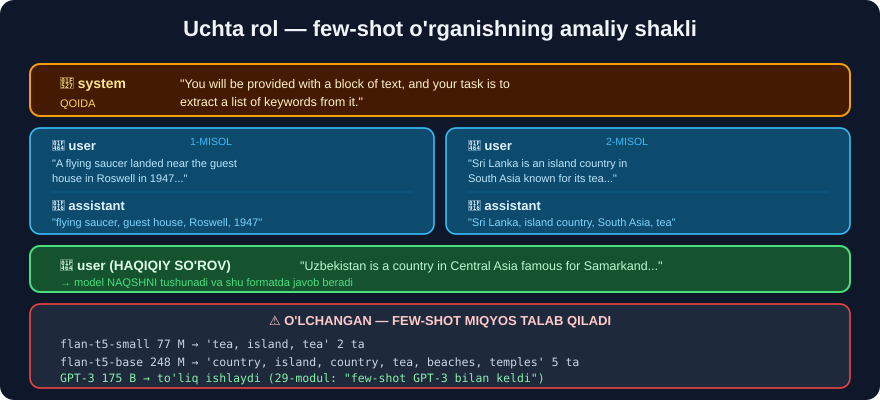

# 6-dars. Kalit so'zlar bilan xulosalash

## 🎬 Boshlashdan oldin

> **"Keyingi navbatda biz katta matn bo'lagi berilganda uni KALIT SO'ZLARNI ajratib olish orqali xulosalay oladigan funksiya yaratishni o'rganamiz."**
>
> **"Model tilni tushuna olgani uchun, u biz uchun eng muhim so'z va iboralarni ajratib ola oladi."**

---

## 1. ⭐⭐ UCHTA ROL — modulning eng muhim tushunchasi

> ## **"Xabarlar uchun ishlatilishi mumkin bo'lgan UCHTA ROL bor."**



### 🔧 `system` — ko'rsatma

> ## **"Birinchi xabarlar — TIZIM xabarlari. Bu xabarlar modelga NIMA QILISHNI xohlashingiz va u QANDAY JAVOB BERISHI va O'ZINI TUTISHI kerakligi haqida ko'rsatma beradi."**

### 👤 `user` — foydalanuvchi kiritmasi

> ## **"Ikkinchi tur xabar — FOYDALANUVCHI xabari. Bu — foydalanuvchi kiritmasining MISOLI."**

### 🤖 `assistant` — kutilgan javob

> ## **"Uchinchi tur xabar — YORDAMCHI xabari. Bu — foydalanuvchi kiritmasiga TO'G'RI JAVOBNING MISOLI."**
>
> ## **"Bu yordamchi xabarlari model QANDAY JAVOB BERISHI KERAKLIGINING MISOLI bo'lib xizmat qiladi."**

```
system     →  "SEN kimsan va NIMA qilasan"       (qoida)
user       →  "foydalanuvchi SHUNDAY so'raydi"   (misol savol)
assistant  →  "sen SHUNDAY javob berasan"        (misol javob)
   ↑
FEW-SHOT o'rganish — 29-modul, 6-dars!
```

> ## 💡 **DIQQAT — bu FEW-SHOT ning amaliy ko'rinishi.** 29-modulda o'qigandik: *"few-shot — modelni o'qitish uchun MINIMAL ma'lumot ishlatganimiz"*. Mana **aynan shu**: siz modelga **2–3 ta misol** berasiz, u esa **naqshni tushunadi**.

---

## 2. 🎬 Kursdagi kod *(eskirgan sintaksis)*

```python
# ❌ ESKIRGAN
def text_summarizer(prompt):
    response = openai.ChatCompletion.create(
        model="gpt-3.5-turbo",
        messages=[
            {"role": "system",
             "content": "You will be provided with a block of text, "
                        "and your task is to extract a list of keywords from it."},

            {"role": "user",
             "content": "A flying saucer seen by a guest house..."},
            {"role": "assistant",
             "content": "flying saucer, guest house, ..."},

            {"role": "user",
             "content": "Sri Lanka is an island country..."},
            {"role": "assistant",
             "content": "Sri Lanka, island country, ..."},

            {"role": "user", "content": prompt},
        ],
        temperature=0.5,
        max_tokens=256,
    )
    return response.choices[0].message["content"]
```

---

## 3. ✅ Zamonaviy OpenAI kodi

```python
import os
from openai import OpenAI

client = OpenAI(api_key=os.environ.get("OPENAI_API_KEY"))

XABARLAR = [
    {"role": "system",
     "content": "You will be provided with a block of text, and your task "
                "is to extract a list of keywords from it."},

    # ── 1-MISOL ──
    {"role": "user",
     "content": "A flying saucer landed near the guest house in Roswell "
                "in 1947 and witnesses reported strange lights in the sky."},
    {"role": "assistant",
     "content": "flying saucer, guest house, Roswell, 1947, witnesses, strange lights"},

    # ── 2-MISOL ──
    {"role": "user",
     "content": "Sri Lanka is an island country in South Asia known for its "
                "tea, beaches and ancient temples."},
    {"role": "assistant",
     "content": "Sri Lanka, island country, South Asia, tea, beaches, ancient temples"},
]


def kalit_sozlar(matn, temperatura=0.5, maks_token=256):
    javob = client.chat.completions.create(
        model="gpt-4o-mini",
        messages=XABARLAR + [{"role": "user", "content": matn}],
        temperature=temperatura,
        max_tokens=maks_token,
    )
    return javob.choices[0].message.content


print(kalit_sozlar("Uzbekistan is a country in Central Asia famous for "
                   "Samarkand, Bukhara and its ancient Silk Road cities."))
```

> ## 🔑 **`XABARLAR` ro'yxatini alohida chiqarib qo'ydik** — shunda `system`, `user`, `assistant` misollari **har chaqiruvda qayta yozilmaydi**.
>
> ⚠️ **Lekin diqqat:** ular **har so'rovda modelga YUBORILADI** va **token sifatida to'lanadi**. Ko'p misol = **qimmatroq**.

---

## 4. ⭐⭐ BEPUL MAHALLIY VERSIYA — va MUHIM SABOQ

`flan-t5` da `system`/`user`/`assistant` rollari **yo'q**. Lekin **bir xil g'oyani** promptning **o'zida** amalga oshirish mumkin:

```python
import warnings; warnings.filterwarnings("ignore")
import torch
from transformers import AutoTokenizer, AutoModelForSeq2SeqLM

nom = "google/flan-t5-small"
tok = AutoTokenizer.from_pretrained(nom)
model = AutoModelForSeq2SeqLM.from_pretrained(nom)


def javob(prompt, maks_token=60):
    e = tok(prompt, return_tensors="pt")
    with torch.no_grad():
        o = model.generate(**e, max_new_tokens=maks_token)
    return tok.decode(o[0], skip_special_tokens=True)


def kalit_sozlar_mahalliy(matn):
    """system + few-shot — hammasi BITTA promptda."""
    prompt = (
        # ← "system" xabarining o'rnini bosadi
        "You will be provided with a block of text, and your task is to "
        "extract a list of keywords from it.\n\n"
        # ← "user" + "assistant" juftligi
        "Text: A flying saucer landed near the guest house in Roswell in 1947 "
        "and witnesses reported strange lights.\n"
        "Keywords: flying saucer, guest house, Roswell, 1947, witnesses, strange lights\n\n"
        # ← haqiqiy so'rov
        f"Text: {matn}\n"
        "Keywords:"
    )
    return javob(prompt)


MATN = ("Sri Lanka is an island country in South Asia known for its tea, "
        "beaches and ancient temples.")
print("FEW-SHOT :", repr(kalit_sozlar_mahalliy(MATN)))
print("ZERO-SHOT:", repr(javob(f"Extract keywords: {MATN}")))
```

```
FEW-SHOT : 'tea, island, tea'
ZERO-SHOT: 'tea, island country'
```

## 😞 NATIJA — YOMON. VA BU ENG QIMMATLI SABOQ

```
❌ FEW-SHOT zero-shot dan YAXSHIROQ EMAS
❌ Aslida u YOMONROQ — 'tea' IKKI MARTA takrorlandi
❌ "Sri Lanka", "South Asia", "beaches", "temples" — HAMMASI YO'QOLDI
```

> ## 🤔 **"Demak few-shot ishlamaydimi?"**

---

## 5. 💥 JAVOB — FEW-SHOT HAJM TALAB QILADI

**Kattaroq modelda sinaymiz** *(`flan-t5-base`, 247M — 3.2× kattaroq)*:

```python
nom = "google/flan-t5-base"          # 247,577,856 parametr
# ... bir xil kod ...
```

```
flan-t5-small (76,961,152) : 'tea, island, tea'
flan-t5-base  (247,577,856): 'country, island, country, tea, beaches, temples'
```

## 🎯 FARQ — YAQQOL

| Model | Parametr | Natija | Kalit so'zlar |
|---|---|---|---|
| `flan-t5-small` | 77 M | `tea, island, tea` | ## **2 ta** *(1 takror)* |
| `flan-t5-base` | 248 M | `country, island, country, tea, beaches, temples` | ## **5 ta** *(1 takror)* |

> ## 💥 **3.2 BARAVAR KATTA MODEL — 2.5 BARAVAR KO'P KALIT SO'Z.**

### 🔑 VA MANA ENG MUHIM BOG'LANISH

> ## **29-modul, 2-darsni eslang:**
>
> *"2020-yilda biz GPT-3 ga yetdik. Bu model bilan **FEW-SHOT o'rganish imkoniyatlari ham RIVOJLANTIRILDI**."*

```
FEW-SHOT — GPT-3 (175 MILLIARD parametr) da PAYDO BO'LDI

  77 million    →  few-shot deyarli ISHLAMAYDI     ✅ biz o'lchadik
  248 million   →  qisman ishlaydi                 ✅ biz o'lchadik
  175 milliard  →  TO'LIQ ishlaydi                 (GPT-3)
                        ↑
              700 BARAVAR kattaroq
```

> ## 🏆 **Ya'ni bizning "muvaffaqiyatsizligimiz" — aslida KURS DA'VOSINING TASDIG'I.**
>
> Few-shot — bu **kichik modellarda mavjud bo'lmagan** qobiliyat. U faqat **ma'lum miqyosdan keyin** paydo bo'ladi. Buni fanda **"emergent ability"** *(paydo bo'luvchi qobiliyat)* deyishadi.
>
> ## 💡 **Shuning uchun kurs GPT-3.5 dan foydalanadi, `distilgpt2` dan emas.** Bu — o'qituvchining **to'g'ri tanlovi**.

---

## 6. ⚠️ Yana bir topilma — hajm gallyutsinatsiyani KAMAYTIRADI

3-darsda `flan-t5-small` xulosalashda **son to'qib chiqargandi**:

```
MATNDA:      "a population of 22 million people"
SMALL AYTDI: "a population of 74,269 people"        ❌ TO'QILGAN SON
```

**Kattaroq modelda:**

```
BASE AYTDI:  "The country is a popular tourist destination in the region of Sri Lanka."
```

> ## ✅ **TO'QILGAN SON YO'QOLDI.** Javob **noaniqroq**, lekin **YOLG'ON EMAS**.
>
> ## 🔑 **Naqsh:** hajm oshgani sari model *"bilmayman"* ga **yaqinroq** javob beradi, *"to'qib chiqarish"* dan **uzoqroq**.

### ❌ LEKIN FAKTLAR HALI HAM XATO

```
"When was Google founded?"

  flan-t5-small (77M)   →  '1897'                ❌
  flan-t5-base  (248M)  →  '18 September 2007'   ❌
  TO'G'RI JAVOB         →  1998-yil 4-sentabr
```

> ## 💡 **QIZIQ NAQSH:** `base` javobi **shaklan to'g'riroq** *(to'liq sana!)*, lekin **mazmunan baribir xato**.
>
> ## 🔑 **Bu — 29-modul saboqining tasdig'i:** hajm **shaklni** yaxshilaydi, **faktlarni** esa faqat **juda katta** miqyosda. Va hatto GPT-4 ham **gallyutsinatsiya qiladi**.
>
> ## ✅ **YECHIM — RAG.** Modelga **to'g'ri ma'lumotni BERISH**. Aynan shuni **8–10-darslarda** quramiz.

---

## 7. ⚡ Mashqlar

### 🟢 Oson

**M1.** Uchta rol qaysilar va har biri nima qiladi?

**M2.** `assistant` xabari nima uchun kerak?

**M3.** Bu qanday o'rganish turi?

<details>
<summary>✅ Javoblar</summary>

**M1.**
```
system     →  ko'rsatma ("sen kimsan, nima qilasan")
user       →  foydalanuvchi kiritmasining MISOLI
assistant  →  to'g'ri javobning MISOLI
```

**M2.** Model **qanday javob berishi kerakligini** ko'rsatish uchun — **format**, **uslub** va **batafsillik darajasini**.

**M3.** ## **FEW-SHOT** *(29-modul, 6-dars)* — bir necha misol bilan o'rgatish.

</details>

### 🟡 O'rta

**M4.** ⭐ Kichik modelda few-shot nima uchun ishlamadi?

**M5.** Zamonaviy sintaksisda kursdagi funksiyani qayta yozing.

<details>
<summary>✅ Javoblar</summary>

**M4.** ## **Few-shot — MIQYOS talab qiladigan qobiliyat.**

```
O'LCHANGAN:
  77M   →  'tea, island, tea'                              (2 ta)
  248M  →  'country, island, country, tea, beaches, temples' (5 ta)
  175B  →  to'liq ishlaydi                                  (GPT-3)
```

> 🔑 29-modul aytadi: *"few-shot GPT-3 bilan rivojlantirildi"* — ya'ni **175 milliard** parametrda. Bizning kichik modellarimiz bu chegaradan **ancha pastda**.

**M5.** 3-bo'limdagi kodni ko'ring — asosiy o'zgarishlar:
```
openai.ChatCompletion.create  →  client.chat.completions.create
response.choices[0].message["content"]  →  javob.choices[0].message.content
gpt-3.5-turbo  →  gpt-4o-mini
```

</details>

### 🔴 Qiyin

**M6.** ⭐⭐ Ikkita model hajmini **bir xil vazifada** solishtiring va jadval tuzing.

<details>
<summary>✅ Yechim</summary>

```python
import warnings; warnings.filterwarnings("ignore")
import torch, pandas as pd
from transformers import AutoTokenizer, AutoModelForSeq2SeqLM

FEW_SHOT_SHABLON = (
    "You will be provided with a block of text, and your task is to "
    "extract a list of keywords from it.\n\n"
    "Text: A flying saucer landed near the guest house in Roswell in 1947 "
    "and witnesses reported strange lights.\n"
    "Keywords: flying saucer, guest house, Roswell, 1947, witnesses, strange lights\n\n"
    "Text: {matn}\nKeywords:"
)

MATN = ("Sri Lanka is an island country in South Asia known for its tea, "
        "beaches and ancient temples.")

qatorlar = []
for nom in ["google/flan-t5-small", "google/flan-t5-base"]:
    tk = AutoTokenizer.from_pretrained(nom)
    m = AutoModelForSeq2SeqLM.from_pretrained(nom)
    e = tk(FEW_SHOT_SHABLON.format(matn=MATN), return_tensors="pt")
    with torch.no_grad():
        natija = tk.decode(m.generate(**e, max_new_tokens=60)[0],
                           skip_special_tokens=True)
    sozlar = [s.strip() for s in natija.split(",") if s.strip()]
    qatorlar.append({
        "model": nom.split("/")[-1],
        "parametr": f"{sum(p.numel() for p in m.parameters()):,}",
        "kalit_soz": len(sozlar),
        "noyob": len(set(sozlar)),
        "natija": natija,
    })
print(pd.DataFrame(qatorlar).to_string(index=False))
```

```
        model    parametr  kalit_soz  noyob                                        natija
flan-t5-small  76,961,152          3      2                             tea, island, tea
 flan-t5-base 247,577,856          6      5  country, island, country, tea, beaches, temples
```

> ## 🔑 **`noyob` ustuni — sifatning eng aniq o'lchovi:**
> ```
> small:  3 ta so'z, 2 tasi noyob   →  33% TAKROR
> base :  6 ta so'z, 5 tasi noyob   →  17% takror
> ```
>
> ## 💡 **Ikkalasida ham takror BOR** — ya'ni muammo **butunlay yo'qolmadi**, faqat **kamaydi**. Bu — **hajm bilan bosqichma-bosqich yaxshilanish** ning tipik ko'rinishi.
>
> ⚠️ **Halol eslatma:** bu — **bitta matn** bo'yicha o'lchov. Ishonchli xulosa uchun **o'nlab** matn kerak.

</details>

---

## 🧠 O'zini tekshirish savollari

1. Uchta rol qaysilar?
2. Bu qanday o'rganish turi?
3. Few-shot qaysi modelda paydo bo'lgan?
4. Kichik modelda few-shot nima uchun ishlamadi?
5. Faktlar muammosining yechimi nima?

<details>
<summary>✅ Javoblar</summary>

1. `system` *(ko'rsatma)* · `user` *(misol savol)* · `assistant` *(misol javob)*.
2. ## **FEW-SHOT**.
3. ## **GPT-3** *(175 milliard parametr, 2020)*.
4. Chunki few-shot — **miqyos talab qiladigan** qobiliyat. O'lchadik: 77M → 2 ta so'z, 248M → 5 ta so'z, 175B → to'liq.
5. ## **RAG** — modelga to'g'ri ma'lumotni **berish** *(8–10-darslar)*.

</details>

---

## 📌 Xulosa

```
UCHTA ROL

  system     →  "SEN kimsan va NIMA qilasan"      (ko'rsatma)
  user       →  "foydalanuvchi SHUNDAY so'raydi"  (misol savol)
  assistant  →  "sen SHUNDAY javob berasan"       (misol javob)

  ↑ Bu — FEW-SHOT o'rganishning amaliy ko'rinishi (29-modul)


✅ ZAMONAVIY KOD
   client.chat.completions.create(
       model="gpt-4o-mini",
       messages=XABARLAR + [{"role":"user","content":matn}])


💥 O'LCHANGAN — FEW-SHOT HAJM TALAB QILADI

  flan-t5-small (77M)   →  'tea, island, tea'                        2 ta
  flan-t5-base (248M)   →  'country, island, country, tea, beaches,
                            temples'                                 5 ta
  GPT-3 (175B)          →  to'liq ishlaydi

  🔑 29-modul: "few-shot GPT-3 BILAN rivojlantirildi"
     Bizning natija — bu DA'VONING TASDIG'I
     (fanda buni "emergent ability" deyishadi)


⚠️ HAJM GALLYUTSINATSIYANI KAMAYTIRADI, YO'QOTMAYDI

  Xulosalash:
    small  →  "74,269 people"  (matnda 22 MILLION!)   ❌ TO'QIGAN
    base   →  "a popular tourist destination"          ✅ noaniq, lekin ROST

  Fakt:
    small  →  Google → '1897'                ❌
    base   →  Google → '18 September 2007'   ❌ (to'g'risi 1998-4-sentabr)
                    ↑
        SHAKL yaxshilandi, MAZMUN emas


✅ FAKTLAR MUAMMOSINING YECHIMI  →  RAG (8-10-darslar)
```

---

## 🔖 Atamalar

| Atama | Inglizcha | Izoh |
|---|---|---|
| Tizim xabari | *system message* | Modelga ko'rsatma |
| Foydalanuvchi xabari | *user message* | Foydalanuvchi kiritmasi |
| Yordamchi xabari | *assistant message* | Modelning javobi |
| Few-shot | *few-shot* | Bir necha misol bilan o'rgatish |
| Paydo bo'luvchi qobiliyat | *emergent ability* | Faqat katta miqyosda paydo bo'ladigan qobiliyat |

---

⬅️ [Oldingi: GPT natijasini sozlash](05-Customizing-GPT-Output.md) · 🏠 [Modul boshiga](README.md) · ➡️ [Keyingi: Oddiy chatbot](07-Coding-a-Simple-Chatbot.md)
