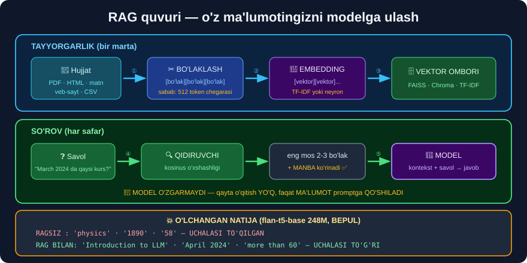

# 9-dars. LangChain nima?

## 🎬 Boshlashdan oldin

> ## **"LangChain — bu ochiq manbali FREYMVORK bo'lib, u dasturchilarga katta til modellarini TASHQI HISOBLASH va MA'LUMOT MANBALARI bilan birlashtirishga imkon beradi."**
>
> **"Uning mashhurligi 2023-yilda keskin oshdi, chunki katta til modellari rivojlandi va dasturchilar ularni o'z ilovalariga OSON INTEGRATSIYA qilish yo'llarini qidirmoqda."**

---

## 1. Nima uchun kerak?

> **"LangChain sizga til modellari bilan quvvatlanadigan BOSHDAN-OXIR ilovalar qurish imkonini beradi."**
>
> ## **"Til modelingiz SIZNING BIZNES SOHANGIZGA yoki u hozirda ega bo'lmagan BOShQA BILIM SOHASIGA oid ma'lumotni ko'ra olishi va tushunishi kerak bo'lgan holatlar bo'ladi."**

### 📚 O'qituvchining ikki misoli

> **"Aytaylik, siz ChatGPT'dan O'QISHDA yordam olishni xohlaysiz. Bu modelda umumiy bilim borligini bilamiz, lekin siz unga o'rganmoqchi bo'lgan BUTUN KURS DASTURINI berish orqali buni yaxshilashingiz mumkin."**

> **"Aytaylik, siz veb-saytingizda mijozlarga yordam berish uchun BIZNESINGIZ UCHUN CHATBOT yaratmoqchisiz."**
>
> ## **"Agar siz katta, mashhur korporatsiyada ishlamasangiz, til modeli sizning kompaniyangizdan XABARDOR BO'LMAYDI — yoki ma'lumot ESKIRGAN bo'lishi mumkin."**

```
🎓 O'QISH        →  kurs dasturini modelga bering
🏢 BIZNES        →  kompaniya ma'lumotini modelga bering
📄 HUJJATLAR     →  shartnoma/qo'llanmani modelga bering
```

---

## 2. ⭐⭐ RAG quvuri — TO'RT QADAM

> ## **"Xo'sh, LangChain bizning ma'lumotimizni qanday qabul qiladi va uni katta til modelimiz o'qishini ta'minlaydi?"**



### ① Yuklash va BO'LAKLASH

> ## **"Birinchi qadam — o'z maxsus ma'lumotimizni yuklash va uni BO'LAKLARGA ajratish, chunki til modellarida odatda bir vaqtda ishlay oladigan matn miqdori CHEKLANGAN."**

```
Butun hujjat (10 000 so'z)
        ↓  BO'LAKLASH
[bo'lak 1] [bo'lak 2] [bo'lak 3] ... [bo'lak 50]
```

> ## 💡 **"Cheklangan matn miqdori" — bu 30-modulda ko'rgan `maks_uzunlik = 512`!**
>
> Va **30-modul, 5-loyihani** eslang: o'zbekcha matn **3.1× ko'p** token oladi → **bo'laklash o'zbek tilida YANADA muhimroq**.

### ② EMBEDDING yaratish

> ## **"Keyin har bir matn bo'lagi uchun RAQAMLI EMBEDDINGLAR yaratamiz."**
>
> ## **"Bu ma'lumot ichida O'XSHASH matn bo'laklarini topishga yordam beradi — bu til modellarimiz berilgan savolga javob berishda matnning QAYSI QISMLARI MUHIMLIGINI aniqlashga urinayotganda foydali."**

> ## 🔑 **"Embedding" — bu 30-modul, 5-darsdagi tushuncha.** Va **24-moduldagi TF-IDF** ham aynan shu g'oyaning **soddaroq** versiyasi!

### ③ VEKTOR OMBORIGA saqlash

> ## **"Nihoyat, bu embeddinglar VEKTOR OMBORIGA yuklanadi. Vektor omborlari embedding fazosida eng o'xshash bo'laklarni TEZ va SAMARALI topishga yordam beradi."**

### ④ QIDIRISH va JAVOB BERISH

```
Savol  →  embedding  →  eng o'xshash bo'laklarni TOP
                              ↓
                    Model + bo'laklar  →  JAVOB
```

---

## 3. 🗺️ To'liq quvur — bir rasmda

```
┌─────────────────────────────────────────────────────────┐
│  TAYYORGARLIK (bir marta)                               │
│                                                          │
│   📄 Hujjat                                              │
│      ↓  ① yuklash + BO'LAKLASH                          │
│   [bo'lak][bo'lak][bo'lak]...                           │
│      ↓  ② EMBEDDING                                     │
│   [vektor][vektor][vektor]...                           │
│      ↓  ③ saqlash                                       │
│   🗄️ VEKTOR OMBORI                                       │
└─────────────────────────────────────────────────────────┘
                          │
┌─────────────────────────┼───────────────────────────────┐
│  SO'ROV (har safar)     ▼                               │
│                                                          │
│   ❓ Savol  →  embedding  →  🔍 O'XSHASHLARNI TOP        │
│                                    ↓                     │
│                          [eng mos 2-3 bo'lak]           │
│                                    ↓                     │
│              🤖 MODEL  +  bo'laklar  →  ✅ JAVOB         │
└─────────────────────────────────────────────────────────┘
```

> ## 🔑 **DIQQAT: model O'ZGARMAYDI.** Uni **qayta o'qitmaymiz**, **sozlamaymiz**. Biz shunchaki unga **to'g'ri ma'lumotni** promptga **qo'shib beramiz**.
>
> ## 💡 **Shuning uchun RAG shunchalik ommalashdi:** u **arzon**, **tez** va **darhol yangilanadi** *(hujjatni o'zgartirsangiz — javob ham o'zgaradi)*.

---

## 4. LangChain yana nima qila oladi?

> **"LangChain sizga til modelingiz bergan javobga asoslanib EMAIL YUBORISH kabi keyingi harakatlarda ham yordam berishi mumkin."**
>
> **"Bu freymvorkda juda ko'p funksionallik bor."**

```
LangChain imkoniyatlari:
   📥 Data loaders   →  PDF, HTML, CSV, veb-sayt, Notion...
   ✂️ Text splitters →  turli bo'laklash strategiyalari
   🔢 Embeddings     →  OpenAI, HuggingFace, Cohere...
   🗄️ Vector stores  →  FAISS, Chroma, Pinecone, Weaviate...
   🔗 Chains         →  bosqichlarni ULASH
   🧠 Memory         →  suhbat tarixini saqlash
   🤖 Agents         →  model O'ZI vosita tanlaydi
```

> ## 💡 **43–47-modullar — LangGraph**, ya'ni bu g'oyaning **yanada rivojlangan** shakli. **35–42-modullar** esa LangChain'ga **to'liq** bag'ishlangan.

---

## 5. ⚠️ HALOL BAHO — LangChain kerakmi?

Kurs LangChain'ni **faqat ijobiy** ko'rsatadi. Halol bo'lsak, **muqobil** ham bor.

| | **LangChain** | **Noldan yozish** |
|---|---|---|
| **Tez boshlash** | ✅ Juda tez | ⚠️ Sekinroq |
| **Data loaders** | ✅ 100+ tayyor | ❌ O'zingiz |
| **Vector stores** | ✅ Ko'pi bilan integratsiya | ⚠️ Bittasini tanlaysiz |
| **Tushunish** | ❌ **"Qora quti"** | ## ✅ **To'liq nazorat** |
| **Nosozlik tuzatish** | ⚠️ Qiyin | ## ✅ **Oson** |
| **Bog'liqliklar** | ⚠️ **Juda ko'p** | ✅ Minimal |
| **Barqarorlik** | ⚠️ API tez-tez o'zgaradi | ✅ O'zingizniki |

> ## 🔑 **AMALIY TAVSIYA:**
> ```
> ① AVVAL noldan yozing  →  RAG ni TUSHUNASIZ
> ② Keyin LangChain      →  tezlik va integratsiya uchun
> ```
>
> ## 💡 **Shuning uchun 10-darsda BIRINCHI navbatda RAG'ni NOLDAN quramiz** — atigi **20 qator kodda**, `sklearn` bilan. Keyin LangChain versiyasini ko'rsatamiz.
>
> ## ⚠️ **Va yana bir sabab:** LangChain'ning API'si **juda tez o'zgaradi**. Kursdagi `ConversationalRetrievalChain` **bugun eskirgan** *(hozir `LCEL` va `create_retrieval_chain` ishlatiladi)*. **Noldan yozilgan kod esa eskirmaydi.**

---

## 6. ⚡ Mashqlar

### 🟢 Oson

**M1.** LangChain nima?

**M2.** RAG quvurining to'rt qadami?

**M3.** Nima uchun matn bo'laklarga bo'linadi?

<details>
<summary>✅ Javoblar</summary>

**M1.** **Ochiq manbali freymvork** — LLM'larni **tashqi ma'lumot** va **hisoblash** bilan birlashtiradi.

**M2.**
```
① yuklash + BO'LAKLASH
② EMBEDDING yaratish
③ VEKTOR OMBORIGA saqlash
④ QIDIRISH + javob berish
```

**M3.** Chunki modelda **kontekst chegarasi** bor — 30-moduldagi `maks_uzunlik = 512`.

</details>

### 🟡 O'rta

**M4.** ⭐ RAG'da model **qayta o'qitiladimi**?

**M5.** Embedding tushunchasi qaysi modullarda uchragan?

<details>
<summary>✅ Javoblar</summary>

**M4.** ## ❌ **YO'Q.** Model **umuman o'zgarmaydi**.
```
Biz faqat TO'G'RI MA'LUMOTNI promptga qo'shamiz.
   →  arzon (o'qitish yo'q)
   →  tez (darhol ishlaydi)
   →  yangilanadigan (hujjatni o'zgartirsangiz — javob o'zgaradi)
```

**M5.**
```
24-modul  →  TF-IDF          (soddaroq versiya)
30-modul  →  word_embeddings (30522 × 768)
31-modul  →  RAG embeddinglari
```
> 🔑 Uchalasi ham **bir xil g'oya**: matnni **vektorga** aylantirish va **o'xshashlikni** o'lchash.

</details>

### 🔴 Qiyin

**M6.** ⭐⭐ 🇺🇿 O'zbek tilida RAG ishlaydimi? Nima uchun?

<details>
<summary>✅ Javob</summary>

## ✅ **HA — VA BU JUDA MUHIM XABAR.**

```
RAG ning to'rt qadami:

  ① BO'LAKLASH   →  ✅ tildan MUSTAQIL (jumlalarga bo'lish)
  ② EMBEDDING    →  ⚠️ BOG'LIQ (qaysi usulni tanlaysiz)
  ③ VEKTOR OMBORI→  ✅ tildan MUSTAQIL (matematika)
  ④ QIDIRISH     →  ✅ tildan MUSTAQIL (kosinus o'xshashligi)
```

**②-qadam uchun ikki yo'l:**

| Usul | O'zbekchada | Izoh |
|---|---|---|
| **TF-IDF** *(24-modul)* | ## ✅ **TO'LIQ ishlaydi** | So'zlarni **sanaydi** — til muhim emas |
| Neyron embedding | ⚠️ Modelga bog'liq | Ko'p tilli model kerak |

> ## 💥 **MANA ENG QIMMATLI XULOSA:**
>
> **28-modulni eslang:** *"sklearn TILDAN MUSTAQIL"*. Bu — **RAG uchun ham to'g'ri**.
>
> ## 🎯 **Ya'ni siz O'ZBEKCHA hujjatlar ustida ishlaydigan RAG tizimini BUGUN qura olasiz** — hech qanday o'zbekcha LLM kutmasdan.
>
> ```
> ① O'zbekcha hujjatni bo'laklang     ✅ ishlaydi
> ② TF-IDF bilan vektorlashtiring     ✅ ishlaydi (28-modul!)
> ③ Savolga eng mos bo'lakni toping   ✅ ishlaydi
> ④ Bo'lakni foydalanuvchiga ko'rsating ✅ ishlaydi
>
> ⚠️ Faqat OXIRGI qadam — javobni GENERATSIYA qilish —
>    yaxshi o'zbekcha model talab qiladi (GPT-4, Claude)
> ```
>
> ## 💡 **10-darsda buni AMALDA ko'rasiz** — o'zbekcha savollar bilan ishlaydigan qidiruv tizimi, **hech qanday API kalitisiz**.

</details>

---

## 🧠 O'zini tekshirish savollari

1. LangChain nima uchun kerak?
2. To'rt qadam qaysilar?
3. RAG'da model o'zgaradimi?
4. Vektor ombori nima qiladi?
5. LangChain'ning kamchiliklari?

<details>
<summary>✅ Javoblar</summary>

1. LLM'ni **o'z ma'lumotingiz** bilan birlashtirish uchun.
2. **Bo'laklash** → **embedding** → **vektor ombori** → **qidirish**.
3. ## ❌ **Yo'q** — faqat promptga ma'lumot **qo'shiladi**.
4. **O'xshash bo'laklarni tez topadi** — kosinus o'xshashligi bo'yicha.
5. **"Qora quti"**, **ko'p bog'liqlik**, **API tez o'zgaradi** *(kursdagi `ConversationalRetrievalChain` allaqachon eskirgan)*.

</details>

---

## 📌 Xulosa

```
LANGCHAIN = LLM  +  o'z ma'lumotingiz


RAG QUVURI — TO'RT QADAM

  TAYYORGARLIK (bir marta):
    ① 📄 yuklash + BO'LAKLASH   (kontekst chegarasi: 512 token)
    ② 🔢 EMBEDDING yaratish
    ③ 🗄️ VEKTOR OMBORIGA saqlash

  HAR SO'ROVDA:
    ④ 🔍 savol → o'xshash bo'laklarni TOP
       🤖 model + bo'laklar → JAVOB


🔑 MODEL O'ZGARMAYDI
   qayta o'qitish YO'Q · sozlash YO'Q
   faqat MA'LUMOT promptga QO'SHILADI
   → arzon · tez · darhol yangilanadi


⚠️ HALOL BAHO
   LangChain    ✅ tez boshlash · ❌ "qora quti" · ⚠️ API tez o'zgaradi
   Noldan       ⚠️ sekinroq · ✅ TO'LIQ TUSHUNISH · ✅ eskirmaydi

   TAVSIYA:  ① avval NOLDAN  ② keyin LangChain


🇺🇿 O'ZBEK TILIDA RAG ISHLAYDIMI?  →  HA!
   ① bo'laklash    ✅ tildan mustaqil
   ② TF-IDF        ✅ tildan mustaqil (28-modul!)
   ③ vektor ombori ✅ matematika
   ④ qidirish      ✅ kosinus o'xshashligi

   ⚠️ faqat GENERATSIYA yaxshi o'zbekcha model talab qiladi
```

---

## 🔖 Atamalar

| Atama | Inglizcha | Izoh |
|---|---|---|
| Freymvork | *framework* | Tayyor vositalar to'plami |
| Bo'laklash | *chunking* | Matnni kichik qismlarga bo'lish |
| Vektor ombori | *vector store* | Embeddinglar bazasi |
| Qidiruvchi | *retriever* | Mos bo'laklarni topuvchi |
| Zanjir | *chain* | Bosqichlar ketma-ketligi |
| Xotira | *memory* | Suhbat tarixi |

---

⬅️ [Oldingi: LangChain'ga kirish](08-Introduction-to-LangChain.md) · 🏠 [Modul boshiga](README.md) · ➡️ [Keyingi: O'z ma'lumotingizni qo'shish](10-Adding-Custom-Data.md)
