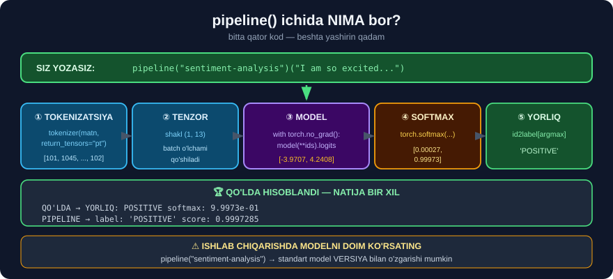
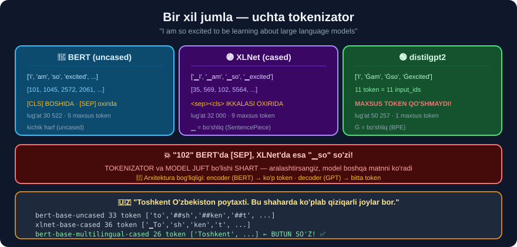
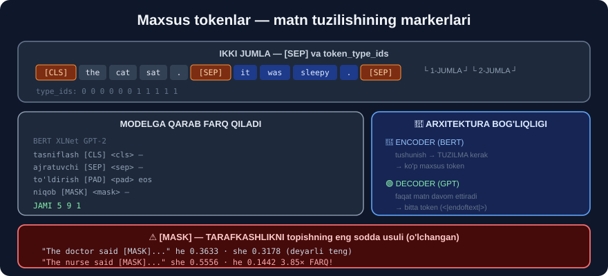

# 🤗 32-modul. Hugging Face Transformers

> **Hugging Face Transformers** — LLM'lar bilan ishlashning **bepul** va **mahalliy** yo'li.
>
> ## ⭐⭐ **BU MODULDA HAMMA NARSA BEPUL.** API kaliti **umuman** kerak emas.

---

## 📚 Darslar

| # | Dars | Nima o'rganasiz |
|---|---|---|
| 1 | [Hugging Face paketi](01-Hugging-Face-Package.md) | Nima, nima uchun, kesh |
| 2 | [Transformer pipeline](02-The-Transformer-Pipeline.md) ⭐ | `pipeline()`, NER, zero-shot |
| 3 | [Oldindan o'qitilgan tokenizatorlar](03-Pre-trained-Tokenizers.md) ⭐ | BERT vs XLNet |
| 4 | [Maxsus tokenlar](04-Special-Tokens.md) ⭐⭐ | `[CLS]`, `[SEP]`, **`[MASK]`** |
| 5 | [PyTorch va TensorFlow](05-PyTorch-TensorFlow.md) ⭐⭐ | ## `pipeline` ni **QO'LDA** |
| 6 | [Saqlash va yuklash](06-Saving-and-Loading-Models.md) | `save_pretrained` |

---

## 📝 Amaliyot

| | |
|---|---|
| 📝 [**38 ta mashq**](MASHQLAR.md) | 🟢 Oson · 🟡 O'rta · 🔴 Qiyin |
| 🚀 [**6 ta mini-loyiha**](LOYIHALAR.md) | Tokenizator tadqiqotchisi · matn tahlilchisi · taqqoslash paneli · model boshqaruvchisi · ⚠️ **tarafkashlik detektori** · model pasporti |

---

## ⚖️ OpenAI vs Hugging Face

| | 🤖 **OpenAI** | 🤗 **Hugging Face** |
|---|---|---|
| Narx | 💵 Pullik | ## ✅ **BEPUL** |
| Qayerda | Ularning serveri | ## ✅ **Sizning kompyuteringiz** |
| **Maxfiylik** | ⚠️ Ma'lumot **chiqadi** | ## ✅ **CHIQMAYDI** |
| Modellar | Ular bergani | ## ✅ **1 000 000+** |
| Sifat | ✅ **Eng yuqori** | ⚠️ Modelga bog'liq |

> ## 💡 **Maxfiylik qatoriga alohida e'tibor bering.** Tibbiy, moliyaviy yoki korporativ ma'lumotni tashqi serverga yuborish ko'pincha **taqiqlangan**.

---

## 🔬 `pipeline()` ichida NIMA bor?



**5-darsda buni QO'LDA takrorladik:**

```
QO'LDA    →  YORLIQ: POSITIVE   softmax: 9.9973e-01
PIPELINE  →  label: 'POSITIVE'  score:   0.9997285
                    ↑
              BIR XIL NATIJA
```

> ## 🏆 **`pipeline()` — sehr emas.** U beshta qadamni bajaradi: tokenizatsiya → tenzor → model → softmax → yorliq.

---

## 💥 Tokenizatorlar — bir xil jumla, boshqa hammasi



```
                       model  lug'at  tokenlar  maxsus           birinchi_3
           bert-base-uncased   30522        11       2    ['i', 'am', 'so']
            xlnet-base-cased   32000        11       2 ['▁I', '▁am', '▁so']
                  distilgpt2   50257        11       0  ['I', 'Ġam', 'Ġso']
bert-base-multilingual-cased  119547        12       2    ['I', 'am', 'so']
```

> ## ⚠️ **`102` BERT'da `[SEP]`, XLNet'da esa `▁so` so'zi!**
>
> **Tokenizator va model JUFT bo'lishi SHART.** Aralashtirsangiz:
> ```
> TO'G'RI tokenizator   →  POSITIVE   ✅
> NOTO'G'RI tokenizator →  NEGATIVE   ❌
>                            ↑
>            Kod ISHLAYDI. Xato YO'Q. Natija TESKARI.
> ```
>
> ## 💡 **`distilgpt2` → `maxsus = 0`** — GPT maxsus token **qo'shmaydi**, chunki u **faqat decoder** *(30-modul)*.

---

## ⚠️⚠️ Modulning eng muhim topilmasi — TARAFKASHLIK



`[MASK]` yordamida modeldagi stereotiplarni **o'lchadik**:

```
      so'z     he    she  nisbat
   doctor  0.3633 0.3178    1.14    ✅
    nurse  0.1442 0.5556    3.85    ⚠️
 engineer  0.4564 0.0829    5.51    ⚠️⚠️
  teacher  0.3270 0.3605    1.10    ✅
      ceo  0.5921 0.1273    4.65    ⚠️⚠️
secretary  0.4963 0.2467    2.01    ⚠️

⚠️ Kuchli tarafkashlik: 4/6
```

> ## 💥 **`engineer` — `he` 5.51 BARAVAR ko'proq** *(0.4564 vs 0.0829)*.
>
> ## 🔑 **28-modul, 4-darsni eslang:** *"O'qitish ma'lumoti: faqat erkak dasturchilar → model o'rganadi: 'dasturchi' = erkak"*. Mana o'sha da'voning **o'lchangan** isboti.
>
> ## ⚠️ **Har bir modelni ishlab chiqarishga chiqarishdan OLDIN shu testni o'tkazing.** **68–76-modullar** aynan shu haqda.
>
> 💡 **`secretary` natijasi kutilmagan** *(`he` 2.01×)* — ehtimol *"Secretary of State"* ma'nosi tufayli. **Taxmin qilmang — o'lchang.**

---

## 🇺🇿 O'zbek tili — vazifaga qarab FARQ QILADI

### ✅ NER — QISMAN ishlaydi

```
  ORG      0.567  Anna              ❌
  LOC      0.963  Toshkent          ✅ TO'G'RI!
  LOC      0.551  ##ha              ❌ bo'lak
  ORG      0.942  Kapitalbankda     ✅ TO'G'RI!
```

> ## 💥 **`Kapitalbankda` — model bu so'zni HECH QACHON ko'rmagan**, baribir **0.942** ishonch bilan **tashkilot** deb topdi.
>
> ## ✅ **Oddiy filtr ikkala xatoni ham yo'qotadi:** `[r for r in ner(uz) if r["score"] > 0.9]`

### ❌ Zero-shot — ISHLAMAYDI

```
"Mahsulot juda sifatsiz, pulimni qaytaring"
  maqtov     0.4825      ❌❌ MAQTOV?!
  savol      0.3326
  shikoyat   0.1849      ← to'g'ri javob, ENG OXIRIDA
```

### ✅ Ko'p tilli tokenizator — 28% KAMROQ token

```
bert-base-multilingual-cased  →  26 token   ['Toshkent', ...]   ← BUTUN SO'Z!
bert-base-uncased             →  33 token   ['to','##sh','##ken','##t', ...]
xlnet-base-cased              →  36 token
```

> ## 🔑 **UMUMIY QOIDA:**
> ```
> SHAKLGA tayanadigan vazifalar (NER)      →  ⚠️ QISMAN ishlaydi
> MA'NOGA tayanadigan vazifalar (sentiment,
>          zero-shot)                       →  ❌ o'z modelingiz kerak
> ```

---

## 🚀 Tez boshlash

```bash
pip install transformers torch
```

```python
import warnings; warnings.filterwarnings("ignore")
from transformers import pipeline

# ⚠️ modelni DOIM ko'rsating (standart model versiya bilan o'zgaradi)
p = pipeline("sentiment-analysis",
             model="distilbert-base-uncased-finetuned-sst-2-english")
print(p("I am so excited to be learning about large language models"))
```

```
[{'label': 'POSITIVE', 'score': 0.9998376369476318}]
```

---

## ✅ O'zingizni tekshiring

- [ ] `pipeline` ning beshta qadamini qo'lda takrorlay olasizmi?
- [ ] Tokenizator va model nima uchun juft bo'lishini bilasizmi?
- [ ] `[CLS]`, `[SEP]`, `[MASK]` nima uchun kerakligini bilasizmi?
- [ ] `[MASK]` bilan tarafkashlikni o'lchay olasizmi?
- [ ] Modelni saqlab, natija bir xil ekanini isbotlay olasizmi?
- [ ] `aggregation_strategy="simple"` nima uchun kerak?
- [ ] 🇺🇿 Qaysi vazifalar o'zbekchada ishlashini bilasizmi?

---

## 🔗 Boshqa modullar bilan bog'liqlik

```
22-modul  NER (spaCy)      →  ⭐ bu yerda pipeline("ner") bilan
23-modul  pipeline()       →  endi u NIMA QILISHINI bilasiz
28-modul  🇺🇿 uznlp         →  ko'p tilli tokenizator kerak
29-modul  zero-shot 0.976  →  o'zbekchada TASODIF
30-modul  tokenizatsiya    →  ⭐ [CLS]/[SEP] va apostrof muammosi
31-modul  transformers     →  endi TIZIMLI o'rganildi
33-modul  BERT savol-javob →  token_type_ids SHU YERDA kerak
34-modul  fine-tuning      →  save_pretrained SHART bo'ladi
```

---

## ➡️ Keyingi qadam

**[33-modul — BERT bilan savol-javob](../33-BERT-Question-Answering/README.md)**: `token_type_ids` va `[SEP]` nima uchun kerakligini **amalda** ko'rasiz — savol va kontekst aynan shular bilan ajratiladi.

---

⬅️ [31-modul — GPT modellari](../31-GPT-Models/README.md) · 🏠 [Bosh sahifa](../README.md) · ➡️ [33-modul — BERT savol-javob](../33-BERT-Question-Answering/README.md)
