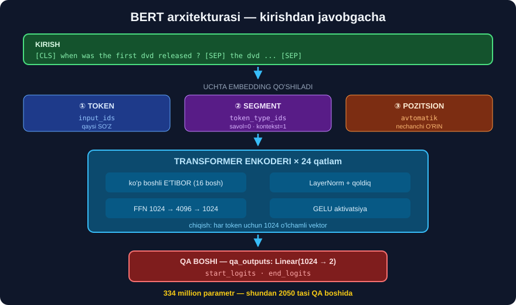

# 2-dars. BERT arxitekturasi

## 🎬 Boshlashdan oldin

> **"BERT kursda avval muhokama qilgan transformer arxitekturasiga asoslangan bo'lsa-da, u BA'ZI O'ZGARTIRISHLARNI kiritadi va uni keng doiradagi NLP vazifalari uchun samarali qiladigan MAXSUS OLDINDAN O'QITISH METODOLOGIYASIGA ega."**

---

## 1. ⭐ Faqat ENCODER

> **"Transformer arxitekturasi haqidagi darslarimizni eslang. Bizda modelni o'qitishda kirish va chiqishlarni qayta ishlaydigan ENCODER bloki va DECODER bloki bor edi."**
>
> ## **"BERT arxitekturasidagi ASOSIY FARQ shundaki, u transformerning FAQAT ENCODER qismini ishlatadi."**
>
> **"Chunki u ketma-ketlikdan ketma-ketlikka vazifalari uchun emas, balki asosan KATTA MATN KORPUSLARIDA OLDINDAN O'QITISH uchun ishlatiladi."**

```
30-MODULDAGI DIAGRAMMA:

  ╔═══════════════╗       ╔═══════════════╗
  ║  🔵 ENCODER   ║══════▶║  🟢 DECODER   ║
  ╚═══════════════╝       ╚═══════════════╝
         ↑                        ↑
       BERT                     GPT
    faqat SHU                faqat SHU
```

> ## **"Transformer arxitekturasiga asoslangan boshqa modellar, masalan GPT seriyasi, matn generatsiyasi yoki ketma-ketlikdan ketma-ketlikka vazifalar uchun DECODER bilan mo'ljallangan."**
>
> ## **"BERT esa, aksincha, asosan matnni KODLASH va TUSHUNISH uchun ishlatiladi — va u bu rolda juda samarali ekanini isbotladi."**

> ## 💡 **30-modul, 4-darsni eslang:** *"🔵 faqat ENCODER → BERT → TUSHUNISH · 🟢 faqat DECODER → GPT → YARATISH"*.

---

## 2. Qatlamlar

> ## **"BERT arxitekturasi BIR XIL ENCODER QATLAMLARINING TO'PLAMIDAN iborat. Qatlamlar soni BERT'ning aniq variantiga bog'liq."**
>
> ## **"BERT Base'da 12 ta encoder qatlami, BERT Large'da esa 24 ta qatlam bor."**
>
> **"BERT Large'ning CHUQURROQ arxitekturasi tokenlarimiz orasidagi ANCHA MURAKKAB naqsh va munosabatlarni qamrab oladi."**

```
distilbert  →   6 qatlam    (30-modulda o'rgangan)
BERT Base   →  12 qatlam
BERT Large  →  24 qatlam
```

---

## 3. ⭐⭐ UCHTA embedding

> **"BERT'ning kirishi — tokenizatsiya qilingan matn, va har bir token kirish tokenlari uchun EMBEDDING VEKTORI sifatida ifodalanadi. BERT buni UCH TURDAGI embeddingga aylantiradi."**



### ① Token embeddinglari

> ## **"Birinchisi — TOKEN EMBEDDINGLARI. Bular har bir tokenni MA'NOLI raqamli ko'rinishga aylantirish uchun standart so'z embeddinglari."**
>
> **"Maxsus tokenlar CLS va SEP ham jumlalarning boshi va oxiriga qo'shiladi."**

### ② Segment embeddinglari

> ## **"Ikkinchi tur — SEGMENT EMBEDDINGLARI. BERT kirish sifatida ketma-ketliklar JUFTLIGINI yoki matn segmentlarini qabul qila oladi. Segment embeddinglari modelga turli segmentlarni AJRATISHGA yordam beradi."**

> ## 🔑 **BU — 32-MODULDAGI `token_type_ids`!**
> ```
> [CLS] the cat sat . [SEP]  it was sleepy . [SEP]
>   0    0   0   0  0   0     1   1    1    1   1
>   └─── 1-SEGMENT ────┘     └─── 2-SEGMENT ────┘
> ```
> **Bu modulda u HAL QILUVCHI ahamiyatga ega bo'ladi:** segment 0 — **SAVOL**, segment 1 — **KONTEKST**.

### ③ Pozitsion embeddinglari

> **"Va nihoyat, BERT POZITSION EMBEDDINGLARNI oladi. Bu embeddinglar kirish ketma-ketligidagi har bir tokenning POZITSIYASINI kodlaydi."**

```
KIRISH = token embedding  +  segment embedding  +  pozitsion embedding
              ↑                    ↑                      ↑
          "bu qaysi so'z?"   "qaysi jumla?"        "nechanchi o'rin?"
```

> ## 💡 **30-modul, 5-darsda ikkitasini ko'rgandik** *(token + pozitsion)*. **Uchinchisi — segment — BERT'ga xos.**

---

## 4. ⭐⭐ Ikkita oldindan o'qitish vazifasi

> **"BERT'ning oldindan o'qitish maqsadi tilni IKKI TOMONLAMA tushunish va ifodalashga qaratilgan. Model IKKI ASOSIY MAQSAD bilan oldindan o'qitiladi."**

### ① MLM — Masked Language Modeling

> ## **"Birinchisi — NIQOBLANGAN TIL MODELLASHTIRISH. Bu maqsadda har bir kirish ketma-ketligidagi tokenlarning bir qismi TASODIFIY NIQOBLANADI, va model niqoblangan so'zni ATROFDAGI tokenlar bergan kontekst asosida bashorat qilishga o'qitiladi."**
>
> ## **"Bu modelni IKKI TOMONLAMA kontekstni o'rganishga MAJBURLAYDI, chunki unga niqoblangan tokenning HAR IKKI TOMONIDAGI barcha niqoblanmagan so'zlarni ko'rishga ruxsat beriladi."**

```
"The cat [MASK] on the mat"
    ←────┘      └────→
  chapdan       o'ngdan
       ↓
   "sat"  ✅
```

> ## 🔁 **32-modulda buni ISHLATGANSIZ:**
> ```python
> fm = pipeline("fill-mask", model="bert-base-uncased")
> fm("The capital of France is [MASK].")
> #  →  'paris'  0.4168
> ```
> **Mana o'sha — BERT'ning ASOSIY o'qitish vazifasi.**

### ② NSP — Next Sentence Prediction

> ## **"Ikkinchisi — KEYINGI JUMLANI BASHORAT QILISH. BERT juftlikdagi ikki jumla asl matnda KETMA-KET kelganmi yoki yo'qmi — shuni bashorat qilishga o'qitiladi."**
>
> **"Bu o'qitish bosqichida kirish jumlalarining 50% i asl kirish matnidagi KEYINGI jumlasi bilan juftlanadi. Qolgan 50% i esa matndan TASODIFIY jumla bilan juftlanadi."**

```
50%  →  "The cat sat."  +  "It was sleepy."      →  KETMA-KET  ✅
50%  →  "The cat sat."  +  "Paris is a city."    →  TASODIFIY  ❌
```

> **"Maqsad — BERT ikki jumla haqiqatan ketma-ket kelganmi yoki yo'qligini ANIQ bashorat qilishi. Bu maqsad modelga JUMLALAR ORASIDAGI munosabatlarni tushunishga yordam beradi."**

> ## 💡 **NSP nima uchun MUHIM?** Chunki **savol-javob** vazifasi aynan **ikki segment** *(savol + kontekst)* orasidagi munosabatga tayanadi. NSP modelni **shunga tayyorlaydi**.

### ⚠️ Halol eslatma — NSP haqidagi keyingi tadqiqotlar

> **RoBERTa** *(7-dars)* **NSP'ni BUTUNLAY OLIB TASHLADI** — va **yaxshiroq** natija berdi.
>
> ```
> BERT     →  MLM + NSP
> RoBERTa  →  faqat MLM       →  natija YAXSHIROQ
> ```
>
> ## 🔑 **Ya'ni NSP — BERT'ning eng kuchli tomoni EMAS.** Bu — 2018-yildagi **g'oya**, keyinchalik **foydasizroq** deb topilgan. Kurs buni aytmaydi, lekin bu **muhim** kontekst.

---

## 5. Nima uchun decoder KERAK EMAS?

> ## **"Bu oldindan o'qitish vazifalari MATN GENERATSIYASINI o'z ichiga olmaydi, shuning uchun oldindan o'qitishning dastlabki bosqichi uchun DECODER KERAK EMAS."**
>
> ## **"Decoder'ning yo'qligi BERT'ni matn tasnifi, savol-javob, nomli obyektlarni aniqlash va boshqa keng doiradagi NLP vazifalariga ANCHA MOSLASHUVCHAN qiladi."**

---

## 6. ⭐ Fine-tuning — vazifaga moslashtirish

> ## **"Oldindan o'qitilgandan so'ng, BERT oldindan o'qitilgan encoder USTIGA VAZIFAGA XOS QATLAM qo'shish orqali bu aniq vazifalar uchun SOZLANISHI mumkin."**
>
> ## **"Biz yaratadigan yangi CHIQISH QATLAMI natijani vazifaga MOS FORMATGA keltiradi."**
>
> **"Masalan, agar biz sentiment tahlilini qilmoqchi bo'lsak, yakuniy chiqish qatlami natijamizni SENTIMENT YORLIQLARIGA aylantirardi."**

```
        OLDINDAN O'QITILGAN BERT (o'zgarmaydi)
                    ↓
        ┌───────────┴───────────┐
        ▼           ▼           ▼
   [sentiment]  [savol-javob]  [NER]
    2 chiqish    2 chiqish     9 chiqish
                (start, end)
        ↑
   FAQAT SHU QATLAM yangi
```

> ## 💡 **Bu — 29-modul, 6-darsdagi "fine-tuning" ning aniq mexanizmi.**
>
> ## 🔑 **Bu modulda biz `BertForQuestionAnswering` ni ishlatamiz** — u aynan shunday qurilgan: BERT + **ikkita chiqish** *(javob boshi va oxiri)*.

### Qanday qilib buni ko'rish mumkin?

```python
import warnings; warnings.filterwarnings("ignore")
from transformers import AutoConfig

for m, s in [("bert-base-uncased", "asosiy"),
             ("distilbert-base-uncased-finetuned-sst-2-english", "sentiment"),
             ("dbmdz/bert-large-cased-finetuned-conll03-english", "NER")]:
    c = AutoConfig.from_pretrained(m)
    n = len(getattr(c, "id2label", {}))
    print(f"{s:10s} {m.split('/')[-1][:38]:40s} chiqish: {n}")
```

> ## 🔑 **Bir xil BERT tanasi — turli chiqish qatlamlari.** Sentiment 2 ta, NER 9 ta *(BIO teglar)*, savol-javob 2 ta *(start/end)*.

---

## 7. ⚡ Mashqlar

### 🟢 Oson

**M1.** BERT transformerning qaysi qismini ishlatadi?

**M2.** Uchta embedding turi qaysilar?

**M3.** Ikkita oldindan o'qitish vazifasi?

<details>
<summary>✅ Javoblar</summary>

**M1.** ## **FAQAT ENCODER**.

**M2.** ① **Token** · ② **Segment** *(`token_type_ids`)* · ③ **Pozitsion**.

**M3.** ① **MLM** *(Masked Language Modeling)* · ② **NSP** *(Next Sentence Prediction)*.

</details>

### 🟡 O'rta

**M4.** ⭐ MLM nima uchun modelni ikki tomonlamalikka MAJBURLAYDI?

**M5.** Segment embeddinglari qaysi `transformers` maydoniga mos keladi?

<details>
<summary>✅ Javoblar</summary>

**M4.**
```
"The cat [MASK] on the mat"

Niqoblangan so'zni topish uchun model:
   ← chapdagi "The cat" ni ko'rishi kerak
   → o'ngdagi "on the mat" ni ham ko'rishi kerak

Faqat bir tomonga qarasa — TOPA OLMAYDI.
```
> 🔑 Ya'ni ikki tomonlamalik — **tanlov emas, ZARURAT**. Vazifaning o'zi shuni talab qiladi.

**M5.** ## **`token_type_ids`** *(32-modul, 4-dars)*.
```
[CLS] savol [SEP] kontekst [SEP]
  0     0     0      1        1
```

</details>

### 🔴 Qiyin

**M6.** ⭐⭐ Turli BERT modellarining **chiqish qatlamlarini** solishtiring.

<details>
<summary>✅ Yechim</summary>

```python
import warnings; warnings.filterwarnings("ignore")
import pandas as pd
from transformers import AutoConfig

MODELLAR = [
    ("asosiy",      "bert-base-uncased"),
    ("sentiment",   "distilbert-base-uncased-finetuned-sst-2-english"),
    ("NER",         "dbmdz/bert-large-cased-finetuned-conll03-english"),
]
r = []
for vazifa, m in MODELLAR:
    c = AutoConfig.from_pretrained(m)
    lbl = getattr(c, "id2label", {})
    r.append({"vazifa": vazifa, "model": m.split("/")[-1][:34],
              "qatlam": getattr(c, "num_hidden_layers", "?"),
              "chiqish": len(lbl),
              "yorliqlar": str(list(lbl.values())[:4])[:40]})
print(pd.DataFrame(r).to_string(index=False))
```

> ## 🔑 **Kutilgan naqsh:**
> ```
> asosiy     →  chiqish 2   (LABEL_0, LABEL_1 — MA'NOSIZ, hali sozlanmagan)
> sentiment  →  chiqish 2   (NEGATIVE, POSITIVE)
> NER        →  chiqish 9   (O, B-PER, I-PER, B-ORG, ...)
> ```
>
> ## 💡 **Birinchi qator MUHIM:** `bert-base-uncased` da ham 2 ta chiqish bor, lekin ular `LABEL_0`/`LABEL_1` — **ma'nosiz**. Chunki bu model **hali hech qanday vazifaga sozlanmagan**.
>
> ## ⚠️ **Amaliy oqibat:** `AutoModelForSequenceClassification.from_pretrained("bert-base-uncased")` ishlatsangiz, model **tasodifiy** javob beradi — chiqish qatlami **o'qitilmagan**. Buni **34-modulda** o'zimiz o'qitamiz.

</details>

**M7.** ⭐⭐ NSP haqida — nima uchun RoBERTa uni olib tashlagan?

<details>
<summary>✅ Javob</summary>

```
BERT     →  MLM + NSP
RoBERTa  →  faqat MLM  (+ ko'proq ma'lumot, kattaroq batch)
              ↓
        NATIJA YAXSHIROQ
```

> ## 🔑 **RoBERTa mualliflarining topilmasi:** NSP vazifasi **juda oson** edi — model *"bu ikki jumla bir mavzudami?"* degan savolga **mavzu** bo'yicha javob berardi, **munosabat** bo'yicha emas.
>
> ## 💡 **Bu — ilm-fanning normal ishlashi:** 2018-yildagi g'oya 2019-yilda **qayta ko'rib chiqildi**. Kurs BERT'ni tasvirlaydi, lekin **eng yaxshi amaliyot o'zgargan**.
>
> ## ⚠️ **Amaliy maslahat:** yangi loyihada **RoBERTa** yoki **DeBERTa** ni ko'rib chiqing — ular BERT'dan **yaxshiroq** natija beradi *(7-darsga qarang)*.

</details>

---

## 🧠 O'zini tekshirish savollari

1. BERT qaysi blokni ishlatadi?
2. Base va Large nechta qatlamga ega?
3. Uchta embedding turi?
4. MLM va NSP nima?
5. Fine-tuning'da nima o'zgaradi?

<details>
<summary>✅ Javoblar</summary>

1. ## **Faqat ENCODER**.
2. **Base** — 12 · **Large** — 24.
3. **Token** · **segment** · **pozitsion**.
4. **MLM** — niqoblangan so'zni bashorat · **NSP** — ikki jumla ketma-ketmi?
5. Faqat **chiqish qatlami** qo'shiladi — BERT tanasi **o'zgarmaydi** *(yoki biroz sozlanadi)*.

</details>

---

## 📌 Xulosa

```
BERT ARXITEKTURASI = FAQAT ENCODER

  🔵 encoder  →  BERT   (tushunish)
  🟢 decoder  →  GPT    (yaratish)


QATLAMLAR
  distilbert   6
  BERT Base   12
  BERT Large  24


UCHTA EMBEDDING
  ① TOKEN      →  "bu qaysi so'z?"        (30-modul)
  ② SEGMENT    →  "qaysi jumla?"          ⭐ token_type_ids (32-modul)
  ③ POZITSION  →  "nechanchi o'rin?"      (30-modul)

  KIRISH = ①  +  ②  +  ③


IKKITA OLDINDAN O'QITISH VAZIFASI

  ① MLM — Masked Language Modeling
       "The cat [MASK] on the mat"
        ←────┘      └────→
       IKKI TOMONLAMALIKKA MAJBURLAYDI

  ② NSP — Next Sentence Prediction
       50% ketma-ket · 50% tasodifiy
       ⚠️ RoBERTa buni OLIB TASHLADI — natija YAXSHIROQ


FINE-TUNING
   BERT tanasi (o'zgarmaydi)  +  VAZIFAGA XOS chiqish qatlami

   sentiment  →  2 chiqish (NEGATIVE, POSITIVE)
   NER        →  9 chiqish (BIO teglar)
   savol-javob→  2 chiqish (START, END)   ← BU MODUL
```

---

## 🔖 Atamalar

| Atama | Inglizcha | Izoh |
|---|---|---|
| MLM | *masked language modeling* | Niqoblangan so'zni bashorat |
| NSP | *next sentence prediction* | Jumlalar ketma-ketligi |
| Segment embedding | *segment embedding* | Qaysi jumlaga tegishli |
| Chiqish qatlami | *output layer* | Vazifaga xos oxirgi qatlam |
| Downstream vazifa | *downstream task* | Sozlashdan keyingi aniq vazifa |

---

⬅️ [Oldingi: GPT va BERT](01-GPT-vs-BERT.md) · 🏠 [Modul boshiga](README.md) · ➡️ [Keyingi: Modelni yuklash](03-Loading-Model-and-Tokenizer.md)
