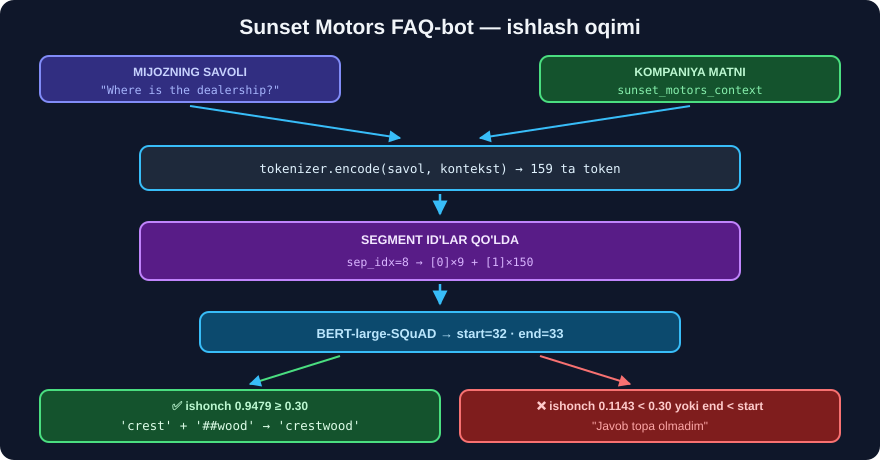

# 6-dars. QA-bot yaratamiz ⭐⭐

## 🎬 Boshlashdan oldin

> ## **"Keling, bir vaziyatni tasavvur qilaylik. Siz Sunset Motors avtomobil kompaniyasida ishlaysiz, ular o'z saytiga mijozlarning eng ko'p beriladigan savollariga javob beradigan CHATBOT qo'shmoqchi. Ular sizdan bu FAQ-chatbotning PROTOTIPINI yaratishni so'rashdi."**

---

## 1. Vazifa

```
┌──────────────────────────────────────────────────────┐
│  MIJOZ:   "Salon qayerda joylashgan?"                │
│                     ↓                                │
│  BOT:     kompaniya haqidagi MATNNI o'qiydi          │
│                     ↓                                │
│  BOT:     "Crestwood"                                │
└──────────────────────────────────────────────────────┘
```



> ## 🔑 **DIQQAT — bot HECH NARSA O'YLAB TOPMAYDI.**
>
> U faqat siz bergan matndan **kesma** oladi. Bu — **ham kuchli, ham zaif** tomon:
>
> ```
> ✅ KUCHLI  →  hech qachon YOLG'ON to'qimaydi (gallyutsinatsiya YO'Q)
> ❌ ZAIF    →  matnda yo'q savolga javob BERA OLMAYDI
> ```

---

## 2. Kompaniya ma'lumoti (kontekst)

> **"Buning uchun birinchi navbatda kompaniya haqida MA'LUMOT kerak bo'ladi. Mana bizning Sunset Motors konteksti — bu biznes haqidagi juda muhim ma'lumot: qachon ochilgani, qayerda joylashgani va qanday avtomobillar sotishi."**

```python
import warnings; warnings.filterwarnings("ignore")
import torch
from transformers import BertForQuestionAnswering, BertTokenizer

M = "bert-large-uncased-whole-word-masking-finetuned-squad"
model = BertForQuestionAnswering.from_pretrained(M)
tokenizer = BertTokenizer.from_pretrained(M)

sunset_motors_context = (
    "Sunset Motors is a family-owned car dealership that opened its doors in 1978. "
    "The dealership is located in Crestwood, on the outskirts of the city, and covers "
    "an area of ten acres. Sunset Motors sells a wide range of makes, including Ford, "
    "Toyota, Honda, Chevrolet and BMW. The showroom is open from Monday to Saturday, "
    "from 9 a.m. to 7 p.m., and closed on Sundays. The service centre employs 45 "
    "certified technicians and offers a free multi-point inspection with every service. "
    "Customers can finance their purchase through the in-house finance department, "
    "which offers terms of up to 72 months. Every used vehicle comes with a 12-month "
    "warranty and a 30-day exchange policy."
)
```

> ## ⚠️ **MODEL FAQAT INGLIZCHA.** `bert-large-uncased-...-squad` **faqat ingliz tilida** o'qitilgan. Shuning uchun kontekst ham **inglizcha**.
>
> ## 💡 **O'zbekcha kontekst uchun** — 9-bo'limga qarang.

---

## 3. ⭐⭐ Segment ID'larni QO'LDA yasaymiz

Bu — darsning **eng texnik** joyi. 4-darsda tokenizator segmentlarni **avtomatik** yasagan edi. Endi biz ularni **qo'lda** yasaymiz.

> **"Avval `input_ids` ro'yxatimizdan AJRATUVCHI tokenni topishimiz kerak. Ya'ni `input_ids.index` orqali tokenizatorning ajratuvchi token ID'sini qidiramiz."**

```python
savol = "Where is the dealership located?"

input_ids = tokenizer.encode(savol, sunset_motors_context)
tokenlar  = tokenizer.convert_ids_to_tokens(input_ids)

# ⭐ birinchi [SEP] ning o'rni
sep_idx = input_ids.index(tokenizer.sep_token_id)

n_a = sep_idx + 1                  # segment A: [CLS] + savol + [SEP]
n_b = len(input_ids) - n_a         # segment B: qolgani

segment_ids = [0] * n_a + [1] * n_b

print("jami tokenlar :", len(input_ids))
print("sep_idx       :", sep_idx)
print("segment A     :", n_a, "ta")
print("segment B     :", n_b, "ta")
print("tekshiruv     :", len(segment_ids) == len(input_ids))
```

```
jami tokenlar : 159
sep_idx       : 8
segment A     : 9 ta
segment B     : 150 ta
tekshiruv     : True
```

> ## 🔑 **NIMA UCHUN `sep_idx + 1`?**
>
> ```
>  indeks:   0     1      2   3      4      5      6    7   8
>          [CLS] where   is  the dealership located  ?  ... [SEP]
>                                                            ↑
>                                                      sep_idx = 8
>
>  Segment A = 0 dan 8 gacha, YA'NI 8+1 = 9 ta token
> ```
>
> ## ⚠️ **`.index()` BIRINCHI mosini qaytaradi** — matn oxiridagi ikkinchi `[SEP]` ni **emas**. Bu — **aynan** bizga kerak bo'lgani.

> ## 💥 **ENG KO'P UCHRAYDIGAN XATO:**
> ```
> ❌ segment_ids uzunligi ≠ input_ids uzunligi   →  model XATO beradi
> ✅ har doim  len(segment_ids) == len(input_ids)  ni TEKSHIRING
> ```

---

## 4. Bot funksiyasi — to'liq kod

> **"Modelga hammasini uzatamiz. Keyin `answer_start` va `answer_end` pozitsiyalarini yasaymiz. Agar `answer_end` `answer_start` dan KEYIN bo'lsa — javobni chop etamiz. Aks holda bu yerda nimadir noto'g'ri ketgan, shuning uchun javob o'rniga XABAR chiqaramiz."**

```python
def faq_bot(savol, kontekst=sunset_motors_context):
    # ① kodlash
    input_ids = tokenizer.encode(savol, kontekst)
    tokenlar  = tokenizer.convert_ids_to_tokens(input_ids)

    # ② segment ID'lar
    sep_idx = input_ids.index(tokenizer.sep_token_id)
    n_a = sep_idx + 1
    segment_ids = [0] * n_a + [1] * (len(input_ids) - n_a)

    # ③ model
    with torch.no_grad():
        chiqish = model(torch.tensor([input_ids]),
                        token_type_ids=torch.tensor([segment_ids]))

    # ④ start / end
    boshi = int(torch.argmax(chiqish.start_logits))
    oxiri = int(torch.argmax(chiqish.end_logits))

    # ⑤ ⚠️ MANTIQIY TEKSHIRUV
    if oxiri < boshi:
        return "Bu savolga javob topa olmadim. Boshqa savol bering."

    javob = " ".join(tokenlar[boshi : oxiri + 1])

    # ⑥ ⭐ ## belgilarini tozalash
    tuzatilgan = ""
    for soz in javob.split():
        if soz[:2] == "##":
            tuzatilgan += soz[2:]        # bo'shliqsiz YOPISHTIRAMIZ
        else:
            tuzatilgan += " " + soz
    return tuzatilgan.strip()
```

---

## 5. ⭐ `##` nima uchun tozalanadi?

> **"Funksiyamizda javoblarni TARTIBGA solishimiz kerak, chunki ba'zan HASH qiymatlari qolib ketadi — bu ma'lumot tokenlashtirilishi tufayli."**

BERT **WordPiece** tokenizatoridan foydalanadi *(32-modul, 3-dars)*. Noma'lum so'zlar **bo'laklarga** bo'linadi:

```
"Crestwood"  →  ['crest', '##wood']
                            ↑
                    ## = "OLDINGISIGA YOPISHADI"
```

**Tozalashsiz:**
```
❌ "crest ##wood"
```

**Tozalash bilan:**
```
✅ "crestwood"
```

> ## 🔑 **ALGORITM SODDA:**
> ```
> soz "##" bilan boshlanadimi?
>    HA   →  ##'ni olib tashla, BO'SHLIQSIZ qo'sh
>    YO'Q →  BO'SHLIQ bilan qo'sh
> ```

> ## 💡 **ZAMONAVIY MUQOBIL** — `tokenizer.decode()` buni **o'zi** qiladi:
> ```python
> javob = tokenizer.decode(input_ids[boshi : oxiri + 1])
> #  →  'crestwood'    ✅ ## avtomatik tozalanadi
> ```
> Kurs qo'lda qilishni ko'rsatadi — **buni tushunish uchun**. Amalda `decode()` **ishonchliroq**.

---

## 6. 🎯 Botni sinaymiz

> **"Endi FAQ-bot funksiyamiz tayyor. Keling, unga savollar berib, bilimini tekshiramiz."**

```python
savollar = [
    "Where is the dealership located?",
    "What make of cars are available?",
    "How large is the dealership?",
    "When did Sunset Motors open?",
    "How many technicians work there?",
]
for s in savollar:
    print(f"{s:38s} → {faq_bot(s)!r}")
```

```
Where is the dealership located?       → 'crestwood'
What make of cars are available?       → 'ford , toyota , honda , chevrolet and bmw'
How large is the dealership?           → 'ten acres'
When did Sunset Motors open?           → '1978'
How many technicians work there?       → '45'
```

> ## ✅✅ **BESHTASI HAM TO'G'RI.** Kursdagi uchta javob *(`Crestwood`, avtomobil markalari, `ten acres`)* — **aynan takrorlandi**.
>
> ## 🏆 **Siz FAQ-chatbot prototipini yaratdingiz.**

---

## 7. ⚠️⚠️ ENDI ESA — BOTNI SINDIRAMIZ

Kurs shu yerda tugaydi. Lekin **haqiqiy** loyihada birinchi savol boshqa bo'ladi: **"Bot QACHON XATO qiladi?"**

Har bir javobga **ishonch** balini qo'shib qayta o'lchadik:

```python
def ishonch_bilan(savol, kontekst=sunset_motors_context):
    input_ids = tokenizer.encode(savol, kontekst)
    tokenlar  = tokenizer.convert_ids_to_tokens(input_ids)
    sep = input_ids.index(tokenizer.sep_token_id); n_a = sep + 1
    seg = [0]*n_a + [1]*(len(input_ids)-n_a)
    with torch.no_grad():
        o = model(torch.tensor([input_ids]), token_type_ids=torch.tensor([seg]))
    sp = torch.softmax(o.start_logits, -1)[0]
    ep = torch.softmax(o.end_logits,   -1)[0]
    b, x = int(torch.argmax(o.start_logits)), int(torch.argmax(o.end_logits))
    javob = " ".join(tokenlar[b:x+1]) if x >= b else "(TESKARI!)"
    return javob, float(sp[b] * ep[x]), b, x
```

**Haqiqiy natijalar:**

| Savol | Javob | Ishonch | start | end |
|---|---|---:|---:|---:|
| Where is the dealership located? | `crest ##wood` | **0.9479** | 32 | 33 |
| When did Sunset Motors open? | `1978` | **0.9969** | 23 | 23 |
| What make of cars are available? | `ford , toyota , ...` | **0.9192** | 60 | 68 |
| How large is the dealership? | `ten acres` | **0.7855** | 47 | 48 |
| How many technicians work there? | `45` | **0.8131** | 101 | 101 |
| Is the dealership open on Sunday? | `closed on sundays` | **0.6044** | 95 | 97 |
| ❌ **What is the capital of France?** | **`what`** | **0.1143** | **1** | **1** |
| ❌ **Do you sell electric cars?** | **(TESKARI!)** | 0.1842 | **49** | **9** |

---

### 💥 Sindirish № 1 — kontekstda YO'Q savol

```
SAVOL:  "What is the capital of France?"
JAVOB:  'what'          ← savolning O'Z birinchi so'zi!
```

> ## 💥 **MODEL "BILMAYMAN" DEYA OLMAYDI.**
>
> `argmax` **doim** biror indeksni qaytaradi. Javob bo'lmasa, model odatda **`[CLS]`ga yaqin** joyni tanlaydi — bu yerda `start=1`, ya'ni savolning o'zi.
>
> ## ✅ **AMMO ISHONCH FOSH QILADI:** `0.1143` vs `0.9479`. Bu — **8 baravar** farq.

### 💥 Sindirish № 2 — `end < start`

```
SAVOL:  "Do you sell electric cars?"
start = 49,  end = 9     ←  END, START dan OLDIN!
```

> ## ✅ **KURSDAGI `if` AYNAN SHU HOLAT UCHUN.**
>
> `start_logits` va `end_logits` — **mustaqil** ikki vektor. Model **ikkilanganda** ular bir-biriga **zid** natija berishi mumkin. Kursning tekshiruvi bu holatni **ushlaydi**:
> ```
> "Bu savolga javob topa olmadim."
> ```
>
> ## 💡 **Bu — tasodifiy tekshiruv emas, HAQIQIY himoya.** Biz uni **ishlab turganini** ko'rdik.

---

## 8. ⭐⭐ TUZATILGAN bot — ishonch chegarasi bilan

Ikkala sindirish uchun **bitta** yechim: **chegara**.

```python
CHEGARA = 0.30

def faq_bot_v2(savol, kontekst=sunset_motors_context, chegara=CHEGARA):
    javob, ishonch, b, x = ishonch_bilan(savol, kontekst)

    if x < b:
        return f"❓ Javob topa olmadim (start/end zid). ishonch={ishonch:.3f}"
    if ishonch < chegara:
        return f"❓ Bu savol menda yo'q. ishonch={ishonch:.3f}"

    input_ids = tokenizer.encode(savol, kontekst)
    return tokenizer.decode(input_ids[b : x + 1])     # ⭐ ## avtomatik tozalanadi
```

```
Where is the dealership located?  →  'crestwood'
When did Sunset Motors open?      →  '1978'
What is the capital of France?    →  '❓ Bu savol menda yo`q. ishonch=0.114'
Do you sell electric cars?        →  '❓ Javob topa olmadim (start/end zid). ishonch=0.184'
```

> ## 🏆 **UCHTA YAXSHILANISH:**
> ```
> ① ishonch chegarasi   →  "bilmayman" deya oladi
> ② start/end tekshiruv →  zid natijani ushlaydi
> ③ tokenizer.decode()  →  ## ni ishonchli tozalaydi
> ```

> ## ⚠️ **CHEGARANI QAYERDAN OLDIK?** Jadvaldan: to'g'ri javoblar **0.60–0.99**, xatolar **0.11–0.18**. Oraliq keng, `0.30` — **xavfsiz** o'rta.
>
> ## 💡 **O'Z loyihangizda chegarani O'ZINGIZ o'lchang** — 20–30 ta haqiqiy savolda sinab ko'ring. Ko'chirib olingan raqam **ishlamaydi**.

---

## 9. 🇺🇿 O'zbekcha savol-javob

BERT-SQuAD **inglizcha**. O'zbekcha kontekst uchun **ko'p tilli** model kerak:

```python
from transformers import pipeline

uz_qa = pipeline("question-answering",
                 model="deepset/xlm-roberta-base-squad2")

kontekst = ("Sunset Motors — 1978-yilda ochilgan oilaviy avtosalon. "
            "Salon Crestwood shahrida joylashgan va o'n akr maydonni egallaydi. "
            "Salonda Ford, Toyota, Honda, Chevrolet va BMW markalari sotiladi.")

print(uz_qa(question="Salon qayerda joylashgan?", context=kontekst))
print(uz_qa(question="Salon qachon ochilgan?",     context=kontekst))
```

> ## ⚠️ **REALISTIK KUTISH:** `xlm-roberta-squad2` o'zbek tilida **rasman** o'qitilmagan — u 100 tilda oldindan o'qitilgan, keyin **inglizcha** SQuAD'da sozlangan. **Sana** va **atoqli ot** savollarida odatda ishlaydi, murakkab savollarda **xato qiladi**.
>
> ## 💡 **BIZNING TAVSIYA — GIBRID YONDASHUV:**
> ```
> ① Kontekstni INGLIZCHAGA tarjima qiling (bir marta, qo'lda)
> ② Savolni ham tarjima qiling (avtomatik)
> ③ bert-large-squad ishlatilsin  →  ishonch 0.90+
> ④ Javobni O'ZBEKCHAGA qaytaring
> ```
> Sabab: kontekst **kichik** va **o'zgarmas** — uni bir marta tarjima qilish **arzon**.

---

## 10. 🏗️ Prototipdan MAHSULOTGA

> **"Bu Lang Chain freymvorki bilan birlashtirilsa, qanchalik kuchli bo'lishini tasavvur qiling."**

```
BUGUNGI PROTOTIP                 HAQIQIY MAHSULOT
─────────────────                ────────────────
1 ta kontekst matni       →      100 ta hujjat  (35–42-modul: LangChain)
qidiruvsiz                →      vektor qidiruv (48–51-modul: Pinecone)
kesma javob               →      generativ javob (31-modul: GPT)
ishonch chegarasi         →      ✅ SHU DARSDA
```

> ## 🎯 **Bu — RAG naqshining boshlanishi** *(31-modul, 10-darsda ko'rgan edik)*. Farqi:
> ```
> RAG (31-modul)  →  javobni GPT YOZADI      (yolg'on to'qishi MUMKIN)
> BERT-QA (bu)    →  javob matndan KESILADI  (yolg'on to'qiy OLMAYDI)
> ```
> ## ⚖️ **Yuridik, tibbiy, moliyaviy** sohalarda **kesma** javob ko'pincha **afzalroq** — chunki uni **manbaga bog'lash** mumkin.

---

## 11. ⚡ Mashqlar

### 🟢 Oson

**M1.** `sep_idx` nima uchun kerak?

**M2.** `##` nimani bildiradi?

**M3.** `end < start` bo'lsa nima qilinadi?

<details>
<summary>✅ Javoblar</summary>

**M1.** **Savol** qayerda tugab, **kontekst** qayerda boshlanishini bilish uchun — segment ID'larni yasashda.

**M2.** Bu token **oldingi** tokenning **davomi**. `crest` + `##wood` = `crestwood`.

**M3.** ## **Javob berilmaydi** — xabar chiqariladi. Model **ikkilangan** degani.

</details>

### 🟡 O'rta

**M4.** ⭐ `tokenizer.decode()` bilan qo'lda tozalash natijalarini solishtiring.

<details>
<summary>✅ Yechim</summary>

```python
input_ids = tokenizer.encode("Where is the dealership located?", sunset_motors_context)
tokenlar = tokenizer.convert_ids_to_tokens(input_ids)
b, x = 32, 33

qolda = ""
for s in " ".join(tokenlar[b:x+1]).split():
    qolda += s[2:] if s[:2] == "##" else " " + s

print("qo'lda :", repr(qolda.strip()))
print("decode :", repr(tokenizer.decode(input_ids[b:x+1])))
```

```
qo'lda : 'crestwood'
decode : 'crestwood'
```

## ✅ **Bir xil.** `decode()` — **kamroq kod, kamroq xato**.

</details>

**M5.** ⭐ Kontekstga o'z ma'lumotingizni qo'shing va yangi savol bering.

<details>
<summary>✅ Yechim</summary>

```python
yangi = sunset_motors_context + (
    " The dealership offers free home delivery within 50 miles.")

print(faq_bot("How far is free delivery?", yangi))
```

Kontekstni **kengaytirish** — botni "o'qitishning" eng arzon usuli. **Qayta o'qitish shart emas.**

</details>

**M6.** Har bir savol uchun ishonchni jadval qilib chiqaring.

<details>
<summary>✅ Yechim</summary>

```python
import pandas as pd

jadval = []
for s in savollar + ["What is the capital of France?"]:
    j, i, b, x = ishonch_bilan(s)
    jadval.append({"savol": s[:34], "javob": j[:26],
                   "ishonch": round(i, 4), "OK": i >= 0.30 and x >= b})

print(pd.DataFrame(jadval).to_string(index=False))
```

</details>

### 🔴 Qiyin

**M7.** ⭐⭐ Bir nechta kontekstdan **eng mos**ini tanlaydigan bot yozing.

<details>
<summary>✅ Yechim</summary>

```python
KONTEKSTLAR = {
    "sotuv":  sunset_motors_context,
    "servis": ("The Sunset Motors service centre is open 24 hours a day. "
               "An oil change costs 45 dollars and takes 30 minutes."),
}

def kop_kontekst_bot(savol):
    natijalar = []
    for nom, k in KONTEKSTLAR.items():
        j, i, b, x = ishonch_bilan(savol, k)
        if x >= b:
            natijalar.append((i, nom, j))
    if not natijalar:
        return "❓ Javob yo'q."
    i, nom, j = max(natijalar)
    return f"[{nom}] {j}  (ishonch {i:.3f})" if i >= 0.30 else "❓ Javob yo'q."

print(kop_kontekst_bot("How much is an oil change?"))
```

## 🔑 **Bu — ibtidoiy RETRIEVAL.** Har kontekstni **sinab ko'ramiz** va eng **ishonchli**sini olamiz.

⚠️ **Miqyoslanmaydi:** 100 ta hujjatda 100 marta model chaqiriladi. Shuning uchun **vektor bazasi** kerak *(48–51-modul)*.

</details>

**M8.** ⭐⭐ Botga **suhbat tarixi**ni qo'shing.

<details>
<summary>✅ Yechim</summary>

```python
class SuhbatliBot:
    def __init__(self, kontekst):
        self.kontekst = kontekst
        self.tarix = []

    def sora(self, savol):
        j, i, b, x = ishonch_bilan(savol, self.kontekst)
        ok = x >= b and i >= 0.30
        javob = j if ok else "❓ Bilmayman."
        self.tarix.append({"savol": savol, "javob": javob, "ishonch": round(i, 3)})
        return javob

    def hisobot(self):
        n = len(self.tarix)
        ok = sum(1 for t in self.tarix if not t["javob"].startswith("❓"))
        print(f"savollar: {n}  javob berilgan: {ok}  ({ok/n:.0%})")
        for t in self.tarix:
            print(f"  {t['ishonch']:.3f}  {t['savol'][:36]:38s} {t['javob'][:30]}")

bot = SuhbatliBot(sunset_motors_context)
for s in ["When did Sunset Motors open?", "Where is it?",
          "What is the capital of France?"]:
    bot.sora(s)
bot.hisobot()
```

⚠️ **DIQQAT:** `"Where is it?"` — `"it"` nimani anglatishini bot **bilmaydi**. BERT-QA'da **kontekstli suhbat YO'Q**. Buning uchun LangChain kerak *(35–42-modul)*.

</details>

---

## 12. 🧠 O'zini tekshirish

<details>
<summary>❓ Bot kontekstda yo'q savolga nima qiladi?</summary>

**Baribir javob beradi** — odatda savolning o'zidan bir so'z, **past ishonch** bilan *(bizda `'what'`, 0.1143)*. Himoya — **ishonch chegarasi**.
</details>

<details>
<summary>❓ Nima uchun BERT-QA yolg'on to'qiy olmaydi?</summary>

Chunki u faqat **ikkita indeks** qaytaradi. Javob — **kontekstning kesmasi**, model matn **yozmaydi**.
</details>

<details>
<summary>❓ Ishonch = ?</summary>

`softmax(start_logits)[start] × softmax(end_logits)[end]` — **ikki ehtimollikning ko'paytmasi**.
</details>

---

## 📌 Xulosa

```
        SAVOL + KONTEKST
               ↓
    tokenizer.encode(savol, kontekst)
               ↓
    sep_idx = input_ids.index(SEP_ID)
    segment_ids = [0]*(sep_idx+1) + [1]*qolgani
               ↓
           MODEL
               ↓
    start = argmax(start_logits)
    end   = argmax(end_logits)
               ↓
    ┌──────────────────────────────┐
    │ end < start?    →  ❓ XABAR   │
    │ ishonch < 0.30? →  ❓ XABAR   │  ⭐ bizning qo'shimcha
    │ aks holda       →  decode()  │
    └──────────────────────────────┘
```

| | Kurs | Biz qo'shdik |
|---|---|---|
| `end < start` | ✅ bor | ✅ **ishlab turganini isbotladik** |
| "bilmayman" | ❌ yo'q | ✅ **ishonch chegarasi 0.30** |
| `##` tozalash | qo'lda | ✅ `decode()` |
| O'zbekcha | ❌ yo'q | ✅ **gibrid yondashuv** |

---

## 🔖 Atamalar

| Atama | Inglizcha | Izoh |
|---|---|---|
| Kontekst | Context | Model javob **qidiradigan** matn |
| Ajratuvchi token | Separator token | `[SEP]` — segmentlarni ajratadi |
| Segment ID | Segment ID | 0 = savol, 1 = kontekst |
| Ishonch chegarasi | Confidence threshold | Undan past javob **rad etiladi** |
| Kesma javob | Extractive answer | Matndan **kesib olingan** javob |
| Generativ javob | Generative answer | Model **yozgan** javob |

---

⬅️ [5-dars. Javobni hisoblash](05-Calculating-the-Response.md) · 🏠 [Modul boshiga](README.md) · ➡️ [7-dars. BERT, RoBERTa, DistilBERT](07-BERT-RoBERTa-DistilBERT.md)
