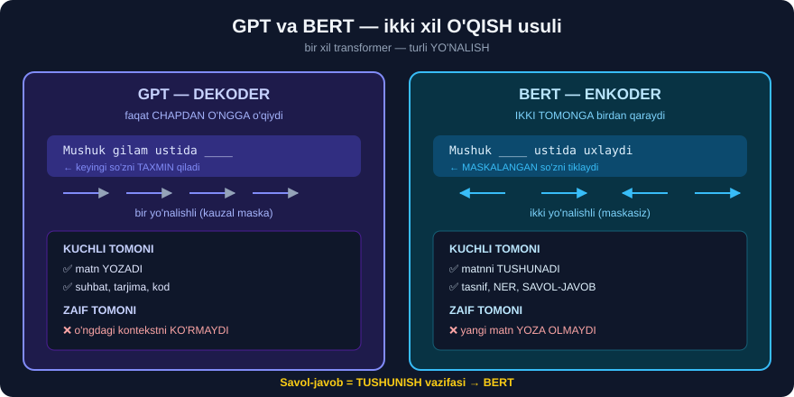
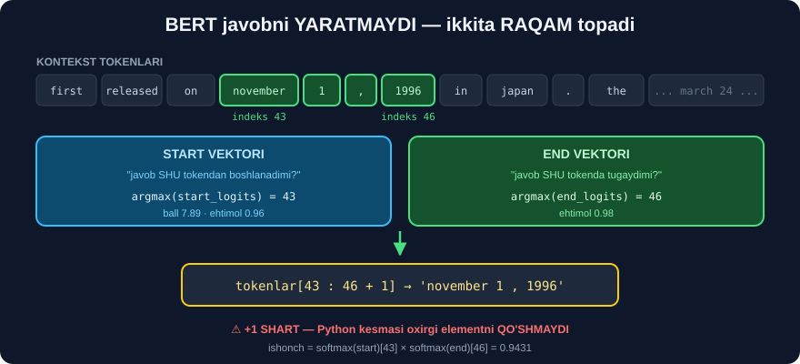
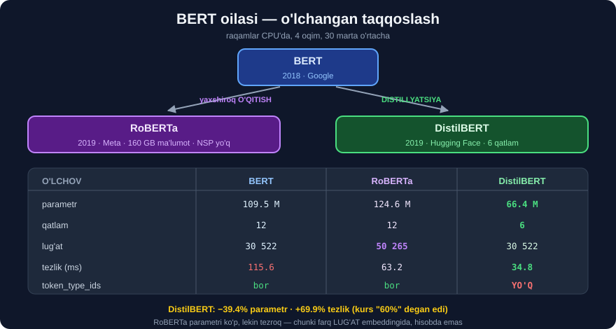

# 🔍 33-modul. BERT bilan savol-javob modellari

> **BERT** — matn **yozmaydi**, matnni **tushunadi**. Bu modulda undan **savol-javob** tizimi quramiz.
>
> ## ⭐⭐ **BU MODULDA HAMMA NARSA BEPUL.** API kaliti **umuman** kerak emas.

---

## 📚 Darslar

| # | Dars | Nima o'rganasiz |
|---|---|---|
| 1 | [GPT va BERT](01-GPT-vs-BERT.md) | Dekoder vs **enkoder**, ikki yo'nalishlilik |
| 2 | [BERT arxitekturasi](02-BERT-Architecture.md) ⭐ | MLM, NSP, uchta embedding |
| 3 | [Model va tokenizatorni yuklash](03-Loading-Model-and-Tokenizer.md) | `BertForQuestionAnswering`, `qa_outputs` |
| 4 | [BERT embeddinglari](04-BERT-Embeddings.md) ⭐ | `token_type_ids`, ⚠️ **`encode_plus` eskirgan** |
| 5 | [Javobni hisoblash](05-Calculating-the-Response.md) ⭐⭐ | `start_logits`, `end_logits`, ## **kursdan FARQ** |
| 6 | [QA-bot yaratamiz](06-Creating-a-QA-Bot.md) ⭐⭐ | Segment ID qo'lda · ## **botni SINDIRAMIZ** |
| 7 | [BERT, RoBERTa, DistilBERT](07-BERT-RoBERTa-DistilBERT.md) ⭐ | ## Kurs da'volarini **O'LCHADIK** |

---

## 📝 Amaliyot

| | |
|---|---|
| 📝 [**42 ta mashq**](MASHQLAR.md) | 🟢 Oson · 🟡 O'rta · 🔴 Qiyin |
| 🚀 [**6 ta mini-loyiha**](LOYIHALAR.md) | Korporativ FAQ-bot · baholash paneli · model stendi · uzun hujjat · ⚠️ **ishonch tahlilchisi** · 🇺🇿 o'zbekcha gibrid |

---

## 🧭 BERT nima uchun QA'ga mos?



```
GPT   →  chapdan o'ngga   →  MATN YOZADI       →  gallyutsinatsiya MUMKIN
BERT  →  ikki tomonga     →  MATNNI TUSHUNADI  →  javob matndan KESILADI
```

> ## 🔑 **BERT yolg'on TO'QIY OLMAYDI** — chunki u faqat **ikkita indeks** qaytaradi: `start` va `end`. Javobni **Python kesadi**, model **yozmaydi**.
>
> ## ⚖️ **Yuridik, tibbiy, moliyaviy** sohalarda bu — **hal qiluvchi ustunlik**.

---

## 🔬 Butun modul bitta rasmda



```
SAVOL + KONTEKST
        ↓  tokenizer(savol, kontekst)
[CLS] savol [SEP] kontekst [SEP]
        ↓  + token_type_ids (0 = savol, 1 = kontekst)
   24 ta enkoder qatlami
        ↓  qa_outputs: Linear(1024 → 2)
start_logits · end_logits
        ↓  argmax
   start = 43 ·  end = 46
        ↓
   'november 1 , 1996'
```

---

## ⚠️ Bu modulda TOPILGAN MUAMMOLAR

Kursdagi hamma narsani **ishga tushirib tekshirdik**. Uchta joyda **farq** chiqdi:

### ① `encode_plus` OLIB TASHLANGAN

```
❌ tokenizer.encode_plus(savol, hujjat)
   →  AttributeError: BertTokenizerFast has no attribute encode_plus

✅ tokenizer(savol, hujjat)
```

`transformers` 5.x da `encode`, `encode_plus`, `batch_encode_plus` — **bitta** `tokenizer(...)` chaqiruviga birlashtirildi. → [4-dars](04-BERT-Embeddings.md)

### ② Model kursning javobini QAYTARMAYDI

```
KURSDA:  "March 24th, 1997"
BIZDA :  "november 1 , 1996"      ← IKKALA modelda ham
```

| Model | Javob | Ishonch |
|---|---|---:|
| bert-large-...-squad *(334M)* | `november 1 , 1996` | 0.9431 |
| distilbert-...-squad *(65M)* | `November 1 , 1996` | 0.7879 |

> ## 💥 **BU MODEL XATOSI EMAS — SAVOL NOANIQ.** Matnda **ikkita** sana bor: DVD **formati** *(Nov 1, 1996)* va DVD **pleyeri** *(Mar 24, 1997)*. Model birinchisini tanladi, `march` esa nomzodlar ro'yxatida **5-o'rinda**.
>
> ## 🔑 **SABOQ:** ko'p *"model xatosi"* aslida **noaniq savol** bo'lib chiqadi. → [5-dars](05-Calculating-the-Response.md)

### ③ Kurs DistilBERT tezligini SUSTROQ aytgan

```
KURS:  "60% tezroq"
BIZDA: 69.9% tezroq       (115.58 ms → 34.80 ms)
```

Parametr da'vosi esa **aynan** to'g'ri: kurs `−40%` deydi, biz `−39.4%` o'lchadik. → [7-dars](07-BERT-RoBERTa-DistilBERT.md)

---

## ⭐⭐ Kursda YO'Q, biz QO'SHGAN narsalar

### 🛡️ Ishonch chegarasi — bot "bilmayman" deya olsin

Kursdagi bot **hamma narsaga** javob beradi:

```
"What is the capital of France?"  →  'what'      ← savolning O'Z so'zi!
```

Biz **sindirib ko'rdik** va **o'lchadik**:

| Savol | Javob | Ishonch |
|---|---|---:|
| When did Sunset Motors open? | `1978` | **0.9969** |
| Where is the dealership located? | `crestwood` | **0.9479** |
| What make of cars are available? | `ford , toyota , ...` | **0.9192** |
| How many technicians work there? | `45` | **0.8131** |
| How large is the dealership? | `ten acres` | **0.7855** |
| Is the dealership open on Sunday? | `closed on sundays` | **0.6044** |
| ❌ Do you sell electric cars? | **`end < start`** | 0.1842 |
| ❌ What is the capital of France? | `what` | **0.1143** |

> ## 🏆 **CHEGARA = 0.30.** To'g'ri javoblar **0.60–0.99**, xatolar **0.11–0.18**. Oraliq **keng** → chegara **ishonchli**.
>
> ## ⚠️ **O'z loyihangizda O'ZINGIZ o'lchang.** Ko'chirib olingan raqam **ishlamaydi**.

### 💥 DistilBERT'ning JIM XATOSI

```python
DistilBertModel.forward  →  token_type_ids: False     ← parametri YO'Q
AutoTokenizer(...)       →  token_type_ids: BERADI    ← lekin beradi!
model(**enc)             →  XATO YO'Q, natija QAYTADI ← jim tashlab yuboriladi
```

> ## 💥 **Kod ishlaydi, natija chiqadi — lekin segment ma'lumoti YO'QOLGAN.** Bu — eng xavfli turdagi xato. → [7-dars, 6-bo'lim](07-BERT-RoBERTa-DistilBERT.md)

### 🤯 RoBERTa'da parametr KO'PROQ, lekin TEZROQ

```
BERT      109.5M parametr   115.58 ms
RoBERTa   124.6M parametr    63.15 ms      ← 15M ko'p, LEKIN 2× tez
```

> **Sabab:** qo'shimcha 15M **butunlay lug'at embeddingida** *(50,265 vs 30,522 × 768 = 15.2M)*. Embedding — **qidiruv jadvali**, hisob **emas**.
>
> ## 🔑 **"Parametrlar soni" ≠ "tezlik".** Sekinlashtiradi — **qatlamlar** va **ketma-ketlik uzunligi**.

---

## ⚖️ Uchta model — o'lchangan



| | 🔵 **BERT** | 🟣 **RoBERTa** | 🟢 **DistilBERT** |
|---|---|---|---|
| Parametr | 109.5M | 124.6M | ## **66.4M** |
| Qatlam | 12 | 12 | ## **6** |
| Lug'at | 30,522 | ## **50,265** | 30,522 |
| Tezlik | 115.6 ms | 63.2 ms | ## **34.8 ms** |
| Tokenizator | WordPiece | **BPE** | WordPiece |
| NSP | ✅ | ❌ | ❌ |
| `token_type_ids` | ✅ | ✅ | ## ❌ |
| Maxsus token | `[CLS]` `[SEP]` | `<s>` `</s>` | `[CLS]` `[SEP]` |

---

## 🇺🇿 O'zbek tili uchun

BERT-SQuAD **faqat inglizcha**. Ikkita yo'l bor va **ikkalasi ham** modulda ko'rsatilgan:

```
① TO'G'RIDAN-TO'G'RI  →  deepset/xlm-roberta-base-squad2
                         ⚠️ o'zbekchada QISMAN ishlaydi
                            (sana, atoqli ot — ha; murakkab savol — yo'q)

② GIBRID  ⭐ TAVSIYA   →  kontekstni BIR MARTA inglizchaga tarjima qiling
                         →  bert-large-squad ishlatilsin (ishonch 0.90+)
                         →  javobni o'zbekchaga qaytaring
```

> ## 💡 **Nega gibrid afzal?** Kontekst odatda **kichik** va **o'zgarmas** — uni bir marta tarjima qilish **arzon**. Savollar esa har xil, lekin ular **qisqa**.

---

## 🎓 Modulni tugatgach

```
✅ enkoder va dekoder farqini bilasiz
✅ start/end logitlar qanday ishlashini tushunasiz
✅ segment ID'larni QO'LDA yasay olasiz
✅ ishonch chegarasi bilan ISHONCHLI bot qurasiz
✅ BERT / RoBERTa / DistilBERT orasidan TANLAY olasiz
✅ 512 token cheklovini sliding window bilan aylanib o'tasiz
✅ "model xatosi" va "noaniq savol" ni FARQLAY olasiz
```

---

## 🔗 Bog'liq modullar

| Modul | Aloqasi |
|---|---|
| [30-modul](../30-Transformer-Architecture/README.md) | E'tibor mexanizmi, enkoder ichki tuzilishi |
| [31-modul](../31-GPT-Models/README.md) | ⚖️ **Generativ** javob vs **kesma** javob |
| [32-modul](../32-HuggingFace-Transformers/README.md) | `pipeline`, `Auto` sinflari, maxsus tokenlar |
| [34-modul](../34-Text-Classification-XLNet/README.md) | ➡️ **Keyingi:** XLNet bilan **fine-tuning** |

---

⬅️ [32-modul. Hugging Face Transformers](../32-HuggingFace-Transformers/README.md) · 🏠 [Bosh sahifa](../README.md) · ➡️ [34-modul. XLNet](../34-Text-Classification-XLNet/README.md)
