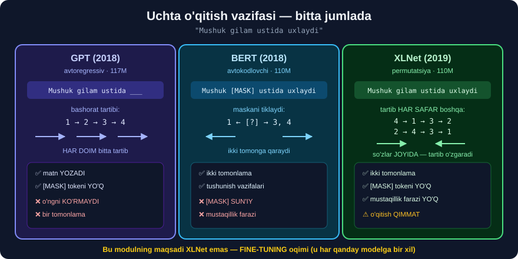

# 1-dars. GPT, BERT va XLNet

## 🎬 Boshlashdan oldin

> **"Shu paytgacha kursda siz NLP asboblar to'plamingizga IKKI XIL til modeli bilan ishlashni qo'shdingiz. U yerda ko'plab turli til modellari bor, shuning uchun kursning bu bo'limida sizni XLNet deb ataladigan yana bir model bilan tanishtirmoqchiman."**

---

## 1. Uchinchi yondashuv



> **"XLNet — 2019-yilda Google AI tomonidan universitetlar va boshqa muassasalar bilan hamkorlikda ishlab chiqilgan katta til modeli."**

```
2018  GPT      →  chapdan o'ngga           (avtoregressiv)
2018  BERT     →  ikki tomonga, MASKA bilan (avtokodlovchi)
2019  XLNet    →  ⭐ HAR IKKALASINI birlashtiradi (permutatsiya)
```

| | 🟣 **GPT** | 🔵 **BERT** | 🟢 **XLNet** |
|---|---|---|---|
| Yil | 2018 | 2018 | 2019 |
| Arxitektura | dekoder | enkoder | ## **dekoder** |
| Yo'nalish | chapdan o'ngga | ikki tomonga | ## **permutatsiya** |
| Vazifa | keyingi so'z | `[MASK]` tiklash | ## **tartiblangan tiklash** |
| `[MASK]` ishlatadi | ❌ | ✅ | ## ❌ **YO'Q** |

---

## 2. Ikki o'lcham

> **"U ikki o'lchamda keladi: XLNet-base — 110 million parametr, va XLNet-large — 340 million parametr."**

```
XLNet-base   →  110M parametr  ·  12 qatlam
XLNet-large  →  340M parametr  ·  24 qatlam
```

> ## 💡 **Bu raqamlar TANISH.** `bert-base` = 110M · 12 qatlam, `bert-large` = 340M · 24 qatlam *(33-modul)*. **Ataylab bir xil** — mualliflar BERT bilan **halol taqqoslash** uchun shunday qilgan.
>
> ## 🔑 **Ilmiy usul:** ikki modelni solishtirish uchun **hamma narsani teng** qiling, faqat **bitta** narsani o'zgartiring. Bu yerda o'zgargani — **o'qitish vazifasi**.

---

## 3. ⚠️ "Dekoder" so'ziga ehtiyot bo'ling

> **"Bert'dan farqli o'laroq — u bir-birining ustiga qo'yilgan ENKODER qatlamlaridan iborat — XLNet faqat DEKODERLI arxitekturaga ega."**

```
BERT   →  ENKODER  ×12/24
XLNet  →  DEKODER  ×12/24
```

> ## ⚠️ **AMMO XLNet MATN YOZISH UCHUN EMAS.**
>
> "Dekoder" bu yerda **avtoregressiv o'qitish vazifasi**ni anglatadi — GPT kabi "keyingi tokenni bashorat qilish". Lekin XLNet **tartibni aralashtiradi**, shuning uchun natijada **ikki tomonlama** kontekst oladi.
>
> ## 🔑 **Amalda XLNet BERT kabi ishlatiladi** — **tasnif**, **NER**, **savol-javob**. Shu moduldagi vazifamiz ham — **tasnif**.

---

## 4. ⭐⭐ Permutatsiya — XLNet'ning ASOSIY g'oyasi

> **"XLNet oldindan o'qitishda BOSHQACHA yondashadi. XLNet kontekstdagi BARCHA so'zlarni ko'rib chiqa oladi — nafaqat maqsadli so'zning chapi va o'ngidagilarni. XLNet kirish ma'lumotining TURLI PERMUTATSIYALARINI namuna qilib oladi."**

Jumlani olamiz:

```
"Mushuk  gilam  ustida  uxlaydi"
   1       2      3        4
```

**GPT** har doim **bitta** tartibda o'qiydi:
```
1 → 2 → 3 → 4        "uxlaydi" ni bashorat qilishda 1,2,3 ko'rinadi
```

**XLNet** **turli tartiblarni** ko'radi:
```
tartib A:  1 → 2 → 3 → 4      "uxlaydi" bashorati: 1,2,3 ko'radi
tartib B:  4 → 1 → 3 → 2      "gilam"  bashorati: 4,1,3 ko'radi  ← O'NGDAGI 4 ni ham!
tartib C:  3 → 4 → 1 → 2      "gilam"  bashorati: 3,4,1 ko'radi
tartib D:  2 → 4 → 3 → 1      "Mushuk" bashorati: 2,4,3 ko'radi
```

> ## 💥 **B TARTIBIGA E'TIBOR BERING.** `"gilam"` ni bashorat qilishda model `"uxlaydi"` ni — ya'ni **o'ngdagi** so'zni **ko'rmoqda**. Bu — **avtoregressiv modelda ikki tomonlama kontekst**.
>
> ## 🔑 **VA BU BEPUL KELMAYDI** — bu **ko'p** hisoblash talab qiladi. Shuning uchun XLNet **sekinroq** o'qitiladi.

> ## ⚠️⚠️ **ENG KO'P UCHRAYDIGAN NOTO'G'RI TUSHUNCHA:**
> ```
> ❌ "XLNet SO'ZLARNI aralashtiradi"
> ✅ "XLNet BASHORAT QILISH TARTIBINI aralashtiradi"
> ```
> **So'zlar joyida qoladi** — pozitsion embeddinglar **o'zgarmaydi**. O'zgaradigan narsa — model **qaysi so'zlarni ko'rishga ruxsat olgani** *(e'tibor maskasi)*.

---

## 5. ⭐ Nima uchun bu BERT'dan yaxshiroq?

> **"Permutatsiyaga asoslangan o'qitishning asosiy afzalligi shundaki, u ikki tomonlama kontekstni SAMARALI ushlab qola oladi."**

### BERT'ning ikkita muammosi

```
① [MASK] TOKENI SUN'IY

   O'QITISHDA:   "Mushuk [MASK] ustida uxlaydi"      ← [MASK] BOR
   ISHLATISHDA:  "Mushuk gilam ustida uxlaydi"       ← [MASK] YO'Q

   💥 O'qitish va ishlatish SHAROITI TURLICHA
```

```
② MASKALANGAN SO'ZLAR BIR-BIRINI KO'RMAYDI

   "New [MASK] [MASK] shahri"          ←  York va Yorkning
                                          bog'liqligini o'rgana OLMAYDI
   BERT ikkalasini MUSTAQIL bashorat qiladi
```

> ## ✅ **XLNet IKKALASINI HAM HAL QILADI:**
> ```
> ① [MASK] tokeni UMUMAN ISHLATILMAYDI  →  sun'iylik yo'q
> ② Permutatsiyada bashorat KETMA-KET   →  "York" ni bashorat qilishda
>                                           "New" ALLAQACHON ma'lum
> ```

---

## 6. Mustaqillik faraz haqidagi izoh

> **"XLNet so'zning ehtimolligini hisoblashda MUSTAQILLIK FARAZINI qiladi. Bu — model ma'lum bir so'zni bashorat qilish uchun so'zlar TARTIBIGA tayanmasligini, balki BUTUN KONTEKSTNI hisobga olishini anglatadi."**

> ## ⚠️ **BU JUMLA KURSDA CHALKASH AYTILGAN — ANIQLASHTIRAMIZ.**
>
> Aslida vaziyat **teskari**:
> ```
> BERT   →  mustaqillik farazini QILADI
>           (maskalangan so'zlar bir-biridan MUSTAQIL bashorat qilinadi)
>
> XLNet  →  bu farazni OLIB TASHLAYDI  ⭐
>           (permutatsiya tartibida bashorat KETMA-KET boradi)
> ```
>
> ## 🔑 **XLNet maqolasining asosiy da'vosi AYNAN SHU:** *"BERT mustaqillik farazi tufayli bog'liq tokenlarni modellay olmaydi; XLNet buni bartaraf qiladi."*
>
> ## 💡 **Kurs "tartibga tayanmaydi" deganda "BITTA qat'iy tartibga tayanmaydi"ni nazarda tutgan** — bu to'g'ri. Lekin "mustaqillik farazini qiladi" — **noto'g'ri**.

---

## 7. Natijalar

> **"XLNet savol-javob, matn tasnifi va til modellashtirishni o'z ichiga olgan turli benchmark NLP vazifalarida ILG'OR natijalarga erishdi."**

```
2019-yildagi holat:
   GLUE, SQuAD, RACE benchmarklarida  →  BERT'dan YAXSHIROQ
```

> ## ⚠️⚠️ **LEKIN BUGUNGI HAQIQAT BOSHQACHA — HALOL AYTAMIZ.**
>
> ```
> 2019  →  XLNet BERT'ni yengdi              ✅
> 2020+ →  RoBERTa, DeBERTa, ELECTRA chiqdi  →  XLNet'dan YAXSHIROQ
> 2023+ →  amaliyotda XLNet KAM ishlatiladi
> ```
>
> **Nima uchun XLNet keng tarqalmadi?**
> ```
> ① Permutatsiya o'qitishi  →  QIMMAT va MURAKKAB
> ② Kod va ekotizim         →  BERT'niki ancha BOY
> ③ RoBERTa ko'rsatdiki     →  BERT'ni shunchaki YAXSHIROQ O'QITSANG YETADI
> ```
>
> ## 🔑 **SHUNDA NIMA UCHUN O'RGANAMIZ?** Chunki bu modulda asosiy mavzu **XLNet emas** — ## **FINE-TUNING**. Siz o'rganadigan `Trainer` oqimi **har qanday** modelga *(BERT, RoBERTa, DeBERTa, hattoki LLaMA)* **bir xil** ishlaydi.

---

## 8. 🎯 Modulning haqiqiy maqsadi

> **"Keyingi bir necha darsda XLNet modelini O'Z vazifalarimiz uchun FINE-TUNE qilishni o'rganamiz. Bu — kuchli mahorat va sizga Hugging Face yordamida katta til modelini O'ZINGIZ fine-tune qilish bilimini beradi."**

```
   OLDINGI MODULLAR              BU MODUL
   ────────────────              ────────
   tayyor modelni ISHLATISH  →   O'Z modelingizni YARATISH
   pipeline("...")           →   Trainer(...).train()
   boshqalarning ma'lumoti   →   ⭐ SIZNING ma'lumotingiz
```

> ## 🏆 **BU — KURSDAGI ENG QIMMATLI MAHORAT.** Fine-tuning'ni bilsangiz, siz **istalgan** modelni **istalgan** vazifaga moslashtira olasiz.

---

## 9. ⚡ Mashqlar

### 🟢 Oson

**M1.** XLNet qachon va kim tomonidan yaratilgan?

**M2.** XLNet-base va XLNet-large — nechta parametr?

**M3.** XLNet `[MASK]` tokenidan foydalanadimi?

<details>
<summary>✅ Javoblar</summary>

**M1.** ## **2019**, **Google AI** *(universitetlar bilan hamkorlikda)*.

**M2.** ## **110M** *(12 qatlam)* va **340M** *(24 qatlam)* — `bert-base`/`bert-large` bilan **aynan bir xil**.

**M3.** ## **Yo'q.** Bu — uning BERT'dan **asosiy farqi**.

</details>

### 🟡 O'rta

**M4.** ⭐ Uchala modelning parametr sonini o'lchang.

<details>
<summary>✅ Yechim</summary>

```python
import warnings; warnings.filterwarnings("ignore")
from transformers import AutoModel

for n in ["bert-base-uncased", "roberta-base", "xlnet-base-cased"]:
    m = AutoModel.from_pretrained(n)
    print(f"{n:22s} {sum(p.numel() for p in m.parameters()):>12,}")
```

⚠️ **`xlnet-base-cased` uchun `sentencepiece` paketi kerak:**
```bash
pip install sentencepiece
```

</details>

**M5.** ⭐ `"Mushuk gilam ustida uxlaydi"` uchun nechta permutatsiya bor?

<details>
<summary>✅ Yechim</summary>

```python
from math import factorial
for n in [4, 8, 16, 128]:
    print(f"{n:4d} token → {factorial(n):,}" if n <= 16 else f"{n:4d} token → {factorial(n):.3e}")
```

```
   4 token → 24
   8 token → 40,320
  16 token → 20,922,789,888,000
 128 token → 3.856e+215
```

## 💥 **HAMMASINI ko'rib bo'lmaydi.** XLNet har qadamda **tasodifiy bir nechtasini** namuna qilib oladi. Bu — permutatsiya o'qitishining **qimmatligi** sababi.

</details>

### 🔴 Qiyin

**M6.** ⭐⭐ Permutatsiya maskasini **o'zingiz** yozing.

<details>
<summary>✅ Yechim</summary>

```python
import numpy as np

def permutatsiya_maskasi(n, tartib):
    """tartib[i] = i-tokenning bashorat NAVBATI (0 = birinchi)"""
    M = np.zeros((n, n), dtype=int)
    for i in range(n):
        for j in range(n):
            M[i, j] = 1 if tartib[j] < tartib[i] else 0   # oldin kelganini KO'RADI
    return M

sozlar = ["Mushuk", "gilam", "ustida", "uxlaydi"]
for nom, t in [("chapdan-o'ngga", [0, 1, 2, 3]), ("permutatsiya", [3, 0, 2, 1])]:
    M = permutatsiya_maskasi(4, t)
    print(f"\n{nom}  (tartib={t})")
    for i, s in enumerate(sozlar):
        koradi = [sozlar[j] for j in range(4) if M[i, j]]
        print(f"  {s:9s} ← {koradi if koradi else '(hech nima)'}")
```

```
chapdan-o'ngga  (tartib=[0, 1, 2, 3])
  Mushuk    ← (hech nima)
  gilam     ← ['Mushuk']
  ustida    ← ['Mushuk', 'gilam']
  uxlaydi   ← ['Mushuk', 'gilam', 'ustida']

permutatsiya  (tartib=[3, 0, 2, 1])
  Mushuk    ← ['gilam', 'ustida', 'uxlaydi']
  gilam     ← (hech nima)
  ustida    ← ['gilam', 'uxlaydi']
  uxlaydi   ← ['gilam']
```

## 💥 **IKKINCHI JADVALDA `Mushuk` O'NGDAGI hamma so'zni KO'RMOQDA.** Aynan shu — permutatsiya XLNet'ga bergan **ikki tomonlamalik**.

## 🔑 **VA E'TIBOR BERING:** so'zlar **joyida** — faqat **kim kimni ko'rishi** o'zgardi. Bu — **e'tibor maskasi** *(30-modul, 6-dars)*.

</details>

---

## 🧠 O'zini tekshirish

<details>
<summary>❓ XLNet so'zlarni aralashtiradimi?</summary>

**Yo'q.** U **bashorat qilish tartibini** aralashtiradi. So'zlar va ularning pozitsion embeddinglari **joyida qoladi**; o'zgaradigan narsa — **e'tibor maskasi**.
</details>

<details>
<summary>❓ BERT'ning "mustaqillik farazi" nima?</summary>

BERT bir nechta `[MASK]` ni **bir-biridan mustaqil** bashorat qiladi. `"New [MASK] [MASK]"` da `York` va `City` orasidagi bog'liqlik **o'rganilmaydi**. XLNet permutatsiya tartibida bashorat qilgani uchun bu muammo **yo'q**.
</details>

<details>
<summary>❓ Bugun XLNet ishlatiladimi?</summary>

**Kam.** 2019-da BERT'ni yenggan, lekin RoBERTa/DeBERTa/ELECTRA undan o'zib ketgan. **Ammo bu modulning maqsadi — XLNet emas, FINE-TUNING oqimi**, u esa **har qanday** modelga taalluqli.
</details>

---

## 📌 Xulosa

```
GPT     "keyingi so'z nima?"          →  chapdan o'ngga
BERT    "[MASK] nima edi?"            →  ikki tomonga, LEKIN sun'iy token
XLNet   "SHU TARTIBDA keyingisi nima?" →  ikki tomonga, tokensiz  ⭐
                    ↑
        tartib HAR SAFAR o'zgaradi
```

| | GPT | BERT | XLNet |
|---|---|---|---|
| Parametr *(base)* | 117M | 110M | **110M** |
| Qatlam | 12 | 12 | 12 |
| `[MASK]` | ❌ | ✅ | ## ❌ |
| Ikki tomonlama | ❌ | ✅ | ## ✅ |
| Mustaqillik farazi | — | ## ⚠️ **bor** | ## ✅ **yo'q** |
| Bugun mashhurmi | ✅✅ | ✅✅ | ## ⚠️ kam |

---

## 🔖 Atamalar

| Atama | Inglizcha | Izoh |
|---|---|---|
| Permutatsiya | Permutation | Bashorat **tartibining** o'rin almashuvi |
| Avtoregressiv | Autoregressive | Keyingi tokenni **ketma-ket** bashorat qilish |
| Avtokodlovchi | Autoencoding | Buzilgan kirishni **tiklash** *(BERT)* |
| Mustaqillik farazi | Independence assumption | Maskalangan tokenlar **bir-biriga bog'liq emas** deb faraz qilish |
| Uzoq masofali bog'liqlik | Long-range dependency | Uzoqdagi so'zlar orasidagi aloqa |
| Fine-tuning | Fine-tuning | Tayyor modelni **o'z ma'lumotingizga** moslash |

---

⬅️ [33-modul. BERT savol-javob](../33-BERT-Question-Answering/README.md) · 🏠 [Modul boshiga](README.md) · ➡️ [2-dars. Ma'lumotni tayyorlash](02-Preprocessing-Our-Data.md)
