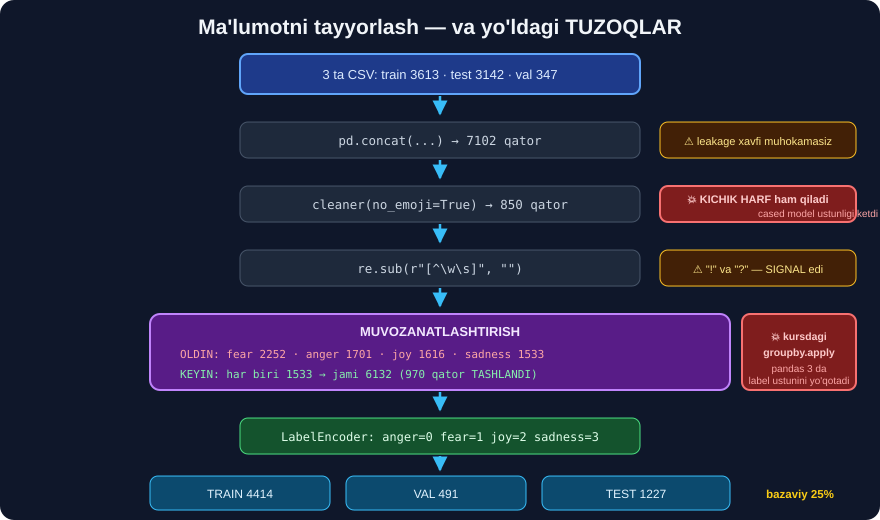

# 2-dars. Ma'lumotni tayyorlash ⭐⭐

## 🎬 Boshlashdan oldin

> ## **"Keyingi bir necha darsda O'Z ma'lumotlar to'plamimiz asosida modelni qanday FINE-TUNE qilishni ko'ramiz. Maqsadimiz — matnni kirish sifatida oladigan, uning HISSIYOTINI aniqlaydigan va bu hissiyot YORLIG'INI qaytaradigan model yaratish."**

---

## 0. ⚙️ Tayyorgarlik

```bash
pip install transformers torch pandas numpy scikit-learn
pip install datasets evaluate clean-text sentencepiece accelerate
```

> ## ⚠️ **BEShTA QO'SHIMCHA PAKET — kursda aytilmagan, lekin SHART:**
> ```
> datasets       →  DatasetDict formati
> evaluate       →  aniqlik metrikasi
> clean-text     →  emoji tozalash   (import nomi: cleantext)
> sentencepiece  →  ⚠️ XLNetTokenizer BUSIZ ishlamaydi
> accelerate     →  ⚠️ Trainer BUSIZ ishlamaydi
> ```

> **"Bizga kerak bo'lgan paketlar va funksiyalarni import qilamiz."**

```python
import warnings; warnings.filterwarnings("ignore")
import re, numpy as np, pandas as pd
import torch, datasets, evaluate, random
from cleantext import clean as cleaner
from sklearn.model_selection import train_test_split
from sklearn.preprocessing import LabelEncoder
from transformers import (XLNetTokenizer, XLNetForSequenceClassification,
                          TrainingArguments, Trainer, pipeline)
```

---

## 1. Ma'lumotni yuklaymiz



> **"Avval `data_train`, `data_test` va `data_val` ni yuklaymiz. Keyin `data_train.head()` ni ishga tushiramiz."**

```python
data_train = pd.read_csv("emotions_data/emotion-labels-train.csv")
data_test  = pd.read_csv("emotions_data/emotion-labels-test.csv")
data_val   = pd.read_csv("emotions_data/emotion-labels-val.csv")

for n, d in [("train", data_train), ("test", data_test), ("val", data_val)]:
    print(f"{n:6s} {d.shape}")
print(data_train.head(3).to_string())
```

```
train  (3613, 2)
test   (3142, 2)
val    (347, 2)

                                                        text label
0  Just got back from seeing @GaryDelaney in Burslem. AMAZ...   joy
1  Oh dear an evening of absolute hilarity ... long time! 😂   joy
2  Been waiting all week for this game ❤️❤️❤️ #cheer #friday    joy
```

> ## 💡 **Bu — Twitter ma'lumoti.** `@foydalanuvchi`, `#xeshteg`, emoji — hammasi **bor**. Aynan shunday "iflos" matn bilan **haqiqiy loyihada** ishlaysiz.

---

## 2. ⚠️ Uchtasini BIRLASHTIRAMIZ — va bu QAROR

> **"Train, test va validatsiya to'plamlarini hozircha BIRLASHTIRAMIZ, shunda hammasini birdaniga tozalay olamiz."**

```python
data = pd.concat([data_train, data_test, data_val], ignore_index=True)
print(data.shape)
```

```
(7102, 2)
```

> ## ⚠️⚠️ **BU — MUNOZARALI QAROR, KURSDA MUHOKAMA QILINMAGAN.**
>
> ```
> ✅ FOYDASI  →  tozalashni BIR MARTA qilasiz, kod soddaroq
>
> ❌ ZARARI   →  ma'lumot tuzuvchilari train/test bo'linishini
>                MAXSUS qilgan bo'lishi mumkin. Birlashtirib
>                qayta bo'lsangiz — bu MEHNAT yo'qoladi.
> ```
>
> ## 🔑 **BU YERDA XAVFSIZ**, chunki tozalash **har qatorga alohida** qo'llanadi — ya'ni **ma'lumot sizib chiqmaydi** *(data leakage yo'q)*.
>
> ## 💥 **AMMO EHTIYOT BO'LING:** agar tozalash **butun to'plamdan** biror narsa hisoblasa *(masalan `TfidfVectorizer.fit`, o'rtacha qiymat, lug'at)* — bu **jiddiy xato** bo'ladi. Bunday qadamlarni **faqat train'da** o'rgating.

---

## 3. Emojilarni olib tashlaymiz

> **"Matnda emojilar borligini ko'rishimiz mumkin. Ularni olib tashlamoqchimiz. Yangi `text_clean` ustunini yaratamiz va har bir matn ustidan `cleaner` funksiyasini ishlatamiz, `no_emoji=True` deb ko'rsatamiz."**

```python
_EMO = re.compile("[\U0001F300-\U0001FAFF☀-➿⬀-⯿️]")
emoji_bor = data.text.map(lambda s: bool(_EMO.search(str(s))))
print("emojili qatorlar:", int(emoji_bor.sum()), f"({emoji_bor.mean():.1%})")

data["text_clean"] = data["text"].apply(lambda t: cleaner(t, no_emoji=True))
```

```
emojili qatorlar: 850 (12.0%)
```

> ## ⚠️ **PANDAS 3.x TUZOG'I — biz duch keldik:**
> ```python
> data.text.str.contains(r"[\U0001F300-\U0001FAFF]", regex=True)
> #  →  pyarrow.lib.ArrowInvalid: invalid escape sequence: \U
> ```
> pandas 3 satrlar uchun **Arrow** backendidan foydalanadi, uning regex dvigateli `\U` ni **tushunmaydi**. Yechim — `.map()` bilan **Python darajasida** qidirish *(yuqoridagi kod)*.

---

## 4. 💥💥 `cleaner` NIMANI YASHIRIN QILADI

Kurs `cleaner(t, no_emoji=True)` deydi va **davom etadi**. Biz esa **oldin/keyin** solishtirdik:

```python
print("OLDIN :", repr(data.text.iloc[0]))
print("KEYIN :", repr(data.text_clean.iloc[0]))
```

```
OLDIN : 'Just got back from seeing @GaryDelaney in Burslem. AMAZING!! Face still hurts...'
KEYIN : 'just got back from seeing garydelaney in burslem amazing face still hurts...'
```

> ## 💥💥 **`cleaner` FAQAT EMOJINI OLIB TASHLAMADI:**
> ```
> ① HAMMA HARFNI KICHIK QILDI      Just → just   ·   AMAZING → amazing
> ② @ BELGISINI OLIB TASHLADI      @GaryDelaney → garydelaney
> ③ tinish belgilarining bir qismi
> ```

> ## ⚠️⚠️ **VA BU JIDDIY MUAMMO — CHUNKI BIZ `xlnet-base-CASED` ISHLATAMIZ.**
>
> ```
> cased    →  model KATTA/kichik harf farqini BILADI
> uncased  →  bilmaydi
>
> 💥 cleaner hammasini kichik qildi  →  CASED modelning ustunligi YO'QOLDI
> ```
>
> ## 🔑 **`AMAZING!!` vs `amazing` — bu HISSIYOT vazifasida MUHIM signal.** Katta harf **baqirishni** anglatadi. Biz uni **o'chirdik**.

> ## ✅ **TUZATISH — `lower=False` bering:**
> ```python
> data["text_clean"] = data["text"].apply(
>     lambda t: cleaner(t, no_emoji=True, lower=False))
> ```
> ## 💡 **6-darsda ikkala variantni O'LCHAB solishtiramiz.** Taxmin qilmaymiz.

---

## 5. Tinish belgilarini olib tashlaymiz

> **"Bu matndan har qanday tinish belgisini ham olib tashlamoqchimiz. `re.sub` dan foydalanamiz."**

```python
data["text_clean"] = data["text_clean"].apply(lambda t: re.sub(r"[^\w\s]", "", t))
print(data[["text_clean", "label"]].head(3).to_string())
```

```
                                                  text_clean label
0  just got back from seeing garydelaney in burslem amazi...   joy
1  oh dear an evening of absolute hilarity i dont think i...   joy
2  been waiting all week for this game cheer friday           joy
```

> **"Ba'zi tinish belgilari hali ham qolgan, shuning uchun agar xohlasangiz, `re.sub` funksiyasini yangilab ko'rishingiz mumkin."**

> ## ⚠️ **BU YERDA KURS BILAN ROZI EMASMIZ — VA SABABINI AYTAMIZ.**
>
> ```
> "amazing!!"  →  "amazing"      ← ikkita undov YO'QOLDI
> "dont"       ←  "don't"        ← apostrof yo'qoldi (buni model biladi)
> ```
>
> ## 💥 **HISSIYOT vazifasida `!` va `?` — MA'LUMOT.** Ularni o'chirish — **signalni o'chirish**.
>
> ## 🔑 **ZAMONAVIY YONDASHUV — KAM tozalang:**
> ```
> 2015 (TF-IDF davri)  →  KO'P tozalash kerak edi (lug'at kichik)
> 2025 (LLM davri)     →  transformer OG'IR matn bilan o'qitilgan;
>                          u tinish belgisi va katta harfni O'ZI TUSHUNADI
> ```
> ## 💡 **6-darsda buni ham O'LCHAYMIZ.**

---

## 6. ⭐ Muvozanatsizlikni topamiz

> **"Endi yorliqlarga qaraymiz. Har bir yorliq bilan bog'liq nechta matn borligini tekshirish uchun ularni chop etamiz."**

```python
print(data.label.value_counts().to_string())
data.label.value_counts().plot(kind="bar", title="MUVOZANATSIZ")
```

```
fear       2252
anger      1701
joy        1616
sadness    1533
```

> **"To'rtta hissiyot tasnifi bor: fear, anger, joy va sadness. Bu MUVOZANATSIZ to'plam ekanini ham ko'ramiz."**

```
fear     ████████████████████████  2252
anger    ██████████████████        1701
joy      █████████████████         1616
sadness  ████████████████          1533
```

> ## 🔑 **NIMA UCHUN MUVOZANATSIZLIK YOMON?**
> ```
> Agar model HAR DOIM "fear" desa       →  aniqlik = 2252/7102 = 31.7%
> Tasodifiy tanlash (4 sinf)             →  aniqlik = 25.0%
>
> 💥 Ya'ni "hech nima o'rganmagan" model ham 31.7% oladi.
>    Aniqlik 31.7% dan past bo'lsa — model TESKARI o'rgangan.
> ```
>
> ## ⭐ **BU RAQAM — SIZNING "BAZAVIY CHIZIG'INGIZ" (baseline).** Uni **har doim** hisoblang.

---

## 7. Muvozanatlashtirish

> **"Ma'lumotimizni olib, uni yorliq bo'yicha GURUHLAYMIZ. Keyin eng KAM qatorli guruhni topamiz va shu MINIMAL qiymat bilan qolgan barcha yorliqlardan namuna olamiz."**

```python
kichik = data.label.value_counts().min()
print("eng kichik guruh:", kichik)

data_bal = (data.groupby("label", group_keys=False)
                .sample(n=kichik, random_state=42)
                .reset_index(drop=True))

print(data_bal.label.value_counts().to_string())
print("jami:", len(data_bal))
```

```
eng kichik guruh: 1533

anger      1533
fear       1533
joy        1533
sadness    1533
jami: 6132
```

> ## ⚠️⚠️ **KURSDAGI KOD PANDAS 3.x DA JIM SINADI — biz tekshirdik:**
>
> ```python
> # KURSDAGI KOD
> data_bal = (data.groupby("label")
>                 .apply(lambda x: x.sample(kichik))
>                 .reset_index(drop=True))
>
> print(list(data_bal.columns))
> #  →  ['text', 'text_clean']        ← ❗ 'label' USTUNI YO'Q!
> ```
>
> ## 💥 **XATO CHIQMAYDI.** pandas 3 da `groupby.apply` **guruhlash ustunini natijaga qo'shmaydi**, `reset_index(drop=True)` esa uni **indeksdan ham o'chiradi**. Natijada `data_bal.label` — `AttributeError`.
>
> ## ✅ **TO'G'RI USUL** — `groupby(...).sample(...)`: **qisqaroq**, **tezroq** va **buzilmaydi**.

> ## 💡 **VA E'TIBOR BERING — MUVOZANATLASHTIRISH ARZON EMAS:**
> ```
> 7102  →  6132 qator      (970 qator, 13.7% TASHLANDI)
> ```
> **Muqobil:** ma'lumotni tashlash o'rniga **sinf og'irliklarini** ishlatish:
> ```python
> from sklearn.utils.class_weight import compute_class_weight
> # →  Trainer'da maxsus loss funksiyasi kerak bo'ladi
> ```
> ## ⚖️ **Kichik to'plamda muvozanatlashtirish sodda va yetarli.** Katta to'plamda — **og'irlik** afzal.

---

## 8. Yorliqlarni RAQAMGA aylantiramiz

> **"Yorliqlarimizni butun songa aylantirmoqchimiz, shuning uchun `LabelEncoder().fit_transform` dan foydalanamiz. Yorliqlar sonini ham 4 deb belgilaymiz."**

```python
le = LabelEncoder()
data_bal["label_int"] = le.fit_transform(data_bal["label"])
num_labels = 4

for i, c in enumerate(le.classes_):
    print(f"{i} → {c}")
```

```
0 → anger
1 → fear
2 → joy
3 → sadness
```

> ## ⭐⭐ **BU XARITANI SAQLANG — 4-darsda `id2label` uchun KERAK.**
>
> ## 🔑 **`LabelEncoder` ALIFBO tartibida raqamlaydi** — shuning uchun `anger=0`. Bu **tasodif emas**, **kafolat**:
> ```python
> print(sorted(le.classes_) == list(le.classes_))     # True
> ```
> ## ⚠️ **Agar xaritani noto'g'ri yozsangiz — model to'g'ri o'rganadi, lekin YORLIQLAR ARALASHIB ketadi.** Aniqlik yuqori, javoblar noto'g'ri — **jim xato**.

---

## 9. Uch qismga bo'lamiz

> **"Matnni oldindan qayta ishlashning oxirgi qadami — o'quv va test ma'lumotlarini yaratish. Validatsiya to'plami ham kerak, shuning uchun o'quv to'plamini YANA bo'lamiz va 10% ni ajratamiz."**

```python
train, test = train_test_split(data_bal, test_size=0.2, random_state=42)
train, val  = train_test_split(train,    test_size=0.1, random_state=42)

print(f"train {len(train)}   test {len(test)}   val {len(val)}")
```

```
train 4414   test 1227   val 491
```

```
6132 ta jami
   ├── 80% → 4905  ─┬─ 90% → 4414   TRAIN   (model O'RGANADI)
   │                └─ 10% →  491   VAL     (kuzatib boramiz)
   └── 20% → 1227                   TEST    (yakuniy BAHO)
```

> ## 🔑 **UCHTA TO'PLAMNING VAZIFASI TURLICHA:**
> ```
> TRAIN  →  model og'irliklarni SHU YERDA yangilaydi
> VAL    →  giperparametrni SHU YERDA tanlaysiz  (ko'p marta qaraysiz)
> TEST   →  BIR MARTA, oxirida.  ⚠️ Unga qarab sozlasangiz — u BUZILADI
> ```
>
> ## ⚠️ **`random_state=42` — TAKRORLANUVCHANLIK uchun SHART.** Usiz har ishga tushirishda **boshqa** bo'linish va **boshqa** aniqlik olasiz — natijalarni **solishtira olmaysiz**.

---

## 10. `DatasetDict` formatiga o'tkazamiz

> **"Ma'lumotimizni `DatasetDict` formatiga keltirmoqchimiz. Ishlatmaydigan ustunlarni ham olib tashlaymiz."**

```python
train_df = pd.DataFrame({"label": train["label_int"], "text": train["text_clean"]})
test_df  = pd.DataFrame({"label": test["label_int"],  "text": test["text_clean"]})

dataset_dict = datasets.DatasetDict({
    "train": datasets.Dataset.from_dict(train_df),
    "test":  datasets.Dataset.from_dict(test_df),
})
print(dataset_dict)
```

```
DatasetDict({
    train: Dataset({ features: ['label', 'text'], num_rows: 4414 })
    test:  Dataset({ features: ['label', 'text'], num_rows: 1227 })
})
```

> ## 🔑 **NIMA UCHUN `DatasetDict` KERAK, `DataFrame` YETMAYDIMI?**
> ```
> ① Trainer AYNAN shu formatni kutadi
> ② .map() BATCH bilan ishlaydi — tezroq
> ③ Diskda keshlanadi — qayta ishga tushirishda TOKENLASH TAKRORLANMAYDI
> ④ Katta to'plamda RAM ga sig'masa — diskdan oqim (streaming)
> ```
>
> ## ⚠️ **`label` USTUNI AYNAN SHU NOM BILAN ATALISHI SHART.** `Trainer` shu nomni qidiradi. `emotion` yoki `y` deb atasangiz — loss **hisoblanmaydi**.

> ## 💡 **`val` to'plami bu yerda `DatasetDict` ga QO'SHILMADI** — kurs uni **6-darsda** namoyish uchun **alohida** ishlatadi.

---

## 11. ⚡ Mashqlar

### 🟢 Oson

**M1.** Nechta hissiyot sinfi bor?

**M2.** Muvozanatlashdan keyin nechta qator qoldi?

**M3.** `LabelEncoder` `anger` ga qaysi raqamni beradi?

<details>
<summary>✅ Javoblar</summary>

**M1.** ## **To'rtta** — `anger`, `fear`, `joy`, `sadness`.

**M2.** ## **6132** *(4 × 1533)*. **970 qator tashlandi**.

**M3.** ## **0** — chunki `LabelEncoder` **alifbo** tartibida raqamlaydi.

</details>

### 🟡 O'rta

**M4.** ⭐ Bazaviy chiziqni hisoblang.

<details>
<summary>✅ Yechim</summary>

```python
print(f"tasodifiy (4 sinf)   : {1/4:.1%}")
print(f"har doim 'fear' (asl): {2252/7102:.1%}")
print(f"muvozanatlangandan keyin: {1533/6132:.1%}")
```

```
tasodifiy (4 sinf)   : 25.0%
har doim 'fear' (asl): 31.7%
muvozanatlangandan keyin: 25.0%
```

## 🔑 **Muvozanatlashtirishning YANA BIR foydasi:** bazaviy chiziq **25%** ga tushdi va **tushunarli** bo'ldi.

</details>

**M5.** ⭐⭐ `cleaner` nimani o'zgartirganini **aniq** ko'ring.

<details>
<summary>✅ Yechim</summary>

```python
namuna = "Just got back from seeing @GaryDelaney in Burslem. AMAZING!! 😂 #hilarious"
print("asl          :", repr(namuna))
print("no_emoji     :", repr(cleaner(namuna, no_emoji=True)))
print("lower=False  :", repr(cleaner(namuna, no_emoji=True, lower=False)))
```

Ikkinchi qatorda **hamma harf kichik**. Uchinchisida — **saqlangan**. Biz `xlnet-base-CASED` ishlatganimiz uchun **uchinchisi to'g'riroq**.

</details>

**M6.** Matn uzunliklarini o'lchang.

<details>
<summary>✅ Yechim</summary>

```python
u = data_bal.text_clean.str.split().str.len()
print(u.describe().round(1).to_string())
print("\n99-protsentil:", int(u.quantile(0.99)))
```

Bu raqam **3-darsdagi `max_length`** ni tanlashda kerak bo'ladi.

</details>

### 🔴 Qiyin

**M7.** ⭐⭐ Kursdagi `groupby.apply` xatosini takrorlang.

<details>
<summary>✅ Yechim</summary>

```python
t = (data.groupby("label").apply(lambda x: x.sample(kichik, random_state=42))
         .reset_index(drop=True))
print("ustunlar:", list(t.columns))
```

```
ustunlar: ['text', 'text_clean']
```

## 💥 **`label` YO'Q.** pandas 3 da `groupby.apply` guruhlash ustunini **qaytarmaydi**. Keyingi qator `t.label` — `AttributeError`.

## ✅ To'g'risi: `data.groupby("label", group_keys=False).sample(n=kichik, random_state=42)`.

</details>

**M8.** ⭐⭐ Muvozanatlashtirish o'rniga **sinf og'irliklarini** hisoblang.

<details>
<summary>✅ Yechim</summary>

```python
from sklearn.utils.class_weight import compute_class_weight

y = LabelEncoder().fit_transform(data["label"])       # ⚠️ MUVOZANATLASHMAGAN
w = compute_class_weight("balanced", classes=np.unique(y), y=y)
print(dict(zip(sorted(data.label.unique()), w.round(3))))
```

**Og'irlik** yondashuvi **970 qatorni saqlaydi** — lekin `Trainer` uchun **maxsus `compute_loss`** yozish kerak bo'ladi.

</details>

**M9.** ⭐⭐ Bo'linishlarda sinf taqsimoti saqlanganini tekshiring.

<details>
<summary>✅ Yechim</summary>

```python
for n, d in [("train", train), ("val", val), ("test", test)]:
    p = d.label.value_counts(normalize=True).sort_index().round(3)
    print(f"{n:6s} {p.to_dict()}")
```

⚠️ `train_test_split` da **`stratify=data_bal["label_int"]`** bering — shunda taqsimot **kafolatlangan** bo'ladi. Kurs buni **qilmagan**; katta to'plamda tasodifan **yaqin** chiqadi, kichigida — **yo'q**.

</details>

---

## 🧠 O'zini tekshirish

<details>
<summary>❓ Nima uchun bazaviy chiziq kerak?</summary>

Modelning aniqligi **ma'noli** ekanini bilish uchun. 31.7% — bu yerda **hech nima o'rganmagan** model natijasi. Undan past bo'lsa — model **zarar** keltirmoqda.
</details>

<details>
<summary>❓ Val va test farqi nima?</summary>

**Val** — giperparametr tanlash uchun, **ko'p marta** qaraysiz. **Test** — yakuniy baho uchun, **bir marta**. Testga qarab sozlasangiz, u **val** ga aylanadi va baho **ishonchsiz** bo'ladi.
</details>

<details>
<summary>❓ `cleaner` nimani buzdi?</summary>

**Katta harflarni** *(`AMAZING` → `amazing`)*. Biz `xlnet-base-**cased**` ishlatamiz, ya'ni **cased modelning ustunligini o'chirdik**. Tuzatish: `lower=False`.
</details>

---

## 📌 Xulosa

```
3 ta CSV  (7102)
     ↓  pd.concat
  BIRLASHTIRISH
     ↓  cleaner(no_emoji=True)      ⚠️ kichik harf ham qiladi!
   EMOJI YO'Q
     ↓  re.sub(r"[^\w\s]", "")      ⚠️ ! va ? ham ketadi
 TINISH BELGISI YO'Q
     ↓  groupby.sample(min)         ⚠️ kursdagi apply pandas 3 da sinadi
 MUVOZANAT  (6132)
     ↓  LabelEncoder                 anger=0 fear=1 joy=2 sadness=3
   RAQAMLI YORLIQ
     ↓  train_test_split × 2
 4414 / 491 / 1227
     ↓  datasets.DatasetDict
   ⭐ TAYYOR
```

| Qadam | Kurs | Bizning izoh |
|---|---|---|
| `concat` | ✅ | ⚠️ leakage xavfi muhokama qilinmagan |
| `cleaner` | ✅ | 💥 **kichik harf ham qiladi** |
| `re.sub` | ✅ | ⚠️ `!` `?` **signal edi** |
| `groupby.apply` | ✅ | 💥 **pandas 3 da SINADI** |
| Bazaviy chiziq | ❌ | ✅ **31.7% hisoblandi** |
| `stratify` | ❌ | ✅ **tavsiya etildi** |

---

## 🔖 Atamalar

| Atama | Inglizcha | Izoh |
|---|---|---|
| Muvozanatsiz to'plam | Imbalanced dataset | Sinflar soni **teng emas** |
| Bazaviy chiziq | Baseline | "Hech nima o'rganmagan" model natijasi |
| Ma'lumot sizishi | Data leakage | Test ma'lumoti o'qitishga **kirib ketishi** |
| Stratifikatsiya | Stratification | Bo'lishda sinf **nisbatini saqlash** |
| Yorliq kodlash | Label encoding | Matnli yorliqni **raqamga** aylantirish |

---

⬅️ [1-dars. GPT, BERT va XLNet](01-GPT-vs-BERT-vs-XLNet.md) · 🏠 [Modul boshiga](README.md) · ➡️ [3-dars. XLNet embeddinglari](03-XLNet-Embeddings.md)
