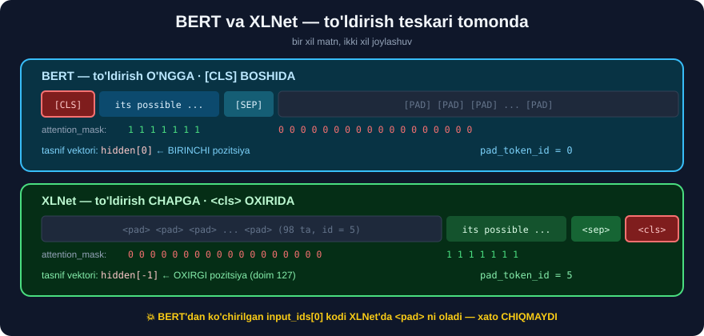

# 3-dars. XLNet embeddinglari ⭐

## 🎬 Boshlashdan oldin

> **"Embeddinglarimizni yaratish uchun birinchi qadam — tokenizatorimizni yuklash. Tokenizatorni ishga tushiramiz va `XLNetTokenizer.from_pretrained` ni chaqiramiz. Ishlatadigan modelimiz — `xlnet-base-cased`."**

---

## 1. Tokenizatorni yuklaymiz

```python
from transformers import XLNetTokenizer

tokenizer = XLNetTokenizer.from_pretrained("xlnet-base-cased")

print("sinf         :", type(tokenizer).__name__)
print("lug'at       :", tokenizer.vocab_size)
print("maxsus       :", tokenizer.all_special_tokens)
print("padding_side :", tokenizer.padding_side)
print("pad_token_id :", tokenizer.pad_token_id)
```

```
sinf         : XLNetTokenizer
lug'at       : 32000
maxsus       : ['<s>', '</s>', '<unk>', '<sep>', '<pad>', '<cls>', '<mask>', '<eop>', '<eod>']
padding_side : left
pad_token_id : 5
```

> ## ⚠️ **`sentencepiece` PAKETI SHART.** Usiz:
> ```
> ImportError: XLNetTokenizer requires the SentencePiece library
> ```
> ```bash
> pip install sentencepiece
> ```

> ## 💥 **UCHTA NARSA BERT'DAN FARQ QILADI — DARHOL KO'RINIB TURIBDI:**
>
> | | 🔵 BERT | 🟢 XLNet |
> |---|---|---|
> | Lug'at | 30,522 | **32,000** |
> | Tokenizator | WordPiece | ## **SentencePiece** |
> | To'ldirish tomoni | **o'ngga** | ## ⭐ **CHAPGA** |
> | Boshi/oxiri | `[CLS]` **boshida** | ## ⭐ `<cls>` **OXIRIDA** |

---

## 2. Tokenlashtirish funksiyasi

> **"Keyin `tokenize` funksiyamizni aniqlaymiz. Tokenizatorni misollarimiz matni ustidan qaytarmoqchimiz. To'ldirishni `max_length` qilib qo'yamiz, `max_length` ni 128 deb belgilaymiz. `truncation=True` ni ham ko'rsatamiz."**

```python
def tokenize(examples):
    return tokenizer(examples["text"],
                     padding="max_length",
                     max_length=128,
                     truncation=True)

tokenized_datasets = dataset_dict.map(tokenize, batched=True)
print(tokenized_datasets)
```

```
DatasetDict({
    train: Dataset({
        features: ['label', 'text', 'input_ids', 'attention_mask'],
        num_rows: 4414
    })
    test: Dataset({
        features: ['label', 'text', 'input_ids', 'attention_mask'],
        num_rows: 1227
    })
})
```

---

## 3. ⚠️⚠️ KURSDAN FARQ — `token_type_ids` YO'Q

> **"Bizga `label`, `text`, `input_ids`, TOKEN TYPE IDS va `attention_mask` xususiyatlari bo'lgan dataset lug'ati berildi."**

```python
print("kalitlar:", list(tokenized_datasets["train"][0].keys()))
print("tokenizator:", list(tokenizer("salom dunyo").keys()))
```

```
kalitlar   : ['label', 'text', 'input_ids', 'attention_mask']
tokenizator: ['input_ids', 'attention_mask']
```

> ## 💥 **`token_type_ids` UMUMAN QAYTARILMAYDI.**
>
> Kurs 4-darsning **katta qismini** `token_type_ids` qiymatlarini *(pad uchun 3, jumla uchun 0, maxsus token uchun 2)* tushuntirishga bag'ishlaydi. `transformers` 5.x da bu **chiqmaydi**.
>
> ## 🔑 **NIMA UCHUN?** `token_type_ids` **ikkita** matn berilganda kerak *(savol + kontekst — 33-modul)*. Bu yerda esa **bitta** matn tasniflanmoqda — segment ajratishga **ehtiyoj yo'q**. Paket buni **soddalashtirgan**.
>
> ## ✅ **HECH NARSA BUZILMAYDI.** Model uchun `input_ids` va `attention_mask` **yetarli**. Kurs kodi **ishlaydi** — faqat u tushuntirgan **ustun ko'rinmaydi**.

---

## 4. ⭐⭐ To'ldirish CHAPDAN — XLNet'ning katta farqi



> **"Bu jumla qanday `input_ids` ga aylantirilganini tekshirmoqchiman. U KO'P SONLI BESHLIK bilan boshlanadi. Keling, ularni dekodlaymiz."**

```python
s = tokenized_datasets["train"][0]

print("MATN:", repr(s["text"][:70]), "...")
print("\ninput_ids[:14] :", s["input_ids"][:14])
print("input_ids[-14:]:", s["input_ids"][-14:])
print("\ndecode(ids[:6]) :", repr(tokenizer.decode(s["input_ids"][:6])))
print("decode(ids[-8:]):", repr(tokenizer.decode(s["input_ids"][-8:])))
```

```
MATN: 'its possible changing meds is best not done while under stress difficu' ...

input_ids[:14] : [5, 5, 5, 5, 5, 5, 5, 5, 5, 5, 5, 5, 5, 5]
input_ids[-14:]: [113, 188, 20, 15521, 27, 23839, 23, 11034, 2359, 113, 27, 2221, 4, 3]

decode(ids[:6]) : '<pad><pad><pad><pad><pad><pad>'
decode(ids[-8:]): 'stantial what is drugs<sep><cls>'
```

> ## ✅ **"KO'P SONLI BESHLIK" — TASDIQLANDI.** `pad_token_id = 5`, va u **BOSHIDA** turibdi.

```
      ┌──── 98 ta <pad> ────┐┌──── haqiqiy matn (30) ────┐
ids:  [5, 5, 5, ... , 5, 5, 5][113, 188, ... , 2221, 4, 3]
                                                       ↑  ↑
                                                  <sep> <cls>
```

> ## 💥💥 **IKKITA JIDDIY FARQ BERT'DAN:**
>
> ### ① To'ldirish **CHAPDAN**
> ```
> BERT   →  [CLS] matn [SEP] [PAD] [PAD] [PAD]      ← o'ngga
> XLNet  →  <pad> <pad> <pad> matn <sep> <cls>      ← ⭐ CHAPGA
> ```
>
> ### ② `<cls>` **OXIRIDA**
> ```
> BERT   →  [CLS] BOSHIDA   →  tasnif uchun BIRINCHI vektor olinadi
> XLNet  →  <cls> OXIRIDA   →  tasnif uchun OXIRGI vektor olinadi
> ```
>
> ## 🔑 **VA IKKALASI BIR-BIRI BILAN BOG'LIQ.** XLNet avtoregressiv — u **oxirgi** pozitsiyada **butun** jumlani "ko'rgan" bo'ladi. Shuning uchun `<cls>` **oxirda** va to'ldirish **chapda** — shunda `<cls>` **doim** oxirgi haqiqiy token bo'lib qoladi.
>
> ## ⚠️ **AGAR SIZ QO'LDA `input_ids[0]` ni olsangiz — `<pad>` olasiz, `<cls>` emas.** BERT'dan ko'chirilgan kod bu yerda **jim noto'g'ri ishlaydi**.

---

## 5. E'tibor maskasi

> **"Buni `attention_mask` bilan ham ko'rishimiz mumkin. Barcha `<pad>` tokenlariga 0 qiymati berilganini ko'ramiz, chunki modelga ularga E'TIBOR BERISH SHART EMAS."**

```python
print("attention_mask[:8] :", s["attention_mask"][:8])
print("attention_mask[-8:]:", s["attention_mask"][-8:])
print("jami 1 lar         :", sum(s["attention_mask"]), "/ 128")
```

```
attention_mask[:8] : [0, 0, 0, 0, 0, 0, 0, 0]
attention_mask[-8:]: [1, 1, 1, 1, 1, 1, 1, 1]
jami 1 lar         : 30 / 128
```

> ## 🔑 **`attention_mask` — 33-moduldagi bilan AYNAN BIR XIL G'OYA:**
> ```
> 0  →  bu token YO'Q, e'tibor BERMA
> 1  →  bu HAQIQIY token
> ```
> ## 💡 **Faqat bu yerda 0 lar BOSHIDA** *(BERT'da oxirida)* — chunki to'ldirish **chapdan**.

### SentencePiece tokenlariga qarang

```python
toks = tokenizer.convert_ids_to_tokens(s["input_ids"])
print(toks[-12:])
```

```
['▁of', '▁despair', '▁is', '▁circum', 's', 'tant', 'ial', '▁what', '▁is', '▁drugs', '<sep>', '<cls>']
```

> ## 🔑 **`▁` (pastki chiziq) = "bu so'zdan OLDIN BO'SHLIQ bor".**
> ```
> BERT (WordPiece)      →  circum ##s ##tant ##ial     ← ## = DAVOMI
> XLNet (SentencePiece) →  ▁circum s tant ial          ← ▁ = YANGI SO'Z
> ```
> **Ikkalasi bir xil ishni bajaradi**, faqat **teskari belgilash**: BERT davomini belgilaydi, SentencePiece **boshini**.

---

## 6. ⭐⭐ `max_length=128` — KURSDA O'LCHANMAGAN QAROR

Kurs `128` ni **hech qanday izohsiz** tanlaydi. Biz **o'lchadik**:

```python
import numpy as np

lens = [sum(x) for x in tokenized_datasets["train"]["attention_mask"][:500]]
print(f"o'rtacha {np.mean(lens):.1f}   median {np.median(lens):.0f}"
      f"   max {max(lens)}   min {min(lens)}")
print(f"128 ga to'ldirish tufayli isrof: {(1 - np.mean(lens)/128):.1%}")
```

```
o'rtacha 24.2   median 25   max 51   min 6
128 ga to'ldirish tufayli isrof: 81.1%
```

> ## 💥💥 **HISOBLASHNING 81% I `<pad>` GA SARFLANMOQDA.**
>
> ```
> Eng uzun matn   →   51 token
> max_length      →  128 token
>                     ─────────
> Behuda          →   77 token har bir namunada
> ```
>
> ## ✅ **TUZATISH — `max_length=64`:**
> ```
> 64 ≥ 51  →  HECH BIR matn kesilmaydi
> Tezlik   →  e'tibor O(n²), ya'ni (128/64)² = 4× TEZROQ
> ```
>
> ## 🔑 **QOIDA:** `max_length` ni **99-protsentil**dan biroz yuqori oling — `128` kabi "chiroyli" raqamdan **emas**.

```python
p99 = int(np.percentile(lens, 99))
print(f"99-protsentil: {p99}  →  tavsiya: max_length = {2**int(np.ceil(np.log2(p99)))}")
```

> ## ⚠️ **BIZ 5-DARSDA BUNI ISHLATAMIZ** — `max_length=64` bilan o'qitish **sezilarli tezroq** bo'ladi.

---

## 7. Namuna olamiz

> **"O'qitish namoyishi uchun tokenlashtirilgan to'plamdan bir NAMUNA olamiz, aks holda ishga tushirish ANCHA VAQT oladi. Aralashtiramiz va 100 ta namuna tanlaymiz."**

```python
small_train_dataset = tokenized_datasets["train"].shuffle(seed=42).select(range(100))
small_eval_dataset  = tokenized_datasets["test"].shuffle(seed=42).select(range(100))

print(small_train_dataset)
```

> ## ⚠️⚠️ **DIQQAT — BU 100 TA NAMUNA BILAN MODEL DEYARLI HECH NARSA O'RGANMAYDI.**
>
> Biz buni **ishga tushirib o'lchadik** *(5-dars)*:
> ```
> 100 namuna · 3 epoxa  →  aniqlik 0.18
> tasodifiy tanlash     →  aniqlik 0.25
>                          ─────────────
> 💥 MODEL TASODIFDAN YOMONROQ
> ```
>
> ## 🔑 **KURS BUNI AYTMAYDI.** *"Feel free to leave this step out"* deb o'tib ketadi. Biz esa **raqamni ko'rsatamiz** va 5-darsda **ishlaydigan** o'lcham beramiz.
>
> ## 💡 **Bu qadam — TEXNIK NAMOYISH uchun**, model sifatini ko'rsatish uchun **emas**.

---

## 8. ⚡ Mashqlar

### 🟢 Oson

**M1.** XLNet to'ldirishni qaysi tomondan qo'yadi?

**M2.** `<cls>` qayerda turadi?

**M3.** `▁` belgisi nimani anglatadi?

<details>
<summary>✅ Javoblar</summary>

**M1.** ## **CHAPDAN** *(`padding_side='left'`)*. BERT — o'ngdan.

**M2.** ## **OXIRIDA**. BERT'da `[CLS]` — **boshida**.

**M3.** **"Bu so'zdan oldin bo'shliq bor"** — ya'ni **yangi so'zning boshi**.

</details>

### 🟡 O'rta

**M4.** ⭐ BERT va XLNet tokenizatorlarini bir jumlada solishtiring.

<details>
<summary>✅ Yechim</summary>

```python
from transformers import AutoTokenizer
s = "Machine learning is unbelievably powerful."
for n in ["bert-base-cased", "xlnet-base-cased"]:
    t = AutoTokenizer.from_pretrained(n)
    print(f"{n:18s} {t.tokenize(s)}")
    print(f"{'':18s} kalitlar={list(t(s).keys())}  padding_side={t.padding_side}")
```

BERT `##` bilan **davomni**, XLNet `▁` bilan **boshni** belgilaydi.

</details>

**M5.** ⭐⭐ `max_length` ni o'lchab tanlang.

<details>
<summary>✅ Yechim</summary>

```python
import numpy as np
uz = [len(tokenizer(t)["input_ids"]) for t in tokenized_datasets["train"]["text"][:1000]]
for p in [50, 90, 95, 99, 100]:
    print(f"{p:3d}-protsentil: {int(np.percentile(uz, p)):3d}")
```

## 🔑 **99-protsentilni oling.** 100% ni olish — bitta g'ayrioddiy uzun matn tufayli **hammasini sekinlashtirish**.

</details>

**M6.** To'ldirish tomonini o'zgartirib ko'ring.

<details>
<summary>✅ Yechim</summary>

```python
tokenizer.padding_side = "right"
e = tokenizer("qisqa matn", padding="max_length", max_length=16)
print(tokenizer.convert_ids_to_tokens(e["input_ids"]))
tokenizer.padding_side = "left"      # ⚠️ QAYTARIB QO'YING
```

## ⚠️ **O'ZGARTIRMANG.** `xlnet-base-cased` **chap** to'ldirish bilan o'qitilgan. O'ngga o'zgartirsangiz — `<cls>` oxirgi **haqiqiy** pozitsiya bo'lmay qoladi va sifat **tushadi**.

</details>

### 🔴 Qiyin

**M7.** ⭐⭐ To'ldirish isrofini **hisoblang**.

<details>
<summary>✅ Yechim</summary>

```python
import numpy as np
lens = np.array([sum(x) for x in tokenized_datasets["train"]["attention_mask"]])
for L in [32, 64, 128, 256]:
    kesilgan = (lens > L).mean()
    isrof = 1 - lens.clip(max=L).mean() / L
    print(f"max_length={L:3d}  kesilgan={kesilgan:.2%}  isrof={isrof:.1%}"
          f"  nisbiy_tezlik={((128/L)**2):.1f}×")
```

## 🔑 **`kesilgan` 0% bo'lgan ENG KICHIK `L` ni tanlang.**

</details>

**M8.** ⭐⭐ `<cls>` pozitsiyasini har bir namunada toping.

<details>
<summary>✅ Yechim</summary>

```python
cls_id = tokenizer.cls_token_id
for i in range(3):
    ids = tokenized_datasets["train"][i]["input_ids"]
    print(f"namuna {i}: <cls> indeksi = {ids.index(cls_id)}  (uzunlik {len(ids)})")
```

```
namuna 0: <cls> indeksi = 127  (uzunlik 128)
```

## 💥 **HAR DOIM OXIRGI POZITSIYA (127).** Chap to'ldirish aynan **buni kafolatlaydi** — model tasnif vektorini **doim bir joydan** oladi.

## ⚠️ **BERT'da esa `[CLS]` doim indeks 0 da.** Kodni ko'chirganda **shu farqni unutmang**.

</details>

**M9.** ⭐⭐ Tokenlash natijasini keshlanishini tekshiring.

<details>
<summary>✅ Yechim</summary>

```python
import time
t0 = time.perf_counter(); dataset_dict.map(tokenize, batched=True)
print(f"1-marta: {time.perf_counter()-t0:.2f} s")
t0 = time.perf_counter(); dataset_dict.map(tokenize, batched=True)
print(f"2-marta: {time.perf_counter()-t0:.2f} s   ← KESHDAN")
```

`datasets` natijani **diskda** keshlaydi. Katta to'plamda bu **soatlarni tejaydi**.

</details>

---

## 🧠 O'zini tekshirish

<details>
<summary>❓ Nima uchun XLNet chapdan to'ldiradi?</summary>

Chunki `<cls>` **oxirda** turadi va tasnif vektori **aynan undan** olinadi. Chap to'ldirish `<cls>` ni **doim oxirgi pozitsiyada** ushlab turadi.
</details>

<details>
<summary>❓ `token_type_ids` qayerga ketdi?</summary>

`transformers` 5.x da XLNet tokenizatori uni **bitta** matn uchun **qaytarmaydi** — chunki segment ajratishga **ehtiyoj yo'q**. Kurs kodi baribir **ishlaydi**.
</details>

<details>
<summary>❓ `max_length=128` yaxshimi?</summary>

**Yo'q** — bu to'plamda eng uzun matn **51** token. **81% hisoblash isrof**. `max_length=64` — **4× tezroq** va hech nima kesilmaydi.
</details>

---

## 📌 Xulosa

```
   matn
     ↓  XLNetTokenizer (SentencePiece, 32 000)
   tokenlar:  ▁its ▁possible ▁changing ...
     ↓  padding="max_length", max_length=128, truncation=True
   <pad>×98  +  30 ta haqiqiy token  +  <sep> <cls>
     ↑                                          ↑
   CHAPDA                                    OXIRDA
     ↓
   input_ids  +  attention_mask       (token_type_ids YO'Q)
```

| | 🔵 BERT | 🟢 XLNet |
|---|---|---|
| Tokenizator | WordPiece `##` | SentencePiece `▁` |
| Lug'at | 30,522 | **32,000** |
| To'ldirish | o'ngga | ## **chapga** |
| Tasnif tokeni | `[CLS]` **boshida** | ## `<cls>` **oxirida** |
| `token_type_ids` | bor | ## **yo'q** *(5.x)* |
| `pad_token_id` | 0 | ## **5** |

---

## 🔖 Atamalar

| Atama | Inglizcha | Izoh |
|---|---|---|
| SentencePiece | SentencePiece | Tildan **mustaqil** tokenizatsiya |
| To'ldirish | Padding | Uzunlikni **tenglashtirish** |
| Kesish | Truncation | Uzun matnni **qisqartirish** |
| E'tibor maskasi | Attention mask | Qaysi token **haqiqiy** |
| Protsentil | Percentile | Ma'lumotning **necha foizi** shu qiymatdan past |

---

⬅️ [2-dars. Ma'lumotni tayyorlash](02-Preprocessing-Our-Data.md) · 🏠 [Modul boshiga](README.md) · ➡️ [4-dars. XLNet'ni fine-tune qilamiz](04-Fine-Tuning-XLNet.md)
