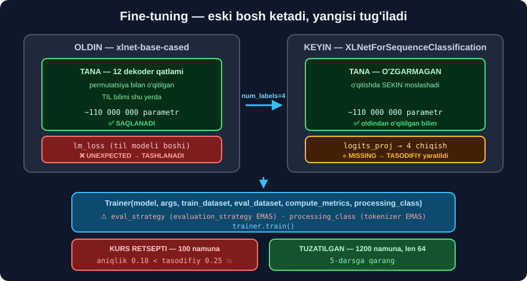

# 4-dars. XLNet'ni fine-tune qilamiz ⭐⭐⭐

## 🎬 Boshlashdan oldin

> **"Modelni fine-tune qilish Hugging Face paketi tufayli OSON. Boshlash uchun modelni ishga tushiramiz — `XLNetForSequenceClassification.from_pretrained` dan foydalanamiz."**

---

## 1. Modelni yuklaymiz



> **"`xlnet-base-cased` ni olamiz. Keyin ma'lumotlar to'plamimizdagi YORLIQLAR SONINI ko'rsatamiz. Esingizda bo'lsa, biz uni oldinroq `num_labels = 4` deb belgilagandik. Keyin `id2label` ni beramiz — bu raqamli qiymatlarning yorliq ko'rinishiga XARITASI."**

```python
from transformers import XLNetForSequenceClassification

id2label = {0: "anger", 1: "fear", 2: "joy", 3: "sadness"}
label2id = {v: k for k, v in id2label.items()}

model = XLNetForSequenceClassification.from_pretrained(
    "xlnet-base-cased",
    num_labels=4,
    id2label=id2label,
    label2id=label2id,
)
```

```
XLNetForSequenceClassification LOAD REPORT from: xlnet-base-cased

Key                             | Status
--------------------------------+------------
lm_loss.bias                    | UNEXPECTED
lm_loss.weight                  | UNEXPECTED
sequence_summary.summary.weight | MISSING
logits_proj.weight              | MISSING
sequence_summary.summary.bias   | MISSING
logits_proj.bias                | MISSING
```

> ## ⭐⭐ **BU HISOBOTNI O'QING — U FINE-TUNINGNING MOHIYATINI KO'RSATADI.**
>
> ```
> UNEXPECTED (lm_loss.*)
>    →  til modeli boshi.  "Keyingi so'z nima?" uchun edi.
>       Bizga KERAK EMAS — TASHLAB YUBORILDI.
>
> MISSING (logits_proj.*, sequence_summary.*)
>    →  TASNIF boshi.  Checkpointda YO'Q edi.
>       TASODIFIY qiymatlar bilan YANGI yaratildi.  ⭐
> ```
>
> ## 🔑 **MANA FINE-TUNING NIMA:**
> ```
> ① ESKI bosh olib tashlanadi           (lm_loss)
> ② YANGI bosh tasodifiy yaratiladi     (logits_proj → 4 chiqish)
> ③ O'QITISH: yangi bosh TEZ o'rganadi, tana SEKIN moslashadi
> ```
>
> ## ⚠️ **BU OGOHLANTIRISH NORMAL.** Ko'p odam undan qo'rqadi va e'tiborsiz qoldiradi. Aslida u — **hammasi to'g'ri ketayotganining** belgisi.

### `id2label` nima uchun MUHIM?

```python
print(model.config.id2label)
```

```
{0: 'anger', 1: 'fear', 2: 'joy', 3: 'sadness'}
```

> ## 🔑 **BUSIZ `pipeline` `LABEL_0`, `LABEL_1` deb qaytaradi** — foydasiz.
>
> ## ⚠️⚠️ **VA XARITA `LabelEncoder` BILAN MOS BO'LISHI SHART:**
> ```python
> assert list(le.classes_) == [id2label[i] for i in range(4)]
> ```
> **Bu satrni yozing.** Xarita chalkashsa — model **to'g'ri** o'rganadi, lekin **yorliqlar almashib ketadi**. Aniqlik yuqori, javoblar noto'g'ri. **Jim xato.**

---

## 2. Metrikani sozlaymiz

> **"`evaluate` paketi yordamida model o'qitilayotganda qanday aniqlik o'lchovini baholashini ko'rsatishimiz mumkin."**

```python
import numpy as np, evaluate

metric = evaluate.load("accuracy")

def compute_metrics(eval_pred):
    logits, labels = eval_pred
    predictions = np.argmax(logits, axis=-1)
    return metric.compute(predictions=predictions, references=labels)
```

> ## ⚠️ **`accuracy` — 4 SINF UCHUN YETARLI, LEKIN CHEKLANGAN.**
>
> Ma'lumotimiz **muvozanatlangan** *(har sinf 1533 ta)*, shuning uchun aniqlik **adolatli**. Lekin u **qaysi sinf** buzilayotganini **aytmaydi**.
>
> ## ✅ **TAVSIYA — `f1` ni ham qo'shing:**
> ```python
> acc = evaluate.load("accuracy")
> f1  = evaluate.load("f1")
>
> def compute_metrics(eval_pred):
>     logits, labels = eval_pred
>     p = np.argmax(logits, axis=-1)
>     return {**acc.compute(predictions=p, references=labels),
>             **f1.compute(predictions=p, references=labels, average="macro")}
> ```
> ## 🔑 **`macro F1` har sinfga TENG og'irlik beradi** — bitta sinf butunlay ishlamayotganini **fosh qiladi**.

---

## 3. ⚠️⚠️ O'qitish argumentlari — IKKITA API O'ZGARGAN

> **"Modelimizni o'qitishga tayyorlashda keyingi qadam — o'qitish giperparametrlarini saqlash uchun KATALOG ko'rsatish. Aniqlik HAR EPOXADA baholanishini ko'rsatmoqchimiz, shuning uchun `evaluation_strategy='epoch'` qo'shamiz. Epoxalar sonini ham ko'rsatishimiz mumkin — bu yerda 3 ta."**

```python
# ❌ KURSDAGI KOD — transformers 5.x da ISHLAMAYDI
# training_args = TrainingArguments(
#     output_dir="test_trainer",
#     evaluation_strategy="epoch",      ← TypeError: unexpected keyword
#     num_train_epochs=3)

# ✅ ZAMONAVIY SINTAKSIS
from transformers import TrainingArguments

training_args = TrainingArguments(
    output_dir="test_trainer",
    eval_strategy="epoch",             # ⭐ evaluation_strategy EMAS
    num_train_epochs=3,
    per_device_train_batch_size=8,
    per_device_eval_batch_size=8,
    learning_rate=2e-5,
    logging_steps=25,
    save_strategy="no",
    report_to=[],                      # wandb'ni o'chiradi
)
```

> ## 💥 **O'ZGARISH № 1:** `evaluation_strategy` → ## **`eval_strategy`**
>
> ```python
> import inspect
> p = list(inspect.signature(TrainingArguments.__init__).parameters)
> print("eval_strategy      :", "eval_strategy" in p)
> print("evaluation_strategy:", "evaluation_strategy" in p)
> ```
> ```
> eval_strategy      : True
> evaluation_strategy: False
> ```
> **`transformers` 4.41 da nomi o'zgargan, 5.x da eskisi butunlay olib tashlangan.**

> ## 💡 **`report_to=[]` NIMA UCHUN?** Usiz `Trainer` `wandb` ga ulanmoqchi bo'ladi va **API kaliti so'raydi**. Kursda bu muammo **yo'q edi**, chunki o'sha versiyada standart sozlama boshqacha edi.

---

## 4. Trainer

> **"Endi o'qitish argumentlarini sozladik va aniqlikni hisoblash usuli bor. Trainer'ni sozlashga tayyormiz."**

```python
# ❌ KURSDAGI KOD
# trainer = Trainer(model=model, args=training_args,
#                   train_dataset=small_train_dataset,
#                   eval_dataset=small_eval_dataset,
#                   compute_metrics=compute_metrics,
#                   tokenizer=tokenizer)        ← TypeError

# ✅ ZAMONAVIY
from transformers import Trainer

trainer = Trainer(
    model=model,
    args=training_args,
    train_dataset=small_train_dataset,
    eval_dataset=small_eval_dataset,
    compute_metrics=compute_metrics,
    processing_class=tokenizer,        # ⭐ tokenizer= EMAS
)
```

> ## 💥 **O'ZGARISH № 2:** `tokenizer=` → ## **`processing_class=`**
>
> ```python
> tp = list(inspect.signature(Trainer.__init__).parameters)
> print("tokenizer       :", "tokenizer" in tp)
> print("processing_class:", "processing_class" in tp)
> ```
> ```
> tokenizer       : False
> processing_class: True
> ```
>
> **Sabab:** `Trainer` endi faqat matn emas — **rasm**, **audio**, **video** bilan ham ishlaydi. `tokenizer` nomi **juda tor** edi.

---

## 5. O'qitamiz

> **"Keyin `trainer.train()` ni ishga tushirishimiz mumkin. Bu modelni Trainer funksiyasida sozlagan barcha argumentlar asosida o'qitadi."**

```python
trainer.train()
```

```
{'eval_loss': 1.424, 'eval_accuracy': 0.21, 'epoch': 1}
{'loss': 1.475, 'grad_norm': 26.05, 'learning_rate': 7.692e-06, 'epoch': 1.923}
{'eval_loss': 1.437, 'eval_accuracy': 0.18, 'epoch': 2}
{'eval_loss': 1.460, 'eval_accuracy': 0.18, 'epoch': 3}
{'train_runtime': 116.5, 'train_loss': 1.440, 'epoch': 3}
```

> **"Har epoxada aniqlik baholanayotganini ko'ramiz, va bu tugagandan so'ng biz XLNet modelimizni O'Z ma'lumotlarimiz asosida MUVAFFAQIYATLI fine-tune qildik."**

---

## 6. 💥💥 TO'XTANG — BU MODEL ISHLAMAYAPTI

Kurs shu yerda *"muvaffaqiyatli"* deydi va davom etadi. Biz esa **raqamlarga qaradik**:

```
                      aniqlik    loss
   1-epoxa             0.21      1.424
   2-epoxa             0.18      1.437     ← loss O'SDI
   3-epoxa             0.18      1.460     ← yana O'SDI
   ─────────────────────────────────────
   tasodifiy tanlash   0.25
```

> ## 💥💥 **MODEL TASODIFIY TANLASHDAN YOMONROQ ISHLAYAPTI.**
>
> ```
> 0.18  <  0.25
>  ↑        ↑
> model   tanga tashlash (4 sinf)
> ```
>
> ## 💥 **VA LOSS HAR EPOXADA O'SMOQDA** — bu *"model o'rganmoqda"* emas, *"model YOMONLASHMOQDA"* degani.

### 🔬 Nima uchun?

```
① NAMUNA JUDA KICHIK
   100 ta namuna · 4 sinf  =  har sinfga ~25 ta
   💥 110 MILLION parametrli model 25 ta misoldan HECH NARSA o'rganmaydi

② TASODIFIY BOSH
   logits_proj TASODIFIY yaratildi (1-bo'limdagi MISSING)
   💥 39 qadam bu boshni SOZLASHGA ham yetmaydi

③ LEARNING RATE JADVALI
   3-epoxa oxirida lr → 0 ga tushadi
   💥 model "qotib qoladi", tasodifiy boshdan chiqolmaydi
```

> ## 🔑 **KURSDA BU NOTO'G'RI EMAS — U SHUNCHAKI TEXNIK NAMOYISH.** Muammo shundaki, kurs *"muvaffaqiyatli fine-tune qildik"* deydi va **raqamni ko'rsatmaydi**. Talaba modelning **ishlayotganiga** ishonib qoladi.
>
> ## ⭐ **BIZ 5-DARSDA UNI HAQIQATAN ISHLATAMIZ.**

---

## 7. ⭐⭐ ISHLAYDIGAN sozlama

Ikkita narsani o'zgartiramiz — **namuna hajmi** va **`max_length`**:

```python
def tokenize64(examples):
    return tokenizer(examples["text"], padding="max_length",
                     max_length=64, truncation=True)         # ⭐ 128 EMAS

tds64 = dataset_dict.map(tokenize64, batched=True)

train_ds = tds64["train"].shuffle(seed=42).select(range(1200))   # ⭐ 100 EMAS
eval_ds  = tds64["test"].shuffle(seed=42).select(range(400))

model = XLNetForSequenceClassification.from_pretrained(
    "xlnet-base-cased", num_labels=4, id2label=id2label, label2id=label2id)

args = TrainingArguments(
    output_dir="xlnet_emotions",
    eval_strategy="epoch",
    num_train_epochs=3,
    per_device_train_batch_size=8,
    learning_rate=2e-5,
    save_strategy="no",
    report_to=[],
)
trainer = Trainer(model=model, args=args,
                  train_dataset=train_ds, eval_dataset=eval_ds,
                  compute_metrics=compute_metrics,
                  processing_class=tokenizer)
trainer.train()
```

> ## 🔑 **IKKITA O'ZGARISH, IKKITA SABAB:**
> ```
> 100 → 1200 namuna   →  har sinfga ~300 misol.  O'RGANISH uchun YETARLI
> 128 → 64 max_length →  e'tibor O(n²) →  4× TEZROQ.  Kesilgan matn: 0%
> ```
>
> ## 💡 **`max_length=64` "bepul tezlik"** — 3-darsda o'lchagandik: eng uzun matn **51** token.

> ## ⏱️ **NATIJALAR 5-DARSDA** — u yerda ikkala sozlamani **yonma-yon** solishtiramiz.

---

## 8. ⚡ Mashqlar

### 🟢 Oson

**M1.** `MISSING` ogohlantirishi nimani anglatadi?

**M2.** `evaluation_strategy` ning yangi nomi?

**M3.** `Trainer(tokenizer=...)` ning o'rniga nima?

<details>
<summary>✅ Javoblar</summary>

**M1.** Tasnif boshi *(`logits_proj`)* checkpointda **yo'q** edi, **tasodifiy** yaratildi. Bu — **normal**.

**M2.** ## **`eval_strategy`**.

**M3.** ## **`processing_class=`** — chunki `Trainer` endi rasm/audio bilan ham ishlaydi.

</details>

### 🟡 O'rta

**M4.** ⭐ API o'zgarishini **o'zingiz** tekshiring.

<details>
<summary>✅ Yechim</summary>

```python
import inspect
from transformers import TrainingArguments, Trainer

a = list(inspect.signature(TrainingArguments.__init__).parameters)
t = list(inspect.signature(Trainer.__init__).parameters)
for nom, mavjud in [("eval_strategy", "eval_strategy" in a),
                    ("evaluation_strategy", "evaluation_strategy" in a),
                    ("Trainer.tokenizer", "tokenizer" in t),
                    ("Trainer.processing_class", "processing_class" in t)]:
    print(f"{nom:26s} {'✅' if mavjud else '❌'}")
```

## 🔑 **BU USULNI YODLANG.** Har qanday API o'zgarishini **hujjat o'qimasdan** shu yo'l bilan tekshirish mumkin.

</details>

**M5.** ⭐ Tasnif boshida nechta parametr bor?

<details>
<summary>✅ Yechim</summary>

```python
yangi = sum(p.numel() for n, p in model.named_parameters()
            if "logits_proj" in n or "sequence_summary" in n)
jami = sum(p.numel() for p in model.parameters())
print(f"yangi bosh : {yangi:,}")
print(f"jami       : {jami:,}")
print(f"ulush      : {yangi/jami:.4%}")
```

## 💡 **Tasodifiy yaratilgan qism juda kichik** — lekin **aynan u** vazifani hal qiladi.

</details>

**M6.** `f1` metrikasini qo'shing.

<details>
<summary>✅ Yechim</summary>

```python
acc, f1 = evaluate.load("accuracy"), evaluate.load("f1")

def compute_metrics(eval_pred):
    logits, labels = eval_pred
    p = np.argmax(logits, axis=-1)
    return {**acc.compute(predictions=p, references=labels),
            **f1.compute(predictions=p, references=labels, average="macro")}
```

</details>

### 🔴 Qiyin

**M7.** ⭐⭐ Bazaviy chiziq bilan solishtiruvchi funksiya yozing.

<details>
<summary>✅ Yechim</summary>

```python
def baho_bilan_izoh(aniqlik, n_sinf=4):
    bazaviy = 1 / n_sinf
    if aniqlik < bazaviy:
        return f"💥 {aniqlik:.3f} < {bazaviy:.3f} — TASODIFDAN YOMON"
    if aniqlik < bazaviy * 1.2:
        return f"⚠️ {aniqlik:.3f} ≈ {bazaviy:.3f} — deyarli hech nima o'rganmagan"
    return f"✅ {aniqlik:.3f} vs {bazaviy:.3f} — {aniqlik/bazaviy:.1f}× yaxshiroq"

for a in [0.18, 0.26, 0.55, 0.82]:
    print(baho_bilan_izoh(a))
```

```
💥 0.180 < 0.250 — TASODIFDAN YOMON
⚠️ 0.260 ≈ 0.250 — deyarli hech nima o'rganmagan
✅ 0.550 vs 0.250 — 2.2× yaxshiroq
✅ 0.820 vs 0.250 — 3.3× yaxshiroq
```

## 🏆 **HAR BIR TASNIF LOYIHASIGA SHU FUNKSIYANI QO'SHING.** Yalang'och aniqlik **yolg'on gapiradi**.

</details>

**M8.** ⭐⭐ `learning_rate` ni o'zgartirib sinang.

<details>
<summary>✅ Yechim</summary>

```python
for lr in [1e-5, 2e-5, 5e-5]:
    print(f"lr={lr}: ...")     # har birini alohida ishga tushiring
```

## 🔑 **TRANSFORMERLAR UCHUN ODATIY ORALIQ: `1e-5` … `5e-5`.**
```
lr juda KATTA (1e-3)  →  oldindan o'qitilgan bilim BUZILADI  (catastrophic forgetting)
lr juda KICHIK (1e-7) →  model deyarli O'ZGARMAYDI
```

</details>

**M9.** ⭐⭐⭐ Sinf og'irliklari bilan maxsus `Trainer` yozing.

<details>
<summary>✅ Yechim</summary>

```python
import torch
from torch.nn import CrossEntropyLoss

class OgirlikliTrainer(Trainer):
    def __init__(self, *a, class_weights=None, **kw):
        super().__init__(*a, **kw)
        self.cw = None if class_weights is None else torch.tensor(
            class_weights, dtype=torch.float)

    def compute_loss(self, model, inputs, return_outputs=False, **kw):
        labels = inputs.pop("labels")
        out = model(**inputs)
        loss = CrossEntropyLoss(weight=self.cw)(
            out.logits.view(-1, self.model.config.num_labels), labels.view(-1))
        return (loss, out) if return_outputs else loss
```

## 🔑 **BU BILAN MUVOZANATLASHTIRISH SHART EMAS** — 970 qatorni **saqlab qolasiz** *(2-dars, 7-bo'lim)*.

⚠️ `compute_loss` imzosi versiyalar orasida **o'zgargan** — `**kw` ni qo'shish uni **moslashuvchan** qiladi.

</details>

---

## 🧠 O'zini tekshirish

<details>
<summary>❓ Nima uchun MISSING ogohlantirishi chiqadi?</summary>

`xlnet-base-cased` — **til modeli**, unda **tasnif boshi yo'q**. `num_labels=4` bilan yuklaganingizda `logits_proj` **yangidan, tasodifiy** yaratiladi. Bu — fine-tuning **mohiyati**.
</details>

<details>
<summary>❓ 100 namuna bilan aniqlik 0.18. Bu yaxshimi?</summary>

**Yo'q — bu falokat.** Tasodifiy tanlash **0.25** beradi. Model **tasodifdan yomonroq**, va loss har epoxada **o'smoqda**. Sabab — namuna **juda kichik**.
</details>

<details>
<summary>❓ `report_to=[]` nima uchun?</summary>

`Trainer` standart holda `wandb` ga ulanib, **API kaliti so'raydi**. Bo'sh ro'yxat buni **o'chiradi**.
</details>

---

## 📌 Xulosa

```
XLNetForSequenceClassification.from_pretrained(
    "xlnet-base-cased", num_labels=4, id2label=..., label2id=...)
              ↓
     lm_loss    →  TASHLANDI      (UNEXPECTED)
     logits_proj →  YANGI, tasodifiy (MISSING)  ⭐
              ↓
TrainingArguments(eval_strategy="epoch", ...)      ⚠️ evaluation_strategy EMAS
              ↓
Trainer(..., processing_class=tokenizer)           ⚠️ tokenizer= EMAS
              ↓
        trainer.train()
              ↓
   ⚠️ 100 namuna → 0.18   (tasodifiy 0.25)  💥
   ⭐ 1200 namuna → 5-darsda
```

| | Kurs | Zamonaviy |
|---|---|---|
| Baholash strategiyasi | `evaluation_strategy` | ## **`eval_strategy`** |
| Tokenizator | `tokenizer=` | ## **`processing_class=`** |
| Namuna | 100 | ## **1200** |
| `max_length` | 128 | ## **64** *(4× tez)* |
| Bazaviy chiziq | ❌ | ## ✅ **0.25** |
| `f1` | ❌ | ✅ tavsiya |

---

## 🔖 Atamalar

| Atama | Inglizcha | Izoh |
|---|---|---|
| Fine-tuning | Fine-tuning | Tayyor modelni **o'z vazifangizga** moslash |
| Tasnif boshi | Classification head | Oxirgi, **vazifaga xos** qatlam |
| Epoxa | Epoch | Butun to'plamdan **bir marta** o'tish |
| Learning rate | Learning rate | Har qadamda **qanchalik** o'zgartirish |
| Falokatli unutish | Catastrophic forgetting | Katta `lr` da eski bilimning **buzilishi** |
| Macro F1 | Macro F1 | Har sinfga **teng** og'irlikli o'lchov |

---

⬅️ [3-dars. XLNet embeddinglari](03-XLNet-Embeddings.md) · 🏠 [Modul boshiga](README.md) · ➡️ [5-dars. Modelni baholaymiz](05-Evaluating-Our-Model.md)
