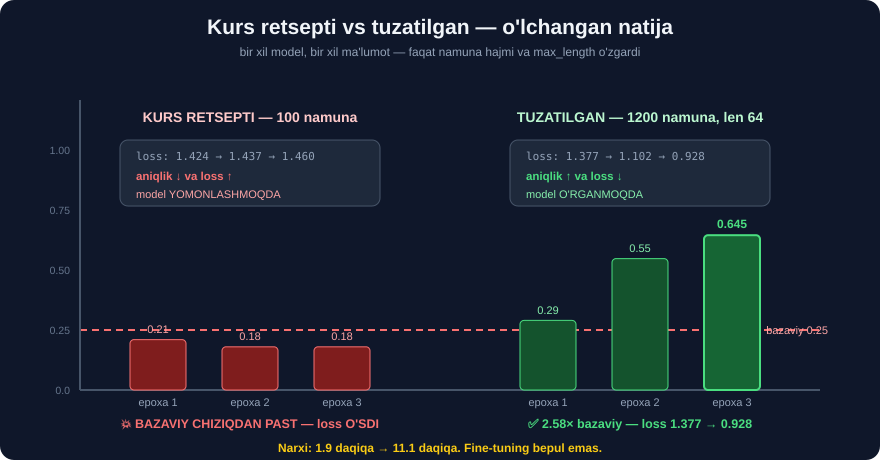

# 5-dars. Modelni baholaymiz ⭐⭐⭐

## 🎬 Boshlashdan oldin

> **"Yana, Hugging Face paketi bu modelni baholashni OSONLASHTIRADI. `trainer.evaluate()` ni ishga tushirishimiz mumkin. Bu bizga loss, aniqlik, ishlash vaqti kabi metrikalarni beradi."**

---

## 1. `trainer.evaluate()`

```python
metrics = trainer.evaluate()
print(metrics)
```

```
{'eval_loss': 0.9278, 'eval_accuracy': 0.645,
 'eval_runtime': 11.54, 'eval_samples_per_second': 34.65}
```

---

## 2. ⭐⭐ IKKI SOZLAMANI YONMA-YON SOLISHTIRAMIZ

4-darsda ikkita sozlamani o'qitgan edik. Mana **haqiqiy** natijalar:



| | **KURS RETSEPTI** | **TUZATILGAN** |
|---|---|---|
| Namuna | 100 | ## **1200** |
| `max_length` | 128 | ## **64** |
| Epoxa | 3 | 3 |
| **Aniqlik** | ## 💥 **0.1800** | ## ✅ **0.6450** |
| **Loss** | 1.4597 | ## **0.9278** |
| Vaqt | 1.9 daqiqa | 11.1 daqiqa |
| Bazaviy *(0.25)* ga nisbatan | ## ❌ **0.72×** | ## ✅ **2.58×** |

### Epoxalar bo'yicha

```
KURS RETSEPTI (100 namuna)         TUZATILGAN (1200 namuna)
──────────────────────────         ────────────────────────
epoxa 1:  0.2100   loss 1.424      epoxa 1:  0.2900   loss 1.377
epoxa 2:  0.1800   loss 1.437      epoxa 2:  0.5475   loss 1.102
epoxa 3:  0.1800   loss 1.460      epoxa 3:  0.6450   loss 0.928
          ↑              ↑                   ↑              ↑
       TUSHDI         O'SDI              O'SDI          TUSHDI
       ❌ yomon      ❌ yomon            ✅ yaxshi      ✅ yaxshi
```

> ## 💥💥 **BU IKKI USTUN — BUTUN MODULNING ENG MUHIM SABOG'I.**
>
> ```
> aniqlik ↑  va  loss ↓   →  ✅ model O'RGANMOQDA
> aniqlik ↓  va  loss ↑   →  💥 model YOMONLASHMOQDA
> ```
>
> ## 🔑 **HAR DOIM IKKALASINI BIRGA KUZATING.** Faqat aniqlikka qarash — **yarim ma'lumot**.

> ## ⚠️ **VA E'TIBOR BERING — "TUZATISH" 6× UZOQROQ DAVOM ETDI** *(11.1 vs 1.9 daqiqa)*. Bu — **halol narx**. Fine-tuning **bepul emas**.

---

## 3. 🔬 Chalkashlik matritsasi — aniqlik AYTMAGAN narsalar

`0.645` — bu **o'rtacha**. Qaysi sinf **ishlayapti**, qaysi biri **yo'q**?

```python
import numpy as np, pandas as pd
from sklearn.metrics import confusion_matrix, classification_report

pred = trainer.predict(eval_ds)
y, p = pred.label_ids, np.argmax(pred.predictions, axis=-1)

nomlar = ["anger", "fear", "joy", "sadness"]
cm = confusion_matrix(y, p)
d = pd.DataFrame(cm, index=nomlar, columns=nomlar)
d["JAMI"] = d.sum(1)
d["to'g'ri_%"] = (np.diag(cm) / cm.sum(1) * 100).round(1)
print(d.to_string())
```

```
         anger  fear  joy  sadness  JAMI  to'g'ri_%
anger       53    10   16       23   102       52.0
fear        14    54   12       21   101       53.5
joy          6     4   73        6    89       82.0
sadness     10    11    9       78   108       72.2
```

> ## 💥 **O'RTACHA 0.645 IKKITA JUDA HAR XIL HOLATNI YASHIRGAN:**
> ```
> joy      →  82.0%   ✅ juda yaxshi
> sadness  →  72.2%   ✅ yaxshi
> fear     →  53.5%   ⚠️ zo'rg'a bazaviydan yuqori
> anger    →  52.0%   ⚠️ deyarli tanga tashlash
> ```

### Sinf bo'yicha to'liq hisobot

```python
print(classification_report(y, p, target_names=nomlar, digits=3))
```

```
              precision    recall  f1-score   support

       anger      0.639     0.520     0.573       102
        fear      0.684     0.535     0.600       101
         joy      0.664     0.820     0.734        89
     sadness      0.609     0.722     0.661       108

    accuracy                          0.645       400
   macro avg      0.649     0.649     0.642       400
```

> ## 🔑 **`precision` va `recall` FARQINI O'QING:**
> ```
> joy:  precision 0.664  recall 0.820
>       ↑                 ↑
>   "joy dedi, 66% to'g'ri"   "haqiqiy joy'ning 82% ini topdi"
>
> 💡 Model joy ni JUDA KO'P deydi — topadi, lekin xato ham qiladi
> ```
> ```
> anger: precision 0.639  recall 0.520
>        💡 Model anger ni KAM deydi — ko'pini O'TKAZIB YUBORADI
> ```

### Eng ko'p chalkashadigan juftliklar

```python
np.fill_diagonal(cm, 0)
juft = sorted([(cm[i, j], nomlar[i], nomlar[j])
               for i in range(4) for j in range(4) if cm[i, j]], reverse=True)
for n, haq, bash in juft[:4]:
    print(f"{n:3d} marta:  {haq:9s} → {bash:9s} deb xato qilindi")
```

```
 23 marta:  anger     → sadness
 21 marta:  fear      → sadness
 16 marta:  anger     → joy
 14 marta:  fear      → anger
```

> ## 🔑 **BU XATOLAR TASODIFIY EMAS — ULAR MA'NOLI.**
>
> ```
> anger → sadness  :  ikkalasi ham SALBIY hissiyot
> fear  → sadness  :  ikkalasi ham SALBIY hissiyot
> fear  → anger    :  ikkalasi ham "keskin" salbiy
> ```
>
> ## 💥 **MODEL "SALBIY vs IJOBIY" NI O'RGANDI, LEKIN SALBIYLARNI BIR-BIRIDAN AJRATA OLMAYDI.** Shuning uchun `joy` **82%** *(u yagona ijobiy sinf)*, salbiy uchtasi esa **52–72%**.
>
> ## ✅ **AGAR SIZGA FAQAT "IJOBIY/SALBIY" KERAK BO'LSA — bu model ANCHA YAXSHI ishlaydi.** Vazifani **soddalashtirish** — ba'zan modelni yaxshilashdan **arzonroq**.

---

## 4. Modelni saqlaymiz

> **"Aytaylik, biz bundan mamnunmiz va endi maxsus modelimizni SAQLAMOQCHIMIZ. Esingizda bo'lsa, modellarni `model.save_pretrained` yordamida osongina saqlashimiz mumkin."**

```python
trainer.save_model("xlnet_emotions")
tokenizer.save_pretrained("xlnet_emotions")       # ⭐ TOKENIZATORNI HAM!
```

> ## ⚠️⚠️ **KURS TOKENIZATORNI SAQLASHNI AYTMAYDI — BU XATO.**
>
> ```
> ❌ faqat model saqlansa  →  keyin NOTO'G'RI tokenizator bilan
>                             yuklash xavfi bor
> 💥 32-modul 5-darsda ko'rgan edik: noto'g'ri tokenizator
>    natijani TESKARI aylantiradi, XATO esa CHIQMAYDI
> ```
>
> ## ✅ **DOIM IKKALASINI BIR PAPKAGA saqlang.**

```python
import os
print(sorted(os.listdir("xlnet_emotions")))
```

> ## 💡 **`trainer.save_model()` `model.save_pretrained()` dan yaxshiroq** — u `TrainingArguments` ni ham saqlaydi, ya'ni **qanday o'qitilganini** keyin bilib olasiz.

---

## 5. Qayta yuklaymiz

> **"Modelimizni saqladik, endi uni QAYTA YUKLASHIMIZ mumkin. `XLNetForSequenceClassification.from_pretrained` ni ishga tushiramiz."**

```python
from transformers import XLNetForSequenceClassification, XLNetTokenizer

fine_tuned_model = XLNetForSequenceClassification.from_pretrained("xlnet_emotions")
tokenizer = XLNetTokenizer.from_pretrained("xlnet_emotions")

print("id2label:", fine_tuned_model.config.id2label)
```

```
id2label: {0: 'anger', 1: 'fear', 2: 'joy', 3: 'sadness'}
```

> ## ✅ **`id2label` SAQLANGAN.** U `config.json` ga yozilgan, shuning uchun `pipeline` **haqiqiy nomlarni** qaytaradi — `LABEL_0` emas.

---

## 6. `pipeline` bilan ishlatamiz

> **"Keyin fine-tune qilingan modelimiz bilan `pipeline` funksiyasidan foydalanmoqchimiz. Vazifa — `text-classification`, modelimiz — fine-tune qilingan modelimiz, tokenizatorimiz — bizning tokenizatorimiz."**

```python
from transformers import pipeline

clf = pipeline("text-classification",
               model="xlnet_emotions",
               tokenizer="xlnet_emotions",
               top_k=None)
```

> ## ⚠️⚠️ **VA MANA ENG KO'P UNUTILADIGAN QADAM:**

```python
import re
from cleantext import clean as cleaner

def tozala(matn):
    """⚠️ O'QITISHDAGI BILAN AYNAN BIR XIL bo'lishi SHART."""
    return re.sub(r"[^\w\s]", "", cleaner(matn, no_emoji=True))
```

> ## 💥 **AGAR SIZ BASHORAT PAYTIDA TOZALAMASANGIZ:**
> ```
> O'QITISHDA model ko'rgan:  "i am so happy today everything went perfectly"
> BASHORATDA berilsa:        "I am so happy today, everything went perfectly! 😊"
>                             ↑ katta harf, vergul, emoji — MODEL BUNI KO'RMAGAN
>
> 💥 Aniqlik SEZILARLI tushadi, sabab esa TOPILMAYDI
> ```
>
> ## 🔑 **QOIDA:** tozalash **bitta funksiyada** bo'lsin va **ikkala joyda** *(o'qitish va bashorat)* **o'sha** funksiya chaqirilsin.

---

## 7. 🎯 Sinaymiz

> **"Endi bu pipeline'ni validatsiya to'plamimizdan ba'zi namunalarda ishga tushiramiz."**

```python
for s in ["I am so happy today, everything went perfectly",
          "This makes me absolutely furious",
          "I am terrified of what comes next",
          "I miss them so much it hurts",
          "The train leaves at 7pm"]:
    r = sorted(clf(tozala(s))[0], key=lambda x: -x["score"])
    print(f"{s[:44]:46s} → {r[0]['label']:8s} {r[0]['score']:.4f}"
          f"   (2: {r[1]['label']} {r[1]['score']:.3f})")
```

```
I am so happy today, everything went perfect   → joy      0.8444   (2: fear 0.086)
This makes me absolutely furious               → anger    0.7434   (2: fear 0.171)
I am terrified of what comes next              → fear     0.7291   (2: sadness 0.182)
I miss them so much it hurts                   → anger    0.3238   (2: fear 0.290)
The train leaves at 7pm                        → sadness  0.4166   (2: fear 0.330)
```

> ## ✅ **BIRINCHI UCHTASI — TO'G'RI va ISHONCHLI** *(0.73–0.84)*.

### 💥 To'rtinchi — XATO

```
"I miss them so much it hurts"   →  anger 0.3238      ← SADNESS bo'lishi kerak
                                    2-nomzod: fear 0.290
```

> ## 🔑 **LEKIN ISHONCH FOSH QILDI:**
> ```
> to'g'ri javoblar :  0.729 – 0.844
> bu xato          :  0.324              ← 2× past
> 1- va 2-nomzod farqi:  0.324 - 0.290 = 0.034   ← DEYARLI TENG
> ```
> ## 💡 **Model IKKILANMOQDA.** `0.034` farq — bu **tanga tashlash**.

### 💥 Beshinchi — NEYTRAL matn

```
"The train leaves at 7pm"   →  sadness 0.4166
```

> ## 💥 **BU MATNDA UMUMAN HISSIYOT YO'Q** — lekin model **4 ta sinfdan birini** tanlashga **majbur**.
>
> ## 🔑 **BU — 33-MODULDAGI MUAMMONING TAKRORI.** BERT-QA *"bilmayman"* deya olmagani kabi, bu tasniflagich ham *"neytral"* deya **olmaydi** — chunki bunday **yorlig'i yo'q**.
>
> ## ✅ **IKKI YECHIM:**
> ```
> ① ISHONCH CHEGARASI  →  0.50 dan past bo'lsa "noaniq" deng   (arzon)
> ② 5-CHI SINF qo'shing →  "neutral" yorlig'i bilan qayta o'qiting  (qimmat, aniqroq)
> ```

---

## 8. ⭐⭐ ISHONCHLI tasniflagich

```python
def hissiyot(matn, chegara=0.50, min_farq=0.15):
    r = sorted(clf(tozala(matn))[0], key=lambda x: -x["score"])
    eng, ikki = r[0], r[1]
    farq = eng["score"] - ikki["score"]
    if eng["score"] < chegara:
        return f"❓ noaniq — eng yaqin {eng['label']} ({eng['score']:.3f})"
    if farq < min_farq:
        return f"❓ ikkilanish — {eng['label']}/{ikki['label']} farq {farq:.3f}"
    return f"{eng['label']} ({eng['score']:.3f})"
```

```
I am so happy today...          →  joy (0.844)
This makes me absolutely...     →  anger (0.743)
I am terrified of what...       →  fear (0.729)
I miss them so much it hurts    →  ❓ noaniq — eng yaqin anger (0.324)
The train leaves at 7pm         →  ❓ noaniq — eng yaqin sadness (0.417)
```

> ## 🏆 **IKKALA MUAMMOLI HOLAT HAM USHLANDI.** Uchta to'g'ri javob **o'zgarmadi**.
>
> ## ⚠️ **NARXI BOR:** chegara ba'zi **to'g'ri** javoblarni ham **rad etadi**. Bu — **atayin qilingan almashuv**:
> ```
> Tibbiy / yuridik  →  YUQORI chegara  (xato QIMMAT)
> Tavsiya tizimi    →  PAST chegara    (xato ARZON)
> ```

---

## 9. 🇺🇿 O'zbekchada sinaymiz — HALOL natija

```python
for s in ["Bugun juda xursandman", "Bu meni g'azablantirdi",
          "Kelajakdan qo'rqaman", "Ularni juda sog'indim"]:
    r = sorted(clf(s)[0], key=lambda x: -x["score"])
    print(f"{s:28s} → {r[0]['label']:8s} {r[0]['score']:.4f}")
```

```
Bugun juda xursandman        → sadness  0.3671      ❌ joy bo'lishi kerak
Bu meni g'azablantirdi       → sadness  0.6953      ❌ anger bo'lishi kerak
Kelajakdan qo'rqaman         → fear     0.5923      ✅ tasodifan to'g'ri
Ularni juda sog'indim        → sadness  0.4977      ✅ to'g'ri
```

> ## 💥 **2/4 — BU TASODIF, BILIM EMAS.** Bazaviy chiziq 25%, tasodifiy 4 tadan 1 tasi to'g'ri chiqishi **kutiladi**.

### 🔬 Sabab — tokenizatorga qarang

```python
print(tokenizer.tokenize("Bugun juda xursandman"))
```

```
['▁Bug', 'un', '▁', 'ju', 'da', '▁x', 'ur', 's', 'and', 'man']
```

> ## 💥💥 **UCHTA O'ZBEKCHA SO'Z — 10 TA MA'NOSIZ BO'LAKKA bo'lindi.**
>
> ```
> "xursandman"  →  ▁x · ur · s · and · man
>                   ↑
>           model uchun bu SO'Z EMAS, shovqin
> ```
>
> ## 🔑 **`xlnet-base-cased` lug'atida O'ZBEKCHA SO'ZLAR YO'Q.** U **faqat inglizcha** matnda o'qitilgan.

> ## ✅ **YECHIM — MODELNI ALMASHTIRING, KODNI EMAS:**
> ```python
> MODEL = "xlm-roberta-base"     # ⭐ 100 tilda oldindan o'qitilgan
> #  ...qolgan HAMMA KOD BIR XIL...
> ```
>
> ## 🏆 **MANA SHU MODULNING ASOSIY QIYMATI:** siz o'rgangan `Trainer` oqimi **modeldan mustaqil**. Bitta satrni o'zgartirib, **o'zbekcha** model o'qitasiz.
>
> ## ⚠️ **LEKIN SIZGA O'ZBEKCHA YORLIQLANGAN MA'LUMOT KERAK** — kamida **200 misol/sinf**. Buni **LOYIHALAR.md** ning 6-loyihasi ko'rsatadi.

---

## 10. 🎓 Kurs yakuni

> **"Shunday qilib, biz O'Z ma'lumotimiz asosida fine-tune qilingan modelni muvaffaqiyatli yaratdik. Bu kursda siz katta til modellari bilan ishlashning bir necha usulini o'rgandingiz."**

```
LLM BO'LIMI (29–34-modul) — nima o'rgandingiz
─────────────────────────────────────────────
29  LLM nima                        →  nazariya
30  Transformer arxitekturasi       →  e'tibor mexanizmi
31  GPT modellari                   →  ⭐ MATN YARATISH
32  Hugging Face                    →  ⭐ TAYYOR modellar
33  BERT savol-javob                →  ⭐ MATNDAN KESISH
34  XLNet fine-tuning               →  ⭐⭐ O'Z MODELINGIZ
```

> ## 🏆 **34-MODUL — ENG QIMMATLISI.** Chunki `pipeline("...")` ni **hamma** ishlata oladi. `Trainer` bilan **o'z modelini yaratish** — bu **muhandislik**.

---

## 11. ⚡ Mashqlar

### 🟢 Oson

**M1.** Bizning modelimizning aniqligi nechchi?

**M2.** Qaysi sinf eng yaxshi ishlaydi?

**M3.** Nima uchun tokenizatorni ham saqlash kerak?

<details>
<summary>✅ Javoblar</summary>

**M1.** ## **0.645** — bazaviy chiziqdan *(0.25)* **2.58× yuqori**.

**M2.** ## **`joy` — 82%**. U **yagona ijobiy** sinf, shuning uchun ajratish oson.

**M3.** Noto'g'ri tokenizator bilan yuklash **jim xatoga** olib keladi — natija noto'g'ri, ogohlantirish **yo'q**.

</details>

### 🟡 O'rta

**M4.** ⭐ Chalkashlik matritsasini foizga aylantiring.

<details>
<summary>✅ Yechim</summary>

```python
cm = confusion_matrix(y, p)
foiz = (cm / cm.sum(1, keepdims=True) * 100).round(1)
print(pd.DataFrame(foiz, index=nomlar, columns=nomlar).to_string())
```

**Qatorlar bo'yicha normallashtirish** — har haqiqiy sinfning **necha foizi** to'g'ri topilgani.

</details>

**M5.** ⭐⭐ "Ijobiy/salbiy" ga soddalashtirib qayta o'lchang.

<details>
<summary>✅ Yechim</summary>

```python
# joy = ijobiy (2), qolgani salbiy
y2 = (y == 2).astype(int)
p2 = (p == 2).astype(int)
print("2 sinfli aniqlik:", round((y2 == p2).mean(), 4))
print("bazaviy (2 sinf):", round(max(y2.mean(), 1 - y2.mean()), 4))
```

## 🔑 **VAZIFANI SODDALASHTIRISH — MODELNI YAXSHILASHDAN ARZONROQ.** Agar biznesga faqat "ijobiy/salbiy" kerak bo'lsa — **shu yetadi**.

</details>

**M6.** Ishonchli xatolarni toping.

<details>
<summary>✅ Yechim</summary>

```python
logits = pred.predictions
e = np.exp(logits - logits.max(-1, keepdims=True))
prob = e / e.sum(-1, keepdims=True)

xato = np.where(y != p)[0]
for i in xato[np.argsort(-prob[xato, p[xato]])][:5]:
    print(f"ishonch {prob[i, p[i]]:.3f}  HAQIQIY={nomlar[y[i]]:8s} "
          f"BASHORAT={nomlar[p[i]]:8s}")
    print(f"   {eval_ds['text'][int(i)][:80]}")
```

## 🏆 **ISHONCHLI XATOLARNI O'QIB CHIQING.** Ko'pincha ular **yorliqdagi xatoni** fosh qiladi, modeldagini emas.

</details>

### 🔴 Qiyin

**M7.** ⭐⭐ Chegarani o'lchab tanlang.

<details>
<summary>✅ Yechim</summary>

```python
eng_ball = prob.max(1)
for c in [0.0, 0.3, 0.4, 0.5, 0.6, 0.7]:
    mask = eng_ball >= c
    if mask.sum() == 0: continue
    print(f"chegara {c:.1f}  qamrov {mask.mean():6.1%}  "
          f"aniqlik {(y[mask] == p[mask]).mean():.4f}")
```

## 🔑 **QAMROV va ANIQLIK — TESKARI BOG'LIQ.** Chegara oshsa aniqlik o'sadi, lekin **javob berilgan savollar kamayadi**. Biznes qarori — **qaysi biri qimmatroq?**

</details>

**M8.** ⭐⭐⭐ `xlm-roberta-base` bilan bir xil oqimni takrorlang.

<details>
<summary>✅ Yechim</summary>

```python
from transformers import AutoTokenizer, AutoModelForSequenceClassification

MODEL = "xlm-roberta-base"                    # ⭐ FAQAT SHU SATR o'zgardi
tok2 = AutoTokenizer.from_pretrained(MODEL)
print("o'zbekcha:", tok2.tokenize("Bugun juda xursandman"))
print("inglizcha:", tok2.tokenize("I am so happy today"))
```

## 🔑 **AVVAL TOKENLARGA QARANG.** Agar o'zbekcha so'zlar **butun** yoki **ikki bo'lak** bo'lsa — model o'sha tilni **biladi**. `xlnet` da 10 ta bo'lakka bo'lingan edi.

</details>

**M9.** ⭐⭐ Modelni HuggingFace Hub'ga yuklang *(ixtiyoriy)*.

<details>
<summary>✅ Yechim</summary>

```python
# huggingface-cli login   (avval terminalda)
# trainer.push_to_hub("mening-hissiyot-modelim")
```

⚠️ **Model ommaga OCHIQ bo'ladi.** Ma'lumotingiz **shaxsiy** bo'lsa — `private=True` bering yoki **umuman yuklamang**.

</details>

---

## 🧠 O'zini tekshirish

<details>
<summary>❓ 0.645 — yaxshimi?</summary>

**Kontekstga bog'liq.** Bazaviy chiziq **0.25**, ya'ni **2.58×** yaxshi — bu **haqiqiy o'rganish**. Lekin ishlab chiqarish uchun **kam**: `anger` **52%** bilan ishlaydi. Ko'proq ma'lumot yoki kattaroq model kerak.
</details>

<details>
<summary>❓ Nima uchun `joy` eng yaxshi?</summary>

U **yagona ijobiy** sinf. Qolgan uchtasi *(`anger`, `fear`, `sadness`)* — hammasi **salbiy** va bir-biriga **yaqin**. Model "ijobiy/salbiy" ni o'rgandi, salbiylarni **ajrata olmadi**.
</details>

<details>
<summary>❓ Nima uchun bashoratda ham tozalash kerak?</summary>

Model **tozalangan** matnda o'qitilgan. Tozalanmagan matn — **boshqa taqsimot**. Aniqlik tushadi va sababi **topilmaydi**.
</details>

---

## 📌 Xulosa

```
trainer.evaluate()
        ↓
   0.645 aniqlik          ⚠️ o'rtacha — BUTUN HIKOYA EMAS
        ↓
chalkashlik matritsasi
        ↓
   joy 82% · sadness 72% · fear 54% · anger 52%
        ↓
   💡 "salbiylar bir-biri bilan chalkashadi"
        ↓
trainer.save_model() + tokenizer.save_pretrained()   ⚠️ IKKALASI!
        ↓
pipeline("text-classification", ...)
        ↓
   ⚠️ tozala() — O'QITISHDAGI BILAN BIR XIL
        ↓
   ishonch chegarasi 0.50 + ikkilanish farqi 0.15
        ↓
        ⭐ ISHONCHLI TASNIFLAGICH
```

| | Kurs | Biz qo'shdik |
|---|---|---|
| `evaluate()` | ✅ | ✅ |
| Bazaviy chiziq | ❌ | ## ✅ **0.25 bilan solishtirish** |
| Chalkashlik matritsasi | ❌ | ## ✅ **sinf bo'yicha tahlil** |
| Tokenizatorni saqlash | ❌ | ## ✅ **shart** |
| Bashoratda tozalash | ❌ | ## ✅ **shart** |
| Ishonch chegarasi | ❌ | ✅ **0.50** |
| O'zbekcha | ❌ | ✅ **halol o'lchandi** |

---

## 🔖 Atamalar

| Atama | Inglizcha | Izoh |
|---|---|---|
| Chalkashlik matritsasi | Confusion matrix | Qaysi sinf **qaysisi bilan** chalkashadi |
| Aniqlik *(precision)* | Precision | *"X dedi"* larning **necha foizi** to'g'ri |
| To'liqlik *(recall)* | Recall | Haqiqiy X larning **necha foizi** topildi |
| Macro F1 | Macro F1 | Har sinfga **teng** og'irlikli o'lchov |
| Qamrov | Coverage | Chegaradan o'tgan javoblar **ulushi** |
| Taqsimot siljishi | Distribution shift | O'qitish va ishlatish matni **har xil** |

---

⬅️ [4-dars. XLNet'ni fine-tune qilamiz](04-Fine-Tuning-XLNet.md) · 🏠 [Modul boshiga](README.md) · ➡️ [35-modul. LangChain'ga kirish](../35-LangChain-Introduction/README.md)
