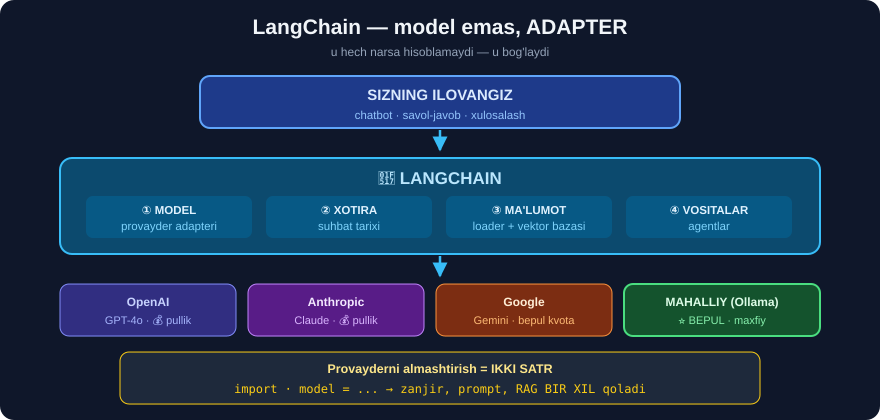

# 1-dars. LangChain kursiga kirish

## 🎬 Boshlashdan oldin

> **"Hammaga salom! OpenAI va LangChain bilan chat-ilovalar yaratish kursiga xush kelibsiz. Mening ismim Christina va men Shvetsiyaning Lund universitetida nazariy fizika bo'yicha magistr darajasiga egaman."**

---

## 1. ⚠️ Avval — bu bo'lim haqida MUHIM eslatma

**35–42-modullar** — bu aslida **alohida kurs**, u asosiy kursga **birlashtirilgan**. Shuning uchun:

```
① O'qituvchi BOSHQA  (Loren Newbould o'rniga Christina)
② 29–34-modullardagi ba'zi mavzular QAYTA tushuntiriladi
③ Modul raqamlari kurs ichida "1-bo'lim, 2-bo'lim..." deb ataladi
```

> ## 💡 **BIZNING TAVSIYAMIZ:** takrorlanadigan joylarni **tez o'ting**. Biz har darsda *"buni N-modulda ko'rgan edik"* deb **ko'rsatib boramiz**.

---

## 2. LLM nima — qisqacha takror

> **"LLM'lar — inson tilini qayta ishlay oladigan va insonga o'xshash javoblar yarata oladigan modellar. Nomdagi KATTA qismi bu modellar o'qitilgan ma'lumotning ulkan miqdoriga va natijada ularning ta'sirchan parametrlar soniga ishora qiladi."**

```
GPT-2  (2019)  →    1.5 milliard parametr  ·   40 GB matn
GPT-3  (2020)  →  175   milliard parametr  ·  570 GB matn
GPT-4  (2023)  →  ⚠️ OpenAI RASMAN E'LON QILMAGAN
```

> ## ⚠️⚠️ **KURSDA AYTILMAGAN, LEKIN MUHIM:** GPT-4 ning parametrlari soni — **rasmiy sir**. Internetdagi *"1.7 trillion"* kabi raqamlar — **taxmin**, tasdiqlanmagan.
>
> ## 🔑 **BU O'ZI HAM XABAR:** 2019-yilda modellar **ochiq** edi, 2023-dan boshlab — **yopiq**. Sanoat **yopilib** bormoqda.

> **"'Katta' so'zi aniq raqamlarga bog'lanmagan, balki shu ko'lamdagi modellar uchun umumiy atama."**

> ## 💡 **29-modulda bu batafsil ko'rilgan.** Agar u modulni o'tgan bo'lsangiz — bu darsni **tez o'qing**.

---

## 3. Chat-modellar

> **"Katta til modellarining bir qismi maxsus SUHBAT olib borishga o'qitilgan. Ular intuitiv ravishda CHAT-MODELLAR deb ataladi."**

```
TIL MODELI  (base)        CHAT MODELI  (instruct / chat)
────────────────────      ───────────────────────────────
"Bir bor ekan..."   →     "Salom! Sizga qanday yordam
matnni DAVOM ettiradi      bera olaman?"
                           SUHBAT olib boradi
```

> ## 🔑 **FARQ — QO'SHIMCHA O'QITISHDA.** Chat-model — bu **base** model + **instruction tuning** + **RLHF** *(insonlar bahosidan o'rganish)*.
>
> ## 💡 **31-modul, 4-darsda buni ko'rgan edik:** `text-davinci-002` *(base)* va `gpt-4o-mini` *(chat)* — **turlicha** API chaqiriladi.

---

## 4. ⚠️ Kurs GPT-4 ishlatadi — BU ESKIRGAN

> **"Bu kurs maxsus chatbotlar yaratish uchun GPT-4 modelidan foydalanadi."**

> ## ⚠️⚠️ **2026-YILDA `gpt-4` ENG YAXSHI TANLOV EMAS.**
>
> ```
> Kurs yozilganda (2024)  :  gpt-4  →  eng kuchli
> Bugun                   :  gpt-4  →  ESKI, QIMMAT, SEKIN
> ```
>
> ## ✅ **BUGUNGI TAVSIYA:**
> ```
> Arzon va tez     →  gpt-4o-mini        (⭐ o'rganish uchun ENG YAXSHI)
> Kuchli           →  gpt-4o
> Eng kuchli       →  o'sha paytdagi eng yangi model
> ```
>
> ## 💡 **YAXSHI XABAR — BU BITTA SATR:**
> ```python
> model = ChatOpenAI(model="gpt-4")        # kursdagi
> model = ChatOpenAI(model="gpt-4o-mini")  # ⭐ bizning tavsiya
> ```
> Kursning **qolgan hamma kodi** o'zgarmaydi.

---

## 5. ⭐⭐ LangChain nima?

> **"LangChain — katta til modellari bilan quvvatlanadigan ilovalarni UZLUKSIZ ishlab chiqishga imkon beruvchi FREYMVORK."**



```
┌─────────────────────────────────────────────────┐
│  SIZNING ILOVANGIZ                              │
├─────────────────────────────────────────────────┤
│  🔗 LANGCHAIN  — umumiy interfeys                │
├──────────┬──────────┬──────────┬────────────────┤
│  OpenAI  │ Anthropic│  Google  │  mahalliy...   │
│  GPT     │  Claude  │  Gemini  │  Llama, Qwen   │
└──────────┴──────────┴──────────┴────────────────┘
```

> ## 🔑 **LANGCHAIN — MODEL EMAS, ADAPTER.**
>
> U hech narsani **o'ylab topmaydi**. U turli provayderlar, ma'lumot manbalari va vositalarni **bitta interfeysga** keltiradi.

---

## 6. Uchta xususiyat — kursning O'Q ILDIZI

> **"Bizning e'tiborimiz butun kurs davomida STATEFUL, KONTEKSTGA XABARDOR va MULOHAZA QILA OLADIGAN chatbotlar yaratishga qaratiladi."**

| Xususiyat | Ingliz. | Nima degani | Qaysi modulda |
|---|---|---|---|
| **Holatli** | stateful | ## Oldingi suhbatni **eslaydi** | 39-modul |
| **Kontekstga xabardor** | context-aware | ## O'qitilmagan ma'lumot haqida **javob beradi** | 42-modul |
| **Mulohazali** | reasoning | ## Vositalarni **o'zi tanlaydi** | *(agentlar)* |

### 🔬 Nima uchun bu uchtasi ALOHIDA muammo?

```
① HOLATLI
   LLM — STATELESS. Har chaqiruv MUSTAQIL.
   💡 "Yechim": butun suhbatni HAR SAFAR qayta yuborish
   ⚠️ Narxi: tokenlar SONI o'sib boradi → PUL o'sadi
```

```
② KONTEKSTGA XABARDOR
   Model 2023-yilda o'qitilgan → sizning kompaniyangizni BILMAYDI
   💡 Yechim: RAG — kerakli matnni TOPIB, promptga QO'SHISH
   ⚠️ 31-modul 10-darsda buni QO'LDA yozgan edik
```

```
③ MULOHAZALI
   Model kalkulyator ham, brauzer ham EMAS
   💡 Yechim: vositalar (tools) + agent
   ⚠️ Eng NOISHONCHLI qism — model noto'g'ri vosita tanlashi mumkin
```

> ## ⚠️ **HALOL BAHO:** birinchi ikkitasi **ishonchli ishlaydi**. Uchinchisi — **agentlar** — 2026-da ham **tajribaviy**. Ishlab chiqarishda agentlarni **ehtiyotkorlik** bilan ishlating.

---

## 7. Qo'llash sohalari

> **"Bunday chatbotlarni qo'llash holatlari CHEKSIZ: bugungi eng muhim yangiliklarni xulosalash, ma'lumotlar bazasini oddiy til bilan so'rov qilish, ko'p manbali fakt tekshiruvchi qurish..."**

| G'oya | Realistik baho |
|---|---|
| Yangiliklarni xulosalash | ## ✅ **Ishonchli** — LLM'ning kuchli tomoni |
| Bazani oddiy tilda so'rov | ## ⚠️ **Ehtiyot** — noto'g'ri SQL **jim** ishlaydi |
| Ko'p manbali fakt tekshirish | ## ⚠️ **Qiyin** — LLM'ning o'zi **yolg'on to'qiydi** |
| Kurs bo'yicha savol-javob | ## ✅ **Ishonchli** — RAG uchun **ideal** vazifa |

> ## 💡 **QOIDA:** LLM **matn bilan matn** ustida ishlaganda **eng ishonchli**. **Haqiqat**, **hisob** yoki **qaror** talab qilinganda — **tekshiring**.

---

## 8. 🇺🇿 O'zbek tili uchun bu nimani anglatadi?

```
✅ ISHLAYDI       →  GPT-4o o'zbekchani TUSHUNADI va YOZADI
⚠️ QIMMATROQ      →  o'zbekcha matn KO'PROQ token oladi (36-modulda O'LCHAYMIZ)
⚠️ SIFAT PASTROQ  →  inglizchaga qaraganda kamroq o'qitilgan
✅ RAG ISHLAYDI   →  o'zbekcha hujjatlarni yuklash MUMKIN
```

> ## 🔑 **ENG MUHIM AMALIY MASLAHAT — SISTEM PROMPTNI INGLIZCHA YOZING:**
> ```python
> system = "You are a helpful assistant. Always answer in Uzbek."
> #          ↑ ko'rsatma inglizcha        ↑ javob o'zbekcha
> ```
> **Sabab:** ko'rsatmalarga bo'ysunish **inglizcha** matnda o'qitilgan. Ko'rsatma o'zbekcha bo'lsa — model uni **e'tiborsiz** qoldirishi mumkin.
>
> ## 💡 **Buni 39-modulda O'LCHAB solishtiramiz.**

---

## 9. ⚡ Mashqlar

### 🟢 Oson

**M1.** LangChain — model, freymvork yoki API?

**M2.** Uchta asosiy xususiyat qaysilar?

**M3.** GPT-3 nechta parametrga ega?

<details>
<summary>✅ Javoblar</summary>

**M1.** ## **Freymvork** *(adapter)*. U model **emas** va hech narsa **hisoblamaydi**.

**M2.** ## **Stateful** *(eslaydi)*, **context-aware** *(o'z ma'lumotingiz)*, **reasoning** *(vositalar)*.

**M3.** ## **175 milliard** *(570 GB matn)*. GPT-4 niki — **e'lon qilinmagan**.

</details>

### 🟡 O'rta

**M4.** ⭐ Nima uchun LLM "stateless"?

<details>
<summary>✅ Javoblar</summary>

Chunki har API chaqiruvi **mustaqil** — model oldingi chaqiruvni **eslamaydi**. "Xotira" — bu **illyuziya**: dastur butun suhbatni **har safar qayta yuboradi**.

```
1-savol:  [savol1]                              →  50 token
2-savol:  [savol1, javob1, savol2]              →  180 token
3-savol:  [savol1, javob1, savol2, javob2, ...] →  340 token
                                                     ↑
                                            NARX O'SIB BORADI
```

## ⚠️ **Shuning uchun 39-modulda "xotira" strategiyalari kerak bo'ladi** — butun tarixni yuborish **qimmat**.

</details>

**M5.** GPT-4 o'rniga qaysi modelni ishlatish kerak?

<details>
<summary>✅ Javob</summary>

## **`gpt-4o-mini`** — o'rganish uchun. U **ancha arzon**, **tezroq** va bu kursdagi barcha vazifalar uchun **yetarli**.

```python
ChatOpenAI(model="gpt-4o-mini")
```

</details>

### 🔴 Qiyin

**M6.** ⭐⭐ Uchta xususiyatning **ishonchlilik darajasini** baholang.

<details>
<summary>✅ Javob</summary>

```
STATEFUL          →  ✅ 95%  sof muhandislik, LLM'ga bog'liq emas
CONTEXT-AWARE     →  ⚠️ 75%  qidiruv topmasa — model YOLG'ON to'qiydi
                            (31-modulda ko'rgan edik: 0.487 ball
                             bilan noto'g'ri hujjat topilgan!)
REASONING         →  ⚠️ 50%  model noto'g'ri vosita tanlashi,
                            cheksiz sikl yasashi mumkin
```

## 🔑 **AMALIY QOIDA:** har uchala qatlamga **tekshiruv** qo'ying. 31-modulda RAG uchun **uchta himoya** qurgan edik: `stop_words`, `min_ball=0.15` va `"NOT FOUND"` ko'rsatmasi.

</details>

---

## 🧠 O'zini tekshirish

<details>
<summary>❓ LangChain LLM'ni almashtiradimi?</summary>

**Yo'q.** LangChain — **adapter**. U LLM'ni **chaqiradi**, unga **kontekst** beradi va javobni **formatlaydi**. Aql — **modelda**.
</details>

<details>
<summary>❓ Bu bo'lim 29–34-modullar bilan takrorlanadimi?</summary>

**Qisman ha.** Bu — alohida kurs, keyin birlashtirilgan. Biz har darsda takrorni **ko'rsatib boramiz**, shunda vaqtingizni tejaysiz.
</details>

---

## 📌 Xulosa

```
LANGCHAIN = ADAPTER
     ↓
┌────────────┬─────────────────┬──────────────┐
│  HOLATLI   │  KONTEKSTGA     │  MULOHAZALI  │
│            │  XABARDOR       │              │
│  xotira    │  RAG            │  agentlar    │
│  39-modul  │  42-modul       │  (tools)     │
│  ✅ 95%    │  ⚠️ 75%         │  ⚠️ 50%      │
└────────────┴─────────────────┴──────────────┘
```

---

## 🔖 Atamalar

| Atama | Inglizcha | Izoh |
|---|---|---|
| Freymvork | Framework | Ilova qurish uchun **tayyor karkas** |
| Holatli | Stateful | Oldingi holatni **eslaydi** |
| Holatsiz | Stateless | Har chaqiruv **mustaqil** |
| Kontekstga xabardor | Context-aware | O'qitilmagan ma'lumot bilan **ishlaydi** |
| Mulohaza | Reasoning | Vositalarni **o'zi tanlash** |
| Chat-model | Chat model | **Suhbat** uchun sozlangan LLM |

---

⬅️ [34-modul. XLNet fine-tuning](../34-Text-Classification-XLNet/README.md) · 🏠 [Modul boshiga](README.md) · ➡️ [2-dars. Biznes qo'llanmalari](02-Business-Applications.md)
