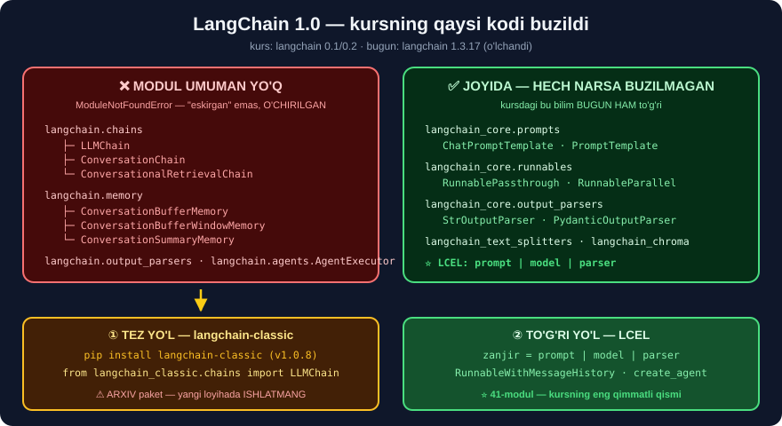

# 4-dars. Kurs nimalarni qamraydi ⭐⭐

## 🎬 Boshlashdan oldin

> **"Oxirgi darsda LangChain'ga qush parvozi nuqtai nazaridan qaradik. Endi qolgan qism uchun O'YIN REJASINI bayon qilaman."**

---

## 1. Yo'l xaritasi

| Modul | Mavzu | Nima o'rganasiz |
|---|---|---|
| **36** | Tokenlar, modellar, narxlar | Token nima, **qancha turadi** |
| **37** | Muhitni sozlash | Anaconda, ## **API kaliti** |
| **38** | OpenAI API | `client.chat.completions.create` |
| **39** | Model kirishlari | Prompt shablonlari, ## **xotira** |
| **40** | Chiqish parserlari | Matn → **ro'yxat**, **sana**, **obyekt** |
| **41** | LCEL | ## ⭐ **`|` operatori** — kursning YURAGI |
| **42** | RAG | ## ⭐⭐ **O'z ma'lumotingiz bilan chatbot** |
| *43–47* | *LangGraph* | *(alohida bo'lim)* |

---

## 2. ⚠️⚠️⚠️ ENG MUHIM OGOHLANTIRISH — LANGCHAIN 1.0 CHIQDI

Bu bo'limga kirishdan **oldin** siz bilishingiz kerak bo'lgan **eng muhim** narsa:

```
KURS YOZILGANDA  :  langchain 0.1 / 0.2
BUGUN            :  langchain 1.3.17          ← ⚠️ KATTA VERSIYA O'ZGARDI
```



### 💥 Biz TEKSHIRDIK — kursning KO'P importi ishlamaydi

```python
import importlib
for mod in ["langchain.chains", "langchain.memory", "langchain.output_parsers"]:
    try:
        importlib.import_module(mod); print("OK  ", mod)
    except ModuleNotFoundError:
        print("YO'Q", mod)
```

```
YO'Q langchain.chains
YO'Q langchain.memory
YO'Q langchain.output_parsers
```

> ## 💥💥 **UCHALA MODUL HAM UMUMAN MAVJUD EMAS.**
>
> Bu — "eskirgan" emas. Bu — **butunlay olib tashlangan**. Kursning quyidagi darslari **hech qanday o'zgarishsiz ISHLAMAYDI**:
> ```
> LLMChain                      →  ❌ langchain.chains da YO'Q
> ConversationChain             →  ❌ YO'Q
> ConversationBufferMemory      →  ❌ langchain.memory da YO'Q
> ConversationSummaryMemory     →  ❌ YO'Q
> ConversationalRetrievalChain  →  ❌ YO'Q
> DatetimeOutputParser          →  ❌ langchain.output_parsers da YO'Q
> AgentExecutor                 →  ❌ langchain.agents da YO'Q
> ```

### ✅ Va mana IKKI YO'L

```
① TEZ YO'L  —  langchain-classic
   pip install langchain-classic

   from langchain_classic.chains import LLMChain          ✅ ISHLAYDI
   from langchain_classic.memory import ConversationBufferMemory  ✅
   from langchain_classic.agents import AgentExecutor      ✅

   ⚠️ Bu — ARXIV paket. Yangi loyihada ISHLATMANG.
```

```
② TO'G'RI YO'L  —  LCEL (41-modul)

   zanjir = prompt | model | parser                       ⭐ ZAMONAVIY
   RunnableWithMessageHistory                             ⭐ xotira uchun
   langchain.agents.create_agent                          ⭐ agentlar uchun
```

> ## 🔑 **BIZNING STRATEGIYAMIZ HAR DARSDA:**
> ```
> ① KURSDAGI kodni ko'rsatamiz        (nima o'rgatilganini bilish uchun)
> ② langchain-classic varianti        (tez ishga tushirish uchun)
> ③ ⭐ ZAMONAVIY LCEL varianti         (haqiqiy loyihangiz uchun)
> ```

### Biz tekshirgan to'liq jadval

| Kursdagi | LangChain 1.x da | Zamonaviy o'rnini bosuvchi |
|---|---|---|
| `langchain.chat_models.ChatOpenAI` | ❌ | ## `langchain_openai.ChatOpenAI` |
| `langchain.chains.LLMChain` | ❌ | ## `prompt \| model` |
| `langchain.chains.ConversationChain` | ❌ | ## `RunnableWithMessageHistory` |
| `langchain.chains.ConversationalRetrievalChain` | ❌ | ## LCEL zanjiri *(42-modul)* |
| `langchain.memory.*` | ❌ | ## `InMemoryChatMessageHistory` |
| `langchain.output_parsers.DatetimeOutputParser` | ❌ | ## `langchain_classic` yoki qo'lda |
| `langchain.agents.AgentExecutor` | ❌ | ## `langchain.agents.create_agent` |
| `langchain_core.prompts.*` | ✅ **bor** | — |
| `langchain_core.runnables.*` | ✅ **bor** | — |
| `langchain_text_splitters.*` | ✅ **bor** | — |
| `langchain_chroma.Chroma` | ✅ **bor** | — |

> ## 💡 **YAXSHI XABAR:** `langchain_core` va `langchain_text_splitters` dagi **hamma narsa joyida**. Faqat **eski zanjir/xotira** sinflari ko'chirilgan.

---

## 3. Kurs nima deydi — mavzular bo'yicha

### 36-modul: Tokenlar va narxlar

> **"Biz LLM'ga uzatadigan matn miqdori TOKENLARGA aylanadi va OpenAI modellari token iste'moliga qarab narxlanadi."**

> ## 🇺🇿 **BIZ QO'SHAMIZ:** o'zbekcha matn **necha baravar** qimmatroq turishini **o'lchaymiz**. Bu — o'zbek dasturchisi uchun **eng amaliy** raqam.

### 37-modul: Muhit

> **"Anaconda muhitimizni tayyorlaymiz, OpenAI API kalitini olishni ko'rsatamiz."**

> ## ⚠️ **BIZ QO'SHAMIZ:** kurs `conda` ishlatadi. Biz `venv` va `uv` variantlarini ham beramiz — ular **yengilroq** va **tezroq**.

### 38-modul: OpenAI API

> **"OpenAI API asoslari bilan tanishamiz."**

> ## 💡 **31-modul 3–4-darslarida buni ko'rgan edik.** Faqat u yerda `openai.Completion` **eskirgani** aniqlangan edi.

### 39-modul: Model kirishlari

> **"Chat xabarlari, chat prompt shablonlari va FEW-SHOT prompting mavzusi. Keyin holatli chatbot yaratishga imkon beruvchi bir necha sinf."**

> ## ⚠️ **XOTIRA DARSLARI — ENG KO'P BUZILGAN QISM.** `langchain.memory` **butunlay yo'q**. Biz **uchala** variantni beramiz.

### 40-modul: Chiqish parserlari

> **"LLM javobini satr, ro'yxat yoki DateTime obyektiga qanday aylantirishni ko'rsatamiz."**

> ## ⭐ **BU — AMALIY JIHATDAN JUDA MUHIM.** LLM **matn** qaytaradi, dasturingiz esa **struktura** kutadi.

### 41-modul: LCEL

> **"LangChain Expression Language — barcha komponentlarni amalga oshirish uchun ishlatiladigan PROTOKOL. Bu muhim mavzu, chunki u kursning qolgan qismi uchun ZAMIN yaratadi."**

> ## 🏆 **KURSNING ENG QIMMATLI MODULI.** LCEL `langchain 1.x` da ham **to'liq ishlaydi** — ya'ni bu bilim **eskirmagan**.
>
> ```python
> zanjir = prompt | model | parser        # ⭐ HALI HAM TO'G'RI
> ```

### 42-modul: RAG

> **"Retrieval Augmented Generation — til modeliga oldin o'qitilmagan ma'lumotni AQLLI tarzda berish texnikasi."**

> ## 💡 **31-modul 10-darsida buni QO'LDA yozgan edik** — `TfidfVectorizer` + `cosine_similarity` bilan, **20 satrda**. Endi **professional** vositalar bilan qilamiz.

---

## 4. ⚠️ Kursning talablari — va bizning izohimiz

> **"Jupyter Notebook muhitida ishlaganimiz uchun, mashinangizda Anaconda va Jupyter Notebook o'rnatilgan bo'lishi kerak."**

| Talab | Kurs | Bizning izoh |
|---|---|---|
| Anaconda | ✅ shart | ## ⚠️ **Shart emas** — `venv` yetadi |
| Jupyter | ✅ shart | ✅ Qulay, lekin `.py` ham bo'ladi |
| Python bilimi | boshlang'ich–o'rta | ✅ To'g'ri |
| **OpenAI API kaliti** | ✅ shart | ## 💰 **PULLIK** — pastga qarang |

---

## 5. 💰💰 API kaliti bo'lmasa nima qilish kerak?

Bu — **eng ko'p beriladigan savol**, va kurs unga **javob bermaydi**.

```
OpenAI API  →  PULLIK  →  karta kerak  →  ⚠️ O'zbekistondan qiyin
```

### ✅ Uchta ishlaydigan yo'l

```
① OLLAMA — mahalliy, BEPUL, cheksiz          ⭐⭐ ENG YAXSHI
   pip install langchain-ollama
   ollama pull qwen2.5

   from langchain_ollama import ChatOllama
   model = ChatOllama(model="qwen2.5")
   #  ...qolgan HAMMA kurs kodi BIR XIL...

   ✅ Bepul · maxfiy · internetsiz
   ⚠️ ~5 GB disk, ~8 GB RAM
```

```
② HUGGING FACE — 32-moduldan tanish
   from langchain_huggingface import HuggingFacePipeline
   model = HuggingFacePipeline.from_model_id(
       model_id="Qwen/Qwen2.5-1.5B-Instruct", task="text-generation")

   ✅ Bepul · 32-modul bilimi ishlaydi
   ⚠️ Kichik modellar SIFATI past
```

```
③ MUQOBIL PROVAYDERLAR — bepul kvota beradiganlar
   Google AI Studio (Gemini)  →  langchain-google-genai
   Groq                       →  langchain-groq

   ✅ Bepul kvota bor
   ⚠️ Ma'lumot chet elga chiqadi
```

> ## 🏆 **BIZNING TAVSIYAMIZ — ① OLLAMA.**
>
> ```
> ✅ Kurs kodining 95% i O'ZGARISHSIZ ishlaydi
> ✅ Cheksiz eksperiment — narx haqida O'YLAMAYSIZ
> ✅ Ma'lumot chiqmaydi  →  O'zbekistondagi bank/tibbiy loyihalar uchun MUHIM
> ```
>
> ## ⚠️ **HALOL:** javob sifati `gpt-4o` dan **pastroq**. Lekin **o'rganish** uchun **yetarli** — siz **oqimni** o'rganasiz, model sifatini emas.
>
> ## 🇺🇿 **O'zbekcha uchun `qwen2.5` ni tanlang** — u `llama3.2` dan **ko'p tilli** ma'lumotda ko'proq o'qitilgan.

---

## 6. ⚡ Mashqlar

### 🟢 Oson

**M1.** Kursning eng muhim moduli qaysi?

**M2.** `langchain.memory` bugun mavjudmi?

**M3.** API kaliti bo'lmasa nima qilish mumkin?

<details>
<summary>✅ Javoblar</summary>

**M1.** ## **41-modul (LCEL)** — u qolgan hamma narsaning **zamini** va `langchain 1.x` da **to'liq ishlaydi**.

**M2.** ## ❌ **Yo'q** — `ModuleNotFoundError`. `langchain-classic` ga ko'chirilgan.

**M3.** ## **Ollama** *(mahalliy, bepul)* — kurs kodining **95% i o'zgarishsiz** ishlaydi.

</details>

### 🟡 O'rta

**M4.** ⭐⭐ Qaysi importlar ishlashini **o'zingiz** tekshiring.

<details>
<summary>✅ Yechim</summary>

```python
import importlib

TEKSHIRUV = [
    ("langchain.chains", "LLMChain"),
    ("langchain.memory", "ConversationBufferMemory"),
    ("langchain.output_parsers", "DatetimeOutputParser"),
    ("langchain.agents", "AgentExecutor"),
    ("langchain_openai", "ChatOpenAI"),
    ("langchain_core.prompts", "ChatPromptTemplate"),
    ("langchain_core.runnables", "RunnablePassthrough"),
    ("langchain_text_splitters", "RecursiveCharacterTextSplitter"),
    ("langchain_chroma", "Chroma"),
]
for mod, nom in TEKSHIRUV:
    try:
        m = importlib.import_module(mod)
        print(f"{'✅' if hasattr(m, nom) else '⚠️ '}  {mod}.{nom}")
    except ModuleNotFoundError:
        print(f"❌  {mod}.{nom}   (modul YO'Q)")
```

Bizning natijamiz:
```
❌  langchain.chains.LLMChain                     (modul YO'Q)
❌  langchain.memory.ConversationBufferMemory     (modul YO'Q)
❌  langchain.output_parsers.DatetimeOutputParser (modul YO'Q)
⚠️   langchain.agents.AgentExecutor
✅  langchain_openai.ChatOpenAI
✅  langchain_core.prompts.ChatPromptTemplate
✅  langchain_core.runnables.RunnablePassthrough
✅  langchain_text_splitters.RecursiveCharacterTextSplitter
✅  langchain_chroma.Chroma
```

## 🏆 **BU SKRIPTNI SAQLANG.** Har yangi versiyada uni **qayta ishga tushiring** — nima buzilganini **bir zumda** bilib olasiz.

</details>

**M5.** ⭐ `langchain-classic` ni sinang.

<details>
<summary>✅ Yechim</summary>

```bash
pip install langchain-classic
```

```python
from langchain_classic.chains import LLMChain, ConversationChain
from langchain_classic.memory import ConversationBufferMemory
from langchain_classic.agents import AgentExecutor
import langchain_classic
print("versiya:", langchain_classic.__version__)      # 1.0.8
print("✅ hammasi import bo'ldi")
```

## ⚠️ **BU — ARXIV PAKET.** LangChain jamoasi uni **rivojlantirmaydi**, faqat **eski kod ishlashi** uchun saqlaydi. **Yangi loyihada ishlatmang.**

</details>

### 🔴 Qiyin

**M6.** ⭐⭐ Ollama'ni o'rnatib, kurs kodini sinang.

<details>
<summary>✅ Yechim</summary>

```bash
# https://ollama.com dan o'rnating
ollama pull qwen2.5:1.5b        # kichik va tez (~1 GB)
```

```python
# pip install langchain-ollama
from langchain_ollama import ChatOllama
from langchain_core.prompts import ChatPromptTemplate
from langchain_core.output_parsers import StrOutputParser

model = ChatOllama(model="qwen2.5:1.5b", temperature=0)
prompt = ChatPromptTemplate.from_messages([
    ("system", "You are a helpful assistant. Always answer in Uzbek."),
    ("human", "{savol}"),
])
zanjir = prompt | model | StrOutputParser()          # ⭐ LCEL

print(zanjir.invoke({"savol": "Toshkent qaysi mamlakatda?"}))
```

## 🔑 **E'TIBOR BERING — SISTEM PROMPT INGLIZCHA, JAVOB O'ZBEKCHA.** Bu — 1-darsda aytgan tavsiyamiz.

## ⚠️ **Kichik model `1.5b` o'zbekchani ZO'RG'A biladi.** Agar RAM yetsa — `qwen2.5:7b` ni oling.

</details>

**M7.** ⭐⭐ Uchta variantning narxini solishtiring.

<details>
<summary>✅ Yechim</summary>

```python
def narx(kunlik_sorov, o_rt_kirish=500, o_rt_chiqish=200,
         kirish_1m=0.15, chiqish_1m=0.60):
    """gpt-4o-mini narxlari asosida (2025)."""
    oylik_k = kunlik_sorov * 30 * o_rt_kirish / 1e6
    oylik_c = kunlik_sorov * 30 * o_rt_chiqish / 1e6
    return oylik_k * kirish_1m + oylik_c * chiqish_1m

for n in [10, 100, 1000, 10000]:
    print(f"{n:6d} so'rov/kun  →  OpenAI ${narx(n):8.2f}/oy  ·  Ollama $0.00")
```

```
    10 so'rov/kun  →  OpenAI $    0.06/oy  ·  Ollama $0.00
   100 so'rov/kun  →  OpenAI $    0.59/oy  ·  Ollama $0.00
  1000 so'rov/kun  →  OpenAI $    5.85/oy  ·  Ollama $0.00
 10000 so'rov/kun  →  OpenAI $   58.50/oy  ·  Ollama $0.00
```

## 💡 **O'RGANISH UCHUN OPENAI ARZON** — oyiga bir necha sent.
## ⚠️ **LEKIN O'zbekistondan KARTA BOG'LASH qiyin** — shuning uchun Ollama **amaliy jihatdan** afzal.
## 🔑 **Ollama "bepul" emas — u SIZNING elektr va apparatingizni ishlatadi.** Lekin **belgilangan** xarajat, **o'zgaruvchan** emas.

</details>

---

## 🧠 O'zini tekshirish

<details>
<summary>❓ Kursning kodi bugun ishlaydimi?</summary>

**Qisman.** `langchain_core`, `langchain_openai`, `langchain_text_splitters` — **ishlaydi**. `langchain.chains`, `langchain.memory`, `langchain.output_parsers` — **umuman yo'q**. Yechim: `langchain-classic` *(tez)* yoki **LCEL** *(to'g'ri)*.
</details>

<details>
<summary>❓ Nima uchun LCEL eng muhim?</summary>

Chunki u **eskirmadi**. `prompt | model | parser` — `langchain 0.1` da ham, `1.x` da ham **bir xil ishlaydi**. Eski `Chain` sinflari esa **olib tashlandi**.
</details>

<details>
<summary>❓ Ollama bilan kursni tugatib bo'ladimi?</summary>

**Ha, 95%.** Siz **oqimni** o'rganasiz — prompt, zanjir, xotira, RAG. Bular **modeldan mustaqil**. Faqat javob **sifati** pastroq bo'ladi.
</details>

---

## 📌 Xulosa

```
                LANGCHAIN 1.0 KO'CHISHI
                ────────────────────────

   langchain.chains         ❌ YO'Q  →  langchain_classic.chains
   langchain.memory         ❌ YO'Q  →  langchain_classic.memory
   langchain.output_parsers ❌ YO'Q  →  langchain_classic.output_parsers
   langchain.agents.AgentExecutor  ❌  →  langchain.agents.create_agent

   langchain_core.*         ✅ JOYIDA
   langchain_openai.*       ✅ JOYIDA
   langchain_text_splitters ✅ JOYIDA
   LCEL  (prompt | model)   ✅ JOYIDA  ⭐ ENG QIMMATLI BILIM
```

| Modul | Kurs kodi bugun | Bizning yechim |
|---|---|---|
| 36 Tokenlar | ✅ nazariya | 🇺🇿 o'zbekcha narx **o'lchandi** |
| 37 Muhit | ⚠️ conda | `venv` / `uv` qo'shildi |
| 38 OpenAI API | ⚠️ qisman | zamonaviy sintaksis |
| 39 Kirishlar | ## ❌ **xotira buzilgan** | 3 variant |
| 40 Parserlar | ⚠️ qisman | zamonaviy |
| 41 LCEL | ## ✅ **to'liq ishlaydi** | — |
| 42 RAG | ## ❌ **zanjirlar buzilgan** | LCEL RAG |

---

## 🔖 Atamalar

| Atama | Inglizcha | Izoh |
|---|---|---|
| LCEL | LangChain Expression Language | `\|` operatori bilan **zanjir** qurish |
| Few-shot | Few-shot prompting | Promptda **misollar** berish |
| Migratsiya | Migration | Eski API'dan yangisiga **ko'chish** |
| Arxiv paket | Legacy package | Eski kod **ishlashi** uchun saqlanadi |
| Buzuvchi o'zgarish | Breaking change | Eski kodni **ishlamas** qiladigan o'zgarish |

---

⬅️ [3-dars. LangChain'ni nima kuchli qiladi](03-What-Makes-LangChain-Powerful.md) · 🏠 [Modul boshiga](README.md) · ➡️ [36-modul. Tokenlar, modellar va narxlar](../36-LangChain-Tokens-Models-Prices/README.md)
