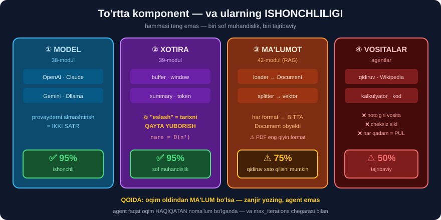
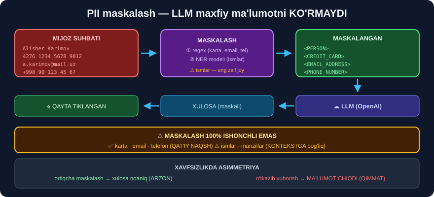

# 🔗 35-modul. LangChain'ga kirish

> ## ⚠️⚠️ **BU MODULNI O'QIMASDAN 36–42-MODULLARGA O'TMANG.**
>
> Bu yerda **eng muhim ogohlantirish** bor: **LangChain 1.0 chiqdi** va kursning **ko'p kodi endi ishlamaydi**. Biz nima buzilganini **o'lchab** ko'rsatamiz va **ikkita yechim** beramiz.

---

## 📚 Darslar

| # | Dars | Nima o'rganasiz |
|---|---|---|
| 1 | [Kursga kirish](01-Introduction-to-the-Course.md) | LLM, chat-model, ## **uchta xususiyat** |
| 2 | [Biznes qo'llanmalari](02-Business-Applications.md) ⭐ | Ally · Adyen · RoboCorp · ## **PII maskalash** |
| 3 | [LangChain'ni nima kuchli qiladi](03-What-Makes-LangChain-Powerful.md) ⭐ | To'rtta komponent va ## **ishonchliligi** |
| 4 | [Kurs nimalarni qamraydi](04-What-Does-the-Course-Cover.md) ⭐⭐ | ## 💥 **LangChain 1.0 migratsiyasi** |

---

## 📝 Amaliyot

| | |
|---|---|
| 📝 [**34 ta mashq**](MASHQLAR.md) | 🟢 Oson · 🟡 O'rta · 🔴 Qiyin |
| 🚀 [**5 ta mini-loyiha**](LOYIHALAR.md) | ⭐ **moslik skaneri** · PII quvuri · narx kalkulyatori · model fabrikasi · 🇺🇿 **suverenitet marshrutizatori** |

> ## ⭐ **HAMMASI API KALITISIZ ISHLAYDI.**

---

## 💥💥 Modulning eng muhim topilmasi


```
KURS YOZILGANDA  :  langchain 0.1 / 0.2
BIZ O'LCHAGANDA  :  langchain 1.3.17
```

### ❌ Bu modullar UMUMAN mavjud emas

```python
import importlib
for mod in ["langchain.chains", "langchain.memory", "langchain.output_parsers"]:
    try:
        importlib.import_module(mod); print("OK  ", mod)
    except ModuleNotFoundError:
        print("YO'Q", mod)
```

```
YO'Q langchain.chains
YO'Q langchain.memory
YO'Q langchain.output_parsers
```

| Kursdagi | Holat | Zamonaviy o'rnini bosuvchi |
|---|---|---|
| `langchain.chains.LLMChain` | ## ❌ | ## `prompt \| model` *(LCEL)* |
| `langchain.chains.ConversationChain` | ## ❌ | `RunnableWithMessageHistory` |
| `langchain.chains.ConversationalRetrievalChain` | ## ❌ | LCEL RAG zanjiri |
| `langchain.memory.*` | ## ❌ | `InMemoryChatMessageHistory` |
| `langchain.output_parsers.DatetimeOutputParser` | ## ❌ | `langchain_classic` |
| `langchain.agents.AgentExecutor` | ## ❌ | `langchain.agents.create_agent` |
| `langchain.chat_models.ChatOpenAI` | ## ❌ | `langchain_openai.ChatOpenAI` |
| `langchain_core.*` | ## ✅ | — |
| `langchain_text_splitters.*` | ## ✅ | — |
| `langchain_chroma.Chroma` | ## ✅ | — |
| ## **LCEL** `prompt \| model \| parser` | ## ✅ | ## ⭐ **eskirmagan** |

### ✅ Ikkita yechim

```
① TEZ YO'L                        ② TO'G'RI YO'L
   pip install langchain-classic      LCEL (41-modul)

   from langchain_classic.chains      zanjir = prompt | model | parser
        import LLMChain               RunnableWithMessageHistory
   from langchain_classic.memory      langchain.agents.create_agent
        import ConversationBufferMemory

   ⚠️ ARXIV paket (v1.0.8)           ⭐ kelajakda ham ishlaydi
      yangi loyihada ISHLATMANG
```

> ## 🔑 **BIZNING STRATEGIYAMIZ HAR DARSDA:**
> ```
> ① KURSDAGI kod        →  nima o'rgatilganini bilish
> ② langchain-classic   →  tez ishga tushirish
> ③ ⭐ ZAMONAVIY LCEL    →  haqiqiy loyihangiz
> ```

---

## 💰 API kaliti bo'lmasa — kursni BARIBIR tugatasiz

Bu — **eng ko'p beriladigan savol**, kurs unga **javob bermaydi**.

```
① OLLAMA  ⭐⭐ ENG YAXSHI
   ollama pull qwen2.5  +  pip install langchain-ollama
   model = ChatOllama(model="qwen2.5")
   ✅ bepul · maxfiy · internetsiz · kurs kodining 95% i O'ZGARISHSIZ

② HUGGING FACE  (32-moduldan tanish)
   HuggingFacePipeline.from_model_id(...)
   ✅ bepul  ⚠️ kichik modellar sifati past

③ BEPUL KVOTALI PROVAYDERLAR
   Google AI Studio (Gemini) · Groq
   ✅ bepul kvota  ⚠️ ma'lumot chet elga chiqadi
```

> ## 🇺🇿 **O'zbekcha uchun `llama3.2` EMAS, `qwen2.5` ni tanlang** — u ko'p tilli ma'lumotda **ko'proq** o'qitilgan.
>
> ## 🏆 **[4-loyiha](LOYIHALAR.md) — `ModelFabrika`** mavjud provayderni **avtomatik** tanlaydi. Kursda `ChatOpenAI(...)` yozilgan har yerda uni qo'ying.

---

## 🧭 LangChain — model emas, ADAPTER


```python
# OpenAI                                     # Ollama (bepul)
from langchain_openai import ChatOpenAI      from langchain_ollama import ChatOllama
model = ChatOpenAI(model="gpt-4o-mini")      model = ChatOllama(model="qwen2.5")

# ⭐ QOLGAN HAMMA KOD BIR XIL
zanjir = prompt | model | parser
```

> ## 🔑 **LangChain hech narsani "aqlliroq" qilmaydi.** Aql — **modelda**. LangChain unga **to'g'ri kontekst** yetkazadi.

---

## ⚖️ To'rtta komponent — teng EMAS



| Komponent | Ishonchlilik | Modul | Asosiy xavf |
|---|---|---|---|
| ① Model integratsiyasi | ## ✅ **95%** | 38 | — |
| ② Xotira | ## ✅ **95%** | 39 | ## **narx `O(n²)`** |
| ③ Ma'lumot *(RAG)* | ## ⚠️ **75%** | 42 | qidiruv **xato** qiladi |
| ④ Vositalar *(agentlar)* | ## ⚠️ **50%** | — | cheksiz sikl, noto'g'ri vosita |

> ## 💥 **"XOTIRA" — ILLYUZIYA.** Model hech narsa eslamaydi — dastur **butun tarixni qayta yuboradi**:
> ```
>   5 xabar →      900 token → $0.0001
>  20 xabar →   12,600 token → $0.0019
> 100 xabar →  303,000 token → $0.0455      ← 336× qimmat!
> ```
> ## ✅ **Yechim — `window` xotirasi** *(oxirgi N ta xabar)*: `O(n²)` → `O(n)`, ~88% tejash.

> ## ⚠️ **AGENTLAR — ENG NOISHONCHLI QISM.**
> ```
> Oqim OLDINDAN MA'LUM  →  ZANJIR yozing   (arzon, tez, ishonchli)
> Oqim HAQIQATAN noma'lum →  agent + max_iterations chegarasi
> ```

---

## 🛡️ Biznes holatlaridan chiqadigan NAQSH



| Kompaniya | Muammo | Texnika | Kim qaror qabul qiladi |
|---|---|---|---|
| **Ally Financial** | Maxfiy ma'lumot | ## **PII maskalash** | ## **Inson** |
| **Adyen** | Model kompaniyani bilmaydi | ## **RAG** | ## **Inson** |
| **RoboCorp** | Model API'ni bilmaydi | ## **RAG** | ## **Inson** |

> ## 🏆 **UCHALASIDA HAM LLM QAROR QABUL QILMAYDI — BU LOYIHA NAQSHI, TASODIF EMAS.**
> ```
> LLM TAKLIF QILADI  →  INSON TASDIQLAYDI
> ```
> Ishlab chiqarishda **shu bilan boshlang**, to'liq avtomatlashtirish bilan **emas**.

### 💥 Biz maskalashni yozdik va IKKITA XATO topdik

```
MASKALANGAN: Mijoz: Alisher Karimov, pochta <EMAIL_0>, karta <KARTA_0>,
             tel <TELEFON_0>, INN<TELEFON_1>
```

```
① "Alisher Karimov" MASKALANMADI
   →  ismlar uchun NAQSH yetarli emas — NER modeli SHART

② INN telefon deb topildi (<TELEFON_1>)
   →  TELEFON naqshi juda KENG edi
   ✅ Yechim: naqshlarni ANIQDAN KENGGA tartiblang
```

> ## 🔑 **XAVFSIZLIKDA ASIMMETRIYA:**
> ```
> Ortiqcha maskalash  →  xulosa biroz noaniq       (ARZON)
> O'tkazib yuborish   →  MAXFIY MA'LUMOT CHIQDI    (QIMMAT)
> ```
> Shuning uchun NER chegarasi **0.75**, `0.9` **emas** — 32-moduldagidan **pastroq**.

---

## 🇺🇿 O'zbekiston uchun alohida masala

> ## ⚠️⚠️ **OpenAI API ishlatilsa — MA'LUMOT AQSH SERVERLARIGA CHIQADI.**
>
> Bank, tibbiy va davlat ma'lumotlari uchun bu ko'pincha **qonuniy muammo**.

```
① MAHALLIY model   →  Ollama / HuggingFace  (32-modul: hammasi BEPUL)
                      ma'lumot SERVERINGIZDAN CHIQMAYDI

② PII maskalash    →  nozik joylarni almashtirib yuborish

③ GIBRID  ⭐        →  nozik so'rov MAHALLIY, umumiy so'rov API'da
```

> ## 🏆 **[5-loyiha](LOYIHALAR.md) — `SuverenitetMarshrutizator`** har so'rovni **avtomatik** baholaydi va **qayerga** yuborishni hal qiladi.
>
> ## ⚠️ **Bu — texnik naqsh, YURIDIK MASLAHAT EMAS.** Haqiqiy loyihada yuridik bo'lim va sohangiz regulyatori bilan **maslahatlashing**.

---

## 🗺️ 36–42-modullar uchun yo'l xaritasi

| Modul | Mavzu | Kurs kodi bugun |
|---|---|---|
| **36** | [Tokenlar, modellar, narxlar](../36-LangChain-Tokens-Models-Prices/README.md) | ✅ nazariya |
| **37** | Muhitni sozlash | ⚠️ `conda` → `venv` |
| **38** | OpenAI API | ⚠️ qisman eskirgan |
| **39** | Model kirishlari | ## ❌ **xotira buzilgan** |
| **40** | Chiqish parserlari | ⚠️ qisman |
| **41** | ## **LCEL** | ## ✅ **to'liq ishlaydi** ⭐ |
| **42** | RAG | ## ❌ **zanjirlar buzilgan** |

> ## 🏆 **41-MODUL (LCEL) — BU BO'LIMNING ENG QIMMATLI QISMI.** U **eskirmadi** va qolgan hamma narsaning **zamini**.

---

## 🎓 Modulni tugatgach

```
✅ LangChain nima ekanini (va NIMA EMASLIGINI) bilasiz
✅ Kursning qaysi kodi bugun ishlashini TEKSHIRA olasiz
✅ langchain-classic va LCEL orasidan TANLAY olasiz
✅ API kalitisiz ham kursni davom ettira olasiz
✅ PII maskalashning CHEKLOVLARINI bilasiz
✅ Xotira narxining O(n²) o'sishini tushunasiz
✅ Agentlarga qachon ISHONMASLIKNI bilasiz
✅ 🇺🇿 Ma'lumot suvereniteti masalasini hal qila olasiz
```

---

## 🔗 Bog'liq modullar

| Modul | Aloqasi |
|---|---|
| [31-modul](../31-GPT-Models/README.md) | RAG'ni **qo'lda** yozgan edik · `openai` API eskirishi |
| [32-modul](../32-HuggingFace-Transformers/README.md) | ⭐ **Bepul mahalliy modellar** · NER · `score > 0.9` |
| [33-modul](../33-BERT-Question-Answering/README.md) | Ishonch chegarasi · kesma vs generativ javob |
| [34-modul](../34-Text-Classification-XLNet/README.md) | Chipta yo'naltirish = **tasnif** vazifasi |
| [36-modul](../36-LangChain-Tokens-Models-Prices/README.md) | ➡️ **Keyingi:** tokenlar va narxlar |

---

⬅️ [34-modul. XLNet fine-tuning](../34-Text-Classification-XLNet/README.md) · 🏠 [Bosh sahifa](../README.md) · ➡️ [36-modul. Tokenlar, modellar, narxlar](../36-LangChain-Tokens-Models-Prices/README.md)
