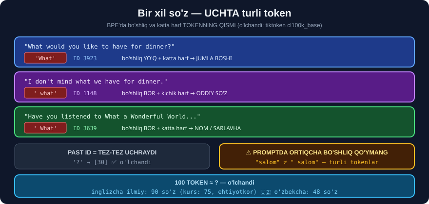
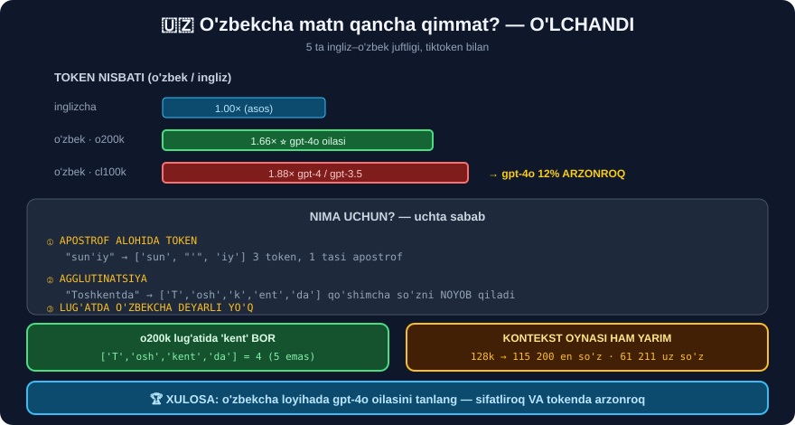

# 1-dars. Tokenlar ⭐⭐

## 🎬 Boshlashdan oldin

> **"Tokenizatsiya — matn kirishlari va chiqishlari TOKENLAR deb ataladigan belgilar ketma-ketligiga bo'linadigan jarayon. LLM ishlaydigan noyob tokenlar bu LLM ning LUG'ATINI tashkil qiladi."**

---

## 1. ⚙️ Tayyorgarlik

```bash
pip install tiktoken pandas
```

```python
import tiktoken, pandas as pd

enc  = tiktoken.get_encoding("cl100k_base")   # gpt-4, gpt-3.5-turbo
o200 = tiktoken.get_encoding("o200k_base")    # gpt-4o oilasi

print("cl100k_base lug'at:", enc.n_vocab)
print("o200k_base  lug'at:", o200.n_vocab)
```

```
cl100k_base lug'at: 100277
o200k_base  lug'at: 200019
```

> ## 🔑 **IKKI XIL TOKENIZATOR — VA BU MUHIM.** `gpt-4o` lug'ati **ikki baravar katta** *(200k vs 100k)*. 5-bo'limda buni **o'zbek tili uchun o'lchaymiz** — natija **kutilmagan** bo'ladi.
>
> ## 💡 **28, 32, 33, 34-MODULLARDA TOKENIZATSIYANI ALLAQACHON KO'RGAN EDIK:**
> ```
> BERT   →  WordPiece      ##bel      (davomni belgilaydi)
> XLNet  →  SentencePiece  ▁so'z      (boshini belgilaydi)
> GPT    →  BPE            ' so'z'    (bo'shliq TOKEN ICHIDA)
> ```

---

## 2. ⭐ Token ≈ so'zning 3/4 qismi — TEKSHIRAMIZ

> **"Token so'zning taxminan uchdan to'rt qismini tashkil qiladi. Buni eslashning oson yo'li — 100 TOKEN taxminan 75 SO'ZGA to'g'ri keladi."**

```python
INGLIZ = ("Machine learning is a field of study in artificial intelligence "
          "concerned with the development and study of statistical algorithms "
          "that can learn from data and generalize to unseen data and thus "
          "perform tasks without explicit instructions. Recently, artificial "
          "neural networks have been able to surpass many previous approaches "
          "in performance. Machine learning approaches have been applied to "
          "many fields including natural language processing, computer vision, "
          "speech recognition, email filtering, agriculture and medicine.")

n_t, n_w = len(enc.encode(INGLIZ)), len(INGLIZ.split())
print(f"so'zlar {n_w}   tokenlar {n_t}   so'z/token = {n_w/n_t:.3f}")
print(f"100 token ≈ {100*n_w/n_t:.1f} so'z     (kurs: 75)")
```

```
so'zlar 72   tokenlar 80   so'z/token = 0.900
100 token ≈ 90.0 so'z     (kurs: 75)
```

> ## 💥 **KURS EHTIYOTKORLIK QILGAN — BIZDA 90, KURSDA 75.**
>
> ## ✅ **VA BU YAXSHI:** narx **hisoblashda** kam baholashdan ko'ra **ko'p** baholash **xavfsizroq**.
>
> ## ⚠️ **AMMO NISBAT MATNGA BOG'LIQ:**
> ```
> Ilmiy/texnik matn  →  ~90 so'z / 100 token   (uzun, tanish so'zlar)
> Kod                →  ~40 so'z / 100 token   (belgilar ko'p)
> Emoji, URL         →  ~20 so'z / 100 token   (juda mayda bo'linadi)
> 🇺🇿 O'zbekcha       →  ~48 so'z / 100 token   ← 5-bo'limda O'LCHAYMIZ
> ```
> ## 🔑 **QOIDA:** taxmin qilmang — **`tiktoken` bilan o'lchang**. U **bir zumda** ishlaydi va **bepul**.

---

## 3. Nima uchun token so'z ham, harf ham emas?

> **"Tokenlarni kichraytirish LUG'ATINGIZNI qisqartiradi, bu esa modelni xotira jihatidan samaraliroq qiladi. Kattaroq tokenlar yaxshiroq kontekst berishi mumkin, lekin bu LUG'AT HAJMINING oshishi hisobiga bo'ladi."**

```
HARF darajasi           BPE (o'rtacha)          SO'Z darajasi
─────────────           ──────────────          ─────────────
lug'at ~100             lug'at ~100 000         lug'at ~1 000 000+
✅ hech qachon <unk>    ✅ muvozanat            ❌ noma'lum so'z = <unk>
❌ ketma-ketlik UZUN    ✅ o'rtacha             ✅ ketma-ketlik QISQA
❌ ma'no yo'q           ✅ ma'no qisman         ✅ ma'no to'liq
```

> ## 🔑 **VA BU — E'TIBOR MEXANIZMI SABABLI** *(30-modul)*. E'tibor narxi **`O(n²)`**:
> ```
> Harf darajasi:  1000 belgi  →  1000 token  →  1 000 000 amal
> BPE:            1000 belgi  →   250 token  →    62 500 amal   (16× tez!)
> ```
> ## 💡 **Tokenizatsiya — bu SIQISH.** Qanchalik yaxshi siqilsa, model shunchalik **arzon** va **tez** ishlaydi.

---

## 4. ⭐⭐ Kursning `what` misolini TAKRORLAYMIZ



> **"Quyidagi jumlada 'what' so'ziga alohida e'tibor bering."**

```python
for s in ["What would you like to have for dinner?",
          "I don't mind what we have for dinner.",
          "Have you listened to What a Wonderful World by Louis Armstrong?"]:
    ids = enc.encode(s)
    toks = [enc.decode([i]) for i in ids]
    w = [(i, t) for i, t in zip(ids, toks) if "hat" in t.lower()]
    print(f"{s}")
    print(f"   tokenlar: {len(ids)}   'what' tokeni: {w}")
```

```
What would you like to have for dinner?
   tokenlar: 9   'what' tokeni: [(3923, 'What')]
I don't mind what we have for dinner.
   tokenlar: 10   'what' tokeni: [(1148, ' what')]
Have you listened to What a Wonderful World by Louis Armstrong?
   tokenlar: 12   'what' tokeni: [(3639, ' What')]
```

> ## ✅✅ **KURSNING DA'VOSI TO'LIQ TASDIQLANDI.**

| Jumla | Token | ID | Nima uchun |
|---|---|---:|---|
| Boshida, katta harf | `'What'` | **3923** | bo'shliq **yo'q** + katta harf → **jumla boshi** |
| O'rtada, kichik harf | `' what'` | **1148** | bo'shliq **bor** + kichik → **oddiy so'z** |
| O'rtada, katta harf | `' What'` | **3639** | bo'shliq **bor** + katta → **nom/sarlavha** |

> ## 💥 **UCHTA TURLI ID — BIR XIL SO'Z UCHUN.**
>
> ```
> Model 'What' (3923) ni ko'rsa   →  "bu SAVOL boshi bo'lsa kerak"
> Model ' What' (3639) ni ko'rsa  →  "bu NOM ichida bo'lsa kerak"
> ```
>
> ## 🔑 **BO'SHLIQ TOKEN ICHIDA.** Bu — BPE ning BERT/XLNet dan **asosiy farqi**:
> ```
> BERT   →  ['what']         bo'shliq alohida ishlov oladi
> GPT    →  [' what']        ⭐ bo'shliq TOKENNING QISMI
> ```
> ## 💡 **AMALIY OQIBAT:** `"salom"` va `" salom"` — **turli tokenlar**. Prompt yozganda **ortiqcha bo'shliq** qo'ymang.

### `?` belgisi haqida

> **"Savol belgisi ham 30 ID'siga ega mustaqil token. Bu tez-tez uchraydigan token, shuning uchun uning ID raqami PAST."**

```python
print("'?' →", enc.encode("?"))
```

```
'?' → [30]
```

> ## ✅ **TASDIQLANDI — `?` = 30.**
>
> ## 🔑 **PAST ID = TEZ-TEZ UCHRAYDI.** BPE lug'ati **chastota** bo'yicha quriladi: eng ko'p uchraydigan bo'laklar **avval** qo'shiladi.
>
> ## 💡 **BUNI TEKSHIRISH MUMKIN:**
> ```python
> for s in ["?", " the", " undulating", " photosynthesis"]:
>     print(f"{s!r:20s} → {enc.encode(s)}")
> ```
> ID qanchalik **katta** bo'lsa — so'z shunchalik **noyob**.

---

## 5. 🇺🇿 O'ZBEK TILI QANCHA QIMMAT? — O'LCHADIK



Bu — kursda **yo'q**, lekin o'zbek dasturchisi uchun **eng amaliy raqam**.

```python
JUFTLIKLAR = [
    ("Machine learning is a field of artificial intelligence.",
     "Mashinali o'rganish — sun'iy intellekt sohasidir."),
    ("The weather in Tashkent is warm today.",
     "Bugun Toshkentda ob-havo issiq."),
    ("Please send me the report by tomorrow morning.",
     "Iltimos, hisobotni ertaga ertalabgacha yuboring."),
    ("Artificial intelligence is changing the world rapidly.",
     "Sun'iy intellekt dunyoni tez o'zgartirmoqda."),
    ("Our company was founded in 1978 in Tashkent.",
     "Kompaniyamiz 1978-yilda Toshkentda tashkil etilgan."),
]

q = []
for en, uz in JUFTLIKLAR:
    q.append({"cl100k_en": len(enc.encode(en)),  "cl100k_uz": len(enc.encode(uz)),
              "nisbat_cl": round(len(enc.encode(uz))/len(enc.encode(en)), 2),
              "o200k_en":  len(o200.encode(en)), "o200k_uz":  len(o200.encode(uz)),
              "nisbat_o200": round(len(o200.encode(uz))/len(o200.encode(en)), 2)})
d = pd.DataFrame(q)
print(d.to_string(index=False))
print(f"\nO'RTACHA  cl100k: {d.nisbat_cl.mean():.2f}×   o200k: {d.nisbat_o200.mean():.2f}×")
```

```
 cl100k_en  cl100k_uz  nisbat_cl  o200k_en  o200k_uz  nisbat_o200
         9         20       2.22         9        17         1.89
        11         13       1.18        10        11         1.10
         9         20       2.22         9        17         1.89
         9         20       2.22         8        17         2.12
        14         22       1.57        13        17         1.31

O'RTACHA  cl100k: 1.88×   o200k: 1.66×
```

> ## 💥💥 **O'ZBEKCHA MATN INGLIZCHADAN 1.88× KO'PROQ TOKEN OLADI.**
>
> **Ya'ni aynan bir xil ma'no uchun siz ~88% ko'proq to'laysiz.**

> ## ⭐ **VA MANA QIMMATLI TOPILMA — `gpt-4o` NING TOKENIZATORI YAXSHIROQ:**
> ```
> cl100k_base (gpt-4, gpt-3.5)  →  1.88×
> o200k_base  (gpt-4o oilasi)   →  1.66×      ⭐ 12% ARZONROQ
> ```
> **Sabab:** `o200k` lug'ati **ikki baravar katta** *(200k vs 100k)* va unda **ko'p tilli** bo'laklar **ko'proq**.
>
> ## 🔑 **AMALIY XULOSA:** o'zbekcha loyihada **`gpt-4o` oilasidan** *(shu jumladan `gpt-4o-mini`)* foydalaning — u **sifatliroq** ham, **tokenda arzonroq** ham.

### 🔬 Nima uchun shunday? — so'zlarga qarang

```python
for s in ["xursandman", "o'zgartirmoqda", "Toshkentda", "kompaniyamiz",
          "sun'iy", "hisobot"]:
    a = [enc.decode([i]) for i in enc.encode(s)]
    b = [o200.decode([i]) for i in o200.encode(s)]
    print(f"{s:18s} cl100k {len(a)}: {a}")
    print(f"{'':18s} o200k  {len(b)}: {b}")
```

```
xursandman         cl100k 4: ['x', 'urs', 'and', 'man']
                   o200k  4: ['x', 'urs', 'and', 'man']
o'zgartirmoqda     cl100k 8: ['o', "'", 'z', 'gart', 'irm', 'o', 'q', 'da']
                   o200k  7: ['o', "'", 'zg', 'art', 'irm', 'oq', 'da']
Toshkentda         cl100k 5: ['T', 'osh', 'k', 'ent', 'da']
                   o200k  4: ['T', 'osh', 'kent', 'da']
kompaniyamiz       cl100k 5: ['kom', 'pan', 'iy', 'am', 'iz']
                   o200k  5: ['kom', 'p', 'ani', 'yam', 'iz']
sun'iy             cl100k 3: ['sun', "'", 'iy']
                   o200k  3: ['sun', "'", 'iy']
hisobot            cl100k 2: ['his', 'obot']
                   o200k  2: ['his', 'obot']
```

> ## 💥 **UCHTA SABAB KO'RINIB TURIBDI:**
>
> ### ① APOSTROF ALOHIDA TOKEN
> ```
> "sun'iy"  →  ['sun', "'", 'iy']       3 ta token, 1 tasi — apostrof!
> ```
> O'zbek tilida apostrof **juda ko'p** uchraydi *(`o'`, `g'`, `'`)*, va u **har safar** alohida token.
>
> ### ② AGGLUTINATSIYA
> ```
> "Toshkent" + "da"        →  ['T','osh','k','ent','da']
> "kompaniya" + "miz"      →  ['kom','pan','iy','am','iz']
> ```
> O'zbekcha qo'shimchalar so'z **oxiriga yopishadi** — natijada har so'z **noyob** bo'lib qoladi va lug'atda **yo'q**.
>
> ### ③ LUG'ATDA O'ZBEKCHA DEYARLI YO'Q
> Faqat `hisobot` **ikki** tokenga bo'lindi — chunki `his` va `obot` boshqa tillarda ham **tez-tez** uchraydi.

> ## ⭐ **VA E'TIBOR BERING — `Toshkentda`:**
> ```
> cl100k:  ['T','osh','k','ent','da']    5 token
> o200k:   ['T','osh','kent','da']       4 token    ⭐ 'kent' BUTUN!
> ```
> `o200k` lug'atida `kent` **bor** — chunki u **ko'p tilli** matnda tez-tez uchraydi *(Tashkent, Kent, Chimkent...)*. Mana shundan **12% tejash** kelib chiqadi.

> ## 💡 **28-MODULNI ESLANG:** o'sha yerda o'zbekcha **stemming** yozgan edik va **agglutinatsiya** aynan shu muammoni tug'dirgan edi. Bu yerda u **pul** shaklida namoyon bo'ldi.

---

## 6. ⚡ Mashqlar

### 🟢 Oson

**M1.** Token so'zning qanchasi?

**M2.** `?` tokenining ID'si nechchi?

**M3.** Nima uchun `?` ID'si past?

<details>
<summary>✅ Javoblar</summary>

**M1.** ## **~3/4**. Kurs *"100 token ≈ 75 so'z"* deydi; biz inglizcha ilmiy matnda **90 so'z** o'lchadik.

**M2.** ## **30**.

**M3.** BPE lug'ati **chastota** bo'yicha quriladi — ko'p uchraydigan bo'laklar **avval** qo'shiladi va **past ID** oladi.

</details>

### 🟡 O'rta

**M4.** ⭐ O'z matningizni tokenlarga bo'ling.

<details>
<summary>✅ Yechim</summary>

```python
def tahlil(matn, enc=enc):
    ids = enc.encode(matn)
    toks = [enc.decode([i]) for i in ids]
    print(f"belgilar {len(matn)}  so'zlar {len(matn.split())}  tokenlar {len(ids)}")
    print(f"so'z/token = {len(matn.split())/len(ids):.3f}")
    for i, t in zip(ids[:20], toks[:20]):
        print(f"  {i:6d}  {t!r}")

tahlil("Sun'iy intellekt dunyoni o'zgartirmoqda.")
```

</details>

**M5.** ⭐⭐ Ikki tokenizatorni o'zbekchada solishtiring.

<details>
<summary>✅ Yechim</summary>

```python
MATN = ("Sun'iy intellekt sohasidagi so'nggi yutuqlar tibbiyot, "
        "ta'lim va moliya sohalarini tubdan o'zgartirmoqda.")
for nom, e in [("cl100k (gpt-4)", enc), ("o200k (gpt-4o)", o200)]:
    print(f"{nom:18s} {len(e.encode(MATN)):3d} token")
print(f"\ntejash: {(1 - len(o200.encode(MATN))/len(enc.encode(MATN))):.1%}")
```

## 🔑 **`gpt-4o` oilasi o'zbekcha uchun ARZONROQ.** Buni **o'z matningizda** o'lchang.

</details>

**M6.** ⭐ Apostrof narxini o'lchang.

<details>
<summary>✅ Yechim</summary>

```python
JUFT = [("o'zbek", "ozbek"), ("sun'iy", "suniy"),
        ("g'alaba", "galaba"), ("ma'lumot", "malumot")]
for a, b in JUFT:
    ta, tb = len(enc.encode(a)), len(enc.encode(b))
    print(f"{a:12s} {ta} token   {b:12s} {tb} token   farq +{ta-tb}")
```

## ⚠️ **APOSTROFSIZ YOZISH ARZONROQ — LEKIN QILMANG.** Bu **imlo xatosi** va model **ma'noni yomonroq tushunadi**. Narx tejash **arzimas**, sifat yo'qotish **jiddiy**.

## 💡 **HAQIQIY YECHIM:** `gpt-4o` tokenizatorli modelni tanlang, apostrofni **o'chirmang**.

</details>

**M7.** Turli matn turlarida nisbatni o'lchang.

<details>
<summary>✅ Yechim</summary>

```python
NAMUNALAR = {
    "ilmiy (en)":   "Machine learning algorithms generalize from data.",
    "oddiy (en)":   "Hey how are you doing today my friend",
    "kod":          "def hello(name): return f'Hello, {name}!'",
    "URL":          "https://github.com/langchain-ai/langchain/blob/master/README.md",
    "emoji":        "Salom 😊 bugun ajoyib kun 🌞🎉",
    "o'zbekcha":    "Sun'iy intellekt dunyoni o'zgartirmoqda",
}
for nom, s in NAMUNALAR.items():
    t, w = len(enc.encode(s)), len(s.split())
    print(f"{nom:12s} so'z {w:2d}  token {t:3d}  100 token ≈ {100*w/t:5.1f} so'z")
```

## 🔑 **HAR TUR UCHUN NISBAT BOSHQACHA.** *"75 so'z"* — faqat **inglizcha oddiy matn** uchun.

</details>

### 🔴 Qiyin

**M8.** ⭐⭐ Loyihangiz uchun token byudjeti kalkulyatorini yozing.

<details>
<summary>✅ Yechim</summary>

```python
class TokenByudjet:
    NARX = {"gpt-4o-mini": (0.15, 0.60), "gpt-4o": (2.50, 10.00)}
    ENC  = {"gpt-4o-mini": "o200k_base", "gpt-4o": "o200k_base",
            "gpt-4": "cl100k_base"}

    def __init__(self, model="gpt-4o-mini"):
        self.model = model
        self.enc = tiktoken.get_encoding(self.ENC[model])

    def hisobla(self, prompt_namunasi, javob_namunasi, kunlik_sorov):
        ki = len(self.enc.encode(prompt_namunasi))
        ch = len(self.enc.encode(javob_namunasi))
        ki_1m, ch_1m = self.NARX[self.model]
        kunlik = kunlik_sorov * (ki * ki_1m + ch * ch_1m) / 1e6
        return {"kirish_token": ki, "chiqish_token": ch,
                "kunlik_usd": round(kunlik, 4),
                "oylik_usd": round(kunlik * 30, 2),
                "yillik_usd": round(kunlik * 365, 2)}

b = TokenByudjet("gpt-4o-mini")
print(b.hisobla(
    prompt_namunasi="Siz bank yordamchisisiz. Mijoz savoli: Depozit foizi qancha?",
    javob_namunasi="Muddatli depozit yillik 18% dan 22% gacha foiz keltiradi.",
    kunlik_sorov=500))
```

## 🏆 **LOYIHANI BOSHLASHDAN OLDIN SHU HISOBNI QILING.** Ko'p loyiha *"narx qancha bo'ladi?"* savoliga **javobsiz** boshlanadi.

</details>

**M9.** ⭐⭐ O'zbekcha ustama narxini loyihangizda o'lchang.

<details>
<summary>✅ Yechim</summary>

```python
def uz_ustama(juftliklar, enc=enc):
    """juftliklar: [(inglizcha, o'zbekcha), ...] — O'Z matningizdan"""
    n = [len(enc.encode(uz)) / len(enc.encode(en)) for en, uz in juftliklar]
    import statistics as st
    print(f"o'rtacha {st.mean(n):.2f}×   median {st.median(n):.2f}×   "
          f"eng yomon {max(n):.2f}×")
    print(f"→ o'zbekcha loyiha {(st.mean(n)-1)*100:.0f}% QIMMATROQ")
    return n

uz_ustama(JUFTLIKLAR)
```

## ⚠️ **O'Z MATNINGIZDA O'LCHANG.** Bizning `1.88×` — **beshta jumla** bo'yicha. Sizning domeningizda boshqacha bo'lishi mumkin.

</details>

**M10.** ⭐⭐⭐ Token siqish strategiyasini sinab ko'ring.

<details>
<summary>✅ Yechim</summary>

```python
STRATEGIYALAR = {
    "asl":              lambda s: s,
    "ortiqcha bo'shliq": lambda s: " ".join(s.split()),
    "kichik harf":       lambda s: s.lower(),
    "tinishsiz":         lambda s: __import__("re").sub(r"[^\w\s']", "", s),
}
MATN = ("Sun'iy   intellekt,  ayniqsa  MASHINALI  o'rganish,   "
        "tibbiyot va ta'lim sohalarini!!!  tubdan o'zgartirmoqda...")

asos = len(enc.encode(MATN))
for nom, f in STRATEGIYALAR.items():
    t = len(enc.encode(f(MATN)))
    print(f"{nom:20s} {t:3d} token   {(1-t/asos):+6.1%}")
```

## ⚠️ **DIQQAT — SIQISH SIFATNI BUZISHI MUMKIN.**
```
✅ ortiqcha bo'shliq  →  BEXAVOTIR, ma'no o'zgarmaydi
⚠️ kichik harf        →  atoqli otlar YO'QOLADI
❌ tinish belgisiz    →  ma'no BUZILADI ("?" savolni bildiradi!)
```

## 🔑 **FAQAT BIRINCHISINI ISHLATING.** Qolganlari — 34-moduldagi `cleaner` xatosining **takrori**.

</details>

---

## 🧠 O'zini tekshirish

<details>
<summary>❓ Nima uchun bir xil so'z turli ID olishi mumkin?</summary>

Chunki **bo'shliq** va **katta harf** tokenning **qismi**. `'What'` *(3923)*, `' what'` *(1148)*, `' What'` *(3639)* — **uchta turli token**.
</details>

<details>
<summary>❓ O'zbekcha necha baravar qimmat?</summary>

## **1.88×** `cl100k` bilan *(gpt-4)*, ## **1.66×** `o200k` bilan *(gpt-4o)*. Sabab: **apostrof**, **agglutinatsiya** va lug'atda o'zbekcha **yo'qligi**.
</details>

<details>
<summary>❓ Apostrofni olib tashlash kerakmi?</summary>

**Yo'q.** Tejash **arzimas**, lekin **imlo buziladi** va model ma'noni **yomonroq** tushunadi. To'g'ri yechim — **`gpt-4o` oilasini tanlash**.
</details>

---

## 📌 Xulosa

```
MATN  →  BPE tokenizator  →  TOKENLAR  →  ID lar  →  MODEL

   Bo'shliq TOKEN ICHIDA:   'What'=3923 · ' what'=1148 · ' What'=3639
   Past ID = TEZ-TEZ:       '?' = 30

   100 token ≈  90 so'z   (inglizcha ilmiy)     kurs: 75 (ehtiyotkor)
   100 token ≈  48 so'z   🇺🇿 (o'zbekcha)
```

| | cl100k *(gpt-4)* | o200k *(gpt-4o)* |
|---|---|---|
| Lug'at | 100,277 | ## **200,019** |
| 🇺🇿 O'zbekcha ustama | ## **1.88×** | ## **1.66×** ⭐ |
| `Toshkentda` | 5 token | ## **4 token** |

> ## 🏆 **O'ZBEKCHA LOYIHADA `gpt-4o` OILASINI TANLANG** — sifatliroq **va** tokenda **12% arzonroq**.

---

## 🔖 Atamalar

| Atama | Inglizcha | Izoh |
|---|---|---|
| Token | Token | Matnning **eng kichik** birligi |
| Tokenizatsiya | Tokenization | Matnni tokenlarga **bo'lish** |
| BPE | Byte-Pair Encoding | GPT ishlatadigan **tokenizatsiya** usuli |
| Lug'at | Vocabulary | Model **biladigan** noyob tokenlar |
| Token ID | Token ID | Tokenning **raqamli** kodi |
| Agglutinatsiya | Agglutination | Qo'shimchalarning so'zga **yopishishi** |

---

⬅️ [35-modul. LangChain'ga kirish](../35-LangChain-Introduction/README.md) · 🏠 [Modul boshiga](README.md) · ➡️ [2-dars. Modellar va narxlar](02-Models-and-Prices.md)
