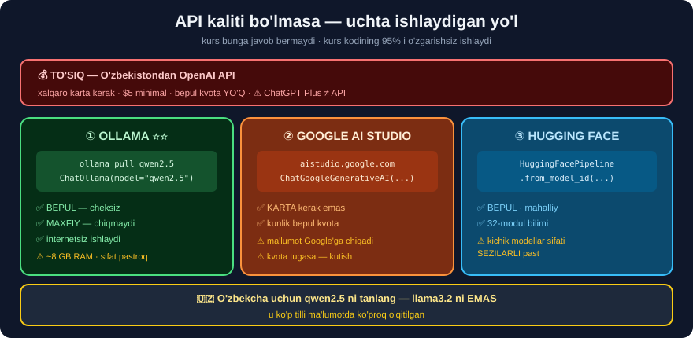

# 2-dars. OpenAI API kalitini olish

## 🎬 Boshlashdan oldin

> **"Bu dars OpenAI API kalitini olishga qaratilgan, bu bizga OpenAI'ning API va katta til modellaridan foydalanishga imkon beradi."**

---

## 1. Qadamlar

> **"Avval `openai.com` saytiga tashrif buyuring, API login ni tanlang va hisobingizga kiring yoki yarating. Keyin menyuga o'ting va API keys ni tanlang. So'ngra yangi maxfiy kalit yaratishni tanlang."**

```
① platform.openai.com  →  Sign up / Log in
② Settings → Billing   →  💳 to'lov usulini kiriting
③ API keys             →  Create new secret key
④ Nom bering           →  masalan "langchain-project"
⑤ ⚠️ KALITNI DARHOL NUSXALANG
```

> **"Diqqat qiling — bu oynani yopganingizdan keyin API kalitini QAYTA KO'RSATA OLMAYSIZ. Kalitni nusxalab, yangi matn fayliga joylashtiring, faylni kompyuteringizga saqlang va FAQAT SHUNDAN KEYIN oynani yoping."**

> ## ⚠️⚠️ **BU — HAQIQIY OGOHLANTIRISH.** Kalit **faqat bir marta** ko'rsatiladi. Yo'qotsangiz — **yangisini** yaratasiz.

---

## 2. 💰💰 Kurs aytmaydigan haqiqat — TO'LOV

> **"Settings ni tanlang, Billing ni tanlang va to'lov usulini kiriting."**

Kurs bu qatorni **bir jumlada** o'tib ketadi. Lekin O'zbekistondagi o'quvchi uchun bu — **eng katta to'siq**.

```
❌ Xalqaro karta kerak (Visa / Mastercard)
❌ O'zbekiston kartalari ko'pincha RAD ETILADI
❌ Minimal to'lov: $5
❌ Bepul kvota 2024-dan boshlab BERILMAYDI (yangi hisoblarga)
```

> ## ⚠️ **VA YANA BIR NOZIKLIK — API VA ChatGPT PLUS ALOHIDA.**
> ```
> ChatGPT Plus ($20/oy)  →  ❌ API'ga kirish BERMAYDI
> API kredit ($5+)        →  ✅ bu KERAK
> ```
> **Ko'p odam Plus obunasini API deb o'ylab, pul sarflaydi.**

---

## 3. ✅✅ API kalitisiz davom etish — UCHTA YO'L



Bu — kursda **umuman yo'q**, lekin **eng ko'p kerak bo'ladigan** ma'lumot.

### ① OLLAMA — ⭐⭐ ENG YAXSHI TANLOV

```bash
# 1) https://ollama.com dan o'rnating
ollama pull qwen2.5              # ~5 GB   (yoki qwen2.5:1.5b ~1 GB)

# 2)
pip install langchain-ollama
```

```python
from langchain_ollama import ChatOllama
model = ChatOllama(model="qwen2.5", temperature=0)
print(model.invoke("Toshkent qaysi mamlakatda?").content)
```

```
✅ BEPUL — cheksiz
✅ MAXFIY — ma'lumot kompyuteringizdan CHIQMAYDI
✅ INTERNETSIZ ishlaydi
✅ Kurs kodining 95% i O'ZGARISHSIZ
⚠️ Sifat gpt-4o dan pastroq
⚠️ ~8 GB RAM kerak (7B model uchun)
```

> ## 🇺🇿 **O'ZBEKCHA UCHUN `qwen2.5` NI TANLANG**, `llama3.2` ni **emas** — u ko'p tilli ma'lumotda **ko'proq** o'qitilgan.

### ② GOOGLE AI STUDIO — bepul kvota

```bash
pip install langchain-google-genai
```

```python
# https://aistudio.google.com  →  Get API key   (KARTASIZ!)
import os
os.environ["GOOGLE_API_KEY"] = "..."

from langchain_google_genai import ChatGoogleGenerativeAI
model = ChatGoogleGenerativeAI(model="gemini-2.0-flash")
```

```
✅ Karta KERAK EMAS
✅ Kunlik bepul kvota bor
⚠️ Ma'lumot Google serverlariga chiqadi
⚠️ Kvota tugasa — kutish kerak
```

### ③ HUGGING FACE — 32-moduldan tanish

```python
from langchain_huggingface import HuggingFacePipeline

model = HuggingFacePipeline.from_model_id(
    model_id="Qwen/Qwen2.5-1.5B-Instruct",
    task="text-generation",
    pipeline_kwargs={"max_new_tokens": 256})
```

```
✅ Bepul · mahalliy · 32-modul bilimi ishlaydi
⚠️ Kichik modellar sifati SEZILARLI past
```

> ## 🏆 **TAVSIYAMIZ:** ① **Ollama** bilan boshlang. Agar RAM yetmasa — ② **Google AI Studio**.

---

## 4. ⚠️⚠️ Kalit XAVFSIZLIGI — kurs YETARLI aytmaydi

> **"Agar token iste'molingizga mos kelmaydigan g'ayrioddiy xatti-harakatni sezsangiz, API kalitini DARHOL bekor qiling va yangisini yarating."**

Bu **to'g'ri**, lekin **kech** — ya'ni zarar **allaqachon** yetgan bo'ladi. Mana **oldini olish** yo'llari:

### 💥 Kalit qanday sizib chiqadi?

```
① GitHub'ga yuklash        ←  ⚠️ ENG KO'P UCHRAYDIGANI
② Notebook chiqishi        ←  print(os.environ) qildingiz va commit qildingiz
③ Skrinshot / ekran ulash  ←  darsda, vebinarda
④ Log fayllar              ←  xato xabari kalitni chiqarib yuboradi
⑤ Chatga nusxalash         ←  yordam so'raganda
```

> ## 💥💥 **GITHUB SIZNING KALITINGIZNI SONIYALAR ICHIDA TOPADI.**
>
> Botlar GitHub'ni **doimiy** skanerlaydi. Yuklangan kalit **daqiqalar** ichida ishlatila boshlaydi. Hisobingizda **yuzlab dollar** hosil bo'lishi mumkin.
>
> ## ✅ **OpenAI ham skanerlaydi** va topilgan kalitni **avtomatik bekor qiladi** — lekin **doim ulgurmaydi**.

### ✅ Beshta himoya

```
① .gitignore ga .env ni QO'SHING          ← ⭐ ENG MUHIMI
② Kalitni HECH QACHON kodda yozmang
③ Kalitga LIMIT qo'ying (OpenAI panelida)
④ Har loyihaga ALOHIDA kalit
⑤ Chiqishlarni tekshiring: print(os.environ) QILMANG
```

> ## 💥 **KURS `.gitignore` NI UMUMAN ESLATMAYDI — BU JIDDIY KAMCHILIK.**

```gitignore
# .gitignore
.env
.env.*
!.env.example
*.key
secrets/
.ipynb_checkpoints/
```

---

## 5. ⭐ Kalitni TEKSHIRUVCHI kod

```python
import re, os

NAQSHLAR = {
    "OpenAI":     r"sk-[A-Za-z0-9_-]{20,}",
    "Anthropic":  r"sk-ant-[A-Za-z0-9_-]{20,}",
    "Google":     r"AIza[A-Za-z0-9_-]{30,}",
    "HuggingFace": r"hf_[A-Za-z0-9]{30,}",
}

def kalit_qidir(matn):
    """Matnda API kaliti bormi?"""
    topildi = []
    for nom, n in NAQSHLAR.items():
        for m in re.findall(n, matn):
            topildi.append((nom, m[:8] + "..." + m[-4:]))
    return topildi


def fayllarni_tekshir(papka=".", kengaytmalar=(".py", ".ipynb", ".md", ".txt")):
    """Loyihada sizib chiqqan kalit bormi?"""
    from pathlib import Path
    ogoh = []
    for p in Path(papka).rglob("*"):
        if p.suffix not in kengaytmalar or ".git" in p.parts:
            continue
        try:
            t = p.read_text(encoding="utf-8", errors="ignore")
        except Exception:
            continue
        for nom, m in kalit_qidir(t):
            ogoh.append((str(p), nom, m))
    if ogoh:
        print("💥💥 KALIT TOPILDI — DARHOL BEKOR QILING:")
        for f, nom, m in ogoh:
            print(f"   {f}  →  {nom}  {m}")
    else:
        print("✅ Sizib chiqqan kalit topilmadi")
    return ogoh

fayllarni_tekshir()
```

> ## 🏆 **BU SKRIPTNI HAR COMMIT'DAN OLDIN ISHGA TUSHIRING.**
>
> ## 💡 **YOKI AVTOMATLASHTIRING — `pre-commit` hook bilan:**
> ```bash
> pip install detect-secrets
> detect-secrets scan > .secrets.baseline
> ```

---

## 6. 🔒 Kalit sizib chiqsa — NIMA QILISH KERAK

```
① DARHOL bekor qiling
   platform.openai.com → API keys → Revoke

② Yangi kalit yarating

③ Hisobni tekshiring
   Usage → oxirgi 24 soat  →  g'ayrioddiy sarf bormi?

④ Git tarixidan O'CHIRING  ←  ⚠️ MUHIM
   Faylni o'chirish YETARLI EMAS — u TARIXDA qoladi!

   pip install git-filter-repo
   git filter-repo --path .env --invert-paths --force

   ⚠️ Bu tarixni QAYTA YOZADI — jamoa bilan kelishing

⑤ .gitignore ni to'g'rilang
```

> ## 💥 **④ — ENG KO'P UNUTILADIGAN QADAM.** `git rm .env` faylni **hozirgi holatdan** o'chiradi, lekin **tarixda** qoladi va **hamma ko'ra oladi**.

---

## 7. ⚡ Mashqlar

### 🟢 Oson

**M1.** API kalitini necha marta ko'rish mumkin?

**M2.** ChatGPT Plus API'ga kirish beradimi?

**M3.** API kalitisiz kursni davom ettirish mumkinmi?

<details>
<summary>✅ Javoblar</summary>

**M1.** ## **Bir marta** — yaratilgan paytda. Keyin **hech qachon**.

**M2.** ## ❌ **Yo'q.** Bular **alohida** xizmatlar. API uchun **alohida kredit** kerak.

**M3.** ## ✅ **Ha** — Ollama, Google AI Studio yoki HuggingFace bilan. Kurs kodining **95% i** o'zgarishsiz ishlaydi.

</details>

### 🟡 O'rta

**M4.** ⭐ Kalit tekshiruvchini sinang.

<details>
<summary>✅ Yechim</summary>

```python
SINOV = """
Mening kodim:
    client = OpenAI(api_key="sk-proj-abcdefghij1234567890KLMNOP")
va Google uchun AIzaSyD-1234567890abcdefghijklmnopqrstuv
"""
for nom, m in kalit_qidir(SINOV):
    print(f"💥 {nom}: {m}")
```

```
💥 OpenAI: sk-proj-...MNOP
💥 Google: AIzaSyD-...stuv
```

## ✅ **Ikkalasi ham topildi.**

</details>

**M5.** ⭐ `.gitignore` faylini yarating.

<details>
<summary>✅ Yechim</summary>

```python
GITIGNORE = """\
# Maxfiy ma'lumot
.env
.env.*
!.env.example
*.key
secrets/

# Python
__pycache__/
*.py[cod]
.venv/
venv/
langchain_env/

# Jupyter
.ipynb_checkpoints/

# Ma'lumot va model
*.db
chroma_db/
*.faiss
"""
from pathlib import Path
Path(".gitignore").write_text(GITIGNORE, encoding="utf-8")
print("✅ .gitignore yaratildi")
```

## ⚠️ **`!.env.example` QATORIGA E'TIBOR BERING** — bu **namuna** faylni **saqlaydi**, unda kalit **yo'q**, faqat nomlar bor.

</details>

**M6.** ⭐ `.env.example` yarating.

<details>
<summary>✅ Yechim</summary>

```python
NAMUNA = """\
# Bu faylni .env deb nusxalang va o'z kalitlaringizni qo'ying
OPENAI_API_KEY="sk-..."
# ANTHROPIC_API_KEY="sk-ant-..."
# GOOGLE_API_KEY="AIza..."
"""
from pathlib import Path
Path(".env.example").write_text(NAMUNA, encoding="utf-8")
```

## 🔑 **`.env.example` — JAMOA ISHI UCHUN STANDART.** Yangi dasturchi **qanday** o'zgaruvchilar kerakligini **darhol** biladi.

</details>

### 🔴 Qiyin

**M7.** ⭐⭐ Loyihangizni sizib chiqqan kalitga tekshiring.

<details>
<summary>✅ Yechim</summary>

```python
from pathlib import Path

def toliq_tekshir(papka="."):
    natija = fayllarni_tekshir(papka)

    gi = Path(papka) / ".gitignore"
    if not gi.exists():
        print("⚠️  .gitignore YO'Q!")
    else:
        t = gi.read_text(encoding="utf-8")
        for k in [".env", "*.key"]:
            print(f"{'✅' if k in t else '⚠️ '} .gitignore da {k}")

    if (Path(papka) / ".env").exists():
        print("✅ .env fayli bor")
        if gi.exists() and ".env" not in gi.read_text(encoding="utf-8"):
            print("💥💥 .env BOR, LEKIN .gitignore da YO'Q — XAVF!")
    return natija

toliq_tekshir()
```

</details>

**M8.** ⭐⭐ Git tarixida kalit bormi?

<details>
<summary>✅ Yechim</summary>

```bash
# Tarixda .env bo'lganmi?
git log --all --full-history -- .env

# Har qanday commit'da "sk-" bormi?
git grep -n "sk-[A-Za-z0-9]" $(git rev-list --all) 2>/dev/null | head
```

## 💥 **AGAR TOPILSA — KALIT ALLAQACHON SIZIB CHIQQAN.** Uni **bekor qiling**, keyin tarixni tozalang.

</details>

**M9.** ⭐⭐⭐ Provayder tanlash yordamchisini yozing.

<details>
<summary>✅ Yechim</summary>

```python
import os, importlib.util, shutil

def provayder_maslahati():
    print("=" * 56)
    variantlar = []

    if os.getenv("OPENAI_API_KEY"):
        variantlar.append(("OpenAI", "gpt-4o-mini", "💰 pullik", 1))
    if os.getenv("GOOGLE_API_KEY"):
        variantlar.append(("Google", "gemini-2.0-flash", "bepul kvota", 2))
    if shutil.which("ollama"):
        variantlar.append(("Ollama", "qwen2.5", "✅ BEPUL, mahalliy", 3))
    if importlib.util.find_spec("transformers"):
        variantlar.append(("HuggingFace", "Qwen2.5-1.5B", "✅ BEPUL", 4))

    if not variantlar:
        print("❌ Hech qanday provayder topilmadi.\n")
        print("TAVSIYA:")
        print("  1) https://ollama.com  →  o'rnating")
        print("  2) ollama pull qwen2.5")
        print("  3) pip install langchain-ollama")
        return None

    for nom, m, narx, _ in variantlar:
        print(f"✅ {nom:12s} {m:22s} {narx}")

    eng = min(variantlar, key=lambda x: x[3])
    print(f"\n⭐ TAVSIYA: {eng[0]} ({eng[1]})")
    print("=" * 56)
    return eng

provayder_maslahati()
```

## 🏆 **BU FUNKSIYANI HAR YANGI MUHITDA ISHGA TUSHIRING** — nimadan foydalanish mumkinligini **darhol** bilib olasiz.

</details>

---

## 🧠 O'zini tekshirish

<details>
<summary>❓ Kalitni yo'qotsam nima bo'ladi?</summary>

**Yangisini yaratasiz.** Eskisi **ko'rsatilmaydi**. Uni bekor qilishni **unutmang**.
</details>

<details>
<summary>❓ Kalitni GitHub'ga yuklab yubordim. Nima qilay?</summary>

```
① DARHOL bekor qiling
② Yangi kalit yarating
③ Usage sahifasini tekshiring
④ Git TARIXIDAN o'chiring (git filter-repo)  ← unutilmasin!
⑤ .gitignore ni to'g'rilang
```
</details>

<details>
<summary>❓ Kartam qabul qilinmadi. Nima qilay?</summary>

**Ollama** ga o'ting — **bepul**, **cheksiz**, **maxfiy** va kurs kodining **95% i** o'zgarishsiz ishlaydi.
</details>

---

## 📌 Xulosa

```
API KALITI OLISH
   platform.openai.com → Billing → API keys → Create
   ⚠️ FAQAT BIR MARTA ko'rsatiladi

💰 TO'LOV MUAMMOSI (O'zbekiston)
   ⚠️ xalqaro karta · $5 minimal · bepul kvota YO'Q
   ⚠️ ChatGPT Plus ≠ API

✅ KALITSIZ DAVOM ETISH
   ① Ollama  ⭐⭐ bepul, maxfiy, cheksiz
   ② Google AI Studio — kartasiz bepul kvota
   ③ HuggingFace — mahalliy

🔒 XAVFSIZLIK  (kursda YETARLI aytilmagan)
   .gitignore → .env          ⭐ ENG MUHIMI
   kalitga LIMIT qo'ying
   commit'dan oldin TEKSHIRING
   sizib chiqsa → bekor + TARIXDAN o'chirish
```

---

## 🔖 Atamalar

| Atama | Inglizcha | Izoh |
|---|---|---|
| API kaliti | API key | Xizmatga **kirish** uchun maxfiy satr |
| Bekor qilish | Revoke | Kalitni **ishlamas** qilish |
| Sizib chiqish | Leak | Maxfiy ma'lumotning **oshkor** bo'lishi |
| Sarf limiti | Usage limit | Oylik **maksimal** xarajat |
| Bepul kvota | Free tier | To'lovsiz **cheklangan** foydalanish |

---

⬅️ [1-dars. Anaconda muhiti](01-Setting-Up-Anaconda-Environment.md) · 🏠 [Modul boshiga](README.md) · ➡️ [3-dars. Kalitni muhit o'zgaruvchisi qilish](03-Setting-the-API-Key-as-Environment-Variable.md)
