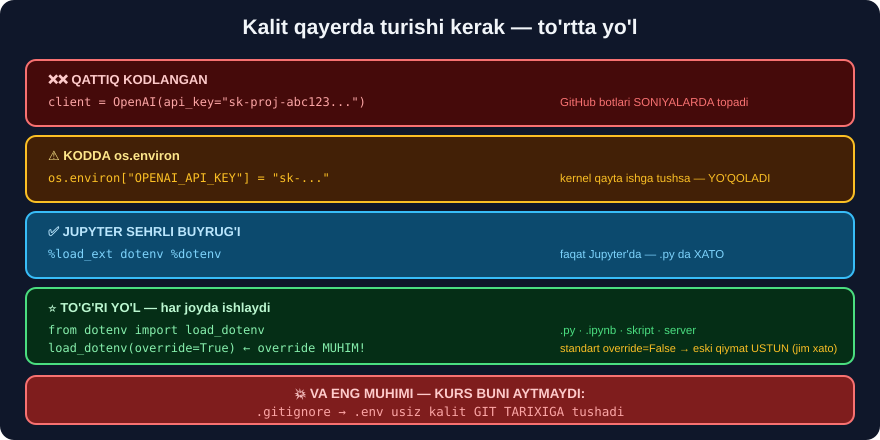

# ⚙️ 37-modul. Muhitni sozlash

> **Bu modul kodsizdek ko'rinadi — lekin aynan u yerda eng ko'p vaqt yo'qoladi.** Va bu yerda kurs **eng muhim** narsani aytmaydi: ## **`.gitignore`**.

---

## 📚 Darslar

| # | Dars | Nima o'rganasiz |
|---|---|---|
| 1 | [Anaconda muhitini sozlash](01-Setting-Up-Anaconda-Environment.md) | `conda` · ## **`venv`** · ## **`uv`** · versiyani qotirish |
| 2 | [OpenAI API kalitini olish](02-Obtaining-an-OpenAI-API-Key.md) ⭐ | ## 💰 **kalitsiz davom etish** · kalit xavfsizligi |
| 3 | [Kalitni muhit o'zgaruvchisi qilish](03-Setting-the-API-Key-as-Environment-Variable.md) ⭐⭐ | `.env` · ## 💥 **`override` jim xatosi** · `.gitignore` |

---

## 📝 Amaliyot

| | |
|---|---|
| 📝 [**28 ta mashq**](MASHQLAR.md) | 🟢 Oson · 🟡 O'rta · 🔴 Qiyin |
| 🚀 [**4 ta mini-loyiha**](LOYIHALAR.md) | ⭐ **muhit doktori** · 🔒 **maxfiylik auditi** · loyiha skeleti · muhit snapshot |

> ## ⭐ **HAMMASI API KALITISIZ ISHLAYDI** — bu modul **muhit** haqida.

---

## 💰 API kaliti bo'lmasa — UCHTA ISHLAYDIGAN YO'L


Kurs *"to'lov usulini kiriting"* deb bir jumlada o'tib ketadi. O'zbekistondagi o'quvchi uchun bu — **eng katta to'siq**.

```
❌ Xalqaro karta kerak · $5 minimal · bepul kvota YO'Q
⚠️ ChatGPT Plus ($20/oy) ≠ API kirish   ←  ko'p odam adashadi
```

| Yo'l | Narx | Maxfiylik | Sifat |
|---|---|---|---|
| ## ⭐⭐ **Ollama** | ## ✅ **bepul, cheksiz** | ## ✅ **chiqmaydi** | ⚠️ pastroq |
| **Google AI Studio** | ✅ bepul kvota *(kartasiz)* | ⚠️ Google'ga | ✅ yaxshi |
| **HuggingFace** | ✅ bepul | ✅ mahalliy | ⚠️ sezilarli past |

```python
from langchain_ollama import ChatOllama
model = ChatOllama(model="qwen2.5")       # ⭐ 🇺🇿 llama3.2 EMAS
#  ...kurs kodining 95% i O'ZGARISHSIZ...
```

> ## 🇺🇿 **O'zbekcha uchun `qwen2.5`** — u ko'p tilli ma'lumotda **ko'proq** o'qitilgan.

---

## 💥💥 Modulning eng muhim topilmasi — `override` JIM XATOSI

Kurs faqat `%dotenv` ni ko'rsatadi. Biz `python-dotenv` ni **to'liq** sinab ko'rdik:

```python
os.environ["MENING_KALITIM"] = "QO'LDA"

load_dotenv()
print("override=False (standart):", os.getenv("MENING_KALITIM"))
load_dotenv(override=True)
print("override=True            :", os.getenv("MENING_KALITIM"))
```

```
override=False (standart): QO'LDA
override=True            : oddiy_qiymat
```

> ## 💥💥 **AGAR O'ZGARUVCHI ALLAQACHON MAVJUD BO'LSA — `.env` UNI ALMASHTIRMAYDI.**
>
> ```
> Siz .env ni tahrirlaysiz   →  yangi kalit yozasiz
> load_dotenv() chaqirasiz   →  ✅ "ishladi" deb o'ylaysiz
> Aslida esa                 →  💥 ESKI qiymat ishlatilmoqda
> ```
>
> ## 🔑 **XATO CHIQMAYDI, OGOHLANTIRISH CHIQMAYDI.**
>
> ## ✅ **YECHIM:** `load_dotenv(override=True)`.

### Yana ikkita foydali topilma

```python
print(dotenv_values(".env"))
```
```
OrderedDict({'OPENAI_API_KEY': 'sk-test-abc123',
             'MENING_KALITIM': 'oddiy_qiymat',
             'BOSHQA': "bo'shliq bilan"})
```

```
✅ dotenv_values()  →  muhitni O'ZGARTIRMAY o'qiydi (nosozlik tuzatish uchun XAVFSIZ)
✅ " = " atrofidagi bo'shliqlar tozalanadi
✅ Qo'shtirnoq ichidagi apostrof muammo tug'dirmaydi   ← 🇺🇿 muhim
```

---

## 🔒 Kurs UMUMAN aytmaydigan narsa — `.gitignore`



> ## 💥💥 **KURS `.env` NI YARATISHNI KO'RSATADI, LEKIN `.gitignore` NI ESLATMAYDI.**
>
> Bu — **eng ko'p uchraydigan kalit sizib chiqish sababi**.

```gitignore
.env
.env.*
!.env.example
*.key
secrets/
.ipynb_checkpoints/
```

### 💥 Kalit qanday sizib chiqadi?

```
① GitHub'ga yuklash        ←  ⚠️ ENG KO'P UCHRAYDIGANI
② Notebook CHIQISHI        ←  print(os.environ) qildingiz va commit qildingiz
③ Skrinshot / ekran ulash
④ Log fayllar
⑤ Chatga nusxalash
```

> ## 💥 **GITHUB BOTLARI KALITINGIZNI SONIYALAR ICHIDA TOPADI.** Yuklangan kalit **daqiqalar** ichida ishlatila boshlaydi.

### Sizib chiqsa — beshta qadam

```
① DARHOL bekor qiling (revoke)
② Yangi kalit yarating
③ Usage sahifasini tekshiring
④ ⚠️ GIT TARIXIDAN o'chiring        ←  ENG KO'P UNUTILADIGANI
   git filter-repo --path .env --invert-paths --force
⑤ .gitignore ni to'g'rilang
```

> ## 💥 **`git rm .env` YETARLI EMAS** — fayl **tarixda qoladi** va **hamma ko'ra oladi**.

---

## 🛠️ Kursning `conda` yo'li — va uchta muqobil

| Usul | Hajm | Tezlik | Izoh |
|---|---|---|---|
| `conda` *(kurs)* | ~3 GB | o'rtacha | ilmiy paketlar **tayyor** |
| `venv` | ## **0** | o'rtacha | Python bilan **birga keladi** |
| ## ⭐ `uv` | ~30 MB | ## **10–100×** | Rust'da yozilgan |

```bash
# Kurs
conda create --name langchain_env python=3.11

# Yengil
python -m venv langchain_env

# ⭐ Eng tez
uv venv langchain_env
```

> ## ⚠️⚠️ **KURS VERSIYANI KO'RSATMAYDI — VA BU JIDDIY MUAMMO:**
> ```
> 2024-da o'rnatgan talaba  →  langchain 0.1   ✅ kurs kodi ishlaydi
> 2026-da o'rnatgan talaba  →  langchain 1.3   ❌ kod ISHLAMAYDI
> ```
>
> ## ✅ **`requirements.txt` DA VERSIYANI QOTIRING** — usiz kodingiz **bir necha oydan keyin** ishlamay qoladi.

---

## 🇺🇿 Windows'da uchraydigan uchta muammo

```
① .env FAYLINI YARATISH
   💥 Explorer nuqta bilan boshlanadigan nomni rad etadi
   💥 Notepad ".txt" qo'shadi  →  ".env.txt"
   ✅ Path(".env").write_text('OPENAI_API_KEY="sk-..."\n', encoding="utf-8")

② UTF-8 KODLASH
   💥 Standart cp1251 — o'zbekcha matn BUZILADI
   ✅ set PYTHONIOENCODING=utf-8
   ✅ kodda DOIM: open(fayl, encoding="utf-8")

③ NOTO'G'RI KERNEL
   💥 pip install qildingiz, notebook esa topmayapti
   ✅ import sys; print(sys.executable)   ← muhit nomi BO'LISHI kerak
   ✅ !{sys.executable} -m pip install ...  ← eng ishonchli
```

---

## 🎓 Modulni tugatgach

```
✅ conda / venv / uv orasidan TANLAY olasiz
✅ Versiyani qotirishning NIMA UCHUN muhimligini bilasiz
✅ API kalitisiz kursni davom ettira olasiz
✅ load_dotenv(override=True) ni DOIM yozasiz
✅ .gitignore ni BIRINCHI kundan yaratasiz
✅ Kalit sizib chiqsa NIMA QILISHNI bilasiz
✅ Notebook CHIQISHLARI ham xavf ekanini bilasiz
✅ 🇺🇿 Windows/UTF-8 muammolarini hal qila olasiz
```

---

## 🔗 Bog'liq modullar

| Modul | Aloqasi |
|---|---|
| [32-modul](../32-HuggingFace-Transformers/README.md) | Bepul mahalliy modellar — **kalitsiz** yo'lning asosi |
| [35-modul](../35-LangChain-Introduction/README.md) | ## **LangChain 1.0 migratsiyasi** · Ollama · model fabrikasi |
| [36-modul](../36-LangChain-Tokens-Models-Prices/README.md) | Narx nazorati — kalit **pulga** teng |
| [38-modul](../38-LangChain-OpenAI-API/README.md) | ➡️ **Keyingi:** OpenAI API'ni ishlatamiz |

---

⬅️ [36-modul. Tokenlar va narxlar](../36-LangChain-Tokens-Models-Prices/README.md) · 🏠 [Bosh sahifa](../README.md) · ➡️ [38-modul. OpenAI API](../38-LangChain-OpenAI-API/README.md)
