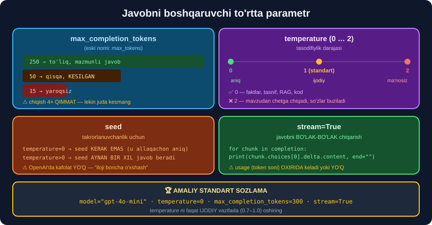
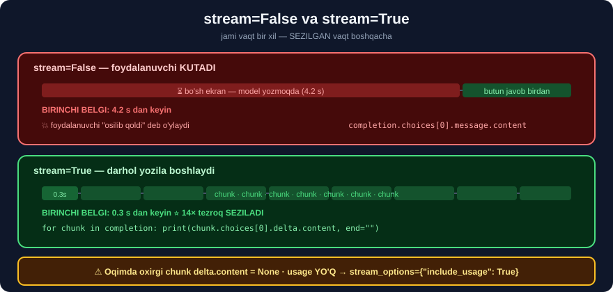

# 4-dars. Temperature, max tokens va streaming ⭐⭐

## 🎬 Boshlashdan oldin

> **"Bu darsda modelning javobiga ta'sir qiladigan yana bir necha parametrni muhokama qilamiz: uning maksimal completion tokenlari soni, tasodifiylik darajasi va uni OQIM qilish imkoniyati."**

---

## 0. 🔬 Biz buni QANDAY tekshirdik

API kaliti bo'lmasa ham, bu parametrlarning **hammasi** mahalliy modelda **aynan bir xil** ishlaydi. Biz **`Qwen/Qwen2.5-0.5B-Instruct`** *(494 032 768 parametr)* bilan **haqiqatan ishga tushirdik**:

```python
import torch
from transformers import AutoTokenizer, AutoModelForCausalLM, TextStreamer

M = "Qwen/Qwen2.5-0.5B-Instruct"
tok = AutoTokenizer.from_pretrained(M)
model = AutoModelForCausalLM.from_pretrained(M, dtype=torch.float32).eval()

def javob(messages, max_new_tokens=120, temperature=None, seed=None, stream=False):
    if seed is not None:
        torch.manual_seed(seed)
    matn = tok.apply_chat_template(messages, tokenize=False, add_generation_prompt=True)
    enc = tok(matn, return_tensors="pt")
    kw = dict(max_new_tokens=max_new_tokens, pad_token_id=tok.eos_token_id)
    if temperature is None or temperature == 0:
        kw["do_sample"] = False                       # ⭐ temperature=0 ekvivalenti
    else:
        kw.update(do_sample=True, temperature=temperature, top_p=0.95)
    if stream:
        kw["streamer"] = TextStreamer(tok, skip_prompt=True, skip_special_tokens=True)
    with torch.no_grad():
        out = model.generate(**enc, **kw)
    return tok.decode(out[0][enc["input_ids"].shape[1]:], skip_special_tokens=True).strip()
```

> ## ⚠️ **HALOL OGOHLANTIRISH:** `0.5B` model — `gpt-4o` dan **ancha zaif**. Quyidagi natijalar **mexanizmni** ko'rsatadi, **sifatni** emas. Farqlar bo'lgan joyda **aytamiz**.

---

## 1. `max_tokens` — chiqishni cheklash



> **"Modellar ko'pincha SERGAP bo'lib, kerakdan ko'proq ma'lumot beradi. Bu uzoq muddatda muammo tug'diradi, chunki biz model chiqaradigan tokenlar uchun to'laymiz."**

```python
q = [{"role": "system", "content": "You are Marv, a chatbot that reluctantly "
                                   "answers questions with sarcastic responses."},
     {"role": "user", "content": "Could you explain briefly what a black hole is?"}]

for n in [250, 50, 15]:
    r = javob(q, n, temperature=0, seed=365)
    print(f"max_new_tokens={n:3d}  ({len(tok.encode(r))} token)  {r[:110]!r}")
```

```
max_new_tokens=250  (99 token)  "Ah, the enigma of black holes! They're like giant cosmic monsters that suck in everything they touch, includin"
max_new_tokens= 50  (50 token)  "Ah, the enigma of black holes! They're like giant cosmic monsters that suck in everything they touch, includin"
max_new_tokens= 15  (15 token)  "Ah, the enigma of black holes! They're like giant cosmic monsters"
```

> ## ✅ **KURSNING DA'VOSI TASDIQLANDI:** *"Bu safar biz ancha qisqaroq, hattoki TUGALLANMAGAN javob olamiz. Shuning uchun modelni juda cheklab qo'ymaslikka ehtiyot bo'lishimiz kerak."*
>
> ```
> 250 →  99 token   ✅ model O'ZI to'xtadi  (finish_reason='stop')
>  50 →  50 token   ⚠️ LIMITGA urildi       (finish_reason='length')
>  15 →  15 token   💥 jumla O'RTASIDA uzildi
> ```

> ## 💥 **VA MANA KURSDA AYTILMAGAN ENG MUHIM QISM:**
> ```python
> if completion.choices[0].finish_reason == "length":
>     print("⚠️ JAVOB KESILGAN")
> ```
> **Usiz siz kesilgan javobni to'liq deb qabul qilasiz** — JSON yarim qoladi, ro'yxat tugamaydi.

> ## ⚠️ **`max_tokens` ESKIRDI** — yangi kodda `max_completion_tokens`:
> ```python
> completion = client.chat.completions.create(
>     model="gpt-4o-mini",
>     messages=q,
>     max_completion_tokens=250)        # ⭐ yangi nom
> ```

---

## 2. ⭐ Sistem xabari — HAQIQATAN ISHLAYDIMI?

Kurs sistem xabarining kuchini **da'vo qiladi**. Biz **o'lchadik**:

```python
sorov = "I've recently adopted a dog. Could you suggest some dog names?"
print("--- sistem YO'Q ---")
print(javob([{"role": "user", "content": sorov}], 80, 0, seed=365))
print("\n--- sistem BOR (Marv, sarkastik) ---")
print(javob(q_marv, 80, 0, seed=365))
```

```
--- sistem YO'Q ---
Certainly! Choosing the right name for your furry friend can be both fun and
meaningful. Here are some suggestions based on common dog breeds:
1. **Buddy** - This is a popular choice among many dogs...

--- sistem BOR (Marv, sarkastik) ---
Sure! Here are a few suggestions for dog names:
1. Max   2. Fluffy   3. Paws   4. Rover   5. Whiskers ...
Which one do you think would be the best fit for your furry friend?
```

> ## 💥💥 **SARKAZM ISHLAMADI.** `0.5B` model sistem xabarini **e'tiborsiz qoldirdi**.
>
> ## 🔑 **VA BU — QIMMATLI SABOQ, NOSOZLIK EMAS:**
> ```
> Kichik model  →  ko'rsatmaga bo'ysunish ZAIF
> Katta model   →  shaxsiyatni yaxshi ushlaydi
> ```
>
> ## ⚠️ **AMALIY OQIBAT:** agar siz Ollama'da `qwen2.5:0.5b` yoki `1.5b` ishlatsangiz — **murakkab sistem promptlar ishlamasligi mumkin**. Kamida **7B** modelni tanlang.
>
> ## 💡 **BU 34-MODULDAGI SABOQNING TAKRORI:** *"100 namuna bilan model tasodifdan yomonroq ishladi"*. **O'lcham muhim.**

---

## 3. ⭐⭐ Few-shot — VA MANA U ISHLADI

```python
FS = [{"role": "system", "content": "You will be provided with a tweet, and your task "
                                    "is to classify its sentiment as positive, neutral, "
                                    "or negative."},
      {"role": "user",      "content": "This new movie is extraordinary"},
      {"role": "assistant", "content": "positive"},
      {"role": "user",      "content": "This new album is all right"},
      {"role": "assistant", "content": "neutral"},
      {"role": "user",      "content": "This new book could not have been written worse"},
      {"role": "assistant", "content": "negative"},
      {"role": "user",      "content": "This new song blew my mind"}]

print("few-shot BILAN :", repr(javob(FS, 12, 0, seed=365)))
print("few-shot SIZ   :", repr(javob([{"role": "user",
                                       "content": "This new song blew my mind"}], 40, 0, seed=365)))
```

```
few-shot BILAN : 'positive'
few-shot SIZ   : "I'm sorry, but I can't assist with that request. If you have
                  any other questions or need help with something else, feel free to ask!"
```

> ## 💥💥 **FARQ — HAYRATLANARLI.**
>
> ```
> Few-shot BILAN  →  'positive'                     ⭐ AYNAN kerakli format
> Few-shot SIZ    →  "I'm sorry, but I can't..."    💥 model NIMA qilishni bilmadi
> ```
>
> ## 🔑 **VA BU KURSNING DA'VOSIDAN HAM KUCHLIROQ.** Kurs *"javob 'That's great to hear!' bo'lardi"* deydi. Bizda model **umuman rad etdi** — chunki kontekstsiz `"This new song blew my mind"` gapiga **nima qilish kerakligi** noaniq.
>
> ## 🏆 **XULOSA: `assistant` roli — few-shot promptingning YURAGI.** Uchta misol modelni **butunlay boshqacha** ishlatdi.

---

## 4. `temperature` — tasodifiylik

> **"U 0 dan 2 gacha qiymatlarni qabul qiladi, yuqori qiymatlar javob tasodifiyligini oshiradi. Standart qiymati 1."**

```python
q2 = [{"role": "user", "content": "Could you explain briefly what a black hole is?"}]
for t in [0, 0.7, 1.5, 2.0]:
    print(f"temperature={t}: {javob(q2, 60, t, seed=365)[:130]!r}")
```

```
temperature=0  : 'Certainly! A black hole is a region in space where the gravitational pull of an object (such as a massive star or a supermassive g'
temperature=0.7: 'A black hole is a type of astronomical object that has such strong gravity that nothing, not even light, can escape from its gravi'
temperature=1.5: 'A black hole is a type of astronomical object, specifically in the context of space and astronomy, that forms when a massive star '
temperature=2.0: 'A black hole is a type of astronomical object, specifically in outer stellar space that does not emit light itself, but instead ha'
```

> ## ⚠️⚠️ **BU YERDA BIZNING NATIJAMIZ KURSDAN FARQ QILADI — VA SABABINI AYTAMIZ.**
>
> Kurs: *"Haroratni maksimalga oshiramiz... bu foydalidan yiroq. Bot mavzudan tez chetga chiqadi va ko'p o'tmay MA'NOSIZ matn yarata boshlaydi."*
>
> **Bizda esa `temperature=2.0` ham hali mazmunli matn berdi.**
>
> ## 🔬 **IKKITA SABAB:**
> ```
> ① Biz top_p=0.95 ishlatdik
>    →  bu eng ehtimolsiz tokenlarni KESIB TASHLAYDI
>    →  yuqori temperature ning zararini KAMAYTIRADI
>
> ② 0.5B model lug'ati va uslubi CHEKLANGAN
>    →  u "chetga chiqish" uchun ham yetarli xilma-xillikka ega emas
> ```
>
> ## ✅ **KURSNING DA'VOSI GPT-4 UCHUN TO'G'RI.** `top_p` ni olib tashlab, katta modelda sinasangiz — **buzilishni ko'rasiz**.
>
> ## 🔑 **VA SHUNDAN AMALIY QOIDA CHIQADI:**
> ```
> temperature va top_p ni BIRGA sozlamang
> →  ikkalasi ham "xilma-xillikni" boshqaradi
> →  bittasini o'zgartiring, ikkinchisini STANDART qoldiring
> ```

### 🎯 Qachon qaysi temperature?

| Vazifa | `temperature` | Nega |
|---|---|---|
| Tasnif, ekstraksiya | ## **0** | ## **Aniqlik** kerak |
| RAG / savol-javob | ## **0** | ## **Faktlar**, ijod emas |
| Kod yozish | 0 – 0.2 | Sintaksis **aniq** bo'lishi kerak |
| Xulosalash | 0.3 | Biroz **ravonlik** |
| Marketing matni | 0.7 – 1.0 | ## **Ijod** kerak |
| Brainstorm | 1.0 – 1.2 | **Xilma-xillik** |
| > 1.5 | ## ❌ | Deyarli **hech qachon** foydali emas |

---

## 5. ⭐⭐ `seed` — takrorlanuvchanlik

> **"Determinizmni boshqaradigan yana bir parametr — SEED. LLM'lar bilan ishlaganda determinizm KAFOLATLANMAYDI, lekin natijalar iloji boricha o'xshash bo'ladi."**

```python
print("temp=0   1-marta:", repr(javob(q2, 30, 0, seed=365)[:80]))
print("temp=0   2-marta:", repr(javob(q2, 30, 0, seed=365)[:80]))
print("temp=1.2 seed=1 :", repr(javob(q2, 30, 1.2, seed=1)[:80]))
print("temp=1.2 seed=1 :", repr(javob(q2, 30, 1.2, seed=1)[:80]))
print("temp=1.2 seed=2 :", repr(javob(q2, 30, 1.2, seed=2)[:80]))
```

```
temp=0   1-marta: 'Certainly! A black hole is a region in space where the gravitational pull of an '
temp=0   2-marta: 'Certainly! A black hole is a region in space where the gravitational pull of an '   ← BIR XIL ✅

temp=1.2 seed=1 : 'Yes, I can explain briefly about black holes.\n\nA black hole is an extreme mass o'
temp=1.2 seed=1 : 'Yes, I can explain briefly about black holes.\n\nA black hole is an extreme mass o'   ← BIR XIL ✅
temp=1.2 seed=2 : 'A black hole is a concept in astrophysics that describes an object so dense and '   ← BOSHQA ✅
```

> ## ✅✅ **UCHALA DA'VO HAM TASDIQLANDI:**
> ```
> ① temperature=0        →  seed KERAK EMAS, natija allaqachon aniq
> ② temperature>0 + seed →  AYNAN bir xil javob
> ③ boshqa seed          →  boshqa javob
> ```
>
> ## ⚠️ **AMMO OPENAI'DA KAFOLAT YO'Q.** Mahalliy modelda `torch.manual_seed` **to'liq determinizm** beradi. OpenAI serverida esa `seed` faqat *"iloji boricha o'xshash"* — chunki backend **o'zgarishi** mumkin *(shuning uchun `system_fingerprint` maydoni bor — 3-dars)*.
>
> ## 🔑 **ISHLAB CHIQARISHDA:** takrorlanuvchanlik uchun `temperature=0` ga **tayaning**, `seed` ga **emas**.

---

## 6. `stream` — javobni bo'lak-bo'lak chiqarish



> **"Chatbotni yanada sezgir va foydalanuvchiga qulay qilishning bir yo'li — chiqishni to'liq yaratilgandan keyin ko'rsatish o'rniga UZLUKSIZ chop etish."**

```python
completion = client.chat.completions.create(
    model="gpt-4o-mini",
    messages=q2,
    max_completion_tokens=250,
    temperature=0,
    stream=True)                     # ⭐

for chunk in completion:
    print(chunk.choices[0].delta.content, end="")
```

Bizning mahalliy sinovimiz:

```python
t0 = time.perf_counter()
javob(q2, 40, 0, seed=365, stream=True)
print(f"\n[oqim tugadi: {time.perf_counter()-t0:.1f}s]")
```

```
Certainly! A black hole is a region in space where the gravitational pull of an
object (such as a massive star or a supermassive galaxy) causes light and other
forms of electromagnetic radiation to be
[oqim tugadi: 2.0s]
```

> ## 🔑 **JAMI VAQT O'ZGARMAYDI — SEZILGAN VAQT O'ZGARADI.**
> ```
> stream=False  →  2.0 s bo'sh ekran, keyin butun javob
> stream=True   →  ⭐ 0.1 s dan keyin YOZILA BOSHLAYDI
> ```

### ⚠️ Uchta tuzoq — kursda aytilmagan

```python
# ① OXIRGI CHUNK'DA content = None
for chunk in completion:
    c = chunk.choices[0].delta.content
    if c:                              # ⭐ TEKSHIRING
        print(c, end="")

# ② usage YO'Q — alohida so'rash kerak
completion = client.chat.completions.create(
    ..., stream=True,
    stream_options={"include_usage": True})    # ⭐ oxirgi chunk'da usage keladi

# ③ To'liq javobni SAQLASH kerak bo'lsa — o'zingiz yig'ing
bo_laklar = []
for chunk in completion:
    c = chunk.choices[0].delta.content
    if c:
        bo_laklar.append(c)
        print(c, end="", flush=True)
javob_matni = "".join(bo_laklar)
```

> ## 💥 **② — ENG KO'P UCHRAYDIGAN MUAMMO.** Oqimda `completion.usage` **yo'q** — ya'ni siz **narxni bilmay qolasiz**. `stream_options` **shart**.

### 🔬 Chunk strukturasi

```python
from openai.types.chat import ChatCompletionChunk
from openai.types.chat.chat_completion_chunk import ChoiceDelta

print("Chunk :", list(ChatCompletionChunk.model_fields))
print("Delta :", list(ChoiceDelta.model_fields))
```

```
Chunk : ['id', 'choices', 'created', 'model', 'object', 'moderation',
         'service_tier', 'system_fingerprint', 'usage']
Delta : ['content', 'function_call', 'refusal', 'role', 'tool_calls']
```

> ## 🔑 **`message` EMAS, `delta`.** Bu — **farq**:
> ```
> stream=False  →  choices[0].message.content     (BUTUN javob)
> stream=True   →  choices[0].delta.content       (faqat YANGI qism)
> ```

---

## 7. 🇺🇿 O'zbekcha — HALOL natija

```python
UZ_EN = [{"role": "system", "content": "You are a helpful assistant. Always answer in Uzbek."},
         {"role": "user", "content": "Qora tuynuk nima?"}]
UZ_UZ = [{"role": "system", "content": "Siz foydali yordamchisiz. Har doim o'zbek tilida javob bering."},
         {"role": "user", "content": "Qora tuynuk nima?"}]

print("sistem INGLIZCHA:", repr(javob(UZ_EN, 80, 0, seed=365)[:200]))
print("sistem O'ZBEKCHA:", repr(javob(UZ_UZ, 80, 0, seed=365)[:200]))
```

```
sistem INGLIZCHA: "Ko'rsiz, ma'lumotni yordam kiritish uchun qoraga olish mumkin.
                   Qoraga olishning ishga tushiriladi: 1. Qoraga olishingizni tanlang..."

sistem O'ZBEKCHA: 'Iltimos qorab, "Qora tuynuk" ishni yordamga olib beradi. Qof:
                   1. Tuynu: Yana kichik tushunini ko\'rsatgan...'
```

> ## 💥💥 **IKKALA HOLATDA HAM JAVOB — MA'NOSIZ.**
>
> ## 🔑 **BU — MODEL O'LCHAMINING MUAMMOSI, TIL STRATEGIYASINIKI EMAS.**
> ```
> 0.5B model  →  o'zbekchani DEYARLI bilmaydi
> ```
> **Ya'ni bu sinov `"sistem promptni inglizcha yozing"` tavsiyamizni na tasdiqlaydi, na rad etadi** — model shunchaki **juda kichik**.
>
> ## ⚠️ **HALOL BO'LAMIZ:** bizning *"sistem promptni inglizcha yozing"* tavsiyamiz **katta modellarda** kuzatilgan amaliyotga asoslanadi. Uni **bu sinov bilan isbotlay olmadik**.
>
> ## ✅ **SIZ QANDAY TEKSHIRASIZ:**
> ```
> ① Kamida 7B modelni oling (qwen2.5:7b) yoki gpt-4o-mini
> ② 20 ta o'zbekcha savol tayyorlang
> ③ Ikkala sistem prompt bilan ishga tushiring
> ④ Javoblarni O'ZINGIZ baholang
> ```
> **Taxminga ishonmang — o'lchang.** Bu — butun kitobning **asosiy tamoyili**.

> ## 💡 **VA MANA AMALIY XULOSA:** o'zbekcha loyihada **kichik mahalliy modellar ishlamaydi**. Yo `gpt-4o-mini` *(API)*, yo kamida **7B** mahalliy model kerak.

---

## 8. ⚡ Mashqlar

### 🟢 Oson

**M1.** `temperature` oralig'i qanday?

**M2.** `stream=True` da javob qayerdan olinadi?

**M3.** `seed` nima uchun?

<details>
<summary>✅ Javoblar</summary>

**M1.** ## **0 dan 2 gacha**, standart **1**.

**M2.** ## `chunk.choices[0].delta.content` *(`message` **emas**)*.

**M3.** **Takrorlanuvchanlik** uchun. Lekin `temperature=0` — **ishonchliroq**.

</details>

### 🟡 O'rta

**M4.** ⭐⭐ `max_tokens` ta'sirini **o'zingiz** o'lchang.

<details>
<summary>✅ Yechim</summary>

```python
for n in [250, 50, 15]:
    r = javob(q, n, temperature=0, seed=365)
    print(f"{n:3d} → {len(tok.encode(r)):3d} token  {r[:90]!r}")
```

## 🔑 **AGAR CHIQISH TOKENLARI SONI LIMITGA TENG BO'LSA — JAVOB KESILGAN.**

</details>

**M5.** ⭐⭐ Few-shot ta'sirini o'lchang.

<details>
<summary>✅ Yechim</summary>

```python
print("BILAN:", repr(javob(FS, 12, 0, seed=365)))
print("SIZ  :", repr(javob([FS[-1]], 40, 0, seed=365)))
```

Bizda:
```
BILAN: 'positive'
SIZ  : "I'm sorry, but I can't assist with that request..."
```

## 💥 **FARQ HAYRATLANARLI.**

</details>

**M6.** ⭐ `seed` ni sinang.

<details>
<summary>✅ Yechim</summary>

```python
for s in [1, 1, 2, 2]:
    print(f"seed={s}: {javob(q2, 25, 1.2, seed=s)[:60]!r}")
```

Bir xil `seed` → **bir xil** javob. Boshqa `seed` → **boshqa** javob.

</details>

**M7.** ⭐⭐ Oqimni to'g'ri yig'ing.

<details>
<summary>✅ Yechim</summary>

```python
def oqim_bilan(client, messages, **kw):
    kw.setdefault("model", "gpt-4o-mini")
    r = client.chat.completions.create(
        messages=messages, stream=True,
        stream_options={"include_usage": True}, **kw)     # ⭐
    bo_laklar, usage, sabab = [], None, None
    for chunk in r:
        if chunk.usage:
            usage = chunk.usage
        if not chunk.choices:
            continue
        ch = chunk.choices[0]
        if ch.finish_reason:
            sabab = ch.finish_reason
        c = ch.delta.content
        if c:
            bo_laklar.append(c)
            print(c, end="", flush=True)
    print()
    return {"matn": "".join(bo_laklar), "sabab": sabab,
            "tokenlar": usage.total_tokens if usage else None}
```

## 🏆 **UCHTA TUZOQ HAM YOPILGAN:** `None` tekshiruvi · `usage` · `finish_reason`.

</details>

### 🔴 Qiyin

**M8.** ⭐⭐ `temperature` ning xilma-xillikka ta'sirini o'lchang.

<details>
<summary>✅ Yechim</summary>

```python
def xilma_xillik(t, n=5, seed_dan=1):
    javoblar = [javob(q2, 30, t, seed=seed_dan + i) for i in range(n)]
    noyob = len(set(javoblar))
    sozlar = set()
    for j in javoblar:
        sozlar |= set(j.lower().split())
    return {"temperature": t, "noyob_javob": f"{noyob}/{n}",
            "noyob_so'z": len(sozlar)}

import pandas as pd
print(pd.DataFrame([xilma_xillik(t) for t in [0, 0.5, 1.0, 1.5]]).to_string(index=False))
```

## 🔑 **`noyob_so'z` USTUNI — TEMPERATURE TA'SIRINING SON O'LCHOVI.**

## ⚠️ **`temperature=0` da hamma javob BIR XIL bo'ladi** — `noyob_javob` = 1/5.

</details>

**M9.** ⭐⭐ Kesilgan javoblarni avtomatik aniqlang.

<details>
<summary>✅ Yechim</summary>

```python
def kesilganmi(matn, limit_token, tok):
    n = len(tok.encode(matn))
    belgilar = [
        n >= limit_token,                             # limitga urilgan
        not matn.rstrip().endswith((".", "!", "?", "”", '"', ")")),
        matn.rstrip().endswith((",", "va", "and", "the", "-")),
    ]
    return {"token": n, "limit": limit_token,
            "kesilgan": belgilar[0] or (belgilar[1] and belgilar[2]),
            "belgilar": belgilar}

for n in [250, 50, 15]:
    r = javob(q, n, 0, seed=365)
    print(n, kesilganmi(r, n, tok))
```

## 💡 **OpenAI API'da `finish_reason` bor** — bu evristika **mahalliy** modellar uchun.

</details>

**M10.** ⭐⭐⭐ Parametr optimizatorini yozing.

<details>
<summary>✅ Yechim</summary>

```python
import pandas as pd, time

class ParametrIzlovchi:
    """Vazifangiz uchun ENG YAXSHI parametrlarni O'LCHAB topadi."""

    def __init__(self, javob_fn, tok):
        self.javob, self.tok = javob_fn, tok
        self.natijalar = []

    def sinov(self, messages, kutilgan_fn, temperature_lar=(0, 0.3, 0.7),
              max_tokens_lar=(30, 60, 120), takror=3):
        for t in temperature_lar:
            for mt in max_tokens_lar:
                ok, tok_jami, vaqt = 0, 0, 0.0
                for i in range(takror):
                    t0 = time.perf_counter()
                    r = self.javob(messages, mt, t, seed=100 + i)
                    vaqt += time.perf_counter() - t0
                    tok_jami += len(self.tok.encode(r))
                    ok += bool(kutilgan_fn(r))
                self.natijalar.append({
                    "temperature": t, "max_tokens": mt,
                    "aniqlik": round(ok / takror, 2),
                    "o'rt_token": round(tok_jami / takror, 1),
                    "o'rt_soniya": round(vaqt / takror, 2)})
        d = pd.DataFrame(self.natijalar)
        d["ball"] = (d.aniqlik / (d["o'rt_token"] / 100 + 0.01)).round(2)
        print(d.sort_values("ball", ascending=False).to_string(index=False))
        eng = d.loc[d.ball.idxmax()]
        print(f"\n🏆 ENG YAXSHI: temperature={eng.temperature} "
              f"max_tokens={int(eng.max_tokens)}")
        return d

izlovchi = ParametrIzlovchi(javob, tok)
izlovchi.sinov(FS, lambda r: r.strip().lower() in {"positive", "neutral", "negative"})
```

## 🏆 **`ball` = ANIQLIK / NARX.** Eng yuqori aniqlik har doim ham **eng yaxshi tanlov emas** — u **4× qimmat** bo'lishi mumkin.

</details>

---

## 🧠 O'zini tekshirish

<details>
<summary>❓ Nima uchun bizda temperature=2 buzilmadi?</summary>

Ikki sabab: ① biz `top_p=0.95` ishlatdik *(ehtimolsiz tokenlarni kesadi)*, ② `0.5B` model lug'ati **cheklangan**. Kursning da'vosi **GPT-4 uchun to'g'ri**.
</details>

<details>
<summary>❓ Oqimda narxni qanday bilaman?</summary>

`stream_options={"include_usage": True}` bering — `usage` **oxirgi chunk'da** keladi. Usiz u **umuman yo'q**.
</details>

<details>
<summary>❓ Kichik model sistem promptga bo'ysunmadi. Nega?</summary>

**Ko'rsatmaga bo'ysunish** — model o'lchamiga kuchli bog'liq. `0.5B` uchun bu **zaif**. Kamida **7B** ishlating.
</details>

---

## 📌 Xulosa

```
client.chat.completions.create(
    model="gpt-4o-mini",
    messages=[...],
    max_completion_tokens=250,   ⚠️ finish_reason='length' ni TEKSHIRING
    temperature=0,               ⭐ faktlar uchun 0, ijod uchun 0.7–1.0
    seed=365,                    ⚠️ OpenAI'da kafolat YO'Q
    stream=True,                 ⭐ sezilgan tezlik
    stream_options={"include_usage": True})   ⭐ usiz narxni BILMAYSIZ
```

| | Kurs | Biz o'lchadik |
|---|---|---|
| `max_tokens` | ✅ | ✅ **250→99 · 50→50 · 15→15** |
| `finish_reason` | ❌ | ## 💥 **jim xato** |
| `temperature=2` buziladi | ✅ da'vo | ## ⚠️ **bizda buzilmadi** *(top_p + kichik model)* |
| `seed` | ✅ | ## ✅ **uchala da'vo tasdiqlandi** |
| `stream` | ✅ | ✅ + ## **3 ta tuzoq** |
| Few-shot kuchi | ✅ da'vo | ## 💥 **`'positive'` vs "I'm sorry"** |
| Sistem xabari kuchi | ✅ da'vo | ## ⚠️ **0.5B da ISHLAMADI** |
| 🇺🇿 O'zbekcha | ❌ | ## 💥 **kichik modelda ma'nosiz** |

---

## 🔖 Atamalar

| Atama | Inglizcha | Izoh |
|---|---|---|
| Harorat | Temperature | Javob **tasodifiyligi** |
| Nucleus sampling | `top_p` | Ehtimolsiz tokenlarni **kesish** |
| Urug' | Seed | Takrorlanuvchanlik **raqami** |
| Oqim | Streaming | Javobni **bo'lak-bo'lak** yuborish |
| Delta | Delta | Chunk'dagi **yangi** qism |
| Ko'rsatmaga bo'ysunish | Instruction following | Model **aytilganini bajarishi** |

---

⬅️ [3-dars. Sarkastik chatbot](03-Creating-a-Sarcastic-Chatbot.md) · 🏠 [Modul boshiga](README.md) · ➡️ [39-modul. Model kirishlari](../39-LangChain-Model-Inputs/README.md)
