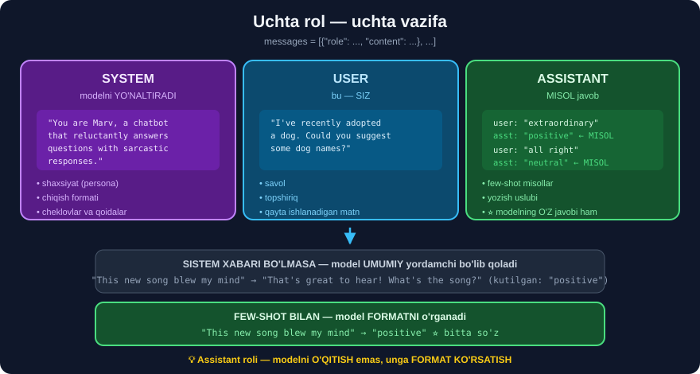

# 🤖 38-modul. OpenAI API

> **LangChain shu API ustiga qurilgan.** U buzilganda *(35-modulda ko'rganimizdek — tez-tez buziladi)* siz **pastki qatlamga** tushib, muammoni **hal qila olasiz**.

---

## 📚 Darslar

| # | Dars | Nima o'rganasiz |
|---|---|---|
| 1 | [Birinchi qadamlar](01-First-Steps.md) ⭐ | 💥 `openai.api_key` **ishlamaydi** · ⭐ `base_url` |
| 2 | [System, user, assistant rollari](02-System-User-Assistant-Roles.md) ⭐⭐ | 🔬 **Rollar ichida NIMA bor** · few-shot |
| 3 | [Sarkastik chatbot](03-Creating-a-Sarcastic-Chatbot.md) ⭐ | Javob anatomiyasi · 💥 **`finish_reason`** |
| 4 | [Temperature, max tokens, streaming](04-Temperature-Max-Tokens-Streaming.md) ⭐⭐ | ## **Hammasi O'LCHANDI** |

---

## 📝 Amaliyot

| | |
|---|---|
| 📝 [**32 ta mashq**](MASHQLAR.md) | 🟢 Oson · 🟡 O'rta · 🔴 Qiyin |
| 🚀 [**5 ta mini-loyiha**](LOYIHALAR.md) | ⭐ **universal klient** · persona lab · parametr optimizatori · 🛡️ **xavfsiz suhbat** · 🇺🇿 o'zbekcha tasniflagich |

> ## ⭐⭐ **API KALITISIZ HAM O'TASIZ** — mahalliy model yoki `base_url` bilan.

---

## 💥 Modulning birinchi topilmasi — kursning BIRINCHI kod satri ishlamaydi

```python
# KURSDAGI KOD
openai.api_key = os.getenv("OPENAI_API_KEY")
client = openai.OpenAI()
```

Biz **sinab ko'rdik** *(`openai` 3.3.1)*:

```python
os.environ.pop("OPENAI_API_KEY", None)
openai.api_key = "sk-KURSDAGI-USUL"
OpenAI()
```
```
OpenAIError : Missing credentials. Please pass an `api_key`, `workload_identity`,
`admin_api_key`, or set the `OPENAI_API_KEY` or `OPENAI_ADMIN_KEY` environment variable.
```

> ## 💥 **`openai.api_key = ...` SATRI HECH NARSA QILMAYDI.**
>
> Kursda u **"ishlagan"** — chunki `%dotenv` allaqachon **muhit o'zgaruvchisini** o'rnatgan edi. Satrning o'zi **bezak** bo'lgan.
>
> ## ✅ **TO'G'RISI:** `load_dotenv(override=True)` → `OpenAI()`, yoki `OpenAI(api_key="...")`.

### ⭐⭐ Va eng foydali topilma — `base_url`

```python
client = OpenAI(api_key="ollama", base_url="http://localhost:11434/v1")
r = client.chat.completions.create(model="qwen2.5",
                                   messages=[{"role": "user", "content": "Salom"}])
```

> ## 🏆 **`openai` PAKETI HAR QANDAY OpenAI-MOS SERVERGA ULANADI** — Ollama, LM Studio, Groq, vLLM.
>
> **Ya'ni butun bu modulning kodini KALITSIZ ishlatish mumkin.** `messages`, `temperature`, `max_tokens`, `stream` — **aynan bir xil**.

---

## 🔬 Rollar aslida NIMA? — ochib berdik



Kurs rollarni **mavhum** tushuntiradi. Biz **aynan nima sodir bo'lishini** ko'rsatdik:

```python
tok.apply_chat_template(msgs, tokenize=False, add_generation_prompt=True)
```
```
"<|im_start|>system
You are Marv, a chatbot that reluctantly answers questions with sarcastic responses.<|im_end|>
<|im_start|>user
I've recently adopted a dog. Could you suggest some dog names?<|im_end|>
<|im_start|>assistant
"
```

> ## 🔑 **ROLLAR — SHUNCHAKI MAXSUS TOKENLI MATN.** Model faqat **matn** ko'radi.

### 💥 Va yashirin xatti-harakat

```python
tok.apply_chat_template([{"role": "user", "content": "Salom"}], ...)
```
```
'<|im_start|>system\nYou are Qwen, created by Alibaba Cloud. You are a helpful
assistant.<|im_end|>\n<|im_start|>user\nSalom<|im_end|>\n<|im_start|>assistant\n'
```

> ## 💥 **SISTEM XABARINI BERMASANGIZ — MODEL O'ZINIKINI QO'YADI.** *"Sistem xabari yo'q"* holati **umuman mavjud emas**.

---

## 💥💥 Few-shot — biz O'LCHADIK va farq HAYRATLANARLI

`Qwen/Qwen2.5-0.5B-Instruct` *(494 032 768 parametr)* bilan **haqiqatan ishga tushirildi**:

```
few-shot BILAN : 'positive'
few-shot SIZ   : "I'm sorry, but I can't assist with that request. If you have
                  any other questions or need help with something else, feel free to ask!"
```

> ## 🏆 **UCHTA `assistant` MISOLI MODELNI BUTUNLAY BOSHQACHA ISHLATDI.**
>
> Kurs *"javob 'That's great to hear!' bo'lardi"* deydi. Bizda model **umuman rad etdi** — chunki kontekstsiz savol **noaniq**.

### ⚠️ Lekin sistem xabari (persona) ISHLAMADI

```
--- sistem YO'Q ---        "Certainly! Choosing the right name for your furry friend..."
--- sistem BOR (Marv) ---  "Sure! Here are a few suggestions for dog names: 1. Max..."
```

> ## 💥 **`0.5B` MODEL SARKASTIK PERSONANI E'TIBORSIZ QOLDIRDI.**
>
> ## 🔑 **SABOQ:** **ko'rsatmaga bo'ysunish** model **o'lchamiga** kuchli bog'liq. Ollama'da kamida **7B** modelni tanlang — `qwen2.5:0.5b` yoki `1.5b` da murakkab sistem promptlar **ishlamaydi**.
>
> ## 💡 **Bu — 34-moduldagi saboqning takrori:** *"100 namuna bilan model tasodifdan yomonroq ishladi"*. **O'lcham muhim.**

---

## 🎛️ To'rtta parametr — hammasi o'lchandi


### `max_tokens`

```
max_new_tokens=250  (99 token)  "Ah, the enigma of black holes! They're like giant cosmic monsters..."
max_new_tokens= 50  (50 token)  "Ah, the enigma of black holes! They're like giant cosmic monsters..."
max_new_tokens= 15  (15 token)  "Ah, the enigma of black holes! They're like giant cosmic monsters"
```

> ## ✅ Kursning da'vosi tasdiqlandi: `250` da model **o'zi to'xtadi**, `50` va `15` da — **limitga urildi**.

### ⚠️ `temperature=2` — bizda BUZILMADI

```
temperature=0  : 'Certainly! A black hole is a region in space where the gravitational pull...'
temperature=0.7: 'A black hole is a type of astronomical object that has such strong gravity...'
temperature=1.5: 'A black hole is a type of astronomical object, specifically in the context...'
temperature=2.0: 'A black hole is a type of astronomical object, specifically in outer stellar...'
```

> ## ⚠️ **KURS DEYDI:** *"bot mavzudan tez chetga chiqadi va ko'p o'tmay MA'NOSIZ matn yarata boshlaydi"*.
>
> **Bizda `2.0` da ham matn mazmunli qoldi.** Ikkita sabab:
> ```
> ① Biz top_p=0.95 ishlatdik  →  ehtimolsiz tokenlarni KESADI
> ② 0.5B model lug'ati CHEKLANGAN  →  "chetga chiqish" uchun ham xilma-xillik yetmaydi
> ```
> ## ✅ **Kursning da'vosi GPT-4 uchun to'g'ri.** `top_p` siz, katta modelda — **buzilishni ko'rasiz**.
>
> ## 🔑 **QOIDA:** `temperature` va `top_p` ni **birga sozlamang** — ikkalasi ham xilma-xillikni boshqaradi.

### ✅ `seed` — uchala da'vo tasdiqlandi

```
temp=0   1-marta: 'Certainly! A black hole is a region in space where...'
temp=0   2-marta: 'Certainly! A black hole is a region in space where...'   ← BIR XIL ✅
temp=1.2 seed=1 : 'Yes, I can explain briefly about black holes...'
temp=1.2 seed=1 : 'Yes, I can explain briefly about black holes...'         ← BIR XIL ✅
temp=1.2 seed=2 : 'A black hole is a concept in astrophysics that...'       ← BOSHQA ✅
```

> ## ⚠️ **OpenAI'da `seed` KAFOLAT BERMAYDI** *(backend o'zgarishi mumkin — shuning uchun `system_fingerprint` bor)*. Takrorlanuvchanlik uchun **`temperature=0`** ga tayaning.

---

## 🌊 Streaming — va uchta tuzoq


```python
for chunk in completion:
    print(chunk.choices[0].delta.content, end="")     # ⚠️ delta, message EMAS
```

```
① Oxirgi chunk'da delta.content = None    →  if c: tekshiring
② usage YO'Q                              →  stream_options={"include_usage": True}
③ To'liq javob kerak bo'lsa               →  o'zingiz yig'ing
```

> ## 💥 **② — ENG KO'P UCHRAYDIGANI.** Oqimda `usage` **yo'q**, ya'ni siz **narxni bilmay qolasiz**.

---

## 💥 Kursda YO'Q, lekin ISHLAB CHIQARISHDA MAJBURIY — `finish_reason`

| Qiymat | Ma'nosi | Nima qilish |
|---|---|---|
| `'stop'` | ## ✅ tabiiy tugadi | — |
| `'length'` | ## 💥 **KESILGAN** | limitni **oshiring** |
| `'content_filter'` | ⚠️ bloklandi | promptni ko'ring |
| `'tool_calls'` | vosita chaqirilmoqda | bajaring |

> ## 💥 **TEKSHIRMASANGIZ — KESILGAN JAVOBNI TO'LIQ DEB QABUL QILASIZ.** JSON yarim qoladi, ro'yxat tugamaydi, jumla uziladi. **Jim xato.**
>
> ## ⭐ **`refusal` — YANGI MAYDON.** Model rad etsa `content` **`None`** bo'ladi. Tekshirmasangiz — `AttributeError`.

---

## 🇺🇿 O'zbekcha — HALOL natija

```
sistem INGLIZCHA: "Ko'rsiz, ma'lumotni yordam kiritish uchun qoraga olish mumkin..."
sistem O'ZBEKCHA: 'Iltimos qorab, "Qora tuynuk" ishni yordamga olib beradi. Qof:...'
```

> ## 💥 **IKKALA HOLATDA HAM MA'NOSIZ.** `0.5B` model o'zbekchani **deyarli bilmaydi**.
>
> ## ⚠️ **HALOL BO'LAMIZ:** bu sinov bizning *"sistem promptni inglizcha yozing"* tavsiyamizni **na tasdiqlaydi, na rad etadi** — model shunchaki **juda kichik**.
>
> ## ✅ **AMALIY XULOSA:** o'zbekcha loyihada **kichik mahalliy modellar ishlamaydi**. Yo `gpt-4o-mini`, yo kamida **7B** model.
>
> ## 🔑 **VA TAMOYIL:** *taxminga ishonmang — o'lchang.* Biz o'z tavsiyamizni ham **isbotlanmagan** deb belgiladik.

---

## 🎓 Modulni tugatgach

```
✅ OpenAI API'ni LangChain'siz ishlata olasiz
✅ base_url bilan HAR QANDAY provayderga ulanasiz
✅ Rollar ichida nima borligini BILASIZ
✅ Few-shot promptni to'g'ri yozasiz
✅ finish_reason ni DOIM tekshirasiz
✅ usage bilan har chaqiruvning narxini bilasiz
✅ Oqimning uchta tuzog'idan qochasiz
✅ temperature ni vazifaga qarab tanlaysiz
✅ 🇺🇿 Model o'lchamining o'zbekcha uchun ahamiyatini bilasiz
```

---

## 🔗 Bog'liq modullar

| Modul | Aloqasi |
|---|---|
| [31-modul](../31-GPT-Models/README.md) | `openai.Completion` eskirishi · RAG'ni qo'lda yozish |
| [33-modul](../33-BERT-Question-Answering/README.md) | Maxsus tokenlar `[CLS]` `[SEP]` — bir xil g'oya |
| [34-modul](../34-Text-Classification-XLNet/README.md) | ⚖️ **Fine-tuning vs few-shot** · o'lcham muhimligi |
| [36-modul](../36-LangChain-Tokens-Models-Prices/README.md) | Narx · `gpt-4o-mini` tanlash · 🇺🇿 token ustamasi |
| [37-modul](../37-LangChain-Setting-Up-Environment/README.md) | `load_dotenv(override=True)` · kalitsiz yo'llar |
| [39-modul](../39-LangChain-Model-Inputs/README.md) | ➡️ **Keyingi:** shu API LangChain orqali |

---

⬅️ [37-modul. Muhitni sozlash](../37-LangChain-Setting-Up-Environment/README.md) · 🏠 [Bosh sahifa](../README.md) · ➡️ [39-modul. Model kirishlari](../39-LangChain-Model-Inputs/README.md)
