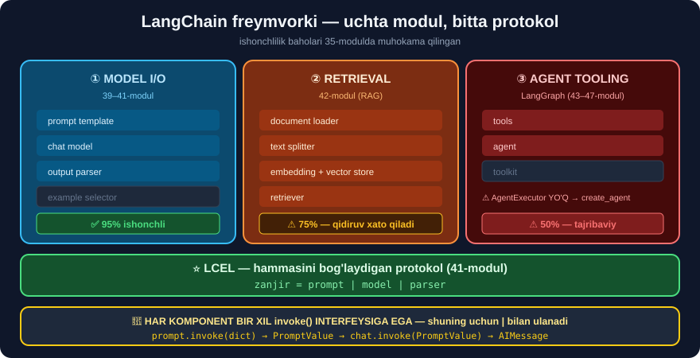

# 1-dars. LangChain freymvorki

## 🎬 Boshlashdan oldin

> **"Bu qiyin vazifani amalga oshirish uchun LangChain ishlab chiquvchilari uni bir necha INTEGRATSIYA KOMPONENTIGA bo'lishgan, har biri alohida quyi vazifa uchun javobgar."**

---

## 1. Uchta modul



```
┌─────────────────────────────────────────────────────────────┐
│                        LANGCHAIN                            │
├──────────────────┬──────────────────┬───────────────────────┤
│  ① MODEL I/O     │  ② RETRIEVAL     │  ③ AGENT TOOLING      │
│                  │                  │                       │
│  prompt template │  document loader │  tools                │
│  chat model      │  text splitter   │  agent                │
│  output parser   │  embedding model │  toolkit              │
│  example selector│  vector store    │                       │
│                  │  retriever       │                       │
├──────────────────┴──────────────────┴───────────────────────┤
│         ⭐ LCEL — hammasini BOG'LAYDIGAN protokol            │
└─────────────────────────────────────────────────────────────┘
   39–41-modul          42-modul           (kursda qisqacha)
```

> ## 🔑 **BU BO'LIM — ① MODEL I/O haqida.** Uning ichida:
> ```
> 39-modul  →  KIRISH   (prompt shablonlari, xabarlar)
> 40-modul  →  CHIQISH  (output parserlar)
> 41-modul  →  ⭐ LCEL   (bog'lash)
> 42-modul  →  ② RETRIEVAL (RAG)
> ```

---

## 2. Prompt va prompt shabloni

> **"Promptlar — modelga matn shaklida uzatadigan savol va ko'rsatmalarimiz. Prompt shablonlari o'z navbatida promptlarga ABSTRAKSIYA beradi, ularni QAYTA ISHLATILADIGAN qiladi."**

```
PROMPT (bir martalik)
  "I've recently adopted a dog. Could you suggest some dog names?"

PROMPT SHABLONI (qayta ishlatiladigan)  ⭐
  "I've recently adopted a {pet}. Could you suggest some {pet} names?"
                            ↑
                    joy egallovchi (placeholder)
```

```python
ct.invoke({"pet": "dog"})    →  "...adopted a dog. ...some dog names?"
ct.invoke({"pet": "cat"})    →  "...adopted a cat. ...some cat names?"
ct.invoke({"pet": "fish"})   →  "...adopted a fish. ...some fish names?"
```

> ## 💡 **BU — ODDIY `str.format()` DAN NIMASI BILAN FARQ QILADI?**
> ```
> str.format()        →  faqat MATN
> PromptTemplate      →  + input_variables tekshiruvi
>                        + xabar ROLLARI
>                        + ⭐ LCEL zanjiriga ULANADI  (|)
> ```
> **Asosiy qiymat — oxirgi qatorda.**

---

## 3. Chiqish parserlari

> **"Modeldan keladigan chiqish ASSISTANT roli xabari shaklida keladi. Bu format pandas DataFrame obyektlarini qabul qiladigan Python skript uchun MOS EMAS. Aynan shu yerda chiqish parserlari ishga tushadi."**

```
AIMessage(content="1. Bark Twain\n2. Sir Waggington\n3. Chewbarka")
            ↓  output parser
["Bark Twain", "Sir Waggington", "Chewbarka"]        ← Python ro'yxati
```

> ## ⚠️ **40-MODULDA KO'RAMIZ — VA U YERDA MUHIM OGOHLANTIRISH BOR:**
>
> Parser **matnni tahlil qiladi**, ya'ni model format buzsa — **parser sinadi**. **38-modul, 3-darsda ko'rgan `response_format={"type": "json_schema", ...}`** — **ancha ishonchliroq** yechim.

---

## 4. Retrieval moduli

> **"Retrieverlar — chatbotimizni KONTEKSTGA XABARDOR qilish uchun qo'shadigan komponentlar. Ya'ni ularga tashqi yoki xususiy ma'lumotni strategik tarzda berishimiz mumkin, shunda ular O'QITILMAGAN ma'lumot bo'yicha savollarga javob bera oladi."**

```
① Document loader  →  PDF/DOCX/CSV → Document
② Text splitter    →  katta hujjat → bo'laklar
③ Embedding model  →  matn → vektor
④ Vector store     →  vektorlarni saqlash
⑤ Retriever        →  savolga eng mos bo'laklarni TOPISH
```

> ## 💡 **31-MODUL 10-DARSIDA BUNI QO'LDA YOZGAN EDIK** — `TfidfVectorizer` + `cosine_similarity`, **20 satrda**. 42-modulda **professional** vositalar bilan qilamiz.
>
> ## ⚠️ **VA O'SHA YERDA TOPGAN MUAMMOMIZNI ESLANG:** *"What is the weather in Tashkent?"* savoli **0.487** ball bilan **noto'g'ri** hujjatni topgan va model **yolg'on javob bergan** edi. **Retrieval — eng zaif halqa.**

---

## 5. Agent tooling

> **"Uchinchi va oxirgi modul — Agent Tooling, u MULOHAZA QILA OLADIGAN chatbotlar yaratishga imkon beradi."**

> ## ⚠️ **35-MODULDA BAHOLAGAN EDIK — AGENTLAR ENG NOISHONCHLI QISM** *(~50%)*. Oqim **oldindan ma'lum** bo'lsa — **zanjir** yozing.
>
> ## ⚠️ **VA API O'ZGARGAN:** `langchain.agents.AgentExecutor` **endi yo'q**. O'rniga — `langchain.agents.create_agent`, u **LangGraph** ustiga qurilgan *(43–47-modul)*.

---

## 6. ⚠️ LangSmith va LangServe

> **"Birinchisi mahsulotning kuzatuvchanligi uchun javobgar, ikkinchisi esa joylashtirish uchun."**

```
LangSmith  →  ⚠️ cheklangan bepul kvota, mahsulot PULLIK
LangServe  →  ⚠️ 2025-dan boshlab DEYARLI TASHLAB QO'YILGAN
```

> ## ✅ **BUGUNGI MUQOBILLAR:**
> ```
> Kuzatuv        →  oddiy jurnal (38-modul, 5-loyiha) yoki OpenTelemetry
> Joylashtirish  →  FastAPI yoki Streamlit  (65-modul)
> ```

---

## 7. 📚 Hujjatlar — kursning to'g'ri maslahati

> **"Ikkita asosiy veb-sahifa o'rganish jarayonida sizga juda yordam beradi. Birinchisi — LangChain hujjatlari sahifasi. Ikkinchisi — kutubxonaning API ma'lumotnomasi."**

> ## ✅ **BU — TO'G'RI MASLAHAT, VA U 35-MODULDAN KEYIN YANADA MUHIMROQ.**
>
> LangChain **tez o'zgaradi**. Har qanday qo'llanma *(shu jumladan bizniki)* **eskirishi mumkin**.
>
> ## 🏆 **VA ENG ISHONCHLI USUL — HUJJAT EMAS, KOD:**
> ```python
> import inspect
> from langchain_openai import ChatOpenAI
> print(list(ChatOpenAI.model_fields))          # ⭐ HAQIQIY parametrlar
> ```
> **35-modul 1-loyihasi** *(`ModuleSkaner`)* aynan shu g'oyaga asoslangan.

---

## 8. ⚡ Mashqlar

### 🟢 Oson

**M1.** LangChain'ning uchta moduli qaysilar?

**M2.** Prompt shabloni oddiy promptdan nimasi bilan farq qiladi?

**M3.** Chiqish parseri nima uchun?

<details>
<summary>✅ Javoblar</summary>

**M1.** ## **Model I/O** · **Retrieval** · **Agent tooling** *(+ ularni bog'lovchi **LCEL**)*.

**M2.** Unda **joy egallovchilar** *(`{pet}`)* bor — ya'ni u **qayta ishlatiladi**.

**M3.** Model **matn** qaytaradi, dasturingiz esa **struktura** *(ro'yxat, sana, obyekt)* kutadi.

</details>

### 🟡 O'rta

**M4.** ⭐ Har modulning ishonchliligini baholang.

<details>
<summary>✅ Javob</summary>

| Modul | Ishonchlilik | Asosiy xavf |
|---|---|---|
| Model I/O — prompt | ## ✅ **95%** | — |
| Model I/O — parser | ⚠️ 80% | model **formatni buzadi** |
| Retrieval | ## ⚠️ **75%** | ## **noto'g'ri hujjat topiladi** |
| Agent | ## ⚠️ **50%** | cheksiz sikl, noto'g'ri vosita |

## 🔑 **HAR QATLAMGA TEKSHIRUV QO'YING** — 31-moduldagi uchta himoya kabi.

</details>

**M5.** ⭐ Kursning importlari bugun ishlaydimi?

<details>
<summary>✅ Yechim</summary>

```python
import importlib
for mod, nom in [
    ("langchain_openai.chat_models", "ChatOpenAI"),
    ("langchain_core.messages", "SystemMessage"),
    ("langchain_core.prompts", "PromptTemplate"),
    ("langchain_core.prompts", "FewShotChatMessagePromptTemplate"),
    ("langchain.agents", "AgentExecutor"),
]:
    try:
        m = importlib.import_module(mod)
        print(f"{'✅' if hasattr(m, nom) else '⚠️ '} {mod}.{nom}")
    except ModuleNotFoundError:
        print(f"❌ {mod}.{nom}")
```

Bizning natija *(langchain-core 1.6.0)*:
```
✅ langchain_openai.chat_models.ChatOpenAI
✅ langchain_core.messages.SystemMessage
✅ langchain_core.prompts.PromptTemplate
✅ langchain_core.prompts.FewShotChatMessagePromptTemplate
⚠️  langchain.agents.AgentExecutor          ← YO'Q
```

## ✅ **YAXSHI XABAR: BU MODULNING HAMMA IMPORTI ISHLAYDI.** Faqat **agentlar** o'zgargan.

</details>

### 🔴 Qiyin

**M6.** ⭐⭐ Prompt shablonining haqiqiy qiymatini o'lchang.

<details>
<summary>✅ Yechim</summary>

```python
from langchain_core.prompts import ChatPromptTemplate

# ① Oddiy f-string
def f_string_usuli(pet, description):
    return [{"role": "system", "content": description},
            {"role": "user", "content": f"I adopted a {pet}. Suggest {pet} names?"}]

# ② Prompt shabloni
ct = ChatPromptTemplate.from_messages([
    ("system", "{description}"),
    ("human", "I adopted a {pet}. Suggest {pet} names?")])

print("input_variables:", ct.input_variables)     # ⭐ AVTOMATIK aniqlandi
try:
    ct.invoke({"pet": "dog"})                     # description YO'Q
except Exception as e:
    print("✅ xato USHLANDI:", type(e).__name__)

f_string_usuli("dog", None)                       # ⚠️ jim None o'tadi
```

## 🔑 **UCHTA HAQIQIY AFZALLIK:**
```
① input_variables AVTOMATIK aniqlanadi
② Yetishmayotgan o'zgaruvchi DARHOL xato beradi  (f-string'da JIM o'tadi)
③ ⭐ LCEL zanjiriga ulanadi:  ct | model | parser
```

</details>

---

## 🧠 O'zini tekshirish

<details>
<summary>❓ LCEL nima uchun barcha modullarni bog'laydi?</summary>

Chunki har komponent bir xil **`invoke()`** interfeysiga ega: `Runnable`. Shuning uchun ularni `|` bilan **ulash** mumkin *(41-modul)*.
</details>

<details>
<summary>❓ LangServe'ni o'rganish kerakmi?</summary>

**Yo'q.** U 2025-dan **deyarli tashlab qo'yilgan**. **FastAPI** yoki **Streamlit** *(65-modul)* ishlatiladi.
</details>

---

## 📌 Xulosa

```
MODEL I/O        prompt → model → parser        39–41-modul  ✅ 95%
RETRIEVAL        loader → splitter → vektor     42-modul     ⚠️ 75%
AGENT TOOLING    tools → agent                  (LangGraph)  ⚠️ 50%
        ↑
    ⭐ LCEL hammasini bog'laydi  (41-modul)
```

---

## 🔖 Atamalar

| Atama | Inglizcha | Izoh |
|---|---|---|
| Model I/O | Model I/O | Modelning **kirish va chiqishi** |
| Joy egallovchi | Placeholder | Shablonda **to'ldiriladigan** joy |
| Retriever | Retriever | Mos hujjatni **topuvchi** |
| Kuzatuvchanlik | Observability | Tizim ichini **ko'rish** |
| Runnable | Runnable | LCEL'ning **umumiy interfeysi** |

---

⬅️ [38-modul. OpenAI API](../38-LangChain-OpenAI-API/README.md) · 🏠 [Modul boshiga](README.md) · ➡️ [2-dars. ChatOpenAI](02-ChatOpenAI.md)
