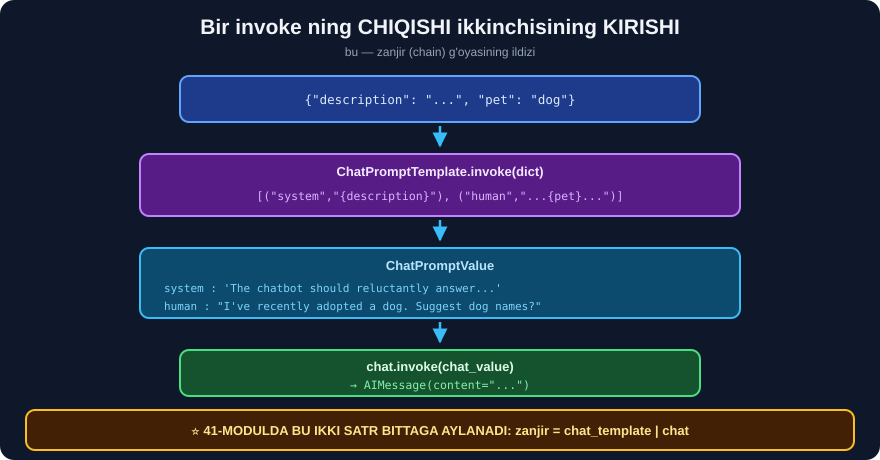

# 💬 39-modul. Model kirishlari

> **Yaxshi xabar:** bu modulning **hamma kodi bugun ham ishlaydi** *(biz tekshirdik — `langchain-core 1.6.0`)*. 35-modulda buzilgan narsalar **bu yerda emas**.

---

## 📚 Darslar

| # | Dars | Nima o'rganasiz |
|---|---|---|
| 1 | [LangChain freymvorki](01-The-LangChain-Framework.md) | Uchta modul va ## **ishonchliligi** |
| 2 | [ChatOpenAI](02-ChatOpenAI.md) ⭐ | 💥 **`seed` endi bevosita parametr** |
| 3 | [System va human xabarlar](03-System-and-Human-Messages.md) | Rol nomlari · ## **kortejlar** |
| 4 | [AI xabarlar](04-AI-Messages.md) ⭐ | Few-shot · ## **o'lchangan taqqoslash** |
| 5 | [Prompt shablonlari](05-Prompt-Templates-and-Prompt-Values.md) ⭐ | 💥 **figurali qavs tuzog'i** |
| 6 | [Chat prompt shablonlari](06-Chat-Prompt-Templates.md) ⭐⭐ | ## ⭐ **`MessagesPlaceholder`** |
| 7 | [Few-shot chat shablonlari](07-Few-Shot-Chat-Message-Prompt-Templates.md) ⭐⭐ | Miqyoslanadigan few-shot · `ExampleSelector` |

---

## 📝 Amaliyot

| | |
|---|---|
| 📝 [**34 ta mashq**](MASHQLAR.md) | 🟢 Oson · 🟡 O'rta · 🔴 Qiyin |
| 🚀 [**4 ta mini-loyiha**](LOYIHALAR.md) | 📚 **shablon kutubxonasi** · 🎯 **few-shot lab** · 💬 **xotirali bot** · 🇺🇿 o'zbekcha prompt to'plami |

> ## ⭐ **KO'PCHILIGI API KALITISIZ ISHLAYDI** — shablonlar **modelsiz** ham quriladi.

---

## ✅ Avval yaxshi xabar — importlar ishlaydi

```
✅ langchain_openai.chat_models.ChatOpenAI
✅ langchain_core.messages.SystemMessage / HumanMessage / AIMessage
✅ langchain_core.prompts.PromptTemplate
✅ langchain_core.prompts.chat.SystemMessagePromptTemplate
✅ langchain_core.prompts.FewShotChatMessagePromptTemplate
⚠️  langchain.agents.AgentExecutor          ← YO'Q (bu modulda kerak emas)
```

> ## 🔑 **35-MODULDA BUZILGAN NARSALAR — `chains`, `memory`, `output_parsers`.** Bu modul ularga **tegmaydi**.

---

## 💥 Topilma № 1 — `seed` endi BEVOSITA parametr

Kurs `seed` **hujjatda yo'q** deb, uni `model_kwargs` ga qo'yadi. Biz **sinab ko'rdik**:

```python
c = ChatOpenAI(model="gpt-4o-mini", model_kwargs={"seed": 365})
print("model_kwargs:", c.model_kwargs, " seed:", c.seed)
```
```
model_kwargs: {}  seed: 365
UserWarning : Parameters {'seed'} should be specified explicitly.
              Instead they were passed in as part of `model_kwargs` parameter.
```

> ## ✅ **LANGCHAIN KURSNING KODINI AVTOMATIK TUZATADI** — `seed` ni `model_kwargs` dan **chiqarib oladi** *(u **bo'sh** qoladi!)* va **ogohlantiradi**.
>
> ## ✅ **ZAMONAVIY YOZUV:** `ChatOpenAI(model="gpt-4o-mini", seed=365)`.

---

## 💥💥 Topilma № 2 — FIGURALI QAVS TUZOG'I

Kursda **umuman aytilmagan**, lekin **deyarli har loyihada** uchraydi:

```python
ct = ChatPromptTemplate.from_messages([
    ("human", 'JSON qaytaring: {"a": 1} va {savol}')])
ct.invoke({"savol": "test"})
```

```
input_variables: ['"a"', 'savol']         ← ❗ "a" o'zgaruvchi deb qabul qilindi

KeyError: Input to ChatPromptTemplate is missing variables {'"a"'}.
Note: if you intended {"a"} to be part of the string and not a variable,
please escape it with double curly braces like: '{{"a"}}'.
```

> ## 💥 **BU DOIM SODIR BO'LADI** — chunki siz **JSON namunasini** promptga qo'yasiz.
>
> ## ✅ **UCHTA YECHIM:** `{{"a": 1}}` · `.partial(namuna=...)` · ⭐ `response_format` *(38-modul)*.

---

## 💥 Topilma № 3 — ANIQ SISTEM PROMPT BO'LGANDA FEW-SHOT ORTIQCHA

Biz `Qwen2.5-0.5B-Instruct` bilan **o'lchadik**:

```
few-shot BILAN (3 misol) : 'positive'
few-shot SIZ             : 'positive'          ← ⚠️ BIR XIL!
```

> ## 🔑 **VA BU 38-MODUL BILAN ZID EMAS, UNI TO'LDIRADI:**
> ```
> 38-modul: sistem xabari YO'Q   →  few-shot SHART edi
>           ("I'm sorry, but I can't assist..." vs 'positive')
> Bu yerda: sistem xabari ANIQ   →  few-shot ORTIQCHA
> ```
>
> ## 🏆 **AMALIY QOIDA — ARZONDAN QIMMATGA:**
> ```
> ① ANIQ sistem prompt              ← BEPUL
> ② 2–3 misol                        ← har chaqiruvda TOKEN
> ③ ko'proq misol
> ④ fine-tuning (34-modul)          ← ko'p so'rovda
> ```
> **Ko'p dasturchi ② dan boshlaydi va ① ni tashlab ketadi** — bu **behuda token**.

---

## ⭐ Kursda YO'Q, lekin ZARUR — `MessagesPlaceholder`

`langchain.memory` **olib tashlangan** *(35-modul)*. Zamonaviy xotira **shu naqsh** bilan quriladi:

```python
ct = ChatPromptTemplate.from_messages([
    ("system", "Siz {rol}siz."),
    MessagesPlaceholder("tarix"),        # ⭐ xabarlar RO'YXATI
    ("human", "{savol}")])
```

```
  system : Siz bank yordamchisisiz.
  human  : Salom
  ai     : Salom! Sizga qanday yordam bera olaman?
  human  : Depozit foizi qancha?
```

> ## 🏆 **BU — `ConversationChain` NING TO'G'RI O'RNINI BOSUVCHISI.** [3-loyiha](LOYIHALAR.md) uni **narx nazorati** bilan birga beradi.

---

## ⭐ Sodda muqobil — KORTEJLAR

Kurs **beshta sinf** import qiladi. Bir xil natijani **importsiz**:

```python
# Kurs
ChatPromptTemplate.from_messages([
    SystemMessagePromptTemplate.from_template("{d}"),
    HumanMessagePromptTemplate.from_template("{q}")])

# ⭐ Sodda
ChatPromptTemplate.from_messages([("system", "{d}"), ("human", "{q}")])
```

```python
a.invoke({"d": "X", "q": "Y"}).messages == b.invoke({"d": "X", "q": "Y"}).messages
# True                                                    ← ✅ AYNAN BIR XIL
```

---

## 🔗 Bir `invoke` ning chiqishi ikkinchisining kirishi



```
chat_template.invoke({...})   →  ChatPromptValue
                                       ↓
chat.invoke(chat_value)       →  AIMessage
```

> ## 🏆 **41-MODULDA BU BITTA SATRGA AYLANADI:**
> ```python
> zanjir = chat_template | chat | StrOutputParser()
> ```
> Biz uni **modelsiz ham** tekshirdik:
> ```
> turi    : RunnableSequence
> qadamlar: ['ChatPromptTemplate', 'StrOutputParser']
> ```

---

## ⚖️ Freymvorkning uchta moduli


| Modul | Ishonchlilik | Modullar | Asosiy xavf |
|---|---|---|---|
| ① Model I/O | ## ✅ **95%** | 39–41 | — |
| ② Retrieval | ## ⚠️ **75%** | 42 | ## noto'g'ri hujjat topiladi |
| ③ Agent tooling | ## ⚠️ **50%** | 43–47 | cheksiz sikl |

---

## 🇺🇿 O'zbek tili uchun

```
✅ O'zbekcha JOY EGALLOVCHI qiymatlari — muammosiz
⚠️ O'zgaruvchi NOMLARIDA apostrof ISHLATMANG:
     ❌ {so'rov}     ✅ {sorov}
⭐ NAQSH: ko'rsatma INGLIZCHA, chiqish O'ZBEKCHA
```

> ## ⚠️ **VA HALOL BO'LAMIZ** — *"sistem promptni inglizcha yozing"* tavsiyamizni **38-modulda isbotlay olmadik** *(mahalliy model juda kichik edi)*. Bu — **amaliyotdan kelgan tavsiya**, o'lchangan fakt **emas**. `gpt-4o-mini` bilan **o'zingiz sinang**.

---

## 🎓 Modulni tugatgach

```
✅ Prompt shablonini qurib, qayta ishlata olasiz
✅ Figurali qavs tuzog'idan qochasiz
✅ system / human / ai rollarini to'g'ri ishlatasiz
✅ Few-shot ni MIQYOSLANADIGAN qilib yozasiz
✅ MessagesPlaceholder bilan XOTIRA qurasiz
✅ seed ni to'g'ri berasiz
✅ "aniq sistem prompt" va "few-shot" orasidan O'LCHAB tanlaysiz
✅ Bir invoke ning chiqishi ikkinchisining kirishi ekanini tushunasiz
```

---

## 🔗 Bog'liq modullar

| Modul | Aloqasi |
|---|---|
| [34-modul](../34-Text-Classification-XLNet/README.md) | ⚖️ **Fine-tuning vs few-shot** · o'rganish egri chizig'i |
| [35-modul](../35-LangChain-Introduction/README.md) | ## **`langchain.memory` olib tashlangan** · xotira narxi |
| [36-modul](../36-LangChain-Tokens-Models-Prices/README.md) | Har misol — **doimiy token** xarajati |
| [38-modul](../38-LangChain-OpenAI-API/README.md) | Rollar **ichida nima bor** · few-shot o'lchovi |
| [41-modul](../41-LangChain-LCEL/README.md) | ➡️ **`\|` operatori** — bu modulning davomi |

---

⬅️ [38-modul. OpenAI API](../38-LangChain-OpenAI-API/README.md) · 🏠 [Bosh sahifa](../README.md) · ➡️ [40-modul. Chiqish parserlari](../40-LangChain-Output-Parsers/README.md)
