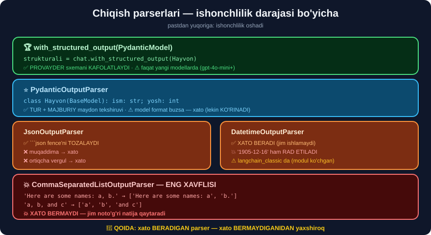

# 🔄 40-modul. Chiqish parserlari

> **LLM matn qaytaradi, dasturingiz esa struktura kutadi.** Bu modul — o'sha ko'prik haqida. Va u yerda **eng xavfli turdagi xato** yashiringan.

---

## 📚 Darslar

| # | Dars | Nima o'rganasiz |
|---|---|---|
| 1 | [String output parser](01-String-Output-Parser.md) | `AIMessage` → `str` · ⚠️ **metadata yo'qoladi** |
| 2 | [Ro'yxat parseri](02-Comma-Separated-List-Output-Parser.md) ⭐⭐ | 💥 **jim noto'g'ri natija** |
| 3 | [Datetime parser](03-Datetime-Output-Parser.md) ⭐⭐ | 💥 **modul ko'chgan** · ⭐ **Pydantic** · 🏆 **`with_structured_output`** |

---

## 📝 Amaliyot

| | |
|---|---|
| 📝 [**26 ta mashq**](MASHQLAR.md) | 🟢 Oson · 🟡 O'rta · 🔴 Qiyin |
| 🚀 [**3 ta mini-loyiha**](LOYIHALAR.md) | 🛡️ **xavfsiz parser qatlami** · 📊 **parser turniri** · 🇺🇿 **strukturali ekstraktor** |

> ## ⭐ **KO'PCHILIGI API KALITISIZ** — parserlar **matn** bilan ishlaydi.

---

## 💥💥 Modulning eng muhim topilmasi — JIM NOTO'G'RI NATIJA



Kurs `CommaSeparatedListOutputParser` ning **muvaffaqiyatli** holatini ko'rsatadi. Biz **beshta** kirishda sinadik:

```
'Bark Twain, Sir Waggington, Chewbarka'          → ['Bark Twain', 'Sir Waggington', 'Chewbarka']  ✅
'Bark Twain,Sir Waggington,Chewbarka'            → ['Bark Twain', 'Sir Waggington', 'Chewbarka']  ✅
'1. Bark Twain\n2. Sir Waggington'               → ['1. Bark Twain', '2. Sir Waggington']         ❌
'Here are some names: Bark Twain, Sir Wagging'   → ['Here are some names: Bark Twain', ...]       ❌
'Bark Twain, Sir Waggington, and Chewbarka'      → ['Bark Twain', 'Sir Waggington', 'and Chewbarka'] ❌
```

> ## 💥 **PARSER SHUNCHAKI VERGUL BO'YICHA BO'LADI — VA U XATO BERMAYDI.**
>
> U **doim** ro'yxat qaytaradi. Siz `['Here are some names: Bark Twain', ...]` ni **to'g'ri deb qabul qilasiz**.
>
> ## 🔑 **BUTUN MODULNING SABOG'I:**
> ```
> XATO BERADIGAN parser  →  siz BILASIZ         ✅ arzon
> XATO BERMAYDIGANI      →  siz BILMAYSIZ       💥 qimmat
> ```

---

## 💥 Topilma № 2 — kursning `DatetimeOutputParser` importi ishlamaydi

```python
from langchain.output_parsers import DatetimeOutputParser
```

```
YO'Q langchain.output_parsers
OK   langchain_classic.output_parsers.DatetimeOutputParser: True
```

> ## ✅ **35-MODULDA OGOHLANTIRGAN EDIK.** `pip install langchain-classic` yoki **zamonaviy** yechimga o'ting.

### Va u JUDA QATTIQ

```
'1905-12-16T00:00:00.000000Z'    → 1905-12-16 00:00:00     ✅
'1905-12-16'                     → ❌ OutputParserException  💥
'December 16, 1905'              → ❌ OutputParserException  💥
```

> ## ✅ **LEKIN BU — YAXSHI TOMONI:** u **jim** ishlamaydi, **darhol** xato beradi.
>
> ## 💡 **YUMSHOQROQ MUQOBIL:** `dateutil.parser.parse(matn, fuzzy=True)` — jumla **ichidan** ham sanani topadi. ⚠️ **Yil oralig'ini tekshiring.**

---

## ⭐⭐ Kursda YO'Q — `PydanticOutputParser`

```python
class Hayvon(BaseModel):
    ism: str = Field(description="hayvon ismi")
    tur: str = Field(description="hayvon turi")
    yosh: int = Field(description="yoshi")

pp = PydanticOutputParser(pydantic_object=Hayvon)
```

```
'{"ism": "Bark Twain", "tur": "it", "yosh": 3}'   → ism='Bark Twain' tur='it' yosh=3   ✅
'{"ism": "Bark Twain", "tur": "it"}'              → ❌ (yosh YO'Q)
'{"ism": "Bark Twain", "tur": "it", "yosh": "uch"}' → ❌ (yosh SATR)
```

> ## 🏆 **UCHTA NARSANI BIRDANIGA QILADI:**
> ```
> ① Modelga SXEMANI aytadi     (get_format_instructions)
> ② JSON ni parse qiladi
> ③ ⭐ TUR va MAJBURIY maydonni TEKSHIRADI
> ```
>
> ## ⭐ **`Literal` — ENG FOYDALI TUR:**
> ```python
> bolim: Literal["karta", "depozit", "kredit", "boshqa"]
> ```
> **Oq ro'yxat sxemaga o'rnatiladi** — model boshqa qiymat qaytara **olmaydi**.

---

## 🏆 ENG ISHONCHLI YECHIM — parser EMAS

```python
strukturali = chat.with_structured_output(Hayvon)      # ⭐ BITTA SATR
natija = strukturali.invoke("Menda 3 yoshli it bor, ismi Bark Twain")
# → Hayvon(ism='Bark Twain', tur='it', yosh=3)
```

```
Parser       →  model MATNNI to'g'ri yozishiga UMID qiladi
Structured   →  ⭐ PROVAYDER sxemani KAFOLATLAYDI
```

> ## 💡 **AMALIY QOIDA:**
> ```
> ① with_structured_output mavjudmi?  →  ⭐ ISHLATING
> ② Yo'qmi?                            →  PydanticOutputParser + qayta urinish
> ③ Juda oddiy vazifa?                 →  StrOutputParser + qo'lda tekshiruv
> ```
> ## ⚠️ **Faqat yangi modellarda** *(`gpt-4o-mini`+, Claude, Gemini)*. Mahalliy kichik modellarda — **yo'q**.

---

## ⚠️ `StrOutputParser` NIMANI YO'QOTADI

```python
matn = StrOutputParser().invoke(r)
```

```
❌ finish_reason   →  javob KESILGANMI?    (38-modul)
❌ usage_metadata  →  NARX qancha bo'ldi?  (36-modul)
❌ model           →  qaysi ANIQ versiya?
```

> ## ✅ **YECHIM:** parserdan **oldin** metadatani oling, yoki `RunnableLambda` bilan **ikkalasini ham** qiling *(41-modul)*.

---

## 📋 Mavjud parserlar — kursda faqat 3 tasi

```
CommaSeparatedListOutputParser  ·  NumberedListOutputParser
MarkdownListOutputParser        ·  JsonOutputParser
PydanticOutputParser            ·  XMLOutputParser
SimpleJsonOutputParser          ·  StrOutputParser  ...
```

> ## 💡 **`NumberedListOutputParser` — AMALIY MASLAHAT.** LLM'lar **tabiiy ravishda** raqamli ro'yxat yozadi. Ularni vergulga **majburlashdan** ko'ra — **tabiiy** formatini **parse qiling**.

---

## 🇺🇿 O'zbekcha ro'yxatlarda ikki tuzoq

```
① "va" bog'lovchisi     →  "..., Chorsu va Minor"  →  "va Minor" element bo'ladi
② Vergul JUMLA ICHIDA   →  "Amir Temur maydoni, shahar markazida"
                            →  IKKITA element bo'lib bo'linadi!
```

> ## ✅ **YECHIM — VERGUL EMAS, `' | '` YOKI YANGI QATOR.**
> ```python
> KO_RSATMA = "Har bir elementni ' | ' bilan ajrating. Boshqa hech narsa yozmang."
> ```
> ## 🔑 **VERGUL — O'ZBEKCHA MATN UCHUN YOMON AJRATUVCHI.**

---

## 🎓 Modulni tugatgach

```
✅ Parserlar zanjirning bir qismi ekanini bilasiz (invoke → Runnable)
✅ CommaSeparatedListOutputParser JIM sinishini bilasiz
✅ get_format_instructions() ni promptga qo'shasiz
✅ PydanticOutputParser bilan TUR tekshiruvini qo'shasiz
✅ Literal bilan oq ro'yxat o'rnatasiz
✅ with_structured_output — eng ishonchli yechim ekanini bilasiz
✅ Metadata parserdan OLDIN olinishi kerakligini bilasiz
✅ 🇺🇿 O'zbekcha uchun vergul yomon ajratuvchi ekanini bilasiz
```

---

## 🔗 Bog'liq modullar

| Modul | Aloqasi |
|---|---|
| [33-modul](../33-BERT-Question-Answering/README.md) | Ishonch chegarasi — **jim xatoga** qarshi bir xil g'oya |
| [34-modul](../34-Text-Classification-XLNet/README.md) | Oltin to'plam · format buzilishini o'lchash |
| [35-modul](../35-LangChain-Introduction/README.md) | ## **`langchain.output_parsers` olib tashlangan** |
| [38-modul](../38-LangChain-OpenAI-API/README.md) | ## **`response_format` + `strict: True`** — asosiy yechim |
| [39-modul](../39-LangChain-Model-Inputs/README.md) | Prompt shabloni — **kirish** tomoni |
| [41-modul](../41-LangChain-LCEL/README.md) | ➡️ **`prompt \| model \| parser`** |

---

⬅️ [39-modul. Model kirishlari](../39-LangChain-Model-Inputs/README.md) · 🏠 [Bosh sahifa](../README.md) · ➡️ [41-modul. LCEL](../41-LangChain-LCEL/README.md)
