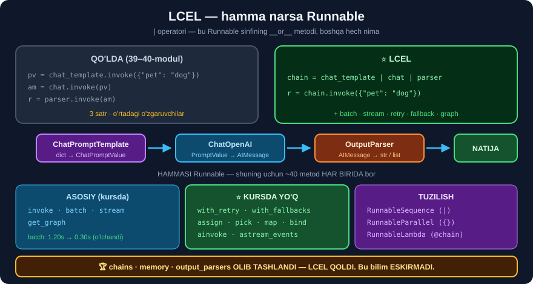

# 1-dars. Prompt, model va parserni ulash ⭐⭐

## 🎬 Boshlashdan oldin

> ## ⭐⭐ **BU — BUTUN LANGCHAIN BO'LIMINING ENG QIMMATLI MODULI.**
>
> 35-modulda ko'rgan edik: `langchain.chains`, `langchain.memory`, `langchain.output_parsers` — **hammasi olib tashlangan**. **LCEL esa — joyida.** Bu bilim **eskirmadi**.

---

## 1. Qo'lda — uch qadam

39 va 40-modullarda alohida ko'rgan edik:

```python
from langchain_core.prompts import ChatPromptTemplate
from langchain_core.output_parsers import CommaSeparatedListOutputParser

list_instructions = CommaSeparatedListOutputParser().get_format_instructions()

chat_template = ChatPromptTemplate.from_messages([
    ("human", "I've recently adopted a {pet}. Could you suggest three {pet} names? \n"
              + list_instructions)])

list_output_parser = CommaSeparatedListOutputParser()

# ── UCH QADAM ──
chat_template_result = chat_template.invoke({"pet": "dog"})     # ① ChatPromptValue
chat_result = chat.invoke(chat_template_result)                 # ② AIMessage
list_output_parser.invoke(chat_result)                          # ③ list
```

---

## 2. ⭐ Bitta satr



```python
chain = chat_template | chat | list_output_parser
chain.invoke({"pet": "dog"})
```

> ## 🏆 **`|` — PYTHON'NING `__or__` OPERATORI.**
>
> LangChain'ning har komponenti **`Runnable`** sinfidan meros oladi, u esa `__or__` ni **qayta aniqlaydi**.
>
> ```python
> a | b   →   RunnableSequence(a, b)
> ```

```python
print("turi    :", type(chain).__name__)
print("qadamlar:", [type(s).__name__ for s in chain.steps])
```

```
turi    : RunnableSequence
qadamlar: ['ChatPromptTemplate', 'ChatOpenAI', 'CommaSeparatedListOutputParser']
```

---

## 3. 🔬 Modelsiz ham ishlaydi — SINAB KO'RING

LCEL'ni tushunish uchun **model kerak emas**:

```python
from langchain_core.runnables import RunnableLambda

runnable_sum = RunnableLambda(lambda x: sum(x))
runnable_square = RunnableLambda(lambda x: x ** 2)

chain = runnable_sum | runnable_square
print(chain.invoke([1, 2, 5]))
```

```
64
```

```
[1, 2, 5]  →  sum  →  8  →  square  →  64
```

> ## 🏆 **BU — LCEL'NI O'RGANISHNING ENG YAXSHI USULI.**
>
> ```
> ✅ BEPUL — API chaqiruvi yo'q
> ✅ TEZ — bir zumda
> ✅ Natija ANIQ — 64 yoki 64 emas
> ```
>
> ## 💡 **Kurs buni 9-darsda ko'rsatadi.** Biz uni **birinchi darsda** beramiz — chunki u **mexanizmni** eng yaxshi tushuntiradi.

---

## 4. ⭐ Nima uchun `|` — SIRLI narsa emas

```python
class MeningRunnable:
    def __init__(self, f): self.f = f
    def invoke(self, x): return self.f(x)
    def __or__(self, boshqa):
        return MeningRunnable(lambda x: boshqa.invoke(self.invoke(x)))

a = MeningRunnable(lambda x: sum(x))
b = MeningRunnable(lambda x: x ** 2)
print((a | b).invoke([1, 2, 5]))        # 64
```

> ## 🔑 **BUTUN LCEL'NING ASOSI — SHU O'N SATR.** LangChain unga **batch**, **stream**, **async**, **retry**, **fallback** va **graf** qo'shadi *(keyingi darslarda)*.

---

## 5. ⚠️ Uchta tuzoq

### ① Tartib MUHIM

```python
chain = chat_template | chat | parser        # ✅
chain = chat | chat_template | parser        # ❌ chat lug'at qabul qilmaydi
```

### ② Turlar MOS kelishi kerak

```
ChatPromptTemplate  qabul: dict          →  qaytaradi: ChatPromptValue
ChatOpenAI          qabul: PromptValue   →  qaytaradi: AIMessage
StrOutputParser     qabul: AIMessage     →  qaytaradi: str
```

> ## 💡 **TEKSHIRISH:**
> ```python
> print(chain.input_schema.model_json_schema()["title"])
> print(chain.output_schema.model_json_schema()["title"])
> ```

### ③ Birinchi element `Runnable` bo'lishi kerak

```python
"salom" | chat          # ❌ TypeError
```

> ## ✅ **YECHIM:** `RunnablePassthrough()` yoki `RunnableLambda(...)` bilan **boshlang**.

---

## 6. ⚡ Mashqlar

### 🟢 Oson

**M1.** `|` operatori nima qaytaradi?

**M2.** LCEL ni o'rganish uchun model kerakmi?

**M3.** Zanjirning qadamlarini qanday ko'rish mumkin?

<details>
<summary>✅ Javoblar</summary>

**M1.** ## **`RunnableSequence`**.

**M2.** ## ❌ **Yo'q** — `RunnableLambda` bilan **bepul** o'rganiladi.

**M3.** ## `chain.steps` yoki `chain.get_graph().print_ascii()`.

</details>

### 🟡 O'rta

**M4.** ⭐ Modelsiz zanjir yasang.

<details>
<summary>✅ Yechim</summary>

```python
from langchain_core.runnables import RunnableLambda

z = (RunnableLambda(lambda x: x.strip())
     | RunnableLambda(lambda x: x.lower())
     | RunnableLambda(lambda x: x.split())
     | RunnableLambda(lambda x: len(x)))

print(z.invoke("  Salom Dunyo Bu Sinov  "))     # 4
print("qadamlar:", [type(s).__name__ for s in z.steps])
```

</details>

**M5.** ⭐ Zanjirning kirish/chiqish turini ko'ring.

<details>
<summary>✅ Yechim</summary>

```python
z = chat_template | chat | StrOutputParser()
print("kirish :", z.input_schema.model_json_schema().get("title"))
print("chiqish:", z.output_schema.model_json_schema().get("title"))
```

## 💡 **TURLAR MOS KELMASA — DARHOL BILASIZ.**

</details>

**M6.** ⭐⭐ `|` ni o'zingiz yozing.

<details>
<summary>✅ Yechim</summary>

```python
class MeningRunnable:
    def __init__(self, f, nom=""):
        self.f, self.nom = f, nom or getattr(f, "__name__", "lambda")
    def invoke(self, x):
        return self.f(x)
    def __or__(self, b):
        yangi = MeningRunnable(lambda x: b.invoke(self.invoke(x)))
        yangi.nom = f"{self.nom} | {b.nom}"
        return yangi

a = MeningRunnable(lambda x: sum(x), "sum")
b = MeningRunnable(lambda x: x**2, "square")
z = a | b
print(z.nom, "→", z.invoke([1, 2, 5]))
```

## 🏆 **LCEL — SEHR EMAS, `__or__`.**

</details>

---

## 📌 Xulosa

```python
# QO'LDA (39–40-modul)
pv = chat_template.invoke({"pet": "dog"})
am = chat.invoke(pv)
r  = parser.invoke(am)

# ⭐ LCEL
chain = chat_template | chat | parser
r = chain.invoke({"pet": "dog"})
```

```
turi    : RunnableSequence
qadamlar: ['ChatPromptTemplate', 'ChatOpenAI', 'CommaSeparatedListOutputParser']
```

> ## 🏆 **VA BU BILIM ESKIRMADI** — `chains`, `memory`, `output_parsers` olib tashlandi, **LCEL qoldi**.

---

⬅️ [40-modul. Chiqish parserlari](../40-LangChain-Output-Parsers/README.md) · 🏠 [Modul boshiga](README.md) · ➡️ [2-dars. Batching](02-Batching.md)
