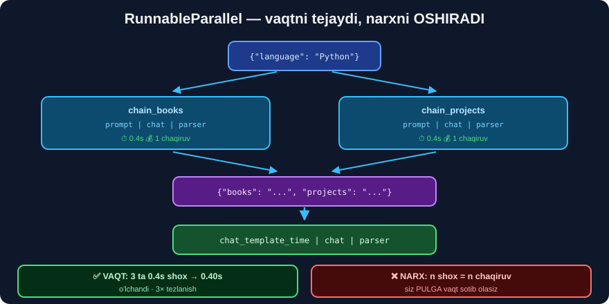

# 7-dars. `RunnableParallel` ⭐⭐

## 🎬 Boshlashdan oldin

> **"`chain_parallel = RunnableParallel({'books': chain_books, 'projects': chain_projects})`"**

---

## 1. G'oya



```
                    ┌─→  chain_books    →  "kitoblar ro'yxati"  ─┐
kirish  ────────────┤                                            ├─→  {"books": ..., "projects": ...}
                    └─→  chain_projects →  "loyihalar ro'yxati" ─┘
```

```python
from langchain_core.runnables import RunnableParallel

chain_books = chat_template_books | chat | string_parser
chain_projects = chat_template_projects | chat | string_parser

chain_parallel = RunnableParallel({"books": chain_books,
                                   "projects": chain_projects})

chain_parallel.invoke({"programming language": "Python"})
```

---

## 2. 🔬 HAQIQATAN PARALLELMI? — O'LCHADIK

Kurs *"parallel"* deydi. Biz **tekshirdik**:

```python
import time
from langchain_core.runnables import RunnableLambda, RunnableParallel

sekin = RunnableLambda(lambda x: (time.sleep(0.4), x)[1])
pp = RunnableParallel({"a": sekin, "b": sekin, "c": sekin})

t0 = time.perf_counter(); pp.invoke(1)
print(f"RunnableParallel (3 ta 0.4s): {time.perf_counter()-t0:.2f}s")
```

```
RunnableParallel (3 ta 0.4s): 0.40s
```

> ## ✅✅ **TASDIQLANDI — HAQIQATAN PARALLEL.**
>
> ```
> Ketma-ket bo'lsa  →  1.20s
> Parallel          →  0.40s        ⭐ 3× tez
> ```

```python
p = RunnableParallel({"yigindi": RunnableLambda(lambda x: sum(x)),
                      "uzunlik": RunnableLambda(lambda x: len(x)),
                      "max": RunnableLambda(lambda x: max(x))})
print(p.invoke([1, 2, 5]))
```

```
{'yigindi': 8, 'uzunlik': 3, 'max': 5}
```

---

## 3. ⭐ Lug'at — qisqa yozuv

```python
# Uzun
chain_time1 = (RunnableParallel({"books": chain_books, "projects": chain_projects})
               | chat_template_time | chat | string_parser)

# ⭐ Qisqa — AYNAN BIR XIL
chain_time2 = ({"books": chain_books, "projects": chain_projects}
               | chat_template_time | chat | string_parser)
```

> ## ✅ **LANGCHAIN LUG'ATNI AVTOMATIK `RunnableParallel` GA AYLANTIRADI.**
>
> ## 💡 **QAYSI BIRINI YOZISH KERAK?** `RunnableParallel(...)` — **aniqroq**, o'qiganda **niyat ko'rinadi**. Amalda **ikkalasi ham** ishlatiladi.

---

## 4. ⚠️ Har shox BIR XIL kirishni oladi

```python
kirish = {"programming language": "Python"}

RunnableParallel({"books": chain_books, "projects": chain_projects}).invoke(kirish)
#                          ↑                    ↑
#                    ikkalasi ham AYNAN SHU lug'atni oladi
```

> ## 🔑 **SHOXLAR BIR-BIRINI KO'RMAYDI.** Agar `projects` ga `books` natijasi kerak bo'lsa — bu **parallel emas**, **ketma-ket** *(5-dars)*.

---

## 5. 💰💰 Parallel narxni OSHIRADI

> ## ⚠️ **KURS BUNI AYTMAYDI:**
> ```
> RunnableParallel {3 shox}  →  3 ta ALOHIDA model chaqiruvi
>                            →  3× NARX
>                            →  1× VAQT              ⭐
> ```
>
> ## 🔑 **ALMASHUV ANIQ:** siz **pulga** vaqt sotib olasiz.
>
> ## 💡 **ARZONROQ MUQOBIL — BITTA CHAQIRUVDA IKKALASINI SO'RASH:**
> ```python
> shablon = ChatPromptTemplate.from_template("""
> For {language}, provide:
> 1) Three intermediate books
> 2) Three intermediate projects
> Answer as JSON with keys "books" and "projects".
> """)
> zanjir = shablon | chat | JsonOutputParser()
> ```
> ```
> Parallel  →  2 chaqiruv · 1× vaqt · 2× narx
> JSON      →  1 chaqiruv · 1× vaqt · 1× narx  ⭐  (lekin sifat pastroq bo'lishi mumkin)
> ```
> ## 🏆 **O'LCHANG** — 34 va 39-modullardagi kabi.

---

## 6. ⭐ Xato bo'lganda nima bo'ladi?

```python
p = RunnableParallel({"ok": RunnableLambda(lambda x: "yaxshi"),
                      "xato": RunnableLambda(lambda x: 1 / 0)})
try:
    p.invoke(1)
except Exception as e:
    print("💥", type(e).__name__, "— BUTUN parallel sindi")
```

> ## 💥 **BITTA SHOX SINSA — HAMMASI SINADI.**
>
> ## ✅ **YECHIM — HAR SHOXGA `with_fallbacks`:**
> ```python
> p = RunnableParallel({
>     "books": chain_books.with_fallbacks([RunnableLambda(lambda x: "—")]),
>     "projects": chain_projects.with_fallbacks([RunnableLambda(lambda x: "—")]),
> })
> ```
> **Endi bitta shox ishlamasa ham — qolgani natija beradi.**

---

## 7. ⚡ Mashqlar

### 🟢 Oson

**M1.** `RunnableParallel` nima qaytaradi?

**M2.** Shoxlar bir-birini ko'radimi?

**M3.** Parallel narxni tejaydimi?

<details>
<summary>✅ Javoblar</summary>

**M1.** ## **Lug'at** — kalitlar shox nomlari.

**M2.** ## ❌ **Yo'q** — hammasi **bir xil kirishni** oladi.

**M3.** ## ❌ **Yo'q** — narxni **oshiradi**, faqat **vaqtni** tejaydi.

</details>

### 🟡 O'rta

**M4.** ⭐ Parallellikni o'zingiz o'lchang.

<details>
<summary>✅ Yechim</summary>

```python
import time
from langchain_core.runnables import RunnableLambda, RunnableParallel

sekin = RunnableLambda(lambda x: (time.sleep(0.4), x)[1])

for n in [1, 2, 4, 8]:
    p = RunnableParallel({f"s{i}": sekin for i in range(n)})
    t0 = time.perf_counter(); p.invoke(1)
    print(f"{n} shox → {time.perf_counter()-t0:.2f}s  "
          f"(ketma-ket bo'lsa {n*0.4:.1f}s)")
```

## 💡 **SHOXLAR KO'PAYGANDA VAQT DEYARLI O'ZGARMAYDI** — bu **parallellik**.

</details>

**M5.** ⭐ Lug'at va `RunnableParallel` bir xilmi?

<details>
<summary>✅ Yechim</summary>

```python
a = RunnableParallel({"x": RunnableLambda(sum), "y": RunnableLambda(max)})
b = {"x": RunnableLambda(sum), "y": RunnableLambda(max)} | RunnableLambda(lambda d: d)

print("a:", a.invoke([1, 2, 5]))
print("b:", b.invoke([1, 2, 5]))
```

</details>

**M6.** ⭐⭐ Xatoli shoxni himoyalang.

<details>
<summary>✅ Yechim</summary>

```python
himoyalangan = RunnableParallel({
    "ok": RunnableLambda(lambda x: "yaxshi"),
    "xato": RunnableLambda(lambda x: 1 / 0).with_fallbacks(
        [RunnableLambda(lambda x: "❌ mavjud emas")]),
})
print(himoyalangan.invoke(1))
```

```
{'ok': 'yaxshi', 'xato': '❌ mavjud emas'}
```

</details>

### 🔴 Qiyin

**M7.** ⭐⭐ Parallel vs bitta JSON chaqiruvini solishtiring.

<details>
<summary>✅ Yechim</summary>

```python
import time, pandas as pd
from langchain_core.output_parsers import JsonOutputParser

# ① Parallel — 2 chaqiruv
zanjir_parallel = ({"books": chain_books, "projects": chain_projects}
                   | RunnableLambda(lambda d: d))

# ② Bitta JSON chaqiruv
shablon_json = ChatPromptTemplate.from_template("""
For {language}, provide exactly:
- "books": three intermediate-level books
- "projects": three intermediate-level projects
Answer ONLY as a JSON object with those two keys.
""")
zanjir_json = shablon_json | chat | JsonOutputParser()

q = []
for nom, z in [("parallel", zanjir_parallel), ("json", zanjir_json)]:
    t0 = time.perf_counter()
    try:
        r = z.invoke({"programming language": "Python", "language": "Python"})
        ok = True
    except Exception as e:
        r, ok = str(e)[:60], False
    q.append({"usul": nom, "soniya": round(time.perf_counter()-t0, 2),
              "ok": ok})
print(pd.DataFrame(q).to_string(index=False))
```

## 🔑 **NARXNI HAM O'LCHANG** — `usage_metadata` orqali *(36-modul)*.

</details>

**M8.** ⭐⭐⭐ Ko'p perspektivali tahlil zanjirini yozing.

<details>
<summary>✅ Yechim</summary>

```python
PERSPEKTIVALAR = {
    "ijobiy": "List ONLY the positive aspects. Be brief.",
    "salbiy": "List ONLY the negative aspects. Be brief.",
    "xavf":   "List ONLY the risks. Be brief.",
}

def perspektiva_zanjiri(chat, parser):
    shoxlar = {
        nom: (ChatPromptTemplate.from_messages([("system", ko), ("human", "{matn}")])
              | chat | parser
              | RunnableLambda(lambda s: s.strip()))
        for nom, ko in PERSPEKTIVALAR.items()}

    xulosa_shablon = ChatPromptTemplate.from_template("""
Considering these three analyses, write a balanced 3-sentence summary in Uzbek:

IJOBIY:
{ijobiy}

SALBIY:
{salbiy}

XAVFLAR:
{xavf}
""")
    return (RunnableParallel(shoxlar) | xulosa_shablon | chat | parser)

z = perspektiva_zanjiri(chat, StrOutputParser())
print(z.invoke({"matn": "Bankimiz mijozlarga AI chatbot joriy qilmoqchi."}))
```

## 🏆 **UCHTA PERSPEKTIVA PARALLEL, KEYIN XULOSA.**
## ⚠️ **NARX: 4 ta chaqiruv** *(3 parallel + 1 xulosa)*. Vaqt esa — **2× chaqiruv vaqti**.

</details>

---

## 📌 Xulosa

```python
RunnableParallel({"a": zanjir1, "b": zanjir2})
{"a": zanjir1, "b": zanjir2}                  # ⭐ AYNAN BIR XIL

→ {"a": natija1, "b": natija2}
```

```
✅ VAQT tejaydi   (3 ta 0.4s → 0.40s, o'lchandi)
❌ NARX oshiradi  (n shox = n chaqiruv)
⚠️ Shoxlar bir-birini KO'RMAYDI
💥 Bitta shox sinsa — HAMMASI sinadi  →  with_fallbacks
```

---

⬅️ [6-dars. Grafda ko'rish](06-Graphing-Runnables.md) · 🏠 [Modul boshiga](README.md) · ➡️ [8-dars. RunnableParallel'ni ulash](08-Piping-RunnableParallel.md)
