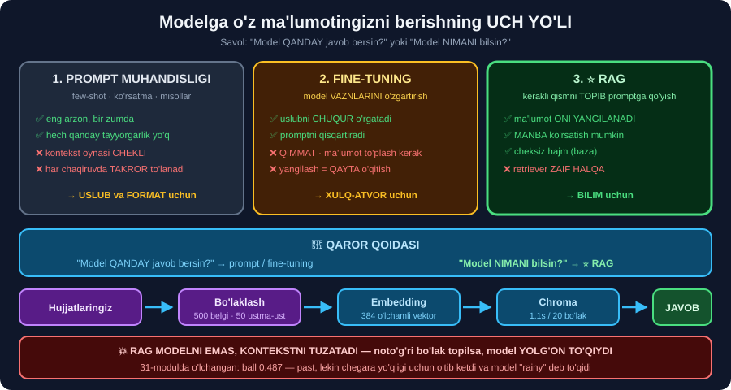
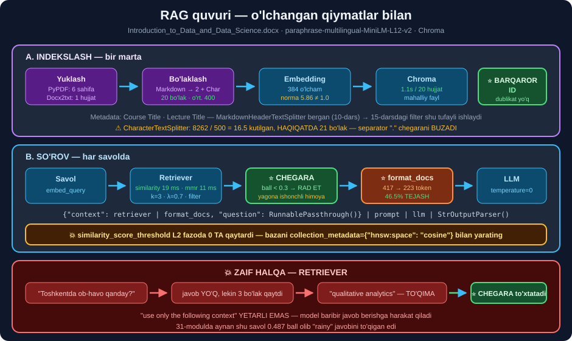

# 📚 42-modul. LangChain — RAG (Retrieval Augmented Generation)

> ## 🏆 **BU — LANGCHAIN BO'LIMINING ENG KATTA VA ENG AMALIY MODULI** *(18 dars)*.
>
> RAG — modelga **o'z hujjatlaringizni** berishning yagona **arzon, yangilanadigan va manbali** yo'li.
>
> ## ⭐⭐ **BUTUN QUVUR API KALITISIZ ISHLAYDI** — mahalliy embedding + mahalliy Chroma.

---

## 📚 Darslar

### 🧠 Nazariya *(1–5)*

| # | Dars | Nima o'rganasiz |
|---|---|---|
| 1 | [O'z ma'lumotingizni ulash](01-How-to-Integrate-Custom-Data.md) ⭐⭐ | ## Prompt · fine-tuning · **RAG** — qaysi biri qachon |
| 2 | [RAG bilan tanishuv](02-Introduction-to-RAG.md) ⭐⭐ | R·A·G · ## 💥 **retriever — zaif halqa** |
| 3 | [Yuklash va bo'laklash](03-Document-Loading-and-Splitting.md) | `Document` · nima uchun bo'laklaymiz |
| 4 | [Hujjat embeddingi](04-Document-Embedding.md) ⭐⭐ | Kosinus · ## 💥 **norma 5.86 ≠ 1.0** |
| 5 | [Saqlash, topish, javob](05-Storing-Retrieval-Generation.md) ⭐ | Vektor DB vs SQL · baza tanlash |

### 📥 Yuklash va bo'laklash *(6–10)*

| # | Dars | Nima o'rganasiz |
|---|---|---|
| 6 | [PyPDFLoader](06-Loading-PyPDFLoader.md) ⭐ | 6 sahifa · `deepcopy` · ## bo'sh sahifa detektori |
| 7 | [Docx2txtLoader](07-Loading-Docx2txtLoader.md) ⭐ | 1 hujjat vs 6 · ## universal yuklovchi |
| 8 | [CharacterTextSplitter — nazariya](08-Character-Text-Splitter-Theory.md) ⭐ | ## 💥 **belgi ≠ token** · 🇺🇿 qisqartma tuzog'i |
| 9 | [CharacterTextSplitter — kod](09-Character-Text-Splitter-Code.md) ⭐⭐ | ## 💥 **21 bo'lak, 16.5 emas** |
| 10 | [MarkdownHeaderTextSplitter](10-Markdown-Header-Text-Splitter.md) ⭐⭐ | ## **Ikki bosqichli naqsh** — metadata kaliti |

### 🗄️ Embedding va baza *(11–13)*

| # | Dars | Nima o'rganasiz |
|---|---|---|
| 11 | [Matn embeddingi](11-Text-Embedding.md) ⭐⭐ | ## ⚠️ `ada-002` **eskirgan** · ## ⭐ **bepul mahalliy** |
| 12 | [Chroma yaratish](12-Creating-Chroma-Vectorstore.md) ⭐ | ## 💥 **embedding mosligi tuzog'i** · 🇺🇿 suverenitet |
| 13 | [Hujjatlarni boshqarish](13-Managing-Documents.md) | CRUD · ## ⭐ **barqaror ID** |

### 🔍 Topish va javob *(14–18)*

| # | Dars | Nima o'rganasiz |
|---|---|---|
| 14 | [Similarity search](14-Similarity-Search.md) ⭐⭐ | ## 💥 **ballar L2 MASOFA, kosinus emas** |
| 15 | [MMR qidiruv](15-MMR-Search.md) ⭐⭐ | `λ` o'lchandi · ## ⭐ **`filter`** |
| 16 | [Retriever](16-Vectorstore-Backed-Retriever.md) ⭐⭐ | ## **Runnable** · 💥 `score_threshold` 0 ta qaytardi |
| 17 | [Stuffing](17-Stuffing-Documents.md) ⭐⭐⭐ | ## 💰 **46.5% token isrofi** |
| 18 | [Javob generatsiyasi](18-Generating-Response.md) ⭐⭐⭐ | ## 💥 **model yolg'on to'qidi** · ikki qavatli himoya |

---

## 📝 Amaliyot

| | |
|---|---|
| 📝 [**44 ta mashq**](MASHQLAR.md) | 🟢 Oson · 🟡 O'rta · 🔴 Qiyin |
| 🚀 [**5 ta mini-loyiha**](LOYIHALAR.md) | 📚 **indekslash quvuri** · 🎯 **sozlagich** · 🛡️ **qalqon** · 📊 **sifat paneli** · 🇺🇿 **o'zbekcha bot** |

---

## 🧭 Uch yo'l — bir rasmda



> ## 🔑 **QAROR QOIDASI:**
> ```
> "Model QANDAY javob bersin?"  →  prompt muhandisligi / fine-tuning
> "Model NIMANI bilsin?"        →  ⭐ RAG
> ```

---

## 🔧 To'liq quvur — o'lchangan qiymatlar bilan



```python
from langchain_huggingface import HuggingFaceEmbeddings
from langchain_chroma import Chroma
from langchain_core.prompts import PromptTemplate
from langchain_core.output_parsers import StrOutputParser
from langchain_core.runnables import RunnableLambda, RunnablePassthrough

embedding = HuggingFaceEmbeddings(                      # ⭐ BEPUL, MAHALLIY
    model_name="sentence-transformers/paraphrase-multilingual-MiniLM-L12-v2")

vs = Chroma.from_documents(bolaklar, embedding,
                           persist_directory="./db",
                           collection_metadata={"hnsw:space": "cosine"})  # ⭐ SHART

retriever = vs.as_retriever(search_type="mmr",
                            search_kwargs={"k": 3, "lambda_mult": 0.7})

def format_docs(docs):                                  # ⭐ 46.5% TEJAYDI
    return "\n\n".join(d.page_content for d in docs)

zanjir = ({"context": retriever | RunnableLambda(format_docs),
           "question": RunnablePassthrough()}
          | prompt | llm | StrOutputParser())
```

---

## 📊 Modulda o'lchangan hamma narsa

| O'lchov | Natija |
|---|---|
| `PyPDFLoader` | 6 sahifa · 8+ metadata maydoni · 1580 → 1541 belgi |
| `Docx2txtLoader` | ## **1 hujjat** · atigi **1** metadata maydoni |
| `CharacterTextSplitter(".", 500)` | ## 💥 **21 bo'lak** *(16.5 kutilgan)* · o'rt. 400 · max 499 |
| `RecursiveCharacterTextSplitter` | ## ✅ **19 bo'lak** · max **500** · oshgan **0** |
| `MarkdownHeader` + `Character` | 2 → ## **20 bo'lak, metadata SAQLANDI** |
| Mahalliy embedding | 384 o'lcham · ## 💥 **norma 5.8556** |
| 🇺🇿 `bank ↔ kredit` | ## ✅ **0.6898** — eng yuqori |
| 🇺🇿 `bank ↔ osmon` | 0.2180 — **3.2× past** |
| 🇺🇿 `cat ↔ mushuk` | ## 💥 **0.2829 — tillar orasi ZAIF** |
| Chroma indekslash | 1.1s / 20 hujjat |
| Qidiruv | similarity **19 ms** · mmr **11 ms** · batch(3) **45 ms** |
| `with_score` ballari | ## 💥 **12.4015 · 15.2941 · 15.5754 — L2 MASOFA** |
| `similarity_score_threshold` | ## 💥 **0 ta hujjat** *(L2 fazoda)* |
| MMR `λ=1.0` | `similarity` bilan **aynan bir xil** ✅ |
| MMR `λ=0.0` | ## 💥 **"kiyim uslublari"** — mutlaqo aloqasiz |
| Stuffing: xom | ## 💥 **417 token** — `Document(...)` repr'i |
| Stuffing: `format_docs` | ## ✅ **223 token — 46.5% TEJASH** |
| Stuffing: manbali | 283 token *(+60, manba beradi)* |
| Generatsiya *(Qwen2.5-0.5B)* | 4.5s · ## 💥 **"ob-havo" savoliga YOLG'ON TO'QIDI** |

---

## 💥 Kurs aytmagan 8 ta narsa

```
① Chroma ballari — L2 MASOFA, kosinus EMAS (12–15, kichik = yaxshi)
   → hnsw:space="cosine" qo'ymasangiz, har qanday chegara BUZILADI

② similarity_score_threshold L2 fazoda 0 TA qaytaradi — faqat OGOHLANTIRISH bilan

③ {context} ga retriever'ni to'g'ridan-to'g'ri ulash = 💰 46.5% TOKEN ISROFI

④ CharacterTextSplitter chunk_size ni KAFOLATLAMAYDI (21 ≠ 16.5)

⑤ Mahalliy embedding normasi 1.0 EMAS → np.dot kosinus EMAS

⑥ from_documents(embedding=) va Chroma(embedding_function=) — nomlar BOSHQA

⑦ langchain_community.vectorstores.Chroma eskirgan → langchain_chroma

⑧ 💥 "use only the following context" YOLG'ON TO'QISHNI TO'XTATMAYDI
   → BALL CHEGARASI kerak (modelga bog'liq bo'lmagan yagona himoya)
```

---

## 🇺🇿 O'zbekcha RAG — qisqacha qo'llanma

```
✅ RETRIEVAL mahalliy va bepul ishlaydi
      bank↔kredit 0.6898 · bank↔osmon 0.2180  →  3.2× ajratish

💥 TILLAR ORASI ZAIF: cat↔mushuk 0.2829
      →  hujjat va savol BIR TILDA bo'lsin
      →  yoki metadata'ga {"til": "uz"} qo'yib FILTRLANG

💰 TOKEN 1.88× QIMMAT (36-modul)
      →  chunk_size 500 emas, 400
      →  k ni kamaytiring, kontekst byudjeti qo'ying

⚠️ GENERATSIYA uchun KUCHLI model kerak
      →  GPT-4o · Claude · Gemini  yoki  Ollama'da 7B+ (37-modul)
      →  Qwen2.5-0.5B o'zbekchada ZAIF (18-darsda o'lchandi)

🏆 MA'LUMOT SUVERENITETI
      Mahalliy embedding + mahalliy Chroma  →  hujjat KOMPYUTERINGIZDAN CHIQMAYDI
      Faqat yakuniy prompt modelga boradi
```

---

## ⚙️ O'rnatish

```bash
pip install langchain langchain-core langchain-community langchain-chroma
pip install langchain-huggingface sentence-transformers
pip install pypdf docx2txt tiktoken pandas
```

> ## 💡 **API KALITI KERAK EMAS** — 1–17-darslarning **hammasi** mahalliy embedding bilan ishlaydi. 18-dars uchun **mahalliy model** *(`transformers`)* yoki **Ollama** *(37-modul)* yetadi.

---

## 🔗 Bog'liq modullar

| Modul | Nima uchun kerak |
|---|---|
| [31-modul](../31-GPT-Models/README.md) | ## 💥 `0.487` ballli **yolg'on to'qish** — 14 va 18-darsda qaytadi |
| [33-modul](../33-BERT-Question-Answering/README.md) | ## ⭐ **Ishonch chegarasini o'lchash usuli** |
| [35-modul](../35-LangChain-Introduction/README.md) | `langchain.chains` **olib tashlangan** — 17-darsdagi strategiyalar |
| [36-modul](../36-LangChain-Tokens-Models-Prices/README.md) | 🇺🇿 **1.88× token** — 17-darsdagi byudjet |
| [37-modul](../37-LangChain-Setting-Up-Environment/README.md) | **Ollama** — 18-darsdagi kalitsiz generatsiya |
| [41-modul](../41-LangChain-LCEL/README.md) | ## 🏆 **LCEL** — 16–18-darslarning butun asosi |

---

## 📌 Modulning bitta xulosasi

> ## 🏆🏆 **RAG — MODELNI EMAS, KONTEKSTNI TUZATADI.**
>
> ```
> Retriever to'g'ri bo'lak topsa   →  hatto kichik model ham to'g'ri javob beradi
> Retriever noto'g'ri topsa        →  hatto GPT-4o ham YOLG'ON TO'QIYDI
> ```
>
> ## 🔑 **SHUNING UCHUN BUTUN KUCHINGIZNI RETRIEVERGA SARFLANG:**
> ```
> ① bo'laklash sifati    (9–10-dars)
> ② embedding tanlovi    (11-dars)
> ③ ⭐ BALL CHEGARASI    (14-dars)   ← eng katta ta'sir
> ④ MMR va filtr         (15-dars)
> ⑤ ⭐ formatlash        (17-dars)   ← eng katta tejash
> ```

---

⬅️ [41-modul. LCEL](../41-LangChain-LCEL/README.md) · 🏠 [Kurs boshiga](../README.md) · 📝 [Mashqlar](MASHQLAR.md) · 🚀 [Loyihalar](LOYIHALAR.md)
