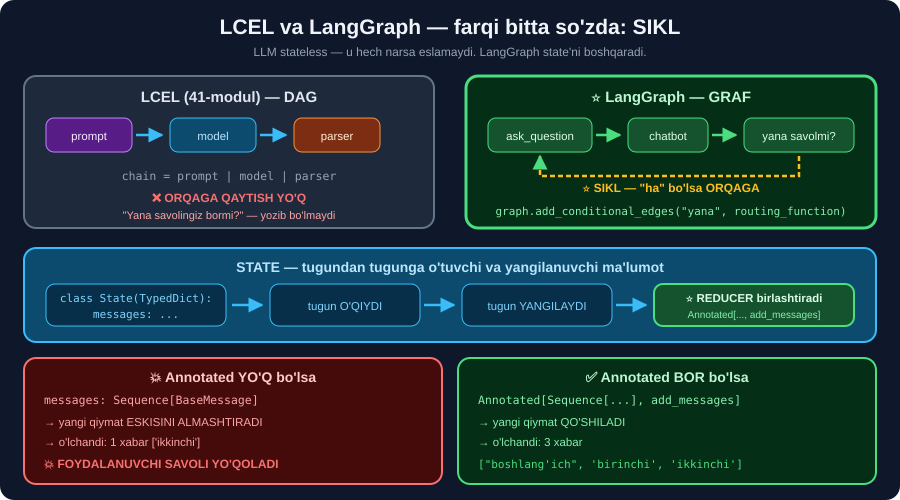

# 🕸️ 43-modul. LangGraph — kirish

> ## 🏆 **BU YERDAN YANGI BO'LIM BOSHLANADI: LANGGRAPH** *(43–47-modullar, 20 dars)*.
>
> LangGraph — til modellari bilan **holatli** *(stateful)*, **ko'p bosqichli** ilovalar quradigan freymvork.
>
> ## ⭐⭐ **BUTUN BO'LIM API KALITISIZ O'RGANILADI** — `FakeListChatModel` yoki Ollama bilan.

---

## 📚 Darslar

| # | Dars | Nima o'rganasiz |
|---|---|---|
| 1 | [LangGraph nima?](01-Welcome-to-the-Course.md) ⭐⭐ | ## 💥 **LLM stateless** · state · ## ⭐ **SIKL** |
| 2 | [Bo'lim nimani qamraydi](02-What-Does-the-Course-Cover.md) ⭐ | Yo'l xaritasi · ## 💰 **uch strategiya narxi** |
| 3 | [Talablar](03-Course-Prerequisites.md) ⭐ | ## `TypedDict` · `Literal` · ## ⭐⭐ **`Annotated`** |

---

## 📝 Amaliyot

| | |
|---|---|
| 📝 [**18 ta mashq**](MASHQLAR.md) | 🟢 Oson · 🟡 O'rta · 🔴 Qiyin |
| 🚀 [**3 ta mini-loyiha**](LOYIHALAR.md) | 🧩 **graf loyihalovchi** · 💰 **narx kalkulyatori** · 📊 **strategiya sinovchisi** |

---

## 🧭 LCEL va LangGraph — bir rasmda



```python
# LCEL (41-modul) — CHIZIQLI, orqaga qaytish YO'Q
chain = prompt | model | parser

# ⭐ LangGraph — GRAF, sikl BOR
graph.add_edge(START, "ask_question")
graph.add_edge("ask_question", "chatbot")
graph.add_conditional_edges("chatbot", routing_function)   # ⭐ QAROR va SIKL
```

> ## 🏆 **FARQI BITTA SO'ZDA: SIKL.**
> ```
> "Yana savolingiz bormi?" → ha → savolga qaytish
>                             ↑
>                LCEL bilan buni YOZIB BO'LMAYDI
> ```

---

## 💥 Modulning eng muhim o'lchovi

```python
class StateYoq(TypedDict):
    messages: Sequence[BaseMessage]                          # ❌ reducer YO'Q

class StateBor(TypedDict):
    messages: Annotated[Sequence[BaseMessage], add_messages] # ✅ reducer BOR
```

```
Annotated YO'Q   →  1 xabar:  ['ikkinchi']                          💥
Annotated BOR    →  3 xabar:  ["boshlang'ich", 'birinchi', 'ikkinchi']  ✅
```

> ## 💥💥 **VA KURSNING 45-MODULDAGI BIRINCHI GRAFIDA `Annotated` YO'Q.**
>
> **Ya'ni foydalanuvchining savoli grafdan chiqmaydi:**
> ```
> kirish : [('human', 'Could you tell me a grook by Piet ...')]
> chiqish: [('ai',    'Piet Hein (1905-1996) was a Danish...')]
>          💥 SAVOL YO'QOLDI
> ```
> Kurs buni **46-modulda tuzatadi**, lekin **xato deb aytmaydi**.

---

## 📊 Bu bo'limda o'lchangan hamma narsa

| O'lchov | Natija |
|---|---|
| `langgraph` versiyasi | ## **1.2.11** *(kurs yozilganidan ancha yangi)* |
| `START` / `END` | ## `'__start__'` / `'__end__'` — **oddiy `str`** |
| `graph` Runnable mi? | ## ❌ **Yo'q** · `graph_compiled` — ## ✅ **ha** |
| `Annotated` yo'q | ## 💥 **1 xabar** — savol yo'qoladi |
| `Annotated` bor | ## ✅ **3 xabar** |
| Rekursiya chegarasi | ## 💥 **10 007** *(sikl ~5000 marta aylandi)* |
| `RemoveMessage` noto'g'ri ID | ## 💥 `ValueError` |
| Checkpointersiz `thread_id` | ## 💥 `ValueError` — aniq xabar bilan |
| `StateSnapshot` maydonlari | `values` `next` `config` `metadata` `created_at` `parent_config` `tasks` `interrupts` |
| SQLite jadvallari | `checkpoints` · `writes` · **28 KB** |
| trim yo'q *(10 burilish)* | 30 xabar · **590 token** |
| trim=5 *(10 burilish)* | ## ✅ **5 xabar · 113 token** — **5.2× farq** |
| Xulosalash narxi | ## 💰 **2× LLM chaqiruvi** |
| 🇺🇿 suhbat tokeni | **1.40×** *(bu misolda)* · **1.88×** *(36-modul)* |

---

## 🇺🇿 Nima uchun bu bo'lim bizga muhim

```
🏦 Bank chatboti      →  ko'p qadamli forma + orqaga qaytish
🏥 Yozilish boti      →  shifokor → sana → vaqt → tasdiq
🏢 Ichki yordamchi    →  42-modul (RAG) + xotira
📞 Marshrutlovchi     →  "bu savol qaysi bo'limga?"

🏆 42 + 43–47 = HUJJATLARINGIZ BO'YICHA XOTIRALI SUHBAT
```

> ## 💰 **🇺🇿 O'ZBEKCHADA TOKEN 1.88× QIMMAT** — ya'ni **xotira strategiyasi** tanlovi bizda **ikki barobar muhimroq**.

---

## ⚙️ O'rnatish

```bash
pip install langgraph langgraph-checkpoint-sqlite
pip install langchain langchain-core tiktoken pandas grandalf
# ixtiyoriy:
pip install langchain-openai python-dotenv        # OpenAI bilan
pip install langchain-ollama                      # mahalliy model bilan
```

```python
# ⭐ API KALITISIZ SINOV MODELI
from langchain_core.language_models.fake_chat_models import FakeListChatModel
chat = FakeListChatModel(responses=["Birinchi javob.", "Ikkinchi javob."])
```

> ## 🏆 **`FakeListChatModel` INTERFEYSI `ChatOpenAI` BILAN BIR XIL** — `invoke`, `batch`, `stream` **hammasi ishlaydi**.
>
> ## 💡 **VA U TAKRORLANUVCHAN** — javoblar sikl bo'yicha qaytariladi, ya'ni xato **grafda** ekani **aniq** bo'ladi.

---

## 🔗 Bog'liq modullar

| Modul | Nima uchun kerak |
|---|---|
| [37](../37-LangChain-Setting-Up-Environment/README.md) | `.env` · ## ⭐ **Ollama** |
| [39](../39-LangChain-Model-Inputs/README.md) | ## ⭐⭐ `HumanMessage` · `AIMessage` · `SystemMessage` |
| [41](../41-LangChain-LCEL/README.md) | ## **Runnable** — tugun ichida ishlatiladi |
| [42](../42-LangChain-RAG/README.md) | ## 🏆 **Retriever — tugunga qo'yiladi** |

---

## 📌 Modulning bitta xulosasi

> ## 🏆 **LLM XOTIRASIZ. "XOTIRA" — BU SIZ QURADIGAN NARSA.**
>
> ```
> ① Xabarlarni saqlash        →  state
> ② Ularni har chaqiruvda yuborish  →  narx MUAMMOSI
> ③ Eskisini qirqish yoki xulosalash  →  ⭐ 46-modul
> ④ Ishga tushirishlar orasida saqlash →  ⭐⭐ 47-modul (checkpointer)
> ```
>
> ## 💥 **VA ENG KO'P UCHRAYDIGAN XATO — `Annotated` NI UNUTISH.** Shunda xabarlar **jim yo'qoladi**.

---

⬅️ [42-modul. RAG](../42-LangChain-RAG/README.md) · 🏠 [Kurs boshiga](../README.md) · ➡️ [44-modul. Muhitni sozlash](../44-LangGraph-Setting-Up-Environment/README.md)
