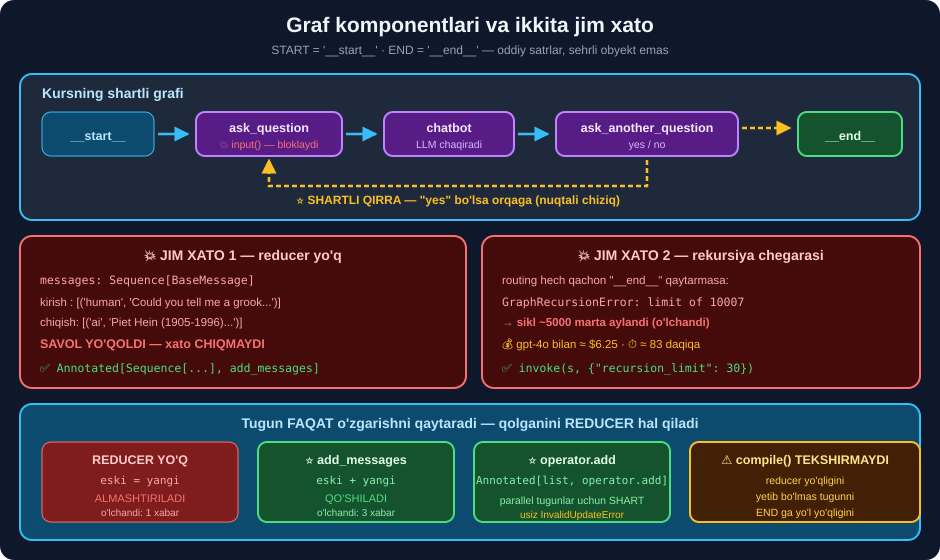

# 🧩 45-modul. Graf komponentlari va amalga oshirish

> ## 🏆 **BU — LANGGRAPH BO'LIMINING ASOSI.** State, node, edge, shartli qirra — **hammasi shu yerda**.
>
> ## ⭐⭐ **BUTUN MODUL API KALITISIZ** — LangGraph **modelsiz ham to'liq ishlaydi**.

---

## 📚 Darslar

| # | Dars | Nima o'rganasiz |
|---|---|---|
| 1 | [State, node va edge](01-States-Nodes-and-Edges.md) ⭐⭐ | `START='__start__'` · superstep · ## ⭐ **reducer** |
| 2 | [Importlar](02-Importing-Relevant-Classes.md) ⭐ | ## `graph` vs `graph_compiled` · ## ⭐ **Runnable** |
| 3 | [State va tugun](03-Defining-a-State-and-a-Node.md) ⭐⭐ | ## 💥 **savol yo'qoladi** · sinf tuguni |
| 4 | [Grafni qurish](04-Building-the-Graph.md) ⭐⭐ | `compile()` · `stream_mode` · ## 💥 **1 xabar, 2 emas** |
| 5 | [Shartli qirralar — tugunlar](05-Conditional-Edges-Nodes-and-Routing.md) ⭐⭐⭐ | ## 💥 **`input()`** → ## ⭐⭐ **`interrupt`** |
| 6 | [Shartli grafni qurish](06-Conditional-Edges-Building-the-Graph.md) ⭐⭐ | ## 💥💥 **rekursiya 10 007** · `path_map` · `Literal` |

---

## 📝 Amaliyot

| | |
|---|---|
| 📝 [**30 ta mashq**](MASHQLAR.md) | 🟢 Oson · 🟡 O'rta · 🔴 Qiyin |
| 🚀 [**4 ta mini-loyiha**](LOYIHALAR.md) | 🔍 **linter** · 🎭 **ishga tushiruvchi** · 📊 **profiler** · 🧪 **test to'plami** |

---

## 🧭 Modul bir rasmda



```python
class State(TypedDict):
    messages: Annotated[Sequence[BaseMessage], add_messages]   # ⭐ SHART

def chatbot(state: State) -> State:
    return State(messages=[chat.invoke(state["messages"])])    # faqat O'ZGARISH

graph = StateGraph(State)
graph.add_node("chatbot", chatbot)
graph.add_edge(START, "chatbot")
graph.add_conditional_edges("chatbot", routing_function)       # ⭐ QAROR va SIKL
graph_compiled = graph.compile()

graph_compiled.invoke(state, {"recursion_limit": 30})          # ⭐⭐ SHART
```

---

## 💥💥 Modulning ikkita jim xatosi

### ① Reducer yo'qligi — savol yo'qoladi

```python
class State(TypedDict):
    messages: Sequence[BaseMessage]         # ❌ kursning kodi
```

```
kirish : [('human', 'Could you tell me a grook by Piet ...')]
chiqish: [('ai',    'Piet Hein (1905-1996) was a Danish...')]
💥 SAVOL YO'QOLDI: True     ← va HECH QANDAY XATO CHIQMAYDI
```

> ## 🔑 **KURS BUNI FAKT SIFATIDA AYTADI:** *"human message endi AI message bilan ALMASHTIRILGAN"*.
>
> ## ✅ **YECHIM — BITTA SO'Z:**
> ```python
> messages: Annotated[Sequence[BaseMessage], add_messages]
> ```
> ```
> chiqish: [('human', ...), ('ai', ...)]   ✅ savol saqlandi
> ```

### ② Rekursiya chegarasi — kursda umuman aytilmagan

```
💥 GraphRecursionError: Recursion limit of 10007 reached
   → sikl ~5000 marta aylandi
```

```
💰 gpt-4o-mini bilan  ≈ $0.38    ⏱ ≈ 83 daqiqa
💰 gpt-4o bilan       ≈ $6.25    — BITTA foydalanuvchining BITTA so'rovi
```

> ## ✅ **IKKI QAVATLI HIMOYA:**
> ```python
> # ① state hisoblagichi — NAZORATLI to'xtash
> if state.get("burilish", 0) >= 20:
>     return "__end__"
>
> # ② recursion_limit — 🛡️ oxirgi himoya
> gc.invoke(state, {"recursion_limit": 30})
> ```

---

## 📊 Modulda o'lchangan hamma narsa

| O'lchov | Natija |
|---|---|
| `START` / `END` | ## `'__start__'` / `'__end__'` — **oddiy `str`** |
| `graph` Runnable? | ## ❌ **False** · `graph_compiled` — ## ✅ **True** |
| Kompilyatsiya turi | `CompiledStateGraph` |
| Reducersiz *(kurs)* | ## 💥 **1 xabar** — savol yo'qoldi |
| `add_messages` bilan | ## ✅ **3 xabar** |
| Parallel + reducersiz | ## 💥 `InvalidUpdateError` |
| `operator.add` bilan | ## ✅ `['A dan', 'B dan']` |
| Rekursiya chegarasi | ## 💥 **10 007** |
| `compile()` xatolari | `Graph must have an entrypoint` · `unknown node` |
| `TypedDict` 100k | ## **0.015s** |
| Pydantic 100k | **0.070s** — ## **4.6× sekin**, lekin **tekshiradi** |
| Parallel 3 tugun | ## ⚡ **33 ms** *(90 ms emas)* |
| `interrupt` | ## ✅ **ishladi** — `Interrupt(value=...)` + `Command(resume=)` |

---

## 💥 Kurs aytmagan 7 ta narsa

```
① 💥 messages'da reducer yo'q → savol YO'QOLADI (o'lchandi)
② 💥 recursion_limit 10 007 → sikl ~5000 marta aylanadi
③ 💥 input() — veb, bot, testda ISHLAMAYDI → ⭐ interrupt
④ 💥 state["messages"][0] → reducer qo'shilgach BUZILADI → [-1]
⑤ ⚠️ compile() reducer yo'qligini TEKSHIRMAYDI
⑥ ⭐ stream / stream_mode — umuman ko'rsatilmagan
⑦ ⭐ routing ro'yxat qaytarsa — PARALLEL tugunlar (33 ms vs 90 ms)
```

---

## 🇺🇿 Amaliy naqshlar

```
# ⭐ Hisob-kitobni KODGA, tushuntirishni MODELGA
def hisobla(s):                       # ⚠️ LLM EMAS
    i, n = 0.24 / 12, s["muddat"]
    return {"oylik": round(s["summa"] * i / (1 - (1 + i) ** -n))}

# ⭐ Har shartli qirrada "operator" yo'li
def bolim_aniqla(s) -> Literal["kredit", "karta", "depozit", "operator"]:
    ...
    return "operator"                 # tushunmadik → ODAMGA

# ⭐ Kalit so'zlar o'zbek VA rus tilida
"depozit": ["depozit", "omonat", "jamg'arma", "vklad"]
```

> ## 🏆 **LLM'GA ARIFMETIKANI BERMANG** — u **ishonchsiz**, **sekin** va **pulli**.
>
> ## 💥 **50 000 000 so'm · 24 oy · 24% → oylik 2 643 555 so'm** *(kod bilan hisoblandi, LLMsiz)*.

---

## 🔗 Bog'liq modullar

| Modul | Nima uchun |
|---|---|
| [39](../39-LangChain-Model-Inputs/README.md) | `HumanMessage` · `AIMessage` · `pretty_print()` |
| [41](../41-LangChain-LCEL/README.md) | ## ⭐ **Runnable** — `graph_compiled` ham Runnable |
| [42](../42-LangChain-RAG/README.md) | ## 🏆 **Retriever tugunga qo'yiladi** |
| [46](../46-LangGraph-Message-Management/README.md) | ## ⭐⭐ **`add_messages` batafsil** |
| [47](../47-LangGraph-Thread-Level-Persistence/README.md) | ## `checkpointer` — `interrupt` uchun **shart** |

---

## 📌 Modulning bitta xulosasi

> ## 🏆 **TUGUN FAQAT O'ZGARISHNI QAYTARADI. QOLGANINI REDUCER HAL QILADI.**
>
> ```
> reducer YO'Q  →  eski qiymat ALMASHTIRILADI  →  💥 ma'lumot yo'qoladi
> reducer BOR   →  eski va yangi BIRLASHTIRILADI  →  ✅
> ```
>
> ## 💥 **VA SIKLLI GRAFDA `recursion_limit` NI DOIM QO'LDA QO'YING.** Standart **10 007** — bu **soatlab vaqt va o'nlab dollar**.

---

⬅️ [44-modul. Muhitni sozlash](../44-LangGraph-Setting-Up-Environment/README.md) · 🏠 [Kurs boshiga](../README.md) · ➡️ [46-modul. Xabarlarni boshqarish](../46-LangGraph-Message-Management/README.md)
