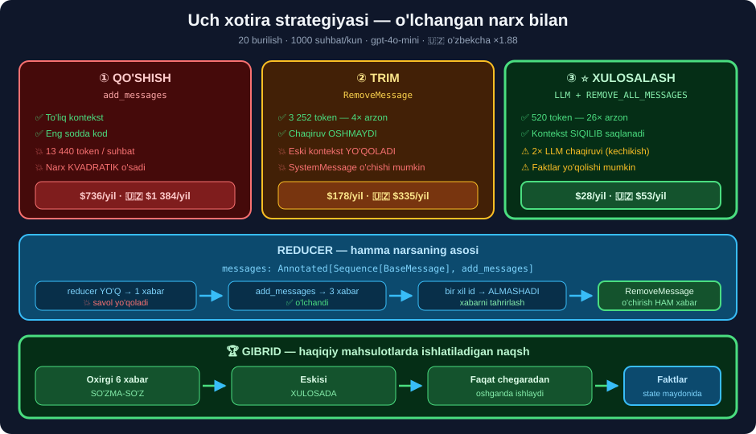

# 💬 46-modul. Xabarlarni boshqarish

> ## 🏆 **BU — BUTUN LANGGRAPH BO'LIMINING MAG'ZI:** chatbotni **xotira bilan** ta'minlash.
>
> ## ⭐⭐ **BUTUN MODUL API KALITISIZ.**

---

## 📚 Darslar

| # | Dars | Nima o'rganasiz |
|---|---|---|
| 1 | [`Annotated` va reducer](01-Annotated-and-Reducer-Functions.md) ⭐⭐⭐ | ## `add_messages` · ## ⭐ **o'z reduceringiz** |
| 2 | [Reducerlar amalda](02-Reducer-Functions-in-Action.md) ⭐⭐ | ## 💥 `[0]` → `[-1]` · ## 💰 **kvadratik narx** |
| 3 | [`MessagesState`](03-The-MessagesState-Class.md) ⭐ | Meros · ## 💥 **`KeyError`** va `.get()` |
| 4 | [`RemoveMessage`](04-The-RemoveMessage-Class.md) ⭐⭐ | ## ⭐ `REMOVE_ALL_MESSAGES` · `lc_trim` |
| 5 | [Qirqish (trim)](05-Trimming-Messages.md) ⭐⭐ | ## 💥 **5.2× tejash** · SystemMessage xavfi |
| 6 | [Xulosalash](06-Summarizing-Messages.md) ⭐⭐⭐ | ## 💰 **26× arzon** · ## 🏆 **gibrid naqsh** |

---

## 📝 Amaliyot

| | |
|---|---|
| 📝 [**28 ta mashq**](MASHQLAR.md) | 🟢 Oson · 🟡 O'rta · 🔴 Qiyin |
| 🚀 [**3 ta mini-loyiha**](LOYIHALAR.md) | 🧠 **xotira menejeri** · 🔬 **sifat sinovchisi** · 📊 **suhbat jurnali** |

---

## 🧭 Uch strategiya — bir rasmda



```python
class State(MessagesState):
    summary: str
    burilish: Annotated[int, operator.add]

# ① QO'SHISH — hech narsa qilmaydi
# ② TRIM — RemoveMessage bilan qirqish
# ③ ⭐ XULOSALASH — LLM bilan siqish
# 🏆 GIBRID — oxirgi 6 so'zma-so'z, eskisi xulosada, chegaradan oshganda
```

---

## 💰 Modulning asosiy o'lchovi

**20 burilish · 1000 suhbat/kun · `gpt-4o-mini`:**

| Strategiya | Kirish token | LLM chaqiruv | Yillik | ## 🇺🇿 **Yillik** |
|---|---:|---:|---:|---:|
| Qo'shish | 13 440 | 20 | $736 | ## 💥 **$1 384** |
| Trim=5 | 3 252 | 20 | $178 | $335 |
| ## **Xulosalash** | ## **520** | ## ⚠️ **40** | ## ⭐ **$28** | ## ⭐ **$53** |

> ## 💥 **QO'SHISH VA XULOSALASH ORASIDA — 🇺🇿 $1 331/YIL FARQ.**
>
> ## ⚠️ **LEKIN XULOSALASH CHAQIRUVNI IKKILANTIRADI** — kechikish ham **2×**.

---

## 📊 Modulda o'lchangan hamma narsa

| O'lchov | Natija |
|---|---|
| `Annotated` yo'q | ## 💥 **1 xabar** — 2 tasi yo'qoldi |
| `add_messages` bilan | ## ✅ **3 xabar** |
| Bir xil `id` | ## ⭐ **almashtiradi** — xabarni tahrirlash usuli |
| `MessagesState` | `messages: Annotated[list[AnyMessage], add_messages]` |
| Merosda `summary` | ## 💥 `KeyError` — `.get("summary", "")` shart |
| `REMOVE_ALL_MESSAGES` | ## `'__remove_all__'` — 10 xabar → **0** |
| Noto'g'ri `id` o'chirish | ## 💥 `ValueError` *(yaxshi xatti-harakat)* |
| 10-burilish, trim yo'q | 30 xabar · **590 token** |
| 10-burilish, trim=5 | ## ✅ **5 xabar · 113 token** — **5.2×** |
| `lc_trim` `include_system` | ## ⚠️ **faqat** `strategy="last"` bilan |
| 3 burilish, reducerli | ## ✅ **15 xabar** *(45-modulda 1 ta edi)* |
| Kontekst o'sishi | ## 💥 **kontekst chiziqli, JAMI narx KVADRATIK** |

---

## 💥 Kurs aytmagan 6 ta narsa

```
① ⭐ O'z reduceringizni yozish mumkin — oxirgi_n · birinchi_qiymat ·
     noyob_qoshish · lugat_yangilash · cheklangan_jurnal

② ⭐ REMOVE_ALL_MESSAGES — bitta obyekt hammasini o'chiradi

③ 💥 langchain_core.trim_messages BOR — kursning funksiyasi uni BERKITADI
     va u ANCHA yaxshiroq: token bo'yicha · include_system · start_on

④ 💥 [:-5] SystemMessage'ni o'chiradi → 🇺🇿 model tilni UNUTADI

⑤ 💰 Kursning kodi HAR BURILISHDA xulosalaydi — chegara qo'ying,
     chaqiruvlar yarmiga qisqaradi

⑥ 🏆 GIBRID naqsh: oxirgi N so'zma-so'z + eskisi xulosada
     — haqiqiy mahsulotlarda ishlatiladigan yechim
```

---

## 🇺🇿 O'zbekcha loyihalar uchun

```
💰 TOKEN 1.88× QIMMAT (36-modul)
   → xotira strategiyasi tanlovi bizda IKKI BAROBAR muhimroq
   → 20 burilishlik suhbat: $1 384/yil (qo'shish) vs $53/yil (xulosalash)

💥 SystemMessage'ni HECH QACHON o'chirmang
   → unda "O'zbek tilida javob bering" yozilgan
   → o'chsa model INGLIZCHAGA o'tib ketadi
   → ✅ lc_trim(..., include_system=True)

🏆 MUHIM FAKTLARNI messages'da EMAS, state MAYDONIDA saqlang
   class State(MessagesState):
       summa: int       # ⭐ trim va xulosalash TEGMAYDI
       muddat: int
       til: str
```

---

## ⚙️ O'rnatish

```bash
pip install langgraph langchain-core tiktoken pandas
```

```python
from langgraph.graph import MessagesState, add_messages
from langgraph.graph.message import REMOVE_ALL_MESSAGES
from langchain_core.messages import RemoveMessage, trim_messages as lc_trim
```

---

## 🔗 Bog'liq modullar

| Modul | Nima uchun |
|---|---|
| [36](../36-LangChain-Tokens-Models-Prices/README.md) | ## 🇺🇿 **1.88× token** — butun narx hisobining asosi |
| [39](../39-LangChain-Model-Inputs/README.md) | `SystemMessage` · `HumanMessage` · `AIMessage` |
| [42](../42-LangChain-RAG/README.md) | ## 💰 **kontekst byudjeti** — o'sha g'oya |
| [45](../45-LangGraph-Graph-Components/README.md) | ## 💥 **reducer yo'qligi muammosi** shu yerda tug'ilgan |
| [47](../47-LangGraph-Thread-Level-Persistence/README.md) | ## ⭐ **Checkpointer** — xotirani SAQLASH |

---

## 📌 Modulning bitta xulosasi

> ## 🏆🏆 **CHATBOT "XOTIRASI" — BU UCH QAROR:**
>
> ```
> ① QANDAY QO'SHISH?     →  ⭐ Annotated[..., add_messages]
> ② QACHON QIRQISH?      →  ⭐ chegaradan oshganda (har safar EMAS)
> ③ NIMANI SAQLASH?      →  ⭐ faktlar state maydonida, suhbat xulosada
> ```
>
> ## 💥 **VA BIRINCHISINI UNUTSANGIZ — QOLGAN IKKITASI KERAK EMAS**, chunki xabarlar **umuman saqlanmaydi**.

---

⬅️ [45-modul. Graf komponentlari](../45-LangGraph-Graph-Components/README.md) · 🏠 [Kurs boshiga](../README.md) · ➡️ [47-modul. Thread-level persistence](../47-LangGraph-Thread-Level-Persistence/README.md)
