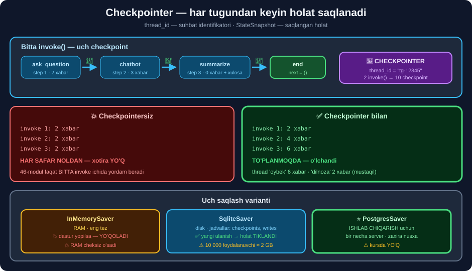

# 💾 47-modul. Thread-level persistence

> ## 🏆 **LANGGRAPH BO'LIMINING YAKUNI:** suhbatni **dastur qayta ishga tushsa ham** saqlash.
>
> ## ⭐⭐ **BUTUN MODUL API KALITISIZ** — va **LLM umuman kerak emas**.

---

## 📚 Darslar

| # | Dars | Nima o'rganasiz |
|---|---|---|
| 1 | [Checkpointer va threadlar](01-Checkpointers-and-Threads.md) ⭐⭐ | ## `thread_id` · ## ⚠️ **xavfsizlik** |
| 2 | [`InMemorySaver`](02-Short-Term-Memory-with-InMemorySaver.md) ⭐⭐ | ## ✅ **2→4→6 xabar** · ## ⭐ `update_state` |
| 3 | [`StateSnapshot`](03-The-StateSnapshot-Class.md) ⭐⭐ | ## 8 maydon · ## ⭐ **orqaga qaytish** |
| 4 | [SQLite](04-Long-Term-Memory-with-SQLite.md) ⭐⭐⭐ | ## ✅ **holat tiklandi** · ## ⚠️ **2 GB xavfi** |

---

## 📝 Amaliyot

| | |
|---|---|
| 📝 [**24 ta mashq**](MASHQLAR.md) | 🟢 Oson · 🟡 O'rta · 🔴 Qiyin |
| 🚀 [**3 ta mini-loyiha**](LOYIHALAR.md) | 🏦 **saqlanadigan bot** · 🎛️ **operator paneli** · 🛠️ **baza boshqaruvchisi** |

---

## 🧭 Modul bir rasmda



```python
from langgraph.checkpoint.sqlite import SqliteSaver
import sqlite3

con = sqlite3.connect("langgraph.db", check_same_thread=False)
con.execute("PRAGMA journal_mode=WAL")        # ⭐ parallel o'qish
con.execute("PRAGMA busy_timeout=5000")       # ⭐ "database is locked" YO'Q

gc = graph.compile(checkpointer=SqliteSaver(con))
gc.invoke(state, {"configurable": {"thread_id": "tg-12345"}})
```

---

## 💥 Modulning asosiy o'lchovi

```
checkpointersiz:  2 · 2 · 2 xabar    💥 har invoke() da NOLDAN
checkpointerli :  2 · 4 · 6 xabar    ✅ TO'PLANMOQDA

ikki thread    :  'oybek' 6 xabar · 'dilnoza' 2 xabar   ✅ mustaqil
```

```
SQLite: yangi ulanish → summary TIKLANDI · step 3
        jadvallar ['checkpoints', 'writes'] · 5 yozuv · 28 KB
```

> ## 🏆 **46-MODUL — BITTA `invoke()` ICHIDA. 47-MODUL — CHAQIRUVLAR ORASIDA.**

---

## 📊 Modulda o'lchangan hamma narsa

| O'lchov | Natija |
|---|---|
| Checkpointersiz | ## 💥 **2 · 2 · 2 xabar** — har safar noldan |
| `InMemorySaver` bilan | ## ✅ **2 · 4 · 6 xabar** |
| Ikki thread | ## ✅ **6 va 2 xabar** — mustaqil |
| Configsiz chaqiruv | ## 💥 `ValueError: Checkpointer requires ... thread_id` |
| `StateSnapshot` maydonlari | `values` `next` `config` `metadata` `created_at` `parent_config` `tasks` `interrupts` |
| 2 `invoke()` | ## **10 checkpoint** · step **-1** dan **8** gacha |
| `metadata.source` | `input` · `loop` · ## ⭐ `update` · `fork` |
| SQLite jadvallari | ## `checkpoints` · `writes` |
| 1 suhbat (3 tugun) | ## **5 checkpoint · 28 KB** |
| Yangi ulanish | ## ✅ **summary TIKLANDI** · step 3 |
| `delete_thread` | ## ✅ **mavjud** |
| `con.backup()` | ## ✅ **mavjud** — atomik zaxira |
| `InMemoryStore` | ## ✅ **ishlaydi** *(kursda yo'q)* |
| 🇺🇿 Ikki tilli bot | ## ✅ **til bir marta aniqlanib, DISKDA saqlandi** |

---

## 💥 Kurs aytmagan 7 ta narsa

```
① ⚠️ thread_id ni foydalanuvchi so'rovidan OLMANG
     → u BOSHQANING suhbatini o'qiy oladi (jiddiy xavfsizlik kamchiligi)

② ⭐ update_state() — human-in-the-loop ning kaliti
     → operator javobni TUZATADI, source == "update" bo'lib qoladi

③ ⭐ Vaqt bo'yicha ORQAGA QAYTISH — tarix[N].config bilan
     → "bekor qilish" tugmasi va A/B sinovining asosi

④ 💥 10 000 foydalanuvchi ≈ 2 GB — VACUUM bilan TOZALANG
     → VACUUM siz o'chirsangiz ham fayl KICHRAYMAYDI

⑤ ⭐ Uch PRAGMA: journal_mode=WAL · synchronous=NORMAL · busy_timeout=5000
     → busy_timeout siz bir necha foydalanuvchida bot YIQILADI

⑥ ⭐ con.backup() — ishlab turgan bazani ham XAVFSIZ nusxalaydi

⑦ 💥 Checkpointer ≠ "long-term memory"
     Checkpointer →  "bu SUHBATDA nima bo'ldi?"
     ⭐ Store      →  "bu ODAM haqida nima bilaman?"  (kursda YO'Q)
```

---

## 🔀 Checkpointer tanlash

| | `InMemorySaver` | `SqliteSaver` | ## ⭐ `PostgresSaver` |
|---|---|---|---|
| Qayerda | RAM | Disk fayli | ## **DB serveri** |
| Dastur yopilsa | ## 💥 yo'qoladi | ## ✅ saqlanadi | ## ✅ saqlanadi |
| Bir necha server | ## ❌ | ## ❌ | ## ✅ |
| Zaxira nusxa | ## ❌ | `con.backup()` | ## ✅ standart vositalar |
| Qachon | Sinov · test | Prototip · 1 server | ## ⭐ **Ishlab chiqarish** |

```bash
pip install langgraph-checkpoint-sqlite       # SQLite
pip install langgraph-checkpoint-postgres     # ⭐ ishlab chiqarish
```

---

## 🇺🇿 Amaliy naqshlar

```python
# ⭐ thread_id — SERVERDA yasaladi va TOZALANADI
def thread_id(kanal, uid):
    fid = re.sub(r"[^a-zA-Z0-9_-]", "", str(uid))[:64] or "anon"
    return f"{kanal}-{fid}"          # tg-12345 · web-abc · call-777

# ⭐ Til BIR MARTA aniqlanadi va DISKDA saqlanadi
def til_aniqla(s):
    if s.get("til"):
        return {"burilish": 1}       # ⭐ ikkinchi marta ishlamaydi
    ...

# ⭐ 🇺🇿 Eksport — ensure_ascii=False SHART
json.dump(data, f, ensure_ascii=False, indent=1)
```

> ## 💰 **VA ENG MUHIMI — KO'P BANK SAVOLLARIGA LLM KERAK EMAS.**
> ```
> "Kredit foizi qancha?"  →  bilim bazasidan ANIQ javob · ~1 ms · $0
> Noaniq savol            →  LLM (yoki operator)
> ```
> **Bu — narxni 70–90% gacha kamaytiradi** va **javobni 1000× tezlashtiradi**.

---

## 🔗 Bog'liq modullar

| Modul | Nima uchun |
|---|---|
| [45](../45-LangGraph-Graph-Components/README.md) | ## ⭐ `interrupt` — **checkpointer SHART** |
| [46](../46-LangGraph-Message-Management/README.md) | ## **State'ni kichik tutish** — checkpoint hajmi |
| [42](../42-LangChain-RAG/README.md) | Retriever + xotira = **to'liq yordamchi** |

---

## 📌 Bo'limning yakuniy xulosasi *(43–47-modullar)*

> ## 🏆🏆 **LANGGRAPH CHATBOTINING TO'RT USTUNI:**
>
> ```
> ① GRAF        →  State · Node · Edge · shartli qirra     (45-modul)
> ② REDUCER     →  ⭐ Annotated[..., add_messages]          (46-modul)
> ③ XOTIRA      →  ⭐ trim · xulosalash · gibrid            (46-modul)
> ④ DAVOMIYLIK  →  ⭐⭐ checkpointer · thread_id            (47-modul)
> ```
>
> ## 💥 **VA HAR BIRINING O'Z JIM XATOSI BOR:**
> ```
> ① recursion_limit 10 007  →  sikl ~5000 marta aylanadi
> ② Annotated unutilsa      →  xabarlar YO'QOLADI
> ③ [:-5] bilan trim        →  SystemMessage o'chadi, 🇺🇿 til yo'qoladi
> ④ thread_id foydalanuvchidan →  boshqaning suhbati O'QILADI
> ```

---

⬅️ [46-modul. Xabarlarni boshqarish](../46-LangGraph-Message-Management/README.md) · 🏠 [Kurs boshiga](../README.md)
