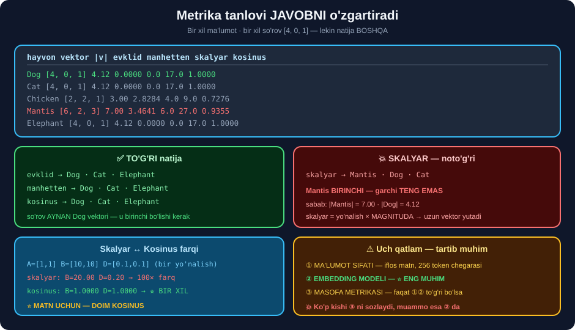

# 📐 49-modul. Vektor fazosi va yuqori o'lchamli ma'lumot

> ## 🏆 **BU — VEKTOR BAZALARINING MATEMATIK ASOSI.** Metrika tanlovi **javobni o'zgartiradi**.
>
> ## ⭐⭐ **HAMMASI API KALITISIZ.**

---

## 📚 Darslar

| # | Dars | Nima o'rganasiz |
|---|---|---|
| 1 | [Vektor fazosi](01-Introduction-to-Vector-Space.md) ⭐ | Galereya misoli · ## 💥 **o'lchamlar la'nati** |
| 2 | [Masofa metrikalari](02-Distance-Metrics.md) ⭐⭐⭐ | ## 💥💥 **metrika javobni o'zgartiradi** |
| 3 | [Embedding jarayoni](03-Vector-Embeddings-Walkthrough.md) ⭐⭐ | ## 💥 **inkor** · **256 token chegarasi** |

---

## 📝 Amaliyot

| | |
|---|---|
| 📝 [**18 ta mashq**](MASHQLAR.md) | 🟢 Oson · 🟡 O'rta · 🔴 Qiyin |
| 🚀 [**2 ta mini-loyiha**](LOYIHALAR.md) | 🧭 **metrika tanlovchi** · 🔍 **embedding tashxisi** |

---

## 🧭 Modul bir rasmda



---

## 💥💥 Modulning eng muhim topilmasi

Kursning **o'z hayvonlari** bilan, **bir xil so'rov**:

```
  hayvon          vektor  evklid  manhetten  skalyar  kosinus
     Dog [4.0, 0.0, 1.0]  0.0000        0.0     17.0   1.0000
 Chicken [2.0, 2.0, 1.0]  2.8284        4.0      9.0   0.7276
  Mantis [6.0, 2.0, 3.0]  3.4641        6.0     27.0   0.9355
```

```
evklid     → ['Dog', 'Cat', 'Elephant']    ✅
skalyar    → ['Mantis', 'Dog', 'Cat']      💥 MANTIS BIRINCHI!
kosinus    → ['Dog', 'Cat', 'Elephant']    ✅
```

> ## 🏆🏆 **BIR XIL MA'LUMOT, BIR XIL SO'ROV — METRIKA TANLOVIGA QARAB BOSHQA JAVOB.**
>
> ## 🔑 **SABAB:** skalyar ko'paytma **magnitudaga** aldanadi. `Mantis` **eng uzun** vektor *(|v| = 7.0)*.
>
> ## ⭐ **MATN UCHUN — DOIM KOSINUS.**

---

## 📊 Modulda o'lchangan hamma narsa

| O'lchov | Natija |
|---|---|
| Da Vinchi rasmlari | ## ✅ **0.833** — eng yuqori |
| Mona Lisa ↔ Soup Cans | 0.325 — eng past |
| O'lchamlar la'nati | ## 💥 std **0.7068** *(2 o'lch.)* → **0.0256** *(1536)* — **28× kamaydi** |
| Haqiqiy vs tasodifiy embedding | ## ✅ std **2.3× kengroq** *(0.1191 vs 0.0512)* |
| `lead` omonimi | ## ✅ **0.1256** — model kontekstni **ajratdi** |
| Inkor *("good" ↔ "not good")* | ## 💥 **0.79–0.89** — model **ajratmadi** |
| `max_seq_length` | ## 💥 **256 token** |
| 21 000 tokenli matn | ## 💥 **0.4959** — 531 tokendan keyin **o'zgarmadi** |
| 🇺🇿 "uy sotib olish uchun pul kerak" | ## 💥 **Ipoteka eng past ball** *(0.1029)* |

---

## 💥 Kurs aytmagan 6 ta narsa

```
① 💥 METRIKA TANLOVI JAVOBNI O'ZGARTIRADI
     skalyar → Mantis · kosinus → Dog (bir xil ma'lumotda)

② 💥 O'LCHAMLAR LA'NATI
     o'lcham oshganda tasodifiy masofalar TENGLASHADI (std 28× kamaydi)

③ 💥 EMBEDDING INKORNI TUSHUNMAYDI
     "good" ↔ "not good" = 0.79–0.89 (omonimda esa atigi 0.1256)

④ 💥 KONTEKST OYNASI 256 TOKEN
     21 000 tokenli matn 531 tokenlikdan FARQ QILMADI — jim yo'qolish

⑤ 💥 METRIKA EMBEDDING SIFATIDAN KEYIN KELADI
     🇺🇿 misolda uchala metrika ham NOTO'G'RI javob berdi — model aybdor

⑥ ⭐ NORMALLASHTIRISH: model normasi 1.0 bo'lsa — skalyar ≡ kosinus (tezroq)
```

---

## 🇺🇿 O'zbekcha uchun

```python
# ❌ o'zbekchani BILMAYDI
SentenceTransformer("all-MiniLM-L6-v2")           # norma 1.0000

# ✅ ko'p tilli
SentenceTransformer("paraphrase-multilingual-MiniLM-L12-v2")   # norma 5.8556
E = E / np.linalg.norm(E, axis=1, keepdims=True)  # ⭐ SHART
```

> ## 💥 **VA HATTO KO'P TILLI MODEL HAM O'ZBEKCHADA XATO QILDI** *(o'lchandi)*:
> ```
> so'rov: "uy sotib olish uchun pul kerak"
> to'g'ri javob: Ipoteka       →  💥 eng PAST ball (0.1029)
> model tanladi: Debet karta   →  💥 eng YUQORI ball (0.5872)
> ```
>
> ## 🏆 **XULOSA: 🇺🇿 LOYIHADA MODELNI SINAB KO'RING.** 10–20 ta **o'z** sinov juftligingizni tayyorlang.

---

## ⚙️ O'rnatish

```bash
pip install sentence-transformers numpy pandas
```

---

## 📌 Modulning bitta xulosasi

> ## 🏆🏆 **UCH QATLAM — VA HAR BIRI KEYINGISIDAN MUHIMROQ:**
>
> ```
> ① MA'LUMOT SIFATI    →  iflos matn, \r belgilar, kontekst oynasi
> ② EMBEDDING MODELI   →  ⭐ ENG MUHIM — u ma'noni tushunadimi?
> ③ MASOFA METRIKASI   →  faqat ①② to'g'ri bo'lsa ahamiyatli
> ```
>
> ## 💥 **KO'P KISHI ③ NI SOZLASHGA URINADI, HOLBUKI MUAMMO ② DA.**

---

⬅️ [48-modul. Kirish](../48-Vector-Databases-Introduction/README.md) · 🏠 [Kurs boshiga](../README.md) · ➡️ [50-modul. Pinecone](../50-Pinecone-Introduction/README.md)
