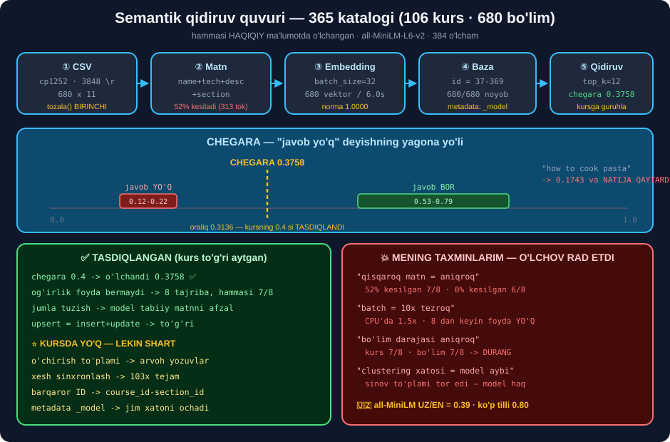

# 🔎 51-modul. Semantik qidiruv — amaliy loyiha

> ## ⭐⭐⭐ **BU MODUL — BUTUN VEKTOR BAZALARI BLOKINING YAKUNI.** ## 48–50-modullardagi hamma narsa bu yerda **haqiqiy ma'lumotda** ishlatiladi.
>
> ## 🏆 **VA MA'LUMOT — HAQIQIY:** 365 ta'lim platformasining **106 kursi** va **680 bo'limi**. ## Ikkala CSV ham **shu papkada**.



---

## 📚 Darslar

| # | Dars | Nima o'rganasiz |
|---|---|---|
| 1 | [Semantik qidiruv nima](01-Introduction-to-Semantic-Search.md) ⭐ | Aniq moslik ↔ ma'no · ## ⚠️ **RAG emas** |
| 2 | [Masala qo'yilishi](02-Case-Study-Problem.md) ⭐⭐ | 💥 `"clustering in Python"` → **0 natija** · sinov to'plami |
| 3 | [Ma'lumot bilan tanishuv](03-Getting-to-Know-the-Data.md) ⭐⭐ | ## 💥 `cp1252` · **3848 ta** `\r` · 52% kesilish |
| 4 | [Ma'lumotni tayyorlash](04-Data-Preprocessing.md) ⭐⭐ | ## ⭐ **barqaror ID** · 💥 matn tartibi **kutilganidek emas** |
| 5 | [Embedding algoritmlari](05-Embedding-Algorithms.md) ⭐⭐⭐ | ## 🏆 **`ajratish`** ko'rsatkichi · 🇺🇿 **UZ/EN 0.39 va 0.80** |
| 6 | [Vektorlash va yuklash](06-Embedding-and-Upserting.md) ⭐⭐ | ## ⚠️ batch CPU'da atigi **1.5×** · `_model` metadata |
| 7 | [Qidiruv va chegara](07-Similarity-Search.md) ⭐⭐⭐ | ## 🏆 **chegara 0.3758** — o'lchangan, taxmin emas |
| 8 | [Bazani yangilash](08-Updating-the-Database.md) ⭐⭐ | ## 💥 **arvoh yozuvlar** · xesh — **103× tejam** |
| 9 | [Bo'lim darajasi](09-Section-Level-Search.md) ⭐⭐⭐ | ## ⚠️ aniqlik **durang** · yutuq — **granulyarlik** |
| 10 | [Og'irlikli embedding](10-Weighted-Embeddings.md) ⭐⭐ | ## 💥 kursning topshirig'i — **8 tajriba, hammasi 7/8** |
| 11 | [Qo'llanishlar](11-Applications.md) ⭐⭐ | Tavsiya · CLIP · anomaliya · ## 🏆 **gibrid (RRF)** |

---

## 📝 Amaliyot

| | |
|---|---|
| 📝 [**26 ta mashq**](MASHQLAR.md) | 🟢 Oson · 🟡 O'rta · 🔴 Qiyin |
| 🚀 [**3 ta mini-loyiha**](LOYIHALAR.md) | 🔎 **qidiruv xizmati** · 🔄 **sinxronlovchi** · 🧪 **laboratoriya** |

---

## 📂 Ma'lumot fayllari

| Fayl | Hajm | Ustunlar |
|---|---|---|
| `course_descriptions.csv` | 106 × 6 | `course_id` · `course_name` · `course_slug` · `course_technology` · `course_topic` · `course_description` |
| `course_section_descriptions.csv` | 680 × 11 | ## ⭐ yuqoridagilar + `section_id` · `section_name` · `section_description` · `course_instructor_quote` |

```python
d = pd.read_csv("course_section_descriptions.csv", encoding="cp1252")
```

> ## 💥 **`encoding="utf-8"` XATO BERADI:**
> ```
> UnicodeDecodeError: 'utf-8' codec can't decode byte 0x92
> ```
> ## `0x92` — Windows'ning **qiyshiq apostrofi**.

---

## 📊 Modulda o'lchangan hamma narsa

### 🗂️ Ma'lumot

| O'lchov | Natija |
|---|---|
| Kodlash | ## `cp1252` · 💥 `utf-8` **ishlamaydi** |
| `\r` belgilari | ## **3848 ta** |
| Noyob `course_id-section_id` | ## ✅ **680/680** |
| Bo'sh `course_instructor_quote` | ## ⚠️ **20 ta** → 💥 Pinecone rad etadi |
| Matn uzunligi *(kurs tartibi)* | ## o'rt **313 token** · kesilgan **351/680 (52%)** |

### 🔍 Qidiruv sifati

| O'lchov | Natija |
|---|---|
| Chegara | ## 🏆 **0.3758** *(oraliq 0.3136)* — kursning **0.4** si ✅ |
| Javob BOR ballari | ## 0.5326 – 0.7941 · o'rt **0.6552** |
| Javob YO'Q ballari | ## 0.1208 – 0.2190 · o'rt **0.1757** |
| `"how to cook pasta"` | ## 💥 **0.1743 ball VA NATIJA QAYTARDI** |
| Kurs darajasi *(106 vektor)* | ## **7/8** |
| Bo'lim darajasi *(680 vektor)* | ## **7/8** — ⚠️ **durang** |
| Chegara 0.6 da | ## 💥 **5/8** — 3 to'g'ri javob **yo'qoldi** |

### 🧠 Modellar

| Model | O'lcham | Maks tok | Norma | Aniqlik | Ajratish | Emb |
|---|---|---|---|---|---|---|
| `all-MiniLM-L6-v2` | 384 | 256 | 1.000 | 6/8 | 0.4596 | ## ⚡ **2.9s** |
| `all-mpnet-base-v2` | 768 | 384 | 1.000 | ## ⭐ **7/8** | ## 🏆 **0.4988** | 22.5s |
| `paraphrase-multilingual` | 384 | ## 💥 **128** | ## 💥 **5.083** | 6/8 | 0.4177 | 5.2s |

### 🇺🇿 O'zbek tili — hal qiluvchi o'lchov

| Model | UZ o'rt | EN o'rt | UZ/EN |
|---|---|---|---|
| `all-MiniLM-L6-v2` | 0.2371 | 0.6141 | ## 💥 **0.39** |
| `paraphrase-multilingual` | 0.5541 | 0.6938 | ## 🏆 **0.80** |

> ## 💥💥 **`all-MiniLM-L6-v2` DA O'ZBEKCHA SO'ROVLAR INGLIZCHANING 39% BALLINI OLADI** — ## ya'ni **0.3758 chegarasidan pastda**, ## demak **hamma o'zbekcha so'rov "topilmadi"** javobini oladi.

### ⚙️ Ishlash

| O'lchov | Natija |
|---|---|
| Batch tezlashuvi *(CPU)* | ## ⚠️ **1.5×** — 8 dan keyin **foyda yo'q** |
| Xeshli sinxronlash | ## 🏆 **103× tejam** |
| Ikkinchi sinxronlash | ## ✅ **0 vektor hisoblandi** *(idempotent)* |
| Og'irlikli embedding | ## 💥 **8 tajriba, hammasi 7/8** · 3× sekin |
| `E @ E.T` xotirasi | 680 → 3.7 MB ✅ · 100k → ## 💥 **80 GB** |

---

## ✅ Kurs to'g'ri aytgan narsalar

| Da'vo | Tekshiruv |
|---|---|
| Chegara **0.4** | ## ✅ o'lchandi **0.3758** |
| Og'irlik *"katta yaxshilanish bermasligi mumkin"* | ## 🏆 **to'liq tasdiqlandi** — 8 tajriba, hammasi **7/8** |
| Ustunlarni **jumlaga** birlashtirish | ## ✅ model tabiiy matnni afzal ko'radi |
| `upsert` = insert + update | ## ✅ to'g'ri |
| Bo'lim darajasi **kerak** | ## ⚠️ aniqlik uchun emas — **granulyarlik** uchun |

## 💥 Mening taxminlarim — o'lchov rad etdi

| Taxmin | Haqiqat |
|---|---|
| *"Qisqaroq matn = aniqroq"* | ## 💥 52% kesilgan **7/8** · 0% kesilgan **6/8** |
| *"Batch 10× tezroq"* | ## 💥 CPU'da **1.5×** · 8 dan keyin foyda **yo'q** |
| *"Bo'lim darajasi aniqroq"* | ## 💥 **7/8 va 7/8** — durang |
| *"`clustering` xatosi — model aybi"* | ## 💥 **sinov to'plami tor edi** — model haq |

> ## 🏆 **OXIRGI QATOR — MODULNING ENG MUHIM DARSI:**
> ## **`7/8` NI KO'RIB "MODEL YOMON" DEMANG. O'SHA BITTA XATONI OCHIB KO'RING.**

---

## 🧭 Kursda yo'q — lekin ishlab chiqarishda SHART

| Nima | Nima uchun |
|---|---|
| ## ⭐ **O'chirish to'plami** | 💥 `upsert` arvoh yozuvlarni **ko'rmaydi** |
| ## ⭐ **Xesh bilan sinxronlash** | 103× tejam · `cron` bilan ishlaydi |
| ## ⭐ **Barqaror ID** | `course_name` o'zgaradi, `course_id-section_id` — **yo'q** |
| ## ⭐ **Metadata'da `_model`** | Model almashsa — **jim xato** o'rniga **ochiq xato** |
| ## ⭐ **`max()` bilan guruhlash** | `+=` da 40 bo'limli kurs **doim yutadi** |
| ## ⭐ **`topilmadi.log`** | 🏆 Katalogda **nima yetishmayotganini** ko'rsatadi |
| ## ⭐ **Gibrid qidiruv (RRF)** | Aniq nomlar *(`SQLAlchemy`)* + ma'no |
| ## ⭐ **50% himoya qoidasi** | 💥 Buzilgan CSV **butun bazani** o'chirishi mumkin |

---

## 🚀 Tez boshlash

```bash
pip install chromadb sentence-transformers pandas numpy rank-bm25
```

```python
import pandas as pd, numpy as np
from sentence_transformers import SentenceTransformer


def tozala(s):
    return " ".join(str(s).replace("\r", " ").replace("\n", " ").split())


d = pd.read_csv("course_section_descriptions.csv", encoding="cp1252")
for c in d.columns:
    if d[c].dtype == object:
        d[c] = d[c].map(tozala)

d["unique_id"] = d.course_id.astype(str) + "-" + d.section_id.astype(str)
d["matn"] = d.apply(lambda r: tozala(
    f'{r.course_name} {r.course_technology} {r.course_description} '
    f'{r.section_name} {r.section_description}'), axis=1)

model = SentenceTransformer("all-MiniLM-L6-v2")
E = model.encode(d.matn.tolist(), batch_size=32, show_progress_bar=False)
E = E / np.linalg.norm(E, axis=1, keepdims=True)


def qidir(savol, k=5, chegara=0.3758):
    q = model.encode(savol)
    q = q / np.linalg.norm(q)
    b = E @ q
    top = [i for i in np.argsort(-b)[:k] if b[i] >= chegara]
    if not top:
        return print(f"❌ '{savol}' — topilmadi ({b.max():.4f})")
    for i in top:
        print(f"  {b[i]:.4f}  {d.iloc[int(i)].course_name} / "
              f"{d.iloc[int(i)].section_name}")


qidir("regression in Python")
qidir("how to cook pasta")
```

---

## 🔗 Bog'liq modullar

| Modul | Bog'liqlik |
|---|---|
| [42. LangChain RAG](../42-LangChain-RAG/README.md) | Qidiruv → ## **generatsiya** |
| [48. Vektor bazalari](../48-Vector-Databases-Introduction/README.md) | Nima uchun vektor bazasi |
| [49. Vektor fazo](../49-Vector-Space-Basics/README.md) | ## ⭐ **Kosinus** nima uchun |
| [50. Pinecone](../50-Pinecone-Introduction/README.md) | Indeks · `upsert` · batch |

---

🏠 [Kurs boshiga](../README.md) · 📝 [Mashqlar](MASHQLAR.md) · 🚀 [Loyihalar](LOYIHALAR.md)
