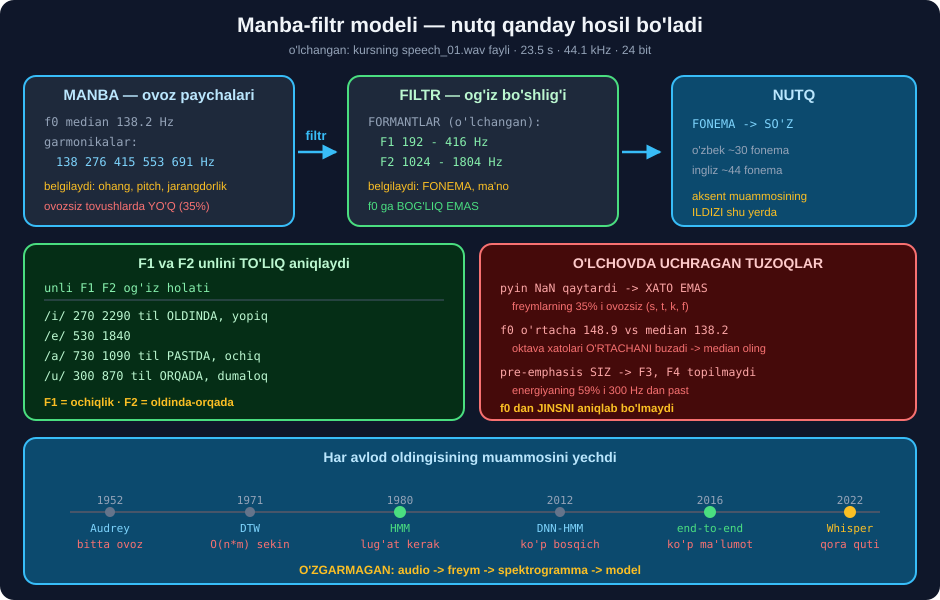

# 🗣️ 52-modul. Nutqni tanish — kirish

> ## ⭐⭐ **NUTQNI TANISH BLOKI BOSHLANDI** *(52–61-modullar)*.
>
> ## 🏆 **VA BU BLOKDAGI HAMMA RAQAM HAQIQIY FAYLDA O'LCHANGAN** — ## kursning o'z `speech_01.wav` fayli: 23.5 s · 44.1 kHz · 24 bit · mono.



---

## 📚 Darslar

| # | Dars | Nima o'rganasiz |
|---|---|---|
| 1 | [Xush kelibsiz](01-Welcome-to-Speech-Recognition.md) ⭐ | ASR ≠ TTS ≠ NLU · ## 💰 **narx hisobi** |
| 2 | [Kurs yondashuvi](02-Course-Approach.md) ⭐ | Blok xaritasi · ## 💥 **Python 3.13+ muammosi** |
| 3 | [Formant, garmonika, fonema](03-Formants-Harmonics-Phonemes.md) ⭐⭐⭐ | ## 🏆 **Manba-filtr modeli** · LPC · `pyin` |
| 4 | [Rivojlanish va evolyutsiya](04-Development-and-Evolution.md) ⭐⭐ | ## ⭐ **DTW** · **HMM** · end-to-end |

---

## 📝 Amaliyot

| | |
|---|---|
| 📝 [**22 ta mashq**](MASHQLAR.md) | 🟢 Oson · 🟡 O'rta · 🔴 Qiyin |
| 🚀 [**3 ta mini-loyiha**](LOYIHALAR.md) | 🎤 **ovoz pasporti** · 🔊 **unli sintezatori** · 🎛️ **DTW buyruq tizimi** |

---

## 🏆 Modulning asosiy g'oyasi — manba-filtr modeli

```
OVOZ PAYCHALARI  →  f0 + GARMONIKALAR   (MANBA)   →  KIM gapiryapti
                        ↓ filtr
OG'IZ BO'SHLIG'I →  FORMANTLAR F1, F2   (FILTR)   →  NIMA deyilyapti
                        ↓
                    FONEMA  →  SO'Z
```

> ## 💡 **SHUNING UCHUN SIZ PICHIRLAB HAM GAPIRA OLASIZ:** ## pichirlashda **manba yo'q** *(f0 yo'q)*, ## lekin **filtr bor** — va so'zlar **tushunarli** qoladi.
>
> ## 🔬 **BUNI SIMULYATSIYADA TASDIQLADIK** *(MASHQLAR, M20)*: ## pichirlashda formantlar **saqlandi** — ## `/a/` 724 → 743 · `/u/` 299 → 265.

---

## 📊 Modulda o'lchangan hamma narsa

### 🎧 Fayl

| O'lchov | Natija |
|---|---|
| Format | 44 100 Hz · **24 bit** · mono · 23.512 s |
| Bitrate | ## `44100 × 24 × 1` = **1 058 400 bit/s** = **1058 kbps** |
| Fayl hajmi | 3 111 350 bayt *(sarlavha 737 bayt)* |
| RMS *(xom)* | −19.11 dBFS · cho'qqi **0.00 dBFS** |
| RMS *(16 kHz ga qayta namunalangan)* | ## ⚠️ **−20.9 dBFS** · cho'qqi **−4.5** |

> ## 🔑 **OXIRGI IKKI QATOR — MUHIM DARS.** ## Bir xil fayl, ikki xil raqam. ## **Qaysi bosqichda o'lchayotganingizni biling.**

### 🎵 Ovoz

| O'lchov | Natija |
|---|---|
| Ovozli freymlar | ## **65%** — 35% da `f0` **umuman yo'q** |
| `f0` median | ## 🏆 **138.2 Hz** |
| `f0` o'rtacha | ## ⚠️ **148.9 Hz** — oktava xatolaridan buzilgan |
| Garmonikalar | 138 · 276 · 415 · 553 · 691 Hz |
| Formantlar *(LPC)* | F1 **192–416** · F2 **1024–1804** Hz |
| Energiya `< 300 Hz` | ## 💥 **59.12%** |
| Energiya `300–3400 Hz` *(telefon)* | ## **31.1%** |

### 🧮 Algoritmlar

| O'lchov | Natija |
|---|---|
| DTW — `sekin` *(cho'zilgan)* | ## 🏆 **0.000** *(oddiy usul 0.527)* |
| DTW — `tez` | ## ⚠️ **0.417** *(oddiy usul 0.200 — yaxshiroq)* |
| DTW — `boshqa so'z` | ## ✅ **1.714** — 4× uzoq |
| HMM xom ehtimol | ## 💥 **ISHLAMAYDI** — uzunlik hal qiladi |
| HMM `log/freym` | ## 🏆 **ishlaydi** — to'g'ri −0.59…−0.76 · xato −1.12…−1.75 |
| HMM modellar raqobati | ## 🏆 **4/4** |
| `float64` underflow | ## 💥 **1075-qadamda nol** *(10 s audio ≈ 1000 freym)* |

---

## 💥 Mening taxminlarim — o'lchov rad etdi

| Taxmin | Haqiqat |
|---|---|
| *"HMM da noto'g'ri tartib 8000× kam ehtimolli"* | ## 💥 `RIB` **7× YUQORI** chiqdi — uzunlik hal qildi |
| *"DTW oddiy usuldan doim yaxshi"* | ## 💥 `tez` da **teskarisi** *(0.417 vs 0.200)* |
| *"Sintezda formantlar `f0` ga bog'liq emas"* | ## ⚠️ **F1 — ha**, F2/F3 — 💥 `f0=200` da **buziladi** |
| *"Pichirlashda `f0` topilmaydi"* | ## 💥 `pyin` shovqinda ham **f0 "topdi"** *(94%, 100%)* |

> ## 🏆 **HAR TO'RTALASI HAM DARSGA AYLANDI:**
> ```
> ① ehtimolni UZUNLIKKA normallang yoki MODELLARNI raqobatlashtiring
> ② DTW ning kuchi — CHO'ZILGAN signalda, hamma joyda emas
> ③ baland ovozli nutqni tahlil qilish QIYINROQ (garmonikalar siyrak)
> ④ bitta algoritmning chiqishiga ishonmang — TEKSHIRING
> ```

---

## ✅ Kurs to'g'ri aytgan narsalar

| Da'vo | Tekshiruv |
|---|---|
| `f0 = 100` → garmonikalar 200, 300, 400 | ## ✅ o'lchandi: 138 → 276, 415, 553 |
| Formantlar unlini ajratadi | ## ✅ sintezda **F1 aniq** tiklandi |
| Stereo 44.1k/16-bit ≈ 1400 kbps | ## ✅ aniq qiymat **1 411 200 bit/s** |
| Fonema ≠ harf | ## ✅ `box` = 3 harf, **4 fonema** |
| HMM shablonlarni almashtirdi | ## ✅ modellar raqobati **4/4** |

> ## ⚠️ **VA KURSNING TRANSKRIPTIDA BITTA XATO BOR:** ## *"Replacing k with k changes the word's meaning"* — ## `cat` ↔ `hat` misolida bu **`k` ni `h` ga** bo'lishi kerak edi.

---

## 🇺🇿 O'zbek tili uchun

```
🔤 FONEMALAR:
   o'zbek  ~30  (6 unli + 24 undosh)
   ingliz  ~44  (20 unli + 24 undosh)

💥 ENG KATTA FARQ — UNLILAR:
   ingliz:  ship /ɪ/  ≠  sheep /iː/     ⭐ MA'NO farq qiladi
   o'zbek:  bunday farq YO'Q

🔬 O'LCHANGAN: /o/ ↔ /u/ ning ΔF2 atigi 30 Hz
   →  ularni faqat F1 ajratadi (270 Hz)
   →  💥 telefon yozuvida (past chastotalar kesilgan) CHALKASHADI
```

> ## 🏆 **BU — AKSENT MUAMMOSINING ILDIZI.** ## Model **o'z tilining fonemalarini** eshitadi, ## siz **o'z tilingizning fonemalarini** aytasiz.
>
> ## ⭐ **VA END-TO-END TUFAYLI O'ZBEKCHA ASR UMUMAN MAVJUD:**
> ```
> Eski usul  →  o'zbek tili mutaxassisi kerak edi (talaffuz lug'ati)
> Yangi usul →  faqat AUDIO + MATN juftliklari
>               ⭐ va Whisper ularni internetdan TOPDI
> ```

---

## 🚀 Tez boshlash

```bash
pip install numpy scipy matplotlib soundfile librosa
```

```python
import warnings; warnings.filterwarnings("ignore")
import numpy as np, librosa

y, sr = librosa.load("speech_01.wav", sr=16000)

f0, voiced, _ = librosa.pyin(y, fmin=60, fmax=400, sr=sr)
ok = f0[~np.isnan(f0)]
med = float(np.median(ok))          # ⭐ median, o'rtacha EMAS

print(f"davomiylik   : {len(y)/sr:.1f} s")
print(f"ovozli freym : {voiced.mean():.0%}")
print(f"f0 median    : {med:.1f} Hz")
print(f"garmonikalar : {[round(med*k) for k in range(1, 6)]} Hz")
print(f"RMS          : {20*np.log10(np.sqrt((y**2).mean())):.1f} dBFS")
```

---

## 🔗 Bog'liq modullar

| Modul | Bog'liqlik |
|---|---|
| [53. Tovush asoslari](../53-Sound-and-Speech-Basics/README.md) | To'lqin · chastota · amplituda |
| [54. Analog → raqamli](../54-Analog-to-Digital-Conversion/README.md) | ## 🏆 Sample rate · bit chuqurligi |
| [30. Transformer](../30-Transformer-Architecture/README.md) | ## ⭐ Whisper'ning asosi |

---

🏠 [Kurs boshiga](../README.md) · 📝 [Mashqlar](MASHQLAR.md) · 🚀 [Loyihalar](LOYIHALAR.md)
