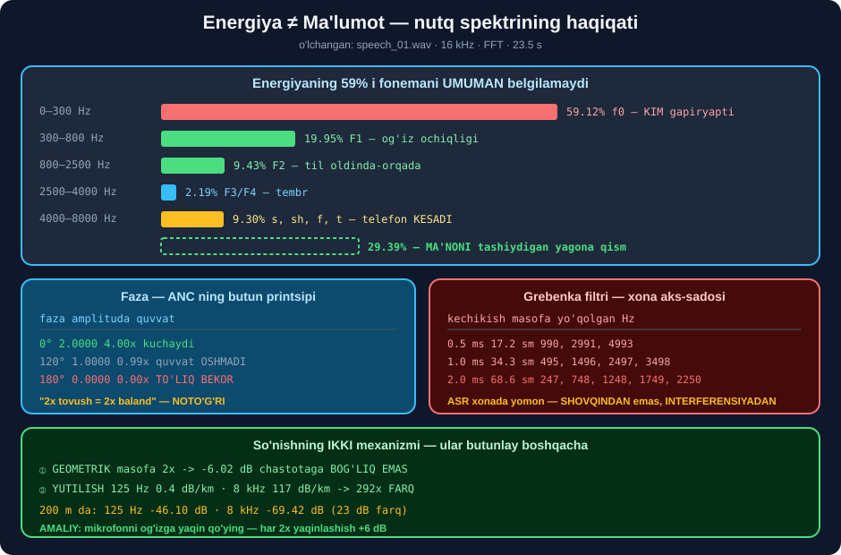

# 🔊 53-modul. Tovush va nutq asoslari

> ## ⭐⭐ **BU MODULNING BITTA XULOSASI BOR — VA U KURSDA YO'Q:**
>
> ## 🏆🏆 **ENERGIYA ≠ MA'LUMOT.** ## Nutq energiyasining **59.12% i** fonemani **umuman belgilamaydi**.



---

## 📚 Darslar

| # | Dars | Nima o'rganasiz |
|---|---|---|
| 1 | [Odam nutqni qanday tanidi](01-How-Humans-Recognize-Speech.md) ⭐⭐ | ## 🏆 **Koxlea = tabiiy spektrogramma** · mel · ITD |
| 2 | [To'lqin asoslari](02-Fundamentals-of-Sound-Waves.md) ⭐⭐ | Muhit · so'nishning ## ⭐ **ikki mexanizmi** |
| 3 | [To'lqin xossalari](03-Properties-of-Sound-Waves.md) ⭐⭐⭐ | dB · faza · ## 💥 **grebenka filtri** · energiya taqsimoti |

---

## 📝 Amaliyot

| | |
|---|---|
| 📝 [**20 ta mashq**](MASHQLAR.md) | 🟢 Oson · 🟡 O'rta · 🔴 Qiyin |
| 🚀 [**2 ta mini-loyiha**](LOYIHALAR.md) | 🎧 **akustik tashxis** · 🔬 **akustik laboratoriya** |

---

## 📊 Modulda o'lchangan hamma narsa

### 👂 Eshitish

| O'lchov | Natija |
|---|---|
| Mel: `+100 Hz` @ 100 Hz | ## **132.74 mel** |
| Mel: `+100 Hz` @ 16 kHz | ## 💥 **6.73 mel** — 20× kam sezgir |
| Mel filtr kengligi | 44.4 – 518.6 Hz · ## **11.7×** farq |
| Mel bank: `htk=True` | ## ✅ qo'lda yozilgani bilan **farq 0.000000** |
| Mel bank: `htk=False` *(Slaney)* | ## 💥 **farq 0.994994** |
| ITD *(90°)* | ## **824.5 µs** = 36.4 namuna @44.1 kHz |

### 🌊 To'lqin

| O'lchov | Natija |
|---|---|
| Geometrik so'nish | masofa 2× → ## **−6.02 dB** *(chastotaga bog'liq emas)* |
| Havoda yutilish | 125 Hz **0.4** · 8 kHz **117** dB/km → ## **292×** |
| 200 m da | 125 Hz −46.10 · 8 kHz ## **−69.42 dB** |
| Tovush tezligi −20…+40 °C | 318.9 – 354.7 m/s *(11%)* |
| Chaqmoq `"÷3"` qoidasi | ## ✅ **2.9–4.5% xato** |
| Faza 0° / 120° / 180° | 2.0000 / 1.0000 / ## 💥 **0.0000** |
| Grebenka *(2 ms = 68.6 sm)* | ## 247, 748, 1248, 1749, 2250, 2750 Hz **yo'qoladi** |
| DRR: studiya → vannaxona | `inf` → 11.03 → 6.81 → ## **1.50 dB** |

### 🗣️ Nutq spektri

| Diapazon | Energiya | Nima |
|---|---|---|
| 0–300 Hz | ## 💥 **59.12%** | `f0` — 👤 **kim** gapiryapti |
| 300–800 Hz | 19.95% | F1 — og'iz ochiqligi |
| 800–2500 Hz | 9.43% | F2 — til holati |
| 2500–4000 Hz | 2.19% | F3/F4 — tembr |
| 4000–8000 Hz | 9.30% | ## 🏆 `s, sh, f, t` |
| ## **300–2500 Hz** | ## 🏆 **29.39%** | ## **MA'NONI tashiydigan yagona qism** |

| Boshqa | Natija |
|---|---|
| Telefon kanalidan keyin `> 4 kHz` | ## 💥 **9.3021% → 0.0000%** |
| Krest-faktor | 19.11 dB *(xom)* · 16.35 *(16 kHz)* |
| 25 ms bo'lakda chastotalar | ## **98–151 ta** *(sinus emas!)* |

---

## 💥 Mening usullarim — o'lchov rad etdi

| Usul | Natija |
|---|---|
| *"`p90/p10` bilan SNR ni baholayman"* | ## 💥 toza faylga **12.2 dB** → yolg'on *"shovqin ko'p"*. ## 30 dB va 20 dB — **bir xil natija** |
| *"Signal spektridagi chuqurliklarni sanab aks-sadoni topaman"* | ## 💥 to'rtala xona ham **11.3%** — **hech narsa ajratmadi** |
| *"`2595·log10(1+f/700)` — bu mel shkalasi"* | ## 💥 bu **HTK** varianti; `librosa` **Slaney** ishlatadi |

> ## 🏆 **UCHALASI HAM YECHIM BILAN ALMASHTIRILDI:**
> ```
> ① SNR o'rniga  →  "jim freymlar ulushi"
>    toza 57% · SNR 20 dB 62% · SNR 10 dB 97% · SNR 0 dB 100%   ✅ ajratdi
>
> ② signal o'rniga  →  XONANING IMPULS JAVOBINI o'lchash
>    studiya 0.0% → vannaxona 8.6%   ✅ ajratdi
>    va DRR: inf → 11.03 → 6.81 → 1.50 dB   ✅ eng sodda
>
> ③ har doim  →  htk= parametrini ANIQ ko'rsatish
> ```

---

## ✅ Kurs to'g'ri aytgan narsalar

| Da'vo | Tekshiruv |
|---|---|
| A4 = 440 Hz, nog'ora 440 marta tebranadi | ## ✅ |
| Zarralar to'lqin bilan **ketmaydi** | ## ✅ simulyatsiyada tasdiqlandi |
| Yuqori chastotalar **tezroq so'nadi** | ## ✅ **292×** farq o'lchandi |
| Faza — interferensiyaning sababi | ## ✅ 180° da **to'liq bekor** |
| Sinusoida — **shunchaki model** | ## ✅ haqiqiy nutqda **98–151** chastota |
| Naqsh tanish — miya va ASR da o'xshash | ## ✅ *(lekin miya **kutadi**, ASR — yo'q)* |

> ## ⚠️ **VA KURS AYTMAGAN NARSA:** ## u yuqori chastotalarning tez so'nishini ## **faqat difraksiya** bilan tushuntirgandek qoldiradi. ## 🔑 Aslida **asosiy sabab — havoda yutilish** *(292× farq)*.

---

## 🇺🇿 O'zbek loyihalari uchun amaliy qoidalar

```
🎙️ YOZISH
   ⭐ mikrofonni og'izga 15–30 sm  →  har 2× yaqinlashish = +6 dB
   ⭐ RMS ni -20 dBFS atrofida tuting
   💥 clipping — TUZATIB BO'LMAYDI, qayta yozing
   ⚠️ 50 Hz guvillash — O'zbekistonda tarmoq chastotasi (60 emas!)

🏠 XONA
   💥 aks-sado shovqindan QIYINROQ — uni ayirib tashlab bo'lmaydi
   ⭐ DRR < 10 dB  →  ASR uchun muammoli
   ⭐ gilam, parda, yumshoq mebel — aks-sadoni kamaytiradi

📞 TELEFON YOZUVLARI
   💥 4 kHz dan yuqorisi YO'Q  →  s/sh/f/t fonemalari yo'qolgan
   💥 yo'qolgan chastotalarni QAYTARIB BO'LMAYDI
   ⭐ modelni AYNAN telefon audiosida sinang
```

---

## 🚀 Tez boshlash

```bash
pip install numpy scipy matplotlib soundfile librosa
```

```python
import warnings; warnings.filterwarnings("ignore")
import numpy as np, librosa

y, sr = librosa.load("speech_01.wav", sr=16000)

Y = np.abs(np.fft.rfft(y))
fr = np.fft.rfftfreq(len(y), 1 / sr)
jami = (Y ** 2).sum()

for lo, hi, nom in [(0, 300, "f0 — KIM gapiryapti"),
                    (300, 2500, "F1+F2 — NIMA deyilyapti"),
                    (4000, 8000, "s/sh/f/t")]:
    m = (fr >= lo) & (fr < hi)
    print(f"  {lo:5d}–{hi:5d} Hz  {(Y[m]**2).sum()/jami:6.2%}   {nom}")

rms = float(np.sqrt((y ** 2).mean()))
cho = float(np.abs(y).max())
print(f"\n  RMS {20*np.log10(rms):+.1f} dBFS · "
      f"krest {20*np.log10(cho/rms):.1f} dB")
```

```
      0–  300 Hz  59.12%   f0 — KIM gapiryapti
    300– 2500 Hz  29.39%   F1+F2 — NIMA deyilyapti
   4000– 8000 Hz   9.30%   s/sh/f/t

  RMS -20.9 dBFS · krest 16.4 dB
```

---

## 🔗 Bog'liq modullar

| Modul | Bog'liqlik |
|---|---|
| [52. Kirish](../52-Speech-Recognition-Introduction/README.md) | Formant · garmonika · fonema |
| [54. Analog → raqamli](../54-Analog-to-Digital-Conversion/README.md) | ## 🏆 Sample rate · bit chuqurligi |
| [55. Audio xususiyatlari](../55-Audio-Feature-Extraction/README.md) | ## ⭐ MFCC — mel shkalasining davomi |
| [59. Shovqin va spektrogramma](../59-Background-Noise-and-Spectrograms/README.md) | Shovqin bilan kurashish |

---

🏠 [Kurs boshiga](../README.md) · 📝 [Mashqlar](MASHQLAR.md) · 🚀 [Loyihalar](LOYIHALAR.md)
