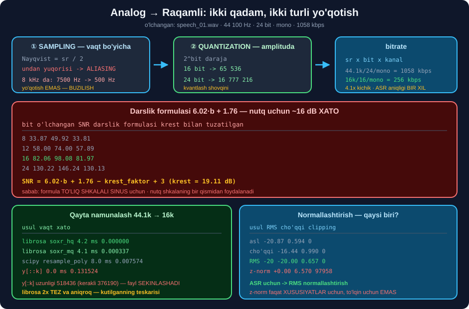

# 💻 54-modul. Analogdan raqamliga

> ## ⭐⭐⭐ **BU MODUL — ASR LOYIHALARIDAGI ENG KO'P UCHRAYDIGAN XATOLARNING MANBAI.**
>
> ## 🏆 **VA UNDA DARSLIK FORMULASINING XATOSI O'LCHANDI:** ## `6.02·b + 1.76` — nutq uchun **~16 dB ga oshirib** ko'rsatadi.



---

## 📚 Darslar

| # | Dars | Nima o'rganasiz |
|---|---|---|
| 1 | [Sample rate, bit chuqurligi, bitrate](01-Sample-Rate-Bit-Depth-Bit-Rate.md) ⭐⭐⭐ | Nayqvist · ## 💥 **aliasing** · ## 🏆 **krest-faktor tuzatmasi** |
| 2 | [ML uchun qayta ishlash](02-Audio-Signal-Processing.md) ⭐⭐ | Normallash · qayta namunalash · ## ⭐ **augmentatsiya** · segmentatsiya |

---

## 📝 Amaliyot

| | |
|---|---|
| 📝 [**18 ta mashq**](MASHQLAR.md) | 🟢 Oson · 🟡 O'rta · 🔴 Qiyin |
| 🚀 [**2 ta mini-loyiha**](LOYIHALAR.md) | 🔧 **ASR tayyorlash quvuri** · 🎚️ **raqamlash laboratoriyasi** |

---

## 📊 Modulda o'lchangan hamma narsa

### 🎚️ Sampling

| O'lchov | Natija |
|---|---|
| Nayqvist | `sr / 2` |
| Aliasing *(8 kHz da)* | 5000 → 3000 · 7000 → 1000 · ## 💥 **7500 → 500 Hz** |
| `y[::k]` xatosi | ## 💥 **0.131524** — to'g'ri usuldan **17×** katta |
| `y[::k]` uzunligi | ## 💥 **518 436** *(kerakli 376 190)* — fayl **sekinlashadi** |
| `librosa soxr_hq` | ## 🏆 **4.2 ms** · xato **0.000000** |
| `librosa soxr_mq` | 4.1 ms · xato 0.000337 |
| `scipy resample_poly` | ## ⚠️ **8.0 ms** · xato **0.007574** |
| `res_type="kaiser_fast"` | ## 💥 **`resampy` paketi kerak** — librosa 1.0 da yo'q |

### 🔢 Quantization

| bit | O'lchangan SNR | Darslik `6.02b+1.76` | Krest bilan tuzatilgan |
|---|---|---|---|
| 8 | 33.87 | ## 💥 49.92 | ## ✅ **33.81** |
| 12 | 58.00 | 💥 74.00 | ✅ 57.89 |
| ## **16** | ## **82.06** | ## 💥 **98.08** | ## ✅ **81.97** |
| 24 | 130.22 | 💥 146.24 | ✅ 130.13 |

```
🏆 TUZATILGAN FORMULA:
   SNR ≈ 6.02·b + 1.76 − krest_faktor + 3     (krest = 19.11 dB)

⚠️ 8 bit dan yuqorida farq < 0.11 dB
💥 2 va 4 bit da buziladi — kvantlash xatosi tasodifiy bo'lmay qoladi
```

### 📦 Bitrate va hajm

| Format | Bitrate | Yillik *(24 333 soat)* |
|---|---|---|
| WAV 44.1k/24bit mono | 1 058 400 bit/s | ## **10 793 GB** |
| WAV 16k/16bit mono | 256 000 bit/s | 2 611 GB |
| MP3 128k | 128 000 bit/s | 1 305 GB |
| Opus 32k | 32 000 bit/s | 326 GB |
| ## **Opus 16k** | 16 000 bit/s | ## 🏆 **163 GB** *(66×)* |

> ## 💡 **`MP3 128k` VA `WAV 8k/16bit` — AYNAN BIR XIL HAJM.** ## Lekin MP3 **to'liq polosani** saqlaydi, ## WAV 8k — 💥 **4 kHz dan yuqorisini yo'qotadi**. ## 🏆 **Bir xil narxga — ikki baravar polosa.**

### 🔧 Qayta ishlash

| O'lchov | Natija |
|---|---|
| `z-normallash` | ## 💥 **97 958 clipping** *(26%)* — to'lqin uchun **yaramaydi** |
| `RMS -20 dBFS` | ## ✅ hamma faylda **bir xil** |
| `cho'qqi` normallash | ⚠️ −20.87 → **−16.44** — har fayl **turlicha** |
| `tezlik 1.1×` → `f0` | 138.2 → **141.1** *(+2.1%)* |
| `pitch +2` → `f0` | 138.2 → **152.9** *(nazariy 155.1)* |
| `tezlik`/`pitch` → RMS | ## 💥 **−3.5 dB** — qayta normallashtiring |
| `siljish` → `f0` | ## ⚠️ **140.3** — signal **o'zgarmagan**! |
| Segmentatsiya `top_db≥25` | ## **1 bo'lak** — bu faylda jimlik yo'q |
| Dither *(4 bit)* | SNR **11.60 → 6.58 dB** — ## ⭐ sifatni **oshiradi** |

---

## 💥 Mening taxminlarim — o'lchov rad etdi

| Taxmin | Haqiqat |
|---|---|
| *"`scipy resample_poly` eng tez"* | ## 💥 **2× sekin** *(8.0 vs 4.2 ms)* va **12× noaniqroq** |
| *"`tezlik 1.1×` `f0` ni o'zgartirmaydi"* | ## ⚠️ **+2.1%** siljidi *(fazali vokoder)* |
| *"`pitch +2` nazariyaga aynan mos"* | ## ⚠️ farq **1.4%** *(152.9 vs 155.1)* |
| *"Segmentatsiya `top_db` oshgani sari 14→10→5 bo'lak"* | ## 💥 real: **5→2→1** — jimlik **umuman yo'q** |
| *"16 kHz da 0.09% energiya yo'qoladi"* | ## 💥 **7.28%** — 81× ko'p |

> ## 🏆 **VA BITTA KUTILMAGAN YON TA'SIR:**
> ```
> `siljish 0.3 s` → f0 138.2 dan 140.3 ga "o'zgardi"
>    💥 lekin signal O'ZGARMAGAN — faqat siljigan
>    🔑 bu — pyin ning ±2 Hz O'LCHOV NOANIQLIGI
>
> 🏆 DARS: kichik farqlarni "o'zgarish" deb hisoblamang
> ```

---

## ✅ Kurs to'g'ri aytgan narsalar

| Da'vo | Tekshiruv |
|---|---|
| Stereo 44.1k/16bit ≈ 1 400 000 bit/s | ## ✅ aniq **1 411 200** |
| 8 bit = 256 daraja | ## ✅ |
| Sampling + quantization = raqamlash | ## ✅ |
| *"Model shovqinli ma'lumotdan HAM o'rganishi kerak"* | ## 🏆 **eng qimmatli fikr** — Whisper 680k soat **tozalanmagan** audioda |
| Normallash fayllarni **taqqoslanadigan** qiladi | ## ✅ RMS usulida **aniq** |

---

## 💥 Beshta eng ko'p uchraydigan xato

```
① sample rate ni METADATA da o'zgartirish  →  fayl sekinlashadi/tezlashadi
② y[::k] bilan kesish                       →  aliasing + noto'g'ri uzunlik
③ 8 kHz ni 16 kHz ga "ko'tarish"            →  yo'qolgan chastota QAYTMAYDI
④ int16 ni float32 deb ishlatish            →  qiymatlar -32768..32767
⑤ stereo faylni mono deb hisoblash          →  shakl (n, 2), model 1D kutadi
```

> ## 🏆 **③ NI ANIQLASH USULI:**
> ```python
> if energiya_4kHz_dan_yuqorida < 0.005:
>     print("💥 fayl 8 kHz dan ko'tarilgan")
> ```
> ## 🔬 **O'LCHANDI:** telefon kanalidan o'tgan faylda — **0.00%**.

---

## 🚀 Tez boshlash

```bash
pip install numpy scipy soundfile librosa
```

```python
import warnings; warnings.filterwarnings("ignore")
import numpy as np, librosa, soundfile as sf


def whisper_uchun(yol, chiqish=None):
    """🏆 Audio → Whisper uchun tayyor 16 kHz float32 mono."""
    x, s = librosa.load(yol, sr=None, mono=True)      # ⭐ asl sr

    if s != 16000:
        x = librosa.resample(x, orig_sr=s, target_sr=16000)   # ⭐ anti-alias

    x = x - float(x.mean())                            # ⭐ DC siljish

    rms = float(np.sqrt((x ** 2).mean()))
    x = x * (10 ** (-20 / 20) / max(rms, 1e-12))       # ⭐ RMS -20 dBFS
    if np.abs(x).max() > 0.99:
        x = x / np.abs(x).max() * 0.99                 # ⚠️ clipping himoyasi

    x = x.astype(np.float32)                           # ⭐ Whisper shuni kutadi

    X = np.abs(np.fft.rfft(x))
    fr = np.fft.rfftfreq(len(x), 1 / 16000)
    yuq = (X[fr >= 4000] ** 2).sum() / (X ** 2).sum()
    if yuq < 0.005:
        print(f"💥 4 kHz+ atigi {yuq:.2%} — telefon kanali?")

    if chiqish:
        sf.write(chiqish, x, 16000)
    return x, 16000


whisper_uchun("speech_01.wav", "tayyor.wav")
```

---

## 🔗 Bog'liq modullar

| Modul | Bog'liqlik |
|---|---|
| [53. Tovush asoslari](../53-Sound-and-Speech-Basics/README.md) | Chastota · energiya taqsimoti |
| [55. Audio xususiyatlari](../55-Audio-Feature-Extraction/README.md) | ## 🏆 MFCC — bu yerdan davom etadi |
| [57. Muhitni sozlash](../57-Setting-Up-the-Environment/README.md) | ## 💥 Python 3.13+ muammosi |
| [60. Whisper](../60-Transcribing-with-Whisper/README.md) | ## ⭐ Bu yerda tayyorlangan audio ishlatiladi |

---

🏠 [Kurs boshiga](../README.md) · 📝 [Mashqlar](MASHQLAR.md) · 🚀 [Loyihalar](LOYIHALAR.md)
