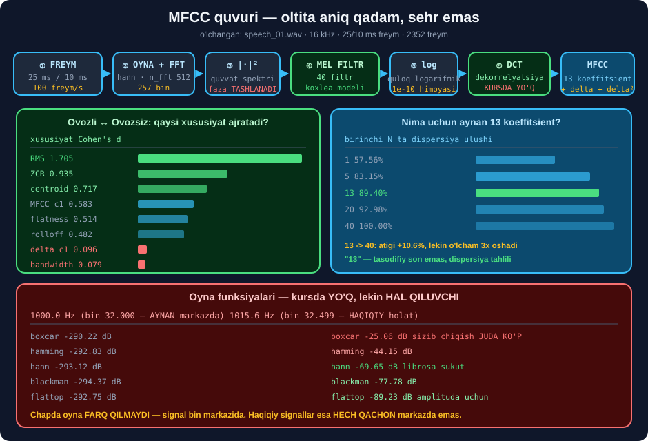

# 🎚️ 55-modul. Audio xususiyatlarini ajratish

> ## ⭐⭐⭐ **BU MODULDA MFCC "SEHR"DAN — OLTITA ANIQ QADAMGA AYLANADI.**
>
> ## 🏆 **VA ENG KUCHLI XUSUSIYAT ENG ODDIYSI BO'LIB CHIQDI:** ## `RMS` — Cohen's d **1.705**, hamma MFCC koeffitsientidan **yuqori**.



---

## 📚 Darslar

| # | Dars | Nima o'rganasiz |
|---|---|---|
| 1 | [Vaqt domeni](01-Time-Domain-Features.md) ⭐⭐ | ZCR · RMS · ogib · ## ⭐ **arzon VAD** |
| 2 | [Chastota va vaqt-chastota](02-Frequency-Domain-Features.md) ⭐⭐⭐ | Centroid · flatness · ## 🏆 **MFCC** · **Cohen's d** |
| 3 | [Freymlash](03-Framing-and-Computation.md) ⭐⭐ | ## ⭐ **25/10 ms** · agregatsiya · xotira |
| 4 | [Furye almashtirishi](04-Fourier-Transform.md) ⭐⭐⭐ | DFT · FFT · STFT · ## 💥 **oyna funksiyalari** |

---

## 📝 Amaliyot

| | |
|---|---|
| 📝 [**22 ta mashq**](MASHQLAR.md) | 🟢 Oson · 🟡 O'rta · 🔴 Qiyin |
| 🚀 [**2 ta mini-loyiha**](LOYIHALAR.md) | 🔧 **MFCC dvigateli** · 🎛️ **xususiyat laboratoriyasi** |

---

## 🏆 MFCC quvuri — oltita qadam

```
audio → ① pre-emphasis → ② freym+oyna → ③ |FFT|² → ④ MEL FILTR
      → ⑤ log → ⑥ DCT → MFCC (13)
                  ↑                ↑
            koxlea modeli    dekorrelyatsiya  ← 💥 KURSDA YO'Q
```

| Qadam | Shakl | min | maks | MB |
|---|---|---|---|---|
| ① pre | (376190,) | −1.098 | 1.061 | 1.44 |
| ② freym | (2348, 512) | −1.097 | 1.059 | 4.59 |
| ③ spektr | (2348, 257) | 0.000 | 1.302 | 2.30 |
| ④ mel | (2348, 40) | 0.000 | 5.653 | 0.72 |
| ⑤ log | (2348, 40) | ## **−23.026** | 1.732 | 0.72 |
| ## ⑥ dct | ## **(2348, 13)** | −145.628 | 14.403 | ## 🏆 **0.23** |

> ## 💾 **4.59 MB → 0.23 MB — 20× SIQILISH.**
>
> ## 💥 **`⑤ log` MINIMUMI AYNAN −23.026** = `log(1e-10)`. ## Bu — **jimlik poli**, va u `log_pol` parametriga **to'liq bog'liq**.

---

## 📊 Modulda o'lchangan hamma narsa

### 🎯 Ajratish kuchi *(Cohen's d, ovozli ↔ ovozsiz)*

| Xususiyat | Ovozli | Ovozsiz | Cohen's d |
|---|---|---|---|
| ## 🏆 **RMS** | 0.1024 | 0.0466 | ## **1.705** |
| **ZCR** | 0.0947 | 0.2355 | 0.935 |
| `mfcc3` | 15.23 | −5.27 | 0.854 |
| **centroid** | 1479.6 | 2241.8 | 0.717 |
| `mfcc1` | 103.2 | 76.1 | 0.583 |
| `mfcc0` | −267.6 | −317.9 | 0.549 |
| **flatness** | 0.0226 | 0.0971 | 0.514 |
| **rolloff** | 2928.2 | 3742.2 | 0.482 |
| ## 💥 **bandwidth** | 1641.4 | 1676.5 | ## **0.079** |
| ## 💥 `mfcc4` | — | — | ## **0.015** |

> ## 🏆 **ENG ODDIY XUSUSIYAT — `RMS` — ENG KUCHLI.**
>
> ## ⚠️ **`mfcc0` ATIGI YETTINCHI** *(0.549)*, garchi u ham **energiya** bo'lsa ham. ## 🔑 Sabab: `mfcc0` — energiyaning **logarifmi**, ## va logarifm farqlarni **siqadi**.

### ⚠️ Ortiqcha xususiyatlar *(|korrelyatsiya| > 0.85)*

```
ZCR       ↔ centroid   +0.956   💥 deyarli AYNAN bir xil
centroid  ↔ rolloff    +0.922
bandwidth ↔ rolloff    +0.872
```

> ## 🏆 **`ZCR` VA `centroid` — BIR XIL SAVOLGA JAVOB BERADI**, ## faqat **turli domenda**. ## ⭐ Bittasini oling — `ZCR` **30× arzon**.

### 🔢 MFCC

| O'lchov | Natija |
|---|---|
| `c0` yolg'iz | dispersiyaning ## **57.56%** i |
| 13 koeffitsient | ## 🏆 **89.40%** |
| 40 koeffitsient | 100% — ## atigi **+10.6%**, o'lcham **3×** |
| Noldan hisoblab, `librosa` bilan | korrelyatsiya ## **0.62–0.95** |
| `htk=True` vs `htk=False` | `c1` korrelyatsiyasi **0.784** vs **0.805** |
| Siqilish | ## **257 → 80 → 13** *(19.8×)* |

### ⏱️ Freymlash

| O'lchov | Natija |
|---|---|
| 25/10 ms | ## **2349 freym** · 60% ustma-ust · **99.9 freym/s** |
| Xotira *(hamming bilan)* | ## 💥 **7.2 MB** *(asl 1.4 MB)* — `float64` ga o'tdi |
| `sliding_window_view` | ## 🏆 **nusxasiz** · **15× tez** *(0.19 vs 2.80 ms)* |
| ZCR o'rtacha / median | 0.1522 / 0.1050 — ## **45% farq** |
| Xotira ↔ ustma-ustlik | 0% **1.4 MB** · 75% **5.7 MB** — ## oyna o'lchamiga **bog'liq emas** |

### 🌊 Furye

| O'lchov | Natija |
|---|---|
| FFT vs DFT | N=64 **2.4×** · N=512 **129×** · N=1024 ## 🏆 **324×** |
| Natijalar farqi | **1e-8** *(float aniqligi)* |
| STFT `n_fft=512` | **(257, 2352)** · `complex64` · bin **31.25 Hz** |
| Oyna — bin markazida *(1000 Hz)* | hammasi ## **−290 dB** — farq **yo'q** |
| Oyna — bin 32.499 *(1015.6 Hz)* | boxcar **−25.06** · hann **−69.65** · flattop ## **−89.23 dB** |
| Jim signal *(nazariy −50.46 dB)* | boxcar ## 💥 **−31.26** · blackman ## ✅ **−50.34** |

### ⚡ Tezlik *(23.5 s audio)*

| Quvur | Vaqt | RTF | 1 soat uchun |
|---|---|---|---|
| RMS | 1.4 ms | 0.00006 | 0.2 s |
| ZCR | 4.4 ms | 0.00019 | 0.7 s |
| STFT | 4.3 ms | 0.00018 | 0.7 s |
| mel *(80)* | 7.6 ms | 0.00032 | 1.2 s |
| MFCC *(13)* | 11.2 ms | 0.00048 | 1.7 s |
| ## 💥 `pyin` | ## **677.7 ms** | 0.02882 | ## **103.8 s** |

> ## ✅ **XUSUSIYAT AJRATISH HECH QACHON TOR JOY BO'LMAYDI** — ## hammasi `RTF < 0.001`. ## 💥 **`pyin` bundan mustasno: 154× sekin.**

---

## 💥 Mening taxminlarim — o'lchov rad etdi

| Taxmin | Haqiqat |
|---|---|
| *"`MFCC c1` eng kuchli ajratuvchi"* | ## 💥 **to'rtinchi** *(0.583)*; birinchi — **RMS** *(1.705)* |
| *"`mfcc0` ikkinchi bo'ladi (energiya)"* | ## 💥 **yettinchi** *(0.549)* — log farqlarni siqadi |
| *"`centroid` kutilganidan zaif"* | ## ⚠️ aslida **uchinchi** *(0.717)* — **kurs haq edi** |
| *"ZCR chegarasi ikki o'rtacha orasida"* | ## 💥 eng yaxshisi **0.10**, o'rtasi **0.165** emas |
| *"Griffin-Lim tasodifiy fazadan yaxshi RMS beradi"* | ## 💥 **teskarisi** — `RMS` faza uchun **noto'g'ri metrika** |
| *"Freymlash xotirasi 2.5× oshadi"* | ## 💥 **5.1×** — `float32` jim ravishda `float64` ga o'tdi |

> ## 🏆 **VA BITTA JIM XATO TOPILDI:**
> ```python
> F = F * sig.get_window("hamming", nw)     # 💥 float64 qaytaradi
> F = F * sig.get_window(...).astype(np.float32)   # ✅ to'g'ri
> ```
> ## 💡 **Xotira ikki baravar oshdi — va hech qanday ogohlantirish yo'q.**

---

## ✅ Kurs to'g'ri aytgan narsalar

| Da'vo | Tekshiruv |
|---|---|
| ZCR ovozli/ovozsizni ajratadi | ## ✅ **2.49×** farq |
| Spektral centroid `boom` ↔ `hiss` ni ajratadi | ## ✅ **1479.6 vs 2241.8 Hz** |
| MFCC mel shkalasidan foydalanadi | ## ✅ |
| Freymlash — "harflarni jumlaga guruhlash" | ## 🏆 **eng yaxshi tashbeh** |
| Furye "akkordni notalarga ajratadi" | ## ✅ matritsa ko'paytmasi |
| STFT — vaqt + chastota | ## ✅ **(257, 2352)** |

> ## ⚠️ **VA KURS AYTMAGAN IKKI NARSA:**
> ```
> ① DCT — MFCC ning ENG MUHIM qadami (dekorrelyatsiya)
> ② OYNA FUNKSIYALARI — usiz spektr 45 dB xato beradi
> ```

---

## 🇺🇿 Amaliy tanlov

```
🎯 QAYSI XUSUSIYAT?
   ASR (nutqni tanish)    →  🏆 mel-spektrogramma (80) — Whisper uslubi
   Klassik ASR (HMM)      →  ⭐ MFCC 13 + delta + delta² = 39
   Tasniflash (janr, ID)  →  ⭐ agregatlangan vektor (54–103 o'lcham)
   Arzon VAD              →  ⭐ RMS + ZCR (Furye kerak emas)

⚠️ ORTIQCHA LARNI TASHLANG
   ZCR ↔ centroid  +0.956  →  bittasini oling
   RMS ↔ mfcc0             →  ikkalasi ham energiya

💥 pyin ni real vaqtli tizimda ISHLATMANG (154× sekin)
```

---

## 🚀 Tez boshlash

```bash
pip install numpy scipy librosa
```

```python
import warnings; warnings.filterwarnings("ignore")
import numpy as np, librosa

y, sr = librosa.load("speech_01.wav", sr=16000)

# ⭐ ASR uchun — freymlar ketma-ketligi (vaqt SAQLANADI)
M = librosa.feature.mfcc(y=y, sr=sr, n_mfcc=13, n_fft=512, hop_length=160)
X = np.vstack([M, librosa.feature.delta(M),
               librosa.feature.delta(M, order=2)])
print(f"  ASR kirishi     : {X.shape}   (39 o'lcham × freym)")

# 🏆 Zamonaviy model uchun — mel-spektrogramma
mel = librosa.power_to_db(librosa.feature.melspectrogram(
    y=y, sr=sr, n_fft=512, hop_length=160, n_mels=80), ref=np.max)
print(f"  Whisper uslubi  : {mel.shape}   (80 kanal × freym)")

# ⭐ Tasniflash uchun — bitta vektor (vaqt YO'QOLADI)
rms = librosa.feature.rms(y=y, frame_length=400, hop_length=160)[0]
zcr = librosa.feature.zero_crossing_rate(y, frame_length=400,
                                         hop_length=160)[0]
print(f"  RMS  o'rt {rms.mean():.4f} · median {np.median(rms):.4f}")
print(f"  ZCR  o'rt {zcr.mean():.4f} · median {np.median(zcr):.4f}")
```

```
  ASR kirishi     : (39, 2352)   (39 o'lcham × freym)
  Whisper uslubi  : (80, 2352)   (80 kanal × freym)
  RMS  o'rt 0.0796 · median 0.0819
  ZCR  o'rt 0.1522 · median 0.1050
```

---

## 🔗 Bog'liq modullar

| Modul | Bog'liqlik |
|---|---|
| [53. Tovush asoslari](../53-Sound-and-Speech-Basics/README.md) | ## ⭐ Mel shkalasi · koxlea |
| [54. Analog → raqamli](../54-Analog-to-Digital-Conversion/README.md) | Sample rate · normallash |
| [56. Texnologiya mexanikasi](../56-Technology-Mechanics/README.md) | ## 🏆 Bu xususiyatlar **qaysi modelga** beriladi |
| [60. Whisper](../60-Transcribing-with-Whisper/README.md) | ## ⭐ 80 kanalli mel-spektrogramma |

---

🏠 [Kurs boshiga](../README.md) · 📝 [Mashqlar](MASHQLAR.md) · 🚀 [Loyihalar](LOYIHALAR.md)
