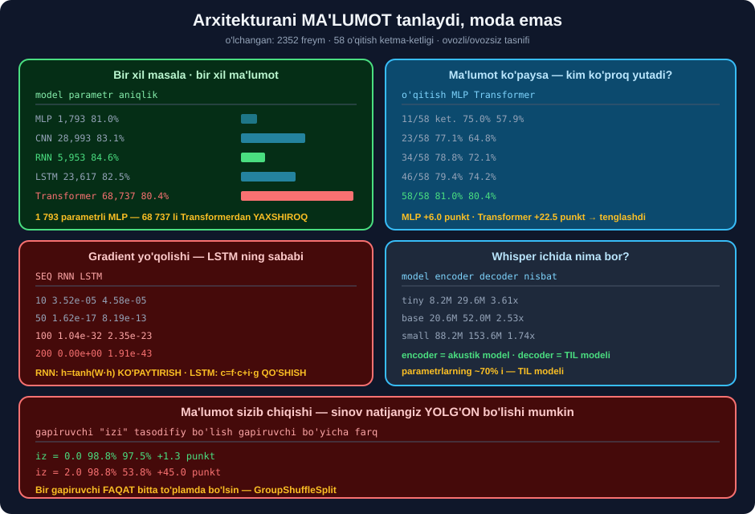

# 🧠 56-modul. Texnologiya mexanikasi

> ## ⭐⭐⭐ **BU MODULDA "QORA QUTI" OCHILADI** — ## HMM dan Transformergacha, va Whisper'ning **ichigacha**.
>
> ## 🏆 **VA ENG YAXSHI TASDIQ:** ## Whisper'ning eng past ishonchli ikki tokeni — ## `' data'` **0.3547** va `' Iv'` **0.3572** — ## aynan **kursning o'zi xato deb ko'rsatgan** ikki so'z.



---

## 📚 Darslar

| # | Dars | Nima o'rganasiz |
|---|---|---|
| 1 | [Akustik va til modeli](01-Acoustic-and-Language-Modeling.md) ⭐⭐ | n-gramm · ## 🏆 **decoder = til modeli** |
| 2 | [HMM va neyron tarmoqlar](02-HMM-and-Neural-Networks.md) ⭐⭐ | Markov taxmini · ## ⭐ **kontekst oynasi** |
| 3 | [CNN, RNN, LSTM](03-Deep-Learning-Models.md) ⭐⭐⭐ | ## 💥 **Gradient yo'qolishi o'lchandi** |
| 4 | [Transformerlar](04-Transformers.md) ⭐⭐⭐ | E'tibor · ## 💥 **doim 30 soniya** |
| 5 | [Modelni qurish](05-Building-a-Model.md) ⭐⭐ | ## 💥 **Ma'lumot sizib chiqishi — 45 punkt** |
| 6 | [Vosita tanlash](06-Selecting-the-Tool.md) ⭐⭐ | ## ⚠️ **Kursning 3 vositasi eskirgan** |

---

## 📝 Amaliyot

| | |
|---|---|
| 📝 [**20 ta mashq**](MASHQLAR.md) | 🟢 Oson · 🟡 O'rta · 🔴 Qiyin |
| 🚀 [**2 ta mini-loyiha**](LOYIHALAR.md) | 🔬 **arxitektura laboratoriyasi** · 🎯 **Whisper ichini ochish** |

---

## 📊 Modulda o'lchangan hamma narsa

### 🎯 Whisper ichida

| O'lchov | Natija |
|---|---|
| `tiny` encoder / decoder | 8.2M / **29.6M** — ## **3.61×** |
| `base` | 20.6M / 52.0M — 2.53× |
| `small` | 88.2M / 153.6M — 1.74× |
| ## **Parametrlarning ~70% i** | ## 🏆 **decoder = TIL MODELI** |
| Kirish | ## 💥 **doim (1, 80, 3000)** = 30 s |
| Encoder chiqishi | (1, **1500**, 384) — conv stride 2 |
| E'tibor entropiyasi | 2.857 / **5.217** / 3.957 / 3.659 *(maks 7.313)* |
| Diagonal og'irligi | tasodifiydan **15–40×** yuqori |
| 30 s to'ldirish | 1 s **RTF 0.266** → 29 s ## **RTF 0.063** |

### 🏗️ Arxitekturalar

| Model | Parametr | 1 fayl *(2-dars)* | 5 fayl, guruh bo'yicha *(loyiha)* |
|---|---|---|---|
| MLP | ## **1 793** | 81.0% | 58.2% ± 4.3% |
| CNN | 28 993 | 83.1% | 58.0% ± 5.4% |
| RNN | 5 953 | ## 🏆 **84.6%** | ## **60.5% ± 6.4%** |
| LSTM | 23 617 | 82.5% | 59.4% ± 7.2% |
| Transformer | ## 💥 **68 737** | ## 💥 **80.4%** | 57.8% ± 9.0% |

> ## 💥💥 **HAMMA FARQ SHOVQIN ICHIDA:** ## RNN ↔ LSTM farqi **1.1%**, shovqin chegarasi **14.4%**. ## 🏆 **Ya'ni "RNN yaxshiroq" deb aytib bo'lmaydi.**

### 📉 Gradient yo'qolishi

| SEQ | RNN | LSTM |
|---|---|---|
| 10 | 3.52e-05 | 4.58e-05 |
| 50 | 1.62e-17 | 8.19e-13 |
| 100 | 1.04e-32 | ## **2.35e-23** *(10¹¹× katta)* |
| ## **200** | ## 💥 **0.00e+00** | 1.91e-43 |

```
RNN:   h_t = tanh(W·h_{t-1} + U·x_t)     💥 KO'PAYTIRISH
LSTM:  c_t = f_t·c_{t-1} + i_t·g_t       ⭐ QO'SHISH
```

### 🎓 Ma'lumot hamma narsani hal qiladi

| O'qitish | MLP | Transformer |
|---|---|---|
| 11/58 | 75.0% | ## 💥 **57.9%** |
| 34/58 | 78.8% | 72.1% |
| 58/58 | 81.0% | ## **80.4%** |
| ## **O'sish** | **+6.0** | ## 🏆 **+22.5 punkt** |

### 🎯 Uzoq bog'liqlik masalasi *(javob birinchi freymda)*

| SEQ | RNN | LSTM | Transformer |
|---|---|---|---|
| 20 | 70.0% | ## 🏆 **95.0%** | 87.5% |
| 50 | 47.5% | 52.5% | ## 🏆 **77.5%** |
| 100 | ## 💥 **42.5%** | 55.0% | 50.0% |

> ## 🏆 **BIR XIL MODELLAR — IKKI MASALADA TESKARI NATIJA.** ## Ovozli/ovozsizda **RNN** yutdi, ## uzoq xotirada — **LSTM** va **Transformer**.

### 💥 Ma'lumot sizib chiqishi

| Gapiruvchi "izi" | Tasodifiy bo'lish | Guruh bo'yicha | Farq |
|---|---|---|---|
| 0.0 | 98.8% | 97.5% | ## ✅ **+1.3 punkt** |
| 1.0 | 93.8% | 65.0% | +28.7 |
| ## **2.0** | ## **98.8%** | ## 💥 **53.8%** | ## 💥 **+45.0 punkt** |

---

## 💥 Mening taxminlarim — o'lchov rad etdi

| Taxmin | Haqiqat |
|---|---|
| *"Transformer eng yaxshi bo'ladi"* | ## 💥 **eng past** *(80.4%)* — kam ma'lumot |
| *"LSTM uzun ketma-ketlikda yutadi"* | ## 💥 RNN **hamma uzunlikda** yutdi *(masala uzoq xotira talab qilmaydi)* |
| *"Chuqurroq qatlam — kengroq kontekst"* | ## 💥 entropiya **monoton emas**: 2.86 → 5.22 → 3.96 → 3.66 |
| *"Whisper vaqti audio uzunligiga bog'liq emas"* | ## 💥 **6.8× oshdi** *(decoder token soni)* |
| *"3-gramm 2-grammdan yaxshiroq"* | ## 💥 ajratish **26% yomonlashdi** *(sparsity)* |
| *"`mfcc0` energiyada `RMS` ga teng"* | ## 💥 Cohen's d **0.549** vs **1.705** *(log siqadi)* |

---

## ✅ Kurs to'g'ri aytgan narsalar

| Da'vo | Tekshiruv |
|---|---|
| Akustik + til modeli hamkorligi | ## ✅ Whisper: encoder + decoder |
| HMM — o'tish va chiqish ehtimolliklari | ## ✅ *(52-modulda o'lchandi)* |
| LSTM uzoq xotira uchun | ## ✅ gradient **10¹¹× katta** |
| Transformer parallel ishlaydi | ## ✅ *(lekin `O(n²)` narxi bilan)* |
| Bir necha arxitekturani birlashtirish | ## ✅ Whisper = **CNN + Transformer** |
| *"Noldan qurish shart emas"* | ## 🏆 **holatlarning 90% ida** |
| Turli aksent va muhit kerak | ## 🏆 sizib chiqish tajribasi **tasdiqladi** |

> ## ⚠️ **VA KURS AYTMAGAN UCHTA NARSA:**
> ```
> ① Gapiruvchi bo'yicha bo'lish (💥 45 punkt farq)
> ② Whisper doim 30 s ishlaydi
> ③ Kursning vosita ro'yxatidagi 3 tasi ESKIRGAN
> ```

---

## 🇺🇿 O'zbek loyihalari uchun

```
🏆 ENG MUHIM TOPILMA — ISHONCH KO'RSATKICHI:
   ' data'  →  0.3547     💥 eng past
   ' Iv'    →  0.3572     💥 ISM
   o'rtacha →  0.8904     ✅ umuman ishonchli

   ⭐ past ishonchli tokenlar = ismlar, atamalar, raqamlar
   🇺🇿 o'zbekcha ismlar (Ulug'bek, G'ulomjon) — ayniqsa past
   🏆 ularni QO'LDA tekshiring

💥 VA BITTA HAYRATLANARLI FAKT:
   pipeline()  →  "My name is Yvonne"
   generate()  →  "My name is Iván"
   Google API  →  "my name is Yvonne"
   ⚠️ BIR XIL MODEL, BIR XIL AUDIO — IKKI XIL ISM
   🏆 muhim matnlarda IKKI MARTA yuriting va solishtiring
```

---

## 🚀 Tez boshlash

```bash
pip install numpy librosa torch transformers
```

```python
import warnings; warnings.filterwarnings("ignore")
import numpy as np, torch, librosa
from transformers import WhisperForConditionalGeneration, WhisperProcessor

proc = WhisperProcessor.from_pretrained("openai/whisper-tiny")
m = WhisperForConditionalGeneration.from_pretrained("openai/whisper-tiny")
m.eval()

y, sr = librosa.load("speech_01.wav", sr=16000)
f = proc.feature_extractor(y, sampling_rate=16000, return_tensors="pt")

with torch.no_grad():
    g = m.generate(f.input_features, language="en", task="transcribe",
                   output_scores=True, return_dict_in_generate=True,
                   max_new_tokens=200)

ids = g.sequences[0]
off = len(ids) - len(g.scores)          # ⭐ prefiks tokenlarni hisobga oling
tok = proc.tokenizer

print(tok.decode(ids, skip_special_tokens=True).strip()[:100])
print("\n  eng past ishonchli tokenlar:")

past = []
for i, s in enumerate(g.scores):
    p = torch.softmax(s[0], dim=-1)
    tid = int(ids[off + i])
    matn = tok.decode([tid])
    if matn.strip() and not matn.startswith("<|"):
        past.append((float(p[tid]), matn))

for ish, matn in sorted(past)[:5]:
    print(f"    {'💥' if ish < 0.5 else '⚠️'} {matn!r:>14s} {ish:.4f}")
```

---

## 🔗 Bog'liq modullar

| Modul | Bog'liqlik |
|---|---|
| [52. Kirish](../52-Speech-Recognition-Introduction/README.md) | HMM · DTW asoslari |
| [55. Xususiyatlar](../55-Audio-Feature-Extraction/README.md) | ## ⭐ Modelga **nima beriladi** |
| [30. Transformer](../30-Transformer-Architecture/README.md) | E'tibor mexanizmi — batafsil |
| [60. Whisper](../60-Transcribing-with-Whisper/README.md) | ## 🏆 Amaliyot |
| [61. Cheklovlar](../61-Final-Discussion/README.md) | ## ⚠️ Gallyutsinatsiya |

---

🏠 [Kurs boshiga](../README.md) · 📝 [Mashqlar](MASHQLAR.md) · 🚀 [Loyihalar](LOYIHALAR.md)
