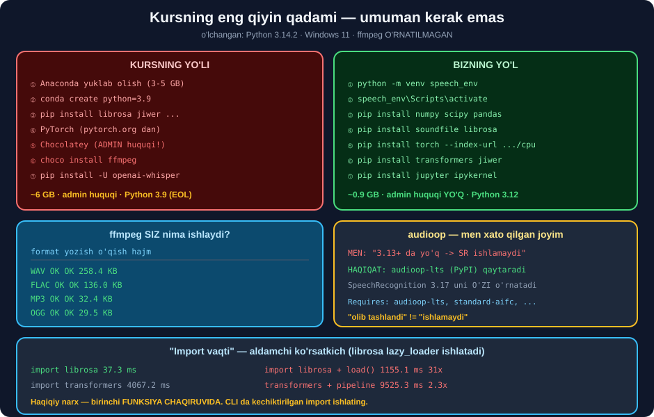

# ⚙️ 57-modul. Muhitni sozlash

> ## ⭐⭐⭐ **KURSNING ENG QIYIN QADAMI — `Chocolatey` + `ffmpeg` — UMUMAN KERAK EMAS.**
>
> ## 🔬 **BIZ `ffmpeg` NI O'RNATMADIK. VA WAV, MP3, FLAC, OGG — HAMMASI ISHLADI.**



---

## 📚 Darslar

| # | Dars | Nima o'rganasiz |
|---|---|---|
| 1 | [Python va Anaconda](01-Python-and-Anaconda.md) ⭐ | ## ⚠️ **Kursning tavsiyasi eskirgan** · `venv` |
| 2 | [Muhit yaratish](02-Creating-an-Environment.md) ⭐⭐ | `venv`/`conda`/`uv` · ## 💥 **`audioop` hikoyasi** |
| 3 | [Paketlarni o'rnatish](03-Installing-Packages.md) ⭐⭐⭐ | ## 🏆 **`ffmpeg` kerak emas** · `transformers` |
| 4 | [Paketlarni import qilish](04-Importing-Packages.md) ⭐ | ## ⭐ **`lazy_loader`** · singleton · `Audio()` |

---

## 📝 Amaliyot

| | |
|---|---|
| 📝 [**16 ta mashq**](MASHQLAR.md) | 🟢 Oson · 🟡 O'rta · 🔴 Qiyin |
| 🚀 [**2 ta mini-loyiha**](LOYIHALAR.md) | 🩺 **muhit doktori** · 📦 **loyiha shabloni** |

---

## 🏆 Kurs vs biz

| | Kurs | ## ⭐ **Biz** |
|---|---|---|
| Python | ## 💥 **3.9** *(EOL 2025-okt)* | ## 🏆 **3.11–3.13** |
| Muhit | Anaconda **3–5 GB** | ## ⭐ **`venv` ~50 MB** |
| `ffmpeg` | ## 💥 **Chocolatey + admin** | ## 🏆 **kerak emas** |
| Whisper | `openai-whisper` | ## ⭐ **`transformers`** |
| `torch` | ## 💥 **~2.5 GB** *(GPU)* | ## ⭐ **0.49 GB** *(CPU)* |
| Jami hajm | ## 💥 **~6 GB** | ## 🏆 **~0.9 GB** |
| Qadamlar | 4 + Chocolatey + admin | ## ⭐ **7 ta `pip`** |

---

## 📊 Modulda o'lchangan hamma narsa

### 🎧 `ffmpeg` siz nima ishlaydi?

| Format | Yozish | O'qish | Hajm *(3 s)* |
|---|---|---|---|
| WAV | ✅ | ✅ | 258.4 KB |
| FLAC | ✅ | ✅ | ## ⭐ **136.0 KB** *(yo'qotishsiz)* |
| MP3 | ✅ | ✅ | 32.4 KB |
| OGG | ⚠️ | ✅ | ## 🏆 **29.5 KB** |

> ## ⚠️ **OGG UCHUN TUZATISH** *(58-modulda topilgan)*: ## `sf.write()` bilan **~750 000 namunadan** katta OGG yozish ## `soundfile 0.14` da **jarayonni o'ldiradi** *(stack overflow)*. ## Bu yerdagi sinov fayli **3 soniyalik** edi. ## ## ✅ Uzun OGG uchun `sf.SoundFile` bilan **bloklab** yozing — ## [58-modul, 1-dars](../58-Google-Web-Speech-API/01-Audio-File-Formats.md).

```
soundfile 0.14  →  27 ta format
ffmpeg          →  ⬜ O'RNATILMAGAN
librosa MP3     →  ✅ ishladi
```

> ## ⚠️ **`ffmpeg` FAQAT VIDEO** *(`.mp4`, `.mkv`)*, **`M4A`/`AAC`**, ## va rasmiy **`openai-whisper`** paketi uchun kerak.

### 💥 `audioop` — men xato qilgan joyim

```
MEN AYTGAN EDIM:  "Python 3.13+ da audioop yo'q
                   →  SpeechRecognition ishlamaydi"

HAQIQAT:  audioop.__file__ = ...\site-packages\audioop\__init__.py
          pip show audioop-lts  →  Version: 0.2.2
          SpeechRecognition Requires: audioop-lts, standard-aifc, ...
```

| Modul | Holat |
|---|---|
| `audioop` | ## ✅ **backport** *(`audioop-lts` 0.2.2)* |
| `aifc` | ## ✅ **backport** *(`standard-aifc`)* |
| `distutils` | ## ✅ **backport** *(`setuptools`)* |
| `sunau`, `cgi`, `imp` | ## 💥 **haqiqatan yo'q** |

> ## 🏆 **"OLIB TASHLANDI" ≠ "ISHLAMAYDI".** ## Uchtasi **PyPI backport** orqali qaytgan, ## va `SpeechRecognition` ularni **avtomatik** o'rnatadi.

### ⏱️ Import vaqti *(alohida jarayonda)*

| Modul | Vaqt |
|---|---|
| `transformers` | ## 💥 **4120.7 ms** |
| `torch` | ⚠️ 1847.0 ms |
| `pandas` | 616.2 ms |
| `matplotlib.pyplot` | 555.6 ms |
| `numpy` | 147.4 ms |
| ## `librosa` | ## ⭐ **37.8 ms** *(?!)* |
| *Bo'sh Python jarayoni* | 27.2 ms |

### 💥 Va "import vaqti" — aldamchi

| Kod | Vaqt | Nisbat |
|---|---|---|
| `import librosa` | 37.3 ms | 1.0× |
| `import librosa` + `load()` | ## **1155.1 ms** | ## 💥 **31×** |
| `import librosa` + `mfcc()` | ## **1914.8 ms** | ## 💥 **51×** |
| `import transformers` | 4067.2 ms | |
| `from transformers import pipeline` | ## **9525.3 ms** | ## 💥 **2.3×** |

> ## 🏆 **SABAB — `lazy_loader`.** ## `librosa 1.0` bog'liqliklarni **birinchi ishlatishda** yuklaydi. ## 💡 Haqiqiy narx — **`import` da emas**, **funksiya chaqiruvida**.

### ⚡ Model singleton

```
🔬 Shablon sinovi (o'lchangan):
   birinchi chaqiruv : 14.52 s
     9.5 s  —  from transformers import pipeline
     4.2 s  —  model yuklash
     0.8 s  —  🏆 haqiqiy transkripsiya
   ikkinchi chaqiruv :  1.93 s   ⭐ 7.5× tez

   100 faylda:
     singleton'siz  →  24 daqiqa   💥
     singleton bilan →  3.4 daqiqa  ⭐
```

### 📦 Boshqa

| O'lchov | Natija |
|---|---|
| `torch` *(CPU)* diskda | ## **0.49 GB** |
| `pip freeze` | ## **234 qator** |
| Qo'lda yozilgan `requirements.txt` | ## ⭐ **9 qator** *(26× kam)* |
| Python | 3.14.2 · Windows 11 AMD64 |

---

## 💥 Mening taxminlarim — o'lchov rad etdi

| Taxmin | Haqiqat |
|---|---|
| *"`audioop` yo'q → `SpeechRecognition` ishlamaydi"* | ## 💥 **ishlaydi** — `audioop-lts` backport |
| *"`librosa` sekin import bo'ladi (numba)"* | ## 💥 **37.8 ms** — `lazy_loader` |
| *"`torch` CPU versiyasi ~200 MB"* | ## 💥 **0.49 GB** diskda |
| *"`del sys.modules[]` bilan import vaqtini o'lchasa bo'ladi"* | ## 💥 **yolg'on natija** — C-kengaytmalar tozalanmaydi |

> ## 🏆 **VA HAMMASI BITTA DARSGA OLIB KELADI:** ## **TAXMIN QILMANG — O'LCHANG.** ## Va o'lchov usulining **o'zini ham** tekshiring.

---

## ✅ Kurs to'g'ri aytgan narsalar

| Da'vo | Tekshiruv |
|---|---|
| Alohida muhit kerak | ## ✅ konfliktlarning oldini oladi |
| `SpeechRecognition` — **bitta so'z** | ## ✅ ta'kidlashga arziydi |
| `openai-whisper` `ffmpeg` talab qiladi | ## ✅ **to'g'ri** *(shuning uchun `transformers`)* |
| `ipykernel` + `--display-name` | ## ✅ to'g'ri usul |
| PyTorch ni `pytorch.org` dan tanlang | ## ✅ **CPU/GPU tanlovi muhim** |

---

## 🚀 To'liq o'rnatish — yetti qadam

```bash
python -m venv speech_env
speech_env\Scripts\activate                          # Windows
# source speech_env/bin/activate                     # macOS / Linux

python -m pip install --upgrade pip
pip install numpy scipy pandas matplotlib
pip install soundfile librosa
pip install torch --index-url https://download.pytorch.org/whl/cpu
pip install transformers jiwer
pip install jupyter ipykernel

python -m ipykernel install --user --name speech_env \
    --display-name "Python (speech_env)"
```

### ✅ Tekshiruv

```python
import sys, shutil, importlib

print(f"Python {sys.version.split()[0]}")
print(f"{'✅ virtual' if sys.prefix != sys.base_prefix else '⚠️ GLOBAL'} muhit")

for m in ["numpy", "soundfile", "librosa", "torch", "transformers", "jiwer"]:
    try:
        mod = importlib.import_module(m)
        print(f"  ✅ {m:14s} {getattr(mod, '__version__', '?')}")
    except Exception:
        print(f"  💥 {m:14s} yo'q")

print(f"\nffmpeg: {shutil.which('ffmpeg') or '⬜ yo`q — SHART EMAS'}")

import audioop
print(f"audioop: {'⭐ backport' if 'site-packages' in audioop.__file__ else 'standart'}")
```

---

## 🔗 Bog'liq modullar

| Modul | Bog'liqlik |
|---|---|
| [54. Analog → raqamli](../54-Analog-to-Digital-Conversion/README.md) | ## ⭐ `audio_yukla()` quvuri |
| [56. Texnologiya mexanikasi](../56-Technology-Mechanics/README.md) | `transformers` bilan Whisper |
| [58. Google Web Speech API](../58-Google-Web-Speech-API/README.md) | ## 🏆 Birinchi transkripsiya |
| [60. Whisper](../60-Transcribing-with-Whisper/README.md) | ## ⭐ Bu muhit ishlatiladi |

---

🏠 [Kurs boshiga](../README.md) · 📝 [Mashqlar](MASHQLAR.md) · 🚀 [Loyihalar](LOYIHALAR.md)
