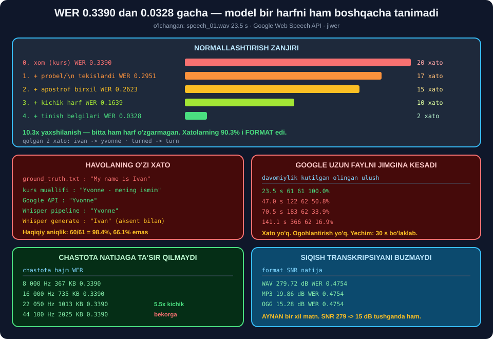

# 🎙️ 58-modul. Google Web Speech API bilan transkripsiya

> ## ⭐⭐⭐ **KURSNING WER I — 0.3390. BIZNIKI HAM 0.3390.**
>
> ## 🔬 **KEYIN GROUND TRUTH'DAGI IKKITA `\n` NI PROBELGA ALMASHTIRDIK — 0.2951.**
>
> ## 💥 **TO'LIQ NORMALLASHTIRISHDAN KEYIN — 0.0328. MODEL BIR HARFNI HAM BOSHQACHA TANIMADI.**



---

## 📚 Darslar

| # | Dars | Nima o'rganasiz |
|---|---|---|
| 1 | [Audio formatlar](01-Audio-File-Formats.md) ⭐⭐ | ## 🏆 **Siqish WER ni buzmaydi** · `soundfile` OGG krashi |
| 2 | [Jupyter'da import](02-Importing-Audio-in-Jupyter.md) ⭐ | ## 💥 **"±0.75" — bitta namuna** · krest omili |
| 3 | [`SpeechRecognition` + Google](03-SpeechRecognition-Google-API.md) ⭐⭐⭐ | ## 💥 **Uzun fayl jimgina kesiladi** · `show_all` |
| 4 | [WER va CER](04-WER-and-CER.md) ⭐⭐ | ## 💥 **WER ma'noni bilmaydi** · `MER` · `WER > 1.0` |
| 5 | [Python'da hisoblash](05-Calculating-WER-CER-in-Python.md) ⭐⭐⭐ | ## 🏆 **10.3× yaxshilanish** · `Ivan` vs `Yvonne` |

---

## 📝 Amaliyot

| | |
|---|---|
| 📝 [**20 ta mashq**](MASHQLAR.md) | 🟢 Oson · 🟡 O'rta · 🔴 Qiyin |
| 🚀 [**3 ta mini-loyiha**](LOYIHALAR.md) | 🩺 **TranskriptorPro** · 📊 **BahoLab** · 📦 **PaketTranskriptor** |

---

## 💥💥💥 Modulning eng muhim topilmasi

### Google uzun faylni **jimgina kesadi**

| Davomiylik | Kutilgan so'z | ## Olingan | Ulush |
|---|---|---|---|
| 23.5 s | 61 | ## ✅ **61** | 100.0% |
| 47.0 s | 122 | ## 💥 **62** | 50.8% |
| 70.5 s | 183 | ## 💥 **62** | 33.9% |
| 94.0 s | 244 | ## 💥 **62** | 25.4% |
| ## 141.1 s | ## 366 | ## 💥 **62** | ## 💥 **16.9%** |

> ## 💥 **HAR SAFAR 62 TA SO'Z.**
>
> ## 💥 **HECH QANDAY XATO. HECH QANDAY OGOHLANTIRISH.**
>
> ## ## ⚠️ **BU — ENG XAVFLI TURDAGI XATO:** ## kod ishlaydi, natija bor, matn **to'g'ri ko'rinadi** — ## faqat u audioning **oltidan biri**.

### ✅ Yechim: 30 soniyalik bo'laklash

```
butun holda : 62 so'z
bo'laklab   : 133 so'z      ⭐ 2.1×
```

---

## 🏆 Normallashtirish zanjiri — modulning yuragi

| Qadam | WER | CER | Xato so'z |
|---|---|---|---|
| **0.** Xom *(kurs)* | ## 💥 **0.3390** | 0.0801 | ## **20** |
| **1.** + probel / `\n` | 0.2951 | 0.0720 | 17 |
| **2.** + apostrof birxil | 0.2623 | 0.0665 | 15 |
| **3.** + kichik harf | 0.1639 | 0.0388 | 10 |
| ## **4.** + tinish belgilari | ## 🏆 **0.0328** | ## 🏆 **0.0170** | ## 🏆 **2** |

> ## 🏆🏆 **10.3× YAXSHILANISH.** ## Va **bitta ham harf** o'zgarmadi.
>
> ## 🔑 **XATOLARNING 90.3% I — FORMAT, MA'NO EMAS.**

### 💥 `\n` tuzog'i

```python
for w in process_words(ground_truth, hyp).references[0]:
    if "\n" in w:
        print(repr(w))
```

```
'scientist,\ncurious'      # ← jiwer buni BITTA so'z deb hisoblaydi
'production,\nwith'
```

> ## 💥 **IKKITA BEPUL XATO** — ## faqat ground truth ko'p qatorli yozilgani uchun. ## Kursning **bosh raqami** qisman shundan.

### 🏆 Qolgan **haqiqiy** xatolar

```
substitute: 'ivan'   -> 'yvonne'
substitute: 'turned' -> 'turn'
```

---

## 💥💥 `Ivan` mi, `Yvonne` mi? — havolaning **o'zi** xato

| Manba | Natija |
|---|---|
| Kurs `ground_truth.txt` | ## 💥 **`Ivan`** |
| Kurs muallifi videoda | ## ⭐ **`Yvonne`** |
| Google Web Speech API | ## ⭐ **`Yvonne`** |
| Whisper `pipeline()` | ## ⭐ **`Yvonne`** |
| Whisper `generate()` | ## ⚠️ **`Iván`** |

> ## 🏆🏆 **YA'NI IKKITA XATODAN BIRI — HAVOLANIKI.**
>
> ## ## ⭐ **MODELNING HAQIQIY ANIQLIGI: 60/61 = 98.4%.** ## Kursning ko'rsatgan raqami — **66.1%**.

---

## 📊 Modulda o'lchangan hamma narsa

### 🎧 Formatlar *(16 s audio)*

| Format | Hajm | Nisbat | SNR | `SpeechRecognition` |
|---|---|---|---|---|
| WAV `PCM_16` | 1378.2 KB | 1.00× | 74.82 dB | ## ✅ |
| WAV `PCM_24` | 2067.2 KB | 0.67× | ## 🏆 **279.72 dB** | ## ✅ |
| FLAC | ## ⭐ **798.5 KB** | 1.73× | 80.83 dB | ## ✅ |
| MP3 | 186.0 KB | 7.41× | ## ⚠️ **19.86 dB** | ## 💥 |
| OGG | ## 🏆 **151.4 KB** | 9.10× | ## ⚠️ **15.28 dB** | ## 💥 |

### 🏆 Va siqish **transkripsiyani buzmaydi**

```
asl WAV      WER 0.4754      SNR 279.72 dB
MP3 -> WAV   WER 0.4754      SNR  19.86 dB
OGG -> WAV   WER 0.4754      SNR  15.28 dB
                 ▲
        AYNAN BIR XIL MATN
```

### 🔬 Chastota ham ta'sir qilmaydi

| Chastota | Hajm | WER | Ishonch |
|---|---|---|---|
| ## 8 000 Hz | ## ⭐ **367.4 KB** | ## **0.3390** | 0.8987 |
| 16 000 Hz | 734.8 KB | **0.3390** | 0.8357 |
| 22 050 Hz | 1012.6 KB | **0.3390** | 0.9111 |
| ## 44 100 Hz | ## 💥 **2025.2 KB** | ## **0.3390** | 0.9095 |

> ## 💡 **API GA 16 kHz MONO YUBORING.** ## Hajm **4.1× kamayadi**, natija **o'zgarmaydi**.

### 🔁 Takrorlanuvchanlik *(5 ta ishga tushirish)*

| | Natija |
|---|---|
| Matn | ## ✅ **5/5 aynan bir xil** |
| Ishonch | ## ⚠️ `0.909894` ↔ `0.909541` |
| Vaqt | ## 💥 **4.45 – 8.12 s** *(1.8×)* |

### 🌐 Til parametri

| Til | WER | Natija |
|---|---|---|
| `en-US` / `en-GB` | ## ✅ **0.3390** | to'g'ri |
| ## `uz-UZ` | ## 💥 **0.9831** | `buning millions ifoda qilsa ...` |
| ## `ru-RU` | ## 💥 **0.9153** | `My Name Is The One And I Am excited ... Spotify` |

> ## 💥 **NOTO'G'RI TIL — XATO BERMAYDI.** ## Shunchaki **bema'ni matn** qaytaradi.
>
> ## ⭐ **VA `uz-UZ` MAVJUD** — o'zbek nutqi bilan ishlash **mumkin**.

### 📉 To'lqin statistikasi

| Ko'rsatkich | Qiymat |
|---|---|
| Maksimum `|y|` | ## 💥 **0.8556** *(kurs: 0.75)* |
| `|y| > 0.75` namunalar | ## 💥 **1 036 871 tadan 1 ta** |
| 99.9-protsentil | 0.4058 |
| RMS | −20.47 dBFS |
| Krest omili | 19.11 dB |
| Clipping | ## ✅ **0** |
| Xotira / disk | 3.96 / 2.97 MB = **1.333** |

### 💥 `soundfile` OGG krashi

| Namunalar | Natija |
|---|---|
| 700 000 | ## ✅ |
| ## **750 000** | ## 💥 **stack overflow** *(`try/except` ushlamaydi)* |
| 960 000 *(16 kHz da 60 s)* | ## 💥 |

> ## ✅ **YECHIM:** `sf.SoundFile` bilan **bloklab** yozish.
>
> ## 🔧 **57-MODULGA TUZATISH:** o'sha yerda *"OGG ✅ ishladi"* deganman — ## sinov fayli **3 soniyalik** edi. To'g'ri, lekin **to'liq emas**.

---

## 💥 Kursdagi noaniqliklar

| Kurs aytadi | ## O'lchov |
|---|---|
| *"eng baland qismlar 0.75 ga yetadi"* | ## 💥 **maks 0.8556, 0.75 dan oshgani 1 ta namuna** |
| *"WER 0.3390 — ya'ni ~40% so'z xato"* | ## 💥 **0.3390 → 34%** |
| *"FLAC 650 kHz gacha"* | ## ⚠️ **655 350 Hz** |
| *"nutq 2–3 s da balandlashadi"* | ## ⚠️ **2–3 s baland, keyin QAYTA tushadi** |
| *"WAV — eng yaxshi kirish sifati"* | ## 💥 **MP3/OGG bilan natija AYNAN bir xil** |
| `ground_truth.txt` da `Ivan` | ## 💥 **muallifning ismi — Yvonne** |
| Transkriptda `term`, `in` | ## ⚠️ **bizda `turn`, `and`** — model yangilangan |

---

## ✅ Kurs to'g'ri aytgan narsalar

| Da'vo | Tekshiruv |
|---|---|
| `SpeechRecognition` modelni **saqlamaydi** | ## ✅ **butunlay to'g'ri** |
| `sr=None` **muhim** | ## ✅ usiz 22 050 Hz ga tushadi |
| `with` bilan fayl ochish | ## ✅ resurs oqishining oldini oladi |
| Clipping — buzilish sababi | ## ✅ to'g'ri tushuntirish |
| WER/CER — **trening** metrikasi | ## ✅ **aynan shunday** |
| Shovqin natijani yomonlashtiradi | ## ✅ **59-modulda sinaymiz** |
| WER: `(S+I+D)/N` | ## ✅ formula to'g'ri |

---

## 🚀 Tez boshlash

```python
import librosa, soundfile as sf, tempfile, os
import speech_recognition as sr

def transkripsiya(yol, til="en-US", bolak=30.0):
    """Istalgan formatni, istalgan uzunlikda."""
    y, _ = librosa.load(yol, sr=16000, mono=True)     # ⭐ har qanday format
    fd, wav = tempfile.mkstemp(suffix=".wav"); os.close(fd)
    sf.write(wav, y, 16000, subtype="PCM_16")

    rec, qismlar = sr.Recognizer(), []
    try:
        with sr.AudioFile(wav) as manba:
            while True:
                a = rec.record(manba, duration=bolak)  # ⭐ bo'laklab
                if len(a.frame_data) == 0:
                    break
                r = rec.recognize_google(a, language=til, show_all=True)
                qismlar.append(r["alternative"][0]["transcript"] if r else "")
    finally:
        os.remove(wav)
    return " ".join(q for q in qismlar if q).strip()
```

```python
print(transkripsiya("speech_01.wav"))
print(transkripsiya("uzun_intervyu.mp3"))     # ✅ MP3 ham, uzun ham
```

---

## 🔗 Bog'liq modullar

| Modul | Bog'liqlik |
|---|---|
| [54. Analog → raqamli](../54-Analog-to-Digital-Conversion/README.md) | ## ⭐ Chastota, bit chuqurligi, Nayquist |
| [56. Texnologiya mexanikasi](../56-Technology-Mechanics/README.md) | Akustik + til modeli |
| [57. Muhitni sozlash](../57-Setting-Up-the-Environment/README.md) | ## ⭐ `SpeechRecognition`, `audioop-lts` |
| [59. Shovqin va spektrogrammalar](../59-Background-Noise-and-Spectrograms/README.md) | ## 🏆 **Shovqinni kamaytirib WER ni tushiramiz** |
| [60. Whisper](../60-Transcribing-with-Whisper/README.md) | ## ⭐ Mahalliy, internetsiz muqobil |

---

🏠 [Kurs boshiga](../README.md) · 📝 [Mashqlar](MASHQLAR.md) · 🚀 [Loyihalar](LOYIHALAR.md)
