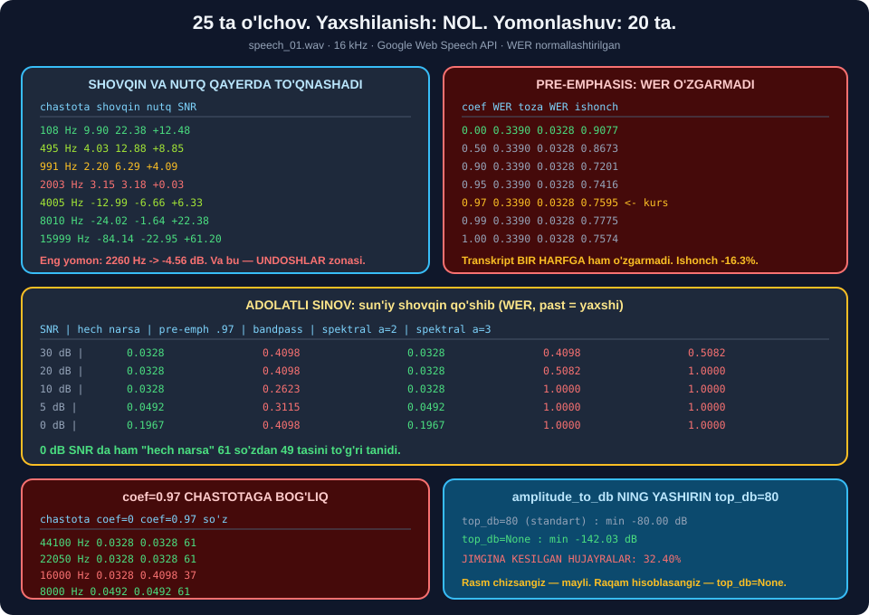

# 🌊 59-modul. Fon shovqini va spektrogrammalar

> ## ⭐⭐⭐ **KURS AYTADI: PRE-EMPHASIS WER NI 0.3390 DAN 0.3220 GA TUSHIRDI.**
>
> ## 🔬 **BIZ BESHTA USULNI BESHTA SHOVQIN DARAJASIDA SINADIK — 25 TA O'LCHOV.**
>
> ## 💥 **YAXSHILANISH: NOL. YOMONLASHUV: 20 TA.**



---

## 📚 Darslar

| # | Dars | Nima o'rganasiz |
|---|---|---|
| 1 | [Shovqinni tushunish](01-Understanding-Noise.md) ⭐⭐ | ## 💥 **2260 Hz da shovqin nutqdan BALAND** · SNR spektri |
| 2 | [Spektrogramma yaratish](02-Creating-a-Spectrogram.md) ⭐⭐ | ## 💥 **`top_db=80` 32.4% ni kesadi** · `n_fft` murosasi |
| 3 | [Shovqin bilan ishlash](03-Dealing-with-Background-Noise.md) ⭐⭐⭐ | ## 🏆 **Eng yaxshi usul — hech narsa qilmaslik** |

---

## 📝 Amaliyot

| | |
|---|---|
| 📝 [**18 ta mashq**](MASHQLAR.md) | 🟢 Oson · 🟡 O'rta · 🔴 Qiyin |
| 🚀 [**2 ta mini-loyiha**](LOYIHALAR.md) | 🔬 **SpektrTahlil** · ⚖️ **HalolTaqqoslash** |

---

## 💥💥💥 Modulning bosh natijasi

### Adolatli sinov: sun'iy shovqin + beshta usul

| SNR | Hech narsa | Pre-emph .97 | Bandpass | Spektral α=2 | Spektral α=3 |
|---|---|---|---|---|---|
| **30 dB** | ## 🏆 **0.0328** | 💥 0.4098 | ## 🏆 **0.0328** | 💥 0.4098 | 💥 0.5082 |
| **20 dB** | ## 🏆 **0.0328** | 💥 0.4098 | ## 🏆 **0.0328** | 💥 0.5082 | ## 💥 **1.0000** |
| **10 dB** | ## 🏆 **0.0328** | 💥 0.2623 | ## 🏆 **0.0328** | ## 💥 **1.0000** | ## 💥 **1.0000** |
| **5 dB** | ## 🏆 **0.0492** | 💥 0.3115 | ## 🏆 **0.0492** | ## 💥 **1.0000** | ## 💥 **1.0000** |
| **0 dB** | ## 🏆 **0.1967** | 💥 0.4098 | ## 🏆 **0.1967** | ## 💥 **1.0000** | ## 💥 **1.0000** |

| Usul | Yaxshiladi | Yomonlashtirdi | O'rtacha Δ |
|---|---|---|---|
| ## Pre-emphasis 0.97 | ## 💥 **0/5** | ## 💥 **5/5** | ## 💥 **−0.2918** |
| ## **Bandpass 80–7500** | 0/5 | ## ✅ **0/5** | ## ⭐ **+0.0000** |
| Spektral ayirish α=2 | 💥 0/5 | 💥 5/5 | 💥 −0.7148 |
| Spektral ayirish α=3 | 💥 0/5 | 💥 5/5 | ## 💥 **−0.8328** |
| Spektral + preemph | 💥 0/5 | 💥 5/5 | 💥 −0.4066 |

> ## 🏆🏆 **ENG YAXSHI "SHOVQIN KAMAYTIRISH" — HECH NARSA QILMASLIK.**
>
> ## ⭐ **0 dB SNR DA HAM** *(shovqin nutq bilan teng quvvatda)* ## `hech narsa` **61 ta so'zdan 49 tasini** to'g'ri tanidi.

### 🔑 Nega?

```
  Google modeli MILLIONLAB SOATLIK shovqinli audioda o'qitilgan.

  Siz "tozalaganingizda":
    ① nutqning bir qismini ham olib tashlaysiz
    ② model kutmagan ARTEFAKTLAR qo'shasiz
    ③ model bunday signalni HECH QACHON ko'rmagan

  Natija: model uchun YOMONLASHADI.
```

---

## 💥 Pre-emphasis asl faylda ham hech narsa qilmadi

| `coef` | WER | Toza WER | Ishonch |
|---|---|---|---|
| ## **0.00** | ## **0.3390** | ## **0.0328** | ## 🏆 **0.9077** |
| 0.50 | 0.3390 | 0.0328 | 0.8673 |
| 0.90 | 0.3390 | 0.0328 | 0.7201 |
| ## **0.97** *(kurs)* | ## **0.3390** | ## **0.0328** | ## 💥 **0.7595** |
| 1.00 | 0.3390 | 0.0328 | 0.7574 |

> ## 💥 **YETTI QIYMAT — BITTA WER.** ## Transkript **bir harfga ham** o'zgarmadi. ## Ishonch esa **16.3% tushdi**.

### 🔑 Nega kurs boshqacha natija oldi?

```
kurs (2024):  ... engineer term data scientist ... learning in artificial ...
biz  (2026):  ... engineer turn data scientist ... learning and artificial ...
```

> ## 🏆 **GOOGLE MODELI SHU IKKI XATONI O'ZI TUZATDI.** ## Pre-emphasis tuzatadigan narsa **qolmagan**. ## ## ⚠️ Kursning natijasi **soxta emas** — ## u **o'sha vaqtdagi modelga** to'g'ri edi.

---

## 💥💥 `coef=0.97` — chastotaga bog'liq

| Chastota | `coef=0` | ## `coef=0.97` | So'z |
|---|---|---|---|
| 44 100 Hz | 0.0328 | ## ✅ **0.0328** | 61 |
| 22 050 Hz | 0.0328 | ## ✅ **0.0328** | 61 |
| ## **16 000 Hz** | 0.0328 | ## 💥 **0.4098** | ## 💥 **37** |
| 8 000 Hz | 0.0492 | ## ✅ **0.0492** | 61 |

**Filtrning chastota xarakteristikasi** `H(f) = |1 − 0.97·e^(−j2πf/fs)|`:

| `fs` | 300 Hz | 1000 Hz | 4000 Hz |
|---|---|---|---|
| 44 100 | −25.76 dB | −16.86 dB | −5.12 dB |
| ## **16 000** | ## 💥 **−18.44 dB** | ## 💥 **−8.28 dB** | +2.88 dB |
| 8 000 | −12.64 dB | −2.45 dB | +5.89 dB |

> ## ⚠️ **VA 16 kHz — AYNAN GOOGLE ICHKI ISHLATADIGAN CHASTOTA.**

---

## 📊 Modulda o'lchangan hamma narsa

### 🔊 SNR spektri *(nutq − shovqin)*

| Chastota | ## SNR |
|---|---|
| 108 Hz | ⭐ +12.48 dB |
| 495 Hz | +8.85 dB |
| 991 Hz | ⚠️ +4.09 dB |
| ## 2003 Hz | ## 💥 **+0.03 dB** |
| 8010 Hz | ⭐ +22.38 dB |
| 15999 Hz | 🏆 +61.20 dB |
| **Eng yomon** | ## 💥 **2260 Hz → −4.56 dB** |
| **Eng yaxshi** | 🏆 12 726 Hz → +75.65 dB |

> ## 💥 **2260 Hz — UNDOSHLAR ZONASI.** ## `s`, `sh`, `t`, `k` shu yerda. ## ## 🔑 **O'chirsangiz — nutqni buzasiz. Qoldirsangiz — shovqin qoladi.**

### 🎚️ Energiya taqsimoti

| Zona | Shovqin *(0–1.5 s)* | Nutq *(5–20 s)* | Oxiri |
|---|---|---|---|
| 0–300 Hz | 13.38% | ⭐ 50.12% | 🏆 73.56% |
| ## 300–1000 Hz | ## 💥 **42.39%** | 28.80% | 8.72% |
| ## 1000–2000 Hz | ## 💥 **30.81%** | 10.90% | 1.98% |
| 8000+ Hz | 0.32% | 3.16% | 2.78% |

### 💥 `amplitude_to_db` ning yashirin `top_db=80`

| | Qiymat |
|---|---|
| `top_db=80` *(standart)* | −80.00 dB |
| ## `top_db=None` | ## 💥 **−142.03 dB** |
| ## Jimgina kesilgan | ## 💥 **32.40%** |

> ## ⭐ **QOIDA:** rasm chizsangiz — qoldiring. ## Raqam hisoblasangiz — `top_db=None`.

### 📐 `n_fft` murosasi

| `n_fft` | Chastota | Vaqt | Xotira |
|---|---|---|---|
| 512 | 💥 86.13 Hz | ⭐ 11.61 ms | 15.88 MB |
| **2048** | **21.53 Hz** | **46.44 ms** | 15.84 MB |
| 4096 | ⭐ 10.77 Hz | 💥 92.88 ms | 15.84 MB |

> ## 🔑 **XOTIRA DEYARLI O'ZGARMAYDI** — binlar ↑, freymlar ↓.

### 🖼️ Spektrogramma turlari

| Tur | Shakl | Xotira | Vaqt |
|---|---|---|---|
| STFT | `(1025, 2026)` | 💥 7.92 MB | 622.7 ms |
| Mel (128) | `(128, 2026)` | 0.99 MB | 75.3 ms |
| ## Mel (80) | `(80, 2026)` | ## 🏆 **0.62 MB** | ## 🏆 **72.2 ms** |
| CQT | `(84, 2026)` | 0.65 MB | 306.0 ms |

> ## 🏆 **MEL (80) — 12.8× KICHIK, 8.6× TEZ.** ## Va aynan shu — **Whisper ning kirishi**.

### ⚠️ `adjust_for_ambient_noise` audioni **yeydi**

| `duration` | `energy_threshold` | Qolgan audio | Yo'qolgan |
|---|---|---|---|
| 0.5 s | 183 342 | 23.05 s | 0.46 s |
| 1.0 s | 301 445 | 22.58 s | 0.93 s |
| ## 1.5 s | ## 417 666 | ## 💥 **22.03 s** | ## 💥 **1.48 s** |

> ## 💥 **U faylning BOSHIDAN o'qiydi** — o'sha qism `record()` ga **yetmaydi**. ## ## ⚠️ Va `energy_threshold` `record()` uchun **umuman ishlatilmaydi** — ## u faqat `Microphone` + `listen()` uchun.

### 💥 Nutqni butunlay yo'q qilgan usullar

| Usul | Natija |
|---|---|
| ## `librosa.effects.harmonic(margin=3.0)` | ## 💥 **61 → 0 so'z** |
| ## Spektral ayirish + pre-emphasis | ## 💥 **61 → 0 so'z** |

---

## 💥 Kursdagi noaniqliklar

| Kurs aytadi | ## O'lchov |
|---|---|
| *"Pre-emphasis WER ni 0.3390 → 0.3220 tushirdi"* | ## 💥 **bizda hech qanday o'zgarish yo'q** |
| *"Yuqori chastotalar model uchun muhim"* | ## ⚠️ **to'g'ri, lekin kuchaytirish yordam bermadi** |
| *"HPSS nutqni shovqindan ajratadi"* | ## 💥 **61 ta so'zdan 0 ta** |
| *"`adjust_for_ambient_noise` fon shovqinini filtrlaydi"* | ## 💥 **faylda audioni yeydi, filtrlamaydi** |
| *"shovqin 512–2048 Hz da"* | ## ✅ **73.2% i 300–2000 Hz da** — deyarli to'g'ri |

---

## ✅ Kurs to'g'ri aytgan narsalar

| Da'vo | Tekshiruv |
|---|---|
| Spektrogramma shovqinni ko'rsatadi | ## ✅ **butunlay to'g'ri** |
| Nutq 64–256 Hz da *(asosiy ton)* | ## ✅ `f0` = **138.2 Hz** |
| Oxirgi 1–2 s tozaroq | ## ✅ **42.39% → 8.72%** |
| `abs()` + `amplitude_to_db` kerak | ## ✅ to'g'ri ketma-ketlik |
| `ref=np.max` normallashtiradi | ## ✅ to'g'ri tushuntirish |
| *"Pre-emphasis yagona yechim emas"* | ## ✅ **va aslida hech qanday yechim emas** |
| *"Ba'zi modellar shovqinli audioda shunday yaxshi o'qitilganki, minimal aralashuv kerak"* | ## 🏆 **AYNAN SHUNDAY — va bu bizning bosh natijamiz** |

> ## 🏆 **KURSNING OXIRGI JUMLASI — TO'G'RI XULOSA.** ## Faqat u buni **o'z tavsiyasidan keyin** aytadi. ## ## ⭐ **Biz uni o'lchab, boshiga qo'ydik.**

---

## 🚀 Amaliy qoida

```
┌───────────────────────────────────────────────────────────┐
│  ① Avval HECH NARSA QILMASDAN o'lchang                   │
│  ② Yetarlimi? ──► HA ──► ✅ TO'XTANG                      │
│  ③ Xatolar QAYERDA? (alignments)                         │
│  ④ ANIQ muammoga ANIQ yechim                             │
│  ⑤ QAYTA o'lchang — yomonlashtirmadingizmi?              │
└───────────────────────────────────────────────────────────┘
```

| Muammo | ## Ishlaydigan yechim |
|---|---|
| 50/60 Hz guli | ## ⭐ **notch filtr** |
| Kesilgan uzun fayl | ## ⭐ **bo'laklash** *(58-modul)* |
| Juda jim yozuv | ## ⭐ **normallash** |
| Chastota/kanal mos emas | ## ⭐ **`librosa.load(sr=16000, mono=True)`** |
| ## Umumiy fon shovqini | ## 💥 **hech narsa qilmang** |
| Reverberatsiya | ## 💥 **filtr yordam bermaydi** |

> ## 🏆 **ENG KUCHLI "SHOVQIN KAMAYTIRISH" — YAXSHIROQ MODEL.**
>
> ## ⭐ **60-modulda Whisper ni shu faylda sinaymiz.**

---

## 🔗 Bog'liq modullar

| Modul | Bog'liqlik |
|---|---|
| [53. Tovush asoslari](../53-Sound-and-Speech-Basics/README.md) | ## ⭐ `DRR`, reverberatsiya |
| [55. Xususiyat ajratish](../55-Audio-Feature-Extraction/README.md) | STFT, mel, `f0` = 138.2 Hz |
| [58. Google Web Speech API](../58-Google-Web-Speech-API/README.md) | ## ⭐ WER/CER, normallashtirish |
| [60. Whisper](../60-Transcribing-with-Whisper/README.md) | ## 🏆 **Shu faylda mahalliy model** |

---

🏠 [Kurs boshiga](../README.md) · 📝 [Mashqlar](MASHQLAR.md) · 🚀 [Loyihalar](LOYIHALAR.md)
