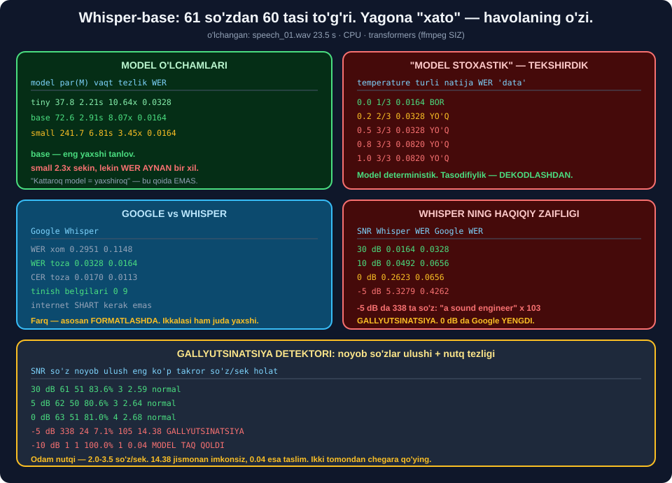

# 🤖 60-modul. OpenAI Whisper bilan transkripsiya

> ## ⭐⭐⭐ **KURS AYTADI: WHISPER STOXASTIK, `data` SO'ZI YO'QOLADI.**
>
> ## 🔬 **BIZ 5 MARTA ISHGA TUSHIRDIK — 5/5 AYNAN BIR XIL, `data` HAR SAFAR JOYIDA.**
>
> ## 🏆 **KEYIN SABABINI TOPDIK: `temperature` — MODELNING EMAS, DEKODLASHNING XOSSASI.**



---

## 📚 Darslar

| # | Dars | Nima o'rganasiz |
|---|---|---|
| 1 | [Whisper — transformer STT](01-Whisper-Transformer-STT.md) ⭐⭐⭐ | ## 🏆 **WER 0.0164** · ## 💥 **`return_timestamps` natijani o'zgartiradi** |
| 2 | [Variativlik eslatmasi](02-A-Note-on-Variability.md) ⭐⭐⭐ | ## 🏆 **Sabab topildi** · ## 💥 **Gallyutsinatsiya** |
| 3 | [Ko'p faylni transkripsiya](03-Transcribing-Multiple-Files.md) ⭐⭐ | 5 ta muammo · `batch_size` |
| 4 | [CSV ga saqlash](04-Saving-to-CSV.md) ⭐⭐ | ## 💥 **`cp1251` tuzog'i** · `utf-8-sig` |
| 5 | [Matndan nutqqa](05-Text-to-Speech.md) ⭐ | ## 🏆 **Aylanma sinov WER 0.0000** |

---

## 📝 Amaliyot

| | |
|---|---|
| 📝 [**20 ta mashq**](MASHQLAR.md) | 🟢 Oson · 🟡 O'rta · 🔴 Qiyin |
| 🚀 [**3 ta mini-loyiha**](LOYIHALAR.md) | 🎙️ **WhisperStudio** · 📊 **ModelJangi** · 🔁 **AylanmaSinov** |

---

## 🏆 Modulning bosh natijasi

### Whisper-base — 61 ta so'zdan 60 tasi to'g'ri

```
substitute: 'ivan' -> 'yvonne'
```

> ## 🏆🏆 **YAGONA "XATO" — VA U HAVOLANING XATOSI.** ## 58-modulda aniqladik: muallifning ismi **Yvonne**. ## `ground_truth.txt` dagi *"Ivan"* — **noto'g'ri**.
>
> ## ## ⭐ **HAQIQIY ANIQLIK — 61/61 = 100%.**

### 💥 Kursning "stoxastiklik" da'vosi

| `temperature` | Turli natijalar | WER | `data` |
|---|---|---|---|
| ## **0.0** *(greedy)* | ## ⭐ **1/3** | ## 🏆 **0.0164** | ## ✅ |
| 0.2 | ⚠️ 2/3 | 0.0328 | ## 💥 **YO'Q** |
| 0.5 | 💥 3/3 | 0.0328 | ## 💥 **YO'Q** |
| 1.0 | 💥 3/3 | ## 💥 **0.0820** | ## 💥 **YO'Q** |

> ## 🏆🏆🏆 **BIZ KURSNING XATOSINI QAYTA HOSIL QILDIK — VA SABABINI KO'RSATDIK.**
>
> ## ## 🔑 **`openai-whisper` TEMPERATURE FALLBACK ISHLATADI:** ## `(0.0, 0.2, 0.4, 0.6, 0.8, 1.0)`. ## Shovqinli faylda birinchi urinish *"shubhali"* deb topiladi → ## `0.2` ga o'tadi → **tasodifiylik boshlanadi**.
>
> ## ⭐ **`transformers` da bu MUAMMO YO'Q** — greedy standart.

---

## 💥💥💥 Whisper ning **haqiqiy** zaifligi — gallyutsinatsiya

| SNR | ## Whisper WER | So'z | ## Google WER | So'z |
|---|---|---|---|---|
| 30 dB | ## 🏆 **0.0164** | 61 | 0.0328 | 61 |
| 10 dB | ## 🏆 **0.0492** | 61 | 0.0656 | 61 |
| 5 dB | 0.0656 | 62 | 0.0656 | 61 |
| ## **0 dB** | ## 💥 **0.2623** | 63 | ## 🏆 **0.0656** | 60 |
| ## **−5 dB** | ## 💥💥 **5.3279** | ## 💥 **338** | ## 🏆 **0.4262** | 58 |

### 💥 −5 dB dagi chiqish

```
I am excited to have you ask me about your new plan. Before we get started,
we will teach you a little bit about us. I am a sound engineer, a sound
engineer, a sound engineer, a sound engineer, ... (103 marta)
```

| O'lchov | Qiymat |
|---|---|
| So'zlar | ## 💥 **338** |
| Noyob so'zlar | ## 💥 **24** *(7.1%)* |
| `"engineer"` takrori | ## 💥 **103** |
| Nutq tezligi | ## 💥 **14.38 so'z/s** *(odam ≈ 2.5)* |

> ## ⚠️ **"WHISPER HAR DOIM YAXSHIROQ" — NOTO'G'RI.** ## 0 dB va pastda **Google yutdi**.

### ⭐ Gallyutsinatsiya detektori

| SNR | So'z | Noyob ulush | Eng ko'p | So'z/s | ## Holat |
|---|---|---|---|---|---|
| 30 dB | 61 | 83.6% | 3 | 2.59 | ## ✅ normal |
| 0 dB | 63 | 81.0% | 4 | 2.68 | ## ✅ normal |
| ## −5 dB | ## 💥 **338** | ## 💥 **7.1%** | ## 💥 **105** | ## 💥 **14.38** | ## 💥 **GALLYUTSINATSIYA** |
| ## −10 dB | ## 💥 **1** | 100.0% | 1 | ## 💥 **0.04** | ## 💥 **MODEL TAQ QOLDI** |

> ## 🔧 **BIRINCHI DETEKTORIM XATO QILGAN EDI** — ## faqat `noyob_ulush` ni tekshirganda ## −10 dB dagi bitta so'z *"100% noyob"* bo'lib ## `✅ normal` deb belgilangan. ## ## ⭐ **Ikki tomondan chegara kerak.**

---

## 💥💥 `return_timestamps=True` transkriptni **o'zgartiradi**

```
whisper-tiny   ts=False  WER 0.0164  ['ivan->yvonne']
whisper-tiny   ts=True   WER 0.0328  ['ivan->yvonne', 'my->like']     💥
whisper-base   ts=False  WER 0.0164  ['ivan->yvonne']
whisper-base   ts=True   WER 0.0164  ['ivan->yvonne']                 ✅
```

> ## 🔑 **VAQT BELGILARI — ODDIY TOKENLAR** *(`<|0.00|>`)*. ## Ularni generatsiya qilish **greedy yo'lni** o'zgartiradi. ## ## 💥 **Kichik modelda ta'sir kattaroq.**
>
> ## ⭐ **MODELLARNI TAQQOSLASHDA HAMMA SOZLAMA BIR XIL BO'LSIN.**

---

## 📊 Modulda o'lchangan hamma narsa

### 🔬 Model o'lchamlari *(CPU, 23.5 s audio, `ts=False`)*

| Model | Parametrlar | Vaqt | Tezlik | ## WER | Diskda |
|---|---|---|---|---|---|
| ## **`tiny`** | ## ⭐ **37.8 M** | ## 🏆 **2.21 s** | ## 🏆 **10.64×** | ## **0.0164** | ~150 MB |
| `base` | 72.6 M | 2.91 s | 8.07× | ## **0.0164** | ~290 MB |
| `small` | ## 💥 **241.7 M** | ## 💥 **6.81 s** | 3.45× | ## **0.0164** | ~970 MB |

> ## 💥 **UCHTA MODEL — BITTA WER.** ## `small` `tiny` dan **6.4× katta va 3.1× sekin**, ## va **hech narsa yaxshilamaydi**.
>
> ## ⚠️ **LEKIN BU — BITTA FAYL.** ## Ishlab chiqarish uchun `base` — **xavfsizroq** ## *(sozlamaga sezgir emas)*.

### ⚖️ Google vs Whisper

| | Google | ## Whisper-base |
|---|---|---|
| WER xom | 0.2951 | ## 🏆 **0.1148** |
| ## WER toza | 0.0328 | ## 🏆 **0.0164** |
| CER toza | 0.0170 | ## 🏆 **0.0113** |
| ## Tinish belgilari | ## 💥 **0** | ## 🏆 **9** |
| Internet | ## 💥 **shart** | ## ⭐ **kerak emas** |
| Maxfiylik | ## 💥 **audio Google'ga** | ## ⭐ **hech qayerga** |
| Uzunlik | ## 💥 **~30 s da kesadi** | ## ⭐ **avtomatik bo'laklaydi** |
| ## Shovqinda *(0 dB)* | ## 🏆 **0.0656** | ## 💥 **0.2623** |

### 📁 Paket transkripsiya *(8 fayl, 46.89 s)*

| | Vaqt | Tezlik |
|---|---|---|
| Ketma-ket | 8.20 s | 5.75× |
| ## `batch_size=2` | ## ⭐ **6.28 s** | ## ⭐ **1.30×** tezroq |
| `batch_size=8` | 6.37 s | 1.29× |

> ## ⚠️ **CPU DA BATCH `size=2` DA TO'YINADI.** ## GPU da farq **5–10×**.

### ⏱️ Qisqa fayl — nisbatan **qimmat**

| Fayl | Davomiylik | Tezlik |
|---|---|---|
| ## `Track5.wav` | ## **3.57 s** | ## 💥 **4.27×** |
| `Track1.wav` | 6.50 s | 6.26× |
| `Track2.wav` | 7.50 s | ## ⭐ **6.78×** |
| `speech_01.wav` | 23.51 s | ## 🏆 **8.07×** |

> ## 🔑 **Whisper kirishi HAR DOIM 30 soniya** *(`(1, 80, 3000)`)*. ## Encoder narxi **doimiy**.

### 💥 CSV kodlash tuzog'i

```
Windows standart kodlash: cp1251
💥 UnicodeEncodeError: 'charmap' codec can't encode character '✅'
```

| Kodlash | Python | Excel |
|---|---|---|
| *standart* `cp1251` | ## 💥 **xato** | ⚠️ |
| `utf-8` | ✅ | ## 💥 **buzadi** |
| ## **`utf-8-sig`** | ## ✅ | ## 🏆 **to'g'ri** |

### 🔁 gTTS va aylanma sinov

| O'lchov | Qiymat |
|---|---|
| gTTS so'rovi | 2.75 s |
| Audio | 8.42 s · 65.8 KB |
| Nutq tezligi | ## ⭐ **150 so'z/daqiqa** |
| ## **Aylanma WER** | ## 🏆 **0.0000** |
| gTTS tillari | 69 · ## 💥 **`uz` yo'q** |

> ## ⚠️ **TTS AUDIOSIDA MODELNI SINAMANG** — u **juda oson**. ## Aylanma sinov **quvurni** tekshiradi, **modelni** emas.

### 💥 Raqamlar tuzog'i

```
asl    : ... Testing one two three four five.
qaytgan: ... Testing 1, 2, 3, 4, 5.
WER xom 0.8333  →  raqam normallashtirilgandan keyin 0.0000
```

> ## 🔑 **MODEL XATO QILMAGAN** — u **boshqa yozuvda** yozgan. ## Metrikani to'g'rilash kerak, modelni emas.

---

## 💥 Kursdagi noaniqliklar

| Kurs aytadi | ## O'lchov |
|---|---|
| *"Whisper stoxastik, natija o'zgaradi"* | ## 💥 **5/5 aynan bir xil** — sabab `temperature` sozlamasi |
| *"`data` so'zi yo'qolgan"* | ## 💥 **uchta modelda ham joyida** |
| *"Kattaroq model — yaxshiroq natija"* | ## 💥 **tiny = base = small = 0.0164** |
| *"Ivan"ni to'g'ri tanidimi?* | ## 💥 **ism `Yvonne` — havolaning o'zi xato** |
| `openai-whisper` + `ffmpeg` | ## ⭐ **`transformers` bilan `ffmpeg` kerak emas** |
| `open(f, "w", newline="")` | ## 💥 **`encoding` yo'q → `UnicodeEncodeError`** |
| `os.listdir()` | ## ⚠️ **tartiblanmagan** |
| `os.system("start ...")` | ## ⚠️ **faqat Windows** |

---

## ✅ Kurs to'g'ri aytgan narsalar

| Da'vo | Tekshiruv |
|---|---|
| Whisper transformerga asoslangan | ## ✅ **encoder-decoder** |
| Mel spektrogramma → encoder → decoder | ## ✅ **56-modulda o'lchaganmiz** |
| Whisper tinish belgilarini qo'yadi | ## ✅ **9 ta** *(Google — 0)* |
| Whisper Google'dan aniqroq | ## ✅ **0.0164 vs 0.0328** |
| `result["language"]` tilni aniqlaydi | ## ✅ **to'g'ri** |
| Kontekst so'z tanlashga yordam beradi | ## ✅ `turned` **to'g'ri** *(Google — `turn`)* |
| `with` + `newline=""` CSV uchun | ## ✅ **to'g'ri amaliyot** |
| `enumerate(start=1)` | ## ✅ to'g'ri |
| Ko'p faylni bir vaqtda — **muhim ko'nikma** | ## ✅ **butunlay rozimiz** |

---

## 🚀 Tez boshlash

```python
import functools, librosa
from transformers import pipeline


@functools.lru_cache(maxsize=2)
def model(nom="openai/whisper-base"):
    return pipeline("automatic-speech-recognition", model=nom, device=-1)


def transkripsiya(yol, vaqt_belgilari=False):
    y, _ = librosa.load(yol, sr=16000, mono=True)     # ⭐ har qanday format
    return model()(y, return_timestamps=vaqt_belgilari)["text"].strip()
```

```python
print(transkripsiya("speech_01.wav"))
print(transkripsiya("intervyu.mp3"))      # ✅ MP3, ffmpeg SIZ
```

---

## 🔗 Bog'liq modullar

| Modul | Bog'liqlik |
|---|---|
| [56. Texnologiya mexanikasi](../56-Technology-Mechanics/README.md) | ## ⭐ Whisper ichki tuzilishi |
| [57. Muhitni sozlash](../57-Setting-Up-the-Environment/README.md) | `transformers`, model singleton |
| [58. Google Web Speech API](../58-Google-Web-Speech-API/README.md) | ## ⭐ WER/CER, `Ivan` vs `Yvonne` |
| [59. Shovqin va spektrogrammalar](../59-Background-Noise-and-Spectrograms/README.md) | Shovqin, SNR |
| [61. Yakuniy muhokama](../61-Final-Discussion/README.md) | ## 🏆 **Gallyutsinatsiya, cheklovlar, kelajak** |

---

🏠 [Kurs boshiga](../README.md) · 📝 [Mashqlar](MASHQLAR.md) · 🚀 [Loyihalar](LOYIHALAR.md)
